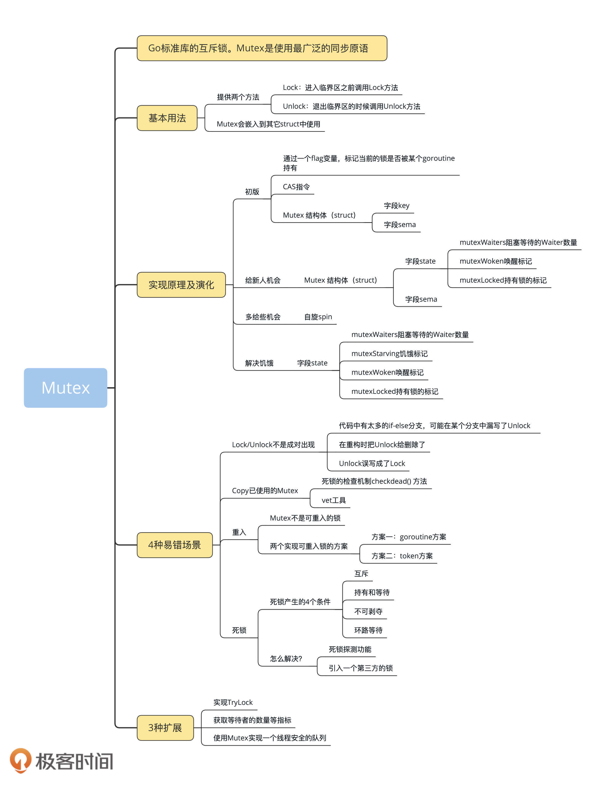

---
date: "2019-06-23"
---  
      
# 04｜ Mutex：骇客编程，如何拓展额外功能？
你好，我是鸟窝。

前面三讲，我们学习了互斥锁Mutex的基本用法、实现原理以及易错场景，可以说是涵盖了互斥锁的方方面面。如果你能熟练掌握这些内容，那么，在大多数的开发场景中，你都可以得心应手。

但是，在一些特定的场景中，这些基础功能是不足以应对的。这个时候，我们就需要开发一些扩展功能了。我来举几个例子。

比如说，我们知道，如果互斥锁被某个goroutine获取了，而且还没有释放，那么，其他请求这把锁的goroutine，就会阻塞等待，直到有机会获得这把锁。有时候阻塞并不是一个很好的主意，比如你请求锁更新一个计数器，如果获取不到锁的话没必要等待，大不了这次不更新，我下次更新就好了，如果阻塞的话会导致业务处理能力的下降。

再比如，如果我们要监控锁的竞争情况，一个监控指标就是，等待这把锁的goroutine数量。我们可以把这个指标推送到时间序列数据库中，再通过一些监控系统（比如Grafana）展示出来。要知道，**锁是性能下降的“罪魁祸首”之一，所以，有效地降低锁的竞争，就能够很好地提高性能。因此，监控关键互斥锁上等待的goroutine的数量，是我们分析锁竞争的激烈程度的一个重要指标**。

实际上，不论是不希望锁的goroutine继续等待，还是想监控锁，我们都可以基于标准库中Mutex的实现，通过Hacker的方式，为Mutex增加一些额外的功能。这节课，我就来教你实现几个扩展功能，包括实现TryLock，获取等待者的数量等指标，以及实现一个线程安全的队列。

<!-- [[[read_end]]] -->

# TryLock

我们可以为Mutex添加一个TryLock的方法，也就是尝试获取排外锁。

这个方法具体是什么意思呢？我来解释一下这里的逻辑。当一个goroutine调用这个TryLock方法请求锁的时候，如果这把锁没有被其他goroutine所持有，那么，这个goroutine就持有了这把锁，并返回true；如果这把锁已经被其他goroutine所持有，或者是正在准备交给某个被唤醒的goroutine，那么，这个请求锁的goroutine就直接返回false，不会阻塞在方法调用上。

如下图所示，如果Mutex已经被一个goroutine持有，调用Lock的goroutine阻塞排队等待，调用TryLock的goroutine直接得到一个false返回。


在实际开发中，如果要更新配置数据，我们通常需要加锁，这样可以避免同时有多个goroutine并发修改数据。有的时候，我们也会使用TryLock。这样一来，当某个goroutine想要更改配置数据时，如果发现已经有goroutine在更改了，其他的goroutine调用TryLock，返回了false，这个goroutine就会放弃更改。

很多语言（比如Java）都为锁提供了TryLock的方法，但是，Go官方[issue 6123](https://github.com/golang/go/issues/6123)有一个讨论（后来一些issue中也提到过），标准库的Mutex不会添加TryLock方法。虽然通过Go的Channel我们也可以实现TryLock的功能，但是基于Channel的实现我们会放在Channel那一讲中去介绍，这一次我们还是基于Mutex去实现，毕竟大部分的程序员还是熟悉传统的同步原语，而且传统的同步原语也不容易出错。所以这节课，还是希望带你掌握基于Mutex实现的方法。

那怎么实现一个扩展TryLock方法的Mutex呢？我们直接来看代码。

```
    // 复制Mutex定义的常量
    const (
        mutexLocked = 1 << iota // 加锁标识位置
        mutexWoken              // 唤醒标识位置
        mutexStarving           // 锁饥饿标识位置
        mutexWaiterShift = iota // 标识waiter的起始bit位置
    )
    
    // 扩展一个Mutex结构
    type Mutex struct {
        sync.Mutex
    }
    
    // 尝试获取锁
    func (m *Mutex) TryLock() bool {
        // 如果能成功抢到锁
        if atomic.CompareAndSwapInt32((*int32)(unsafe.Pointer(&m.Mutex)), 0, mutexLocked) {
            return true
        }
    
        // 如果处于唤醒、加锁或者饥饿状态，这次请求就不参与竞争了，返回false
        old := atomic.LoadInt32((*int32)(unsafe.Pointer(&m.Mutex)))
        if old&(mutexLocked|mutexStarving|mutexWoken) != 0 {
            return false
        }
    
        // 尝试在竞争的状态下请求锁
        new := old | mutexLocked
        return atomic.CompareAndSwapInt32((*int32)(unsafe.Pointer(&m.Mutex)), old, new)
    }
    

```

第17行是一个fast path，如果幸运，没有其他goroutine争这把锁，那么，这把锁就会被这个请求的goroutine获取，直接返回。

如果锁已经被其他goroutine所持有，或者被其他唤醒的goroutine准备持有，那么，就直接返回false，不再请求，代码逻辑在第23行。

如果没有被持有，也没有其它唤醒的goroutine来竞争锁，锁也不处于饥饿状态，就尝试获取这把锁（第29行），不论是否成功都将结果返回。因为，这个时候，可能还有其他的goroutine也在竞争这把锁，所以，不能保证成功获取这把锁。

我们可以写一个简单的测试程序，来测试我们的TryLock的机制是否工作。

这个测试程序的工作机制是这样子的：程序运行时会启动一个goroutine持有这把我们自己实现的锁，经过随机的时间才释放。主goroutine会尝试获取这把锁。如果前一个goroutine一秒内释放了这把锁，那么，主goroutine就有可能获取到这把锁了，输出“got the lock”，否则没有获取到也不会被阻塞，会直接输出“`can't get the lock`”。

```
    func try() {
        var mu Mutex
        go func() { // 启动一个goroutine持有一段时间的锁
            mu.Lock()
            time.Sleep(time.Duration(rand.Intn(2)) * time.Second)
            mu.Unlock()
        }()
    
        time.Sleep(time.Second)
    
        ok := mu.TryLock() // 尝试获取到锁
        if ok { // 获取成功
            fmt.Println("got the lock")
            // do something
            mu.Unlock()
            return
        }
    
        // 没有获取到
        fmt.Println("can't get the lock")
    }
    

```

# 获取等待者的数量等指标

接下来，我想和你聊聊怎么获取等待者数量等指标。

第二讲中，我们已经学习了Mutex的结构。先来回顾一下Mutex的数据结构，如下面的代码所示。它包含两个字段，state和sema。前四个字节（int32）就是state字段。

```
    type Mutex struct {
        state int32
        sema  uint32
    }
    

```

Mutex结构中的state字段有很多个含义，通过state字段，你可以知道锁是否已经被某个goroutine持有、当前是否处于饥饿状态、是否有等待的goroutine被唤醒、等待者的数量等信息。但是，state这个字段并没有暴露出来，所以，我们需要想办法获取到这个字段，并进行解析。

怎么获取未暴露的字段呢？很简单，我们可以通过unsafe的方式实现。我来举一个例子，你一看就明白了。

```
    const (
        mutexLocked = 1 << iota // mutex is locked
        mutexWoken
        mutexStarving
        mutexWaiterShift = iota
    )
    
    type Mutex struct {
        sync.Mutex
    }
    
    func (m *Mutex) Count() int {
        // 获取state字段的值
        v := atomic.LoadInt32((*int32)(unsafe.Pointer(&m.Mutex)))
        v = v >> mutexWaiterShift //得到等待者的数值
        v = v + (v & mutexLocked) //再加上锁持有者的数量，0或者1
        return int(v)
    }
    

```

这个例子的第14行通过unsafe操作，我们可以得到state字段的值。第15行我们右移三位（这里的常量mutexWaiterShift的值为3），就得到了当前等待者的数量。如果当前的锁已经被其他goroutine持有，那么，我们就稍微调整一下这个值，加上一个1（第16行），你基本上可以把它看作是当前持有和等待这把锁的goroutine的总数。

state这个字段的第一位是用来标记锁是否被持有，第二位用来标记是否已经唤醒了一个等待者，第三位标记锁是否处于饥饿状态，通过分析这个state字段我们就可以得到这些状态信息。我们可以为这些状态提供查询的方法，这样就可以实时地知道锁的状态了。

```
    // 锁是否被持有
    func (m *Mutex) IsLocked() bool {
        state := atomic.LoadInt32((*int32)(unsafe.Pointer(&m.Mutex)))
        return state&mutexLocked == mutexLocked
    }
    
    // 是否有等待者被唤醒
    func (m *Mutex) IsWoken() bool {
        state := atomic.LoadInt32((*int32)(unsafe.Pointer(&m.Mutex)))
        return state&mutexWoken == mutexWoken
    }
    
    // 锁是否处于饥饿状态
    func (m *Mutex) IsStarving() bool {
        state := atomic.LoadInt32((*int32)(unsafe.Pointer(&m.Mutex)))
        return state&mutexStarving == mutexStarving
    }
    

```

我们可以写一个程序测试一下，比如，在1000个goroutine并发访问的情况下，我们可以把锁的状态信息输出出来：

```
    func count() {
        var mu Mutex
        for i := 0; i < 1000; i++ { // 启动1000个goroutine
            go func() {
                mu.Lock()
                time.Sleep(time.Second)
                mu.Unlock()
            }()
        }
    
        time.Sleep(time.Second)
        // 输出锁的信息
        fmt.Printf("waitings: %d, isLocked: %t, woken: %t,  starving: %t\n", mu.Count(), mu.IsLocked(), mu.IsWoken(), mu.IsStarving())
    }
    

```

有一点你需要注意一下，在获取state字段的时候，并没有通过Lock获取这把锁，所以获取的这个state的值是一个瞬态的值，可能在你解析出这个字段之后，锁的状态已经发生了变化。不过没关系，因为你查看的就是调用的那一时刻的锁的状态。

# 使用Mutex实现一个线程安全的队列

最后，我们来讨论一下，如何使用Mutex实现一个线程安全的队列。

为什么要讨论这个话题呢？因为Mutex经常会和其他非线程安全（对于Go来说，我们其实指的是goroutine安全）的数据结构一起，组合成一个线程安全的数据结构。新数据结构的业务逻辑由原来的数据结构提供，而**Mutex提供了锁的机制，****来****保证线程安全**。

比如队列，我们可以通过Slice来实现，但是通过Slice实现的队列不是线程安全的，出队（Dequeue）和入队（Enqueue）会有data race的问题。这个时候，Mutex就要隆重出场了，通过它，我们可以在出队和入队的时候加上锁的保护。

```
    type SliceQueue struct {
        data []interface{}
        mu   sync.Mutex
    }
    
    func NewSliceQueue(n int) (q *SliceQueue) {
        return &SliceQueue{data: make([]interface{}, 0, n)}
    }
    
    // Enqueue 把值放在队尾
    func (q *SliceQueue) Enqueue(v interface{}) {
        q.mu.Lock()
        q.data = append(q.data, v)
        q.mu.Unlock()
    }
    
    // Dequeue 移去队头并返回
    func (q *SliceQueue) Dequeue() interface{} {
        q.mu.Lock()
        if len(q.data) == 0 {
            q.mu.Unlock()
            return nil
        }
        v := q.data[0]
        q.data = q.data[1:]
        q.mu.Unlock()
        return v
    }
    

```

因为标准库中没有线程安全的队列数据结构的实现，所以，你可以通过Mutex实现一个简单的队列。通过Mutex我们就可以为一个非线程安全的data interface\{\}实现线程安全的访问。

# 总结

好了，我们来做个总结。

Mutex是package sync的基石，其他的一些同步原语也是基于它实现的，所以，我们“隆重”地用了四讲来深度学习它。学到后面，你一定能感受到，多花些时间来完全掌握Mutex是值得的。

今天这一讲我和你分享了几个Mutex的拓展功能，这些方法是不是给你带来了一种“骇客”的编程体验呢，通过Hacker的方式，我们真的可以让Mutex变得更强大。

我们学习了基于Mutex实现TryLock，通过unsafe的方式读取到Mutex内部的state字段，这样，我们就解决了开篇列举的问题，一是不希望锁的goroutine继续等待，一是想监控锁。

另外，使用Mutex组合成更丰富的数据结构是我们常见的场景，今天我们就实现了一个线程安全的队列，未来我们还会讲到实现线程安全的map对象。

到这里，Mutex我们就系统学习完了，最后给你总结了一张Mutex知识地图，帮你复习一下。



# 思考题

你可以为Mutex获取锁时加上Timeout机制吗？会有什么问题吗？

欢迎在留言区写下你的思考和答案，我们一起交流讨论。如果你觉得有所收获，也欢迎你把今天的内容分享给你的朋友或同事。