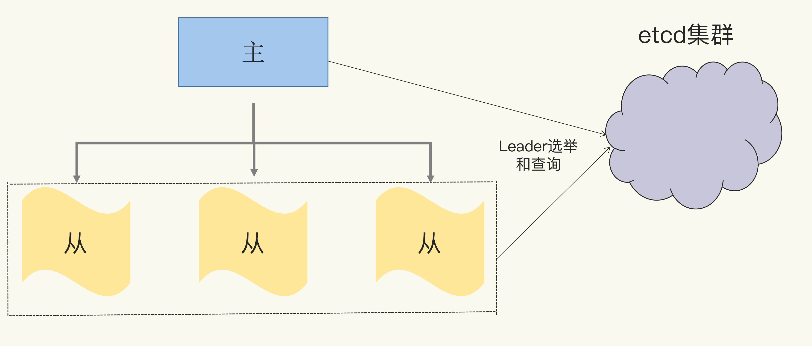

---
date: "2019-06-23"
---  
      
# 19 |  在分布式环境中，Leader选举、互斥锁和读写锁该如何实现？
你好，我是鸟窝。

在前面的课程里，我们学习的并发原语都是在进程内使用的，也就是我们常见的一个运行程序为了控制共享资源、实现任务编排和进行消息传递而提供的控制类型。在接下来的这两节课里，我要讲的是几个分布式的并发原语，它们控制的资源或编排的任务分布在不同进程、不同机器上。

分布式的并发原语实现更加复杂，因为在分布式环境中，网络状况、服务状态都是不可控的。不过还好有相应的软件系统去做这些事情。这些软件系统会专门去处理这些节点之间的协调和异常情况，并且保证数据的一致性。我们要做的就是在它们的基础上实现我们的业务。

常用来做协调工作的软件系统是Zookeeper、etcd、Consul之类的软件，Zookeeper为Java生态群提供了丰富的分布式并发原语（通过Curator库），但是缺少Go相关的并发原语库。Consul在提供分布式并发原语这件事儿上不是很积极，而etcd就提供了非常好的分布式并发原语，比如分布式互斥锁、分布式读写锁、Leader选举，等等。所以，今天，我就以etcd为基础，给你介绍几种分布式并发原语。

既然我们依赖etcd，那么，在生产环境中要有一个etcd集群，而且应该保证这个etcd集群是7\*24工作的。在学习过程中，你可以使用一个etcd节点进行测试。

<!-- [[[read_end]]] -->

这节课我要介绍的就是Leader选举、互斥锁和读写锁。

# Leader选举

Leader选举常常用在主从架构的系统中。主从架构中的服务节点分为主（Leader、Master）和从（Follower、Slave）两种角色，实际节点包括1主n从，一共是n+1个节点。

主节点常常执行写操作，从节点常常执行读操作，如果读写都在主节点，从节点只是提供一个备份功能的话，那么，主从架构就会退化成主备模式架构。

主从架构中最重要的是如何确定节点的角色，也就是，到底哪个节点是主，哪个节点是从？

**在同一时刻，系统中不能有两个主节点，否则，如果两个节点都是主，都执行写操作的话，就有可能出现数据不一致的情况，所以，我们需要一个选主机制，选择一个节点作为主节点，这个过程就是Leader选举**。

当主节点宕机或者是不可用时，就需要新一轮的选举，从其它的从节点中选择出一个节点，让它作为新主节点，宕机的原主节点恢复后，可以变为从节点，或者被摘掉。

我们可以通过etcd基础服务来实现leader选举。具体点说，我们可以将Leader选举的逻辑交给etcd基础服务，这样，我们只需要把重心放在业务开发上。etcd基础服务可以通过多节点的方式保证7\*24服务，所以，我们也不用担心Leader选举不可用的问题。如下图所示：



接下来，我会给你介绍业务开发中跟Leader选举相关的选举、查询、Leader变动监控等功能。

我要先提醒你一句，如果你想运行我下面讲到的测试代码，就要先部署一个etcd的集群，或者部署一个etcd节点做测试。

首先，我们来实现一个测试分布式程序的框架：它会先从命令行中读取命令，然后再执行相应的命令。你可以打开两个窗口，模拟不同的节点，分别执行不同的命令。

这个测试程序如下：

```
    package main
    
    // 导入所需的库
    import (
        "bufio"
        "context"
        "flag"
        "fmt"
        "log"
        "os"
        "strconv"
        "strings"
    
        "github.com/coreos/etcd/clientv3"
        "github.com/coreos/etcd/clientv3/concurrency"
    )
    
    // 可以设置一些参数，比如节点ID
    var (
        nodeID    = flag.Int("id", 0, "node ID")
        addr      = flag.String("addr", "http://127.0.0.1:2379", "etcd addresses")
        electName = flag.String("name", "my-test-elect", "election name")
    )
    
    func main() {
        flag.Parse()
    
        // 将etcd的地址解析成slice of string
        endpoints := strings.Split(*addr, ",")
    
        // 生成一个etcd的clien
        cli, err := clientv3.New(clientv3.Config{Endpoints: endpoints})
        if err != nil {
            log.Fatal(err)
        }
        defer cli.Close()
    
        // 创建session,如果程序宕机导致session断掉，etcd能检测到
        session, err := concurrency.NewSession(cli)
        defer session.Close()
    
        // 生成一个选举对象。下面主要使用它进行选举和查询等操作
        // 另一个方法ResumeElection可以使用既有的leader初始化Election
        e1 := concurrency.NewElection(session, *electName)
    
        // 从命令行读取命令
        consolescanner := bufio.NewScanner(os.Stdin)
        for consolescanner.Scan() {
            action := consolescanner.Text()
            switch action {
            case "elect": // 选举命令
                go elect(e1, *electName)
            case "proclaim": // 只更新leader的value
                proclaim(e1, *electName)
            case "resign": // 辞去leader,重新选举
                resign(e1, *electName)
            case "watch": // 监控leader的变动
                go watch(e1, *electName)
            case "query": // 查询当前的leader
                query(e1, *electName)
            case "rev":
                rev(e1, *electName)
            default:
                fmt.Println("unknown action")
            }
        }
    }
    

```

部署完以后，我们就可以开始选举了。

## 选举

如果你的业务集群还没有主节点，或者主节点宕机了，你就需要发起新一轮的选主操作，主要会用到**Campaign和Proclaim**。如果你需要主节点放弃主的角色，让其它从节点有机会成为主节点，就可以调用**Resign**方法。

这里我提到了三个和选主相关的方法，下面我来介绍下它们的用法。

**第一个方法是Campaign**。它的作用是，把一个节点选举为主节点，并且会设置一个值。它的签名如下所示：

```
    func (e *Election) Campaign(ctx context.Context, val string) error
    

```

需要注意的是，这是一个阻塞方法，在调用它的时候会被阻塞，直到满足下面的三个条件之一，才会取消阻塞。

1.  成功当选为主；
2.  此方法返回错误；
3.  ctx被取消。

**第二个方法是Proclaim**。它的作用是，重新设置Leader的值，但是不会重新选主，这个方法会返回新值设置成功或者失败的信息。方法签名如下所示：

```
    func (e *Election) Proclaim(ctx context.Context, val string) error
    

```

**第三个方法是Resign**：开始新一次选举。这个方法会返回新的选举成功或者失败的信息。它的签名如下所示：

```
    func (e *Election) Resign(ctx context.Context) (err error)
    

```

这三个方法的测试代码如下。你可以使用测试程序进行测试，具体做法是，启动两个节点，执行和这三个方法相关的命令。

```
    var count int
    // 选主
    func elect(e1 *concurrency.Election, electName string) {
        log.Println("acampaigning for ID:", *nodeID)
        // 调用Campaign方法选主,主的值为value-<主节点ID>-<count>
        if err := e1.Campaign(context.Background(), fmt.Sprintf("value-%d-%d", *nodeID, count)); err != nil {
            log.Println(err)
        }
        log.Println("campaigned for ID:", *nodeID)
        count++
    }
    // 为主设置新值
    func proclaim(e1 *concurrency.Election, electName string) {
        log.Println("proclaiming for ID:", *nodeID)
        // 调用Proclaim方法设置新值,新值为value-<主节点ID>-<count>
        if err := e1.Proclaim(context.Background(), fmt.Sprintf("value-%d-%d", *nodeID, count)); err != nil {
            log.Println(err)
        }
        log.Println("proclaimed for ID:", *nodeID)
        count++
    }
    // 重新选主，有可能另外一个节点被选为了主
    func resign(e1 *concurrency.Election, electName string) {
        log.Println("resigning for ID:", *nodeID)
        // 调用Resign重新选主
        if err := e1.Resign(context.TODO()); err != nil {
            log.Println(err)
        }
        log.Println("resigned for ID:", *nodeID)
    }
    

```

## 查询

除了选举Leader，程序在启动的过程中，或者在运行的时候，还有可能需要查询当前的主节点是哪一个节点？主节点的值是什么？版本是多少？不光是主从节点需要查询和知道哪一个节点，在分布式系统中，还有其它一些节点也需要知道集群中的哪一个节点是主节点，哪一个节点是从节点，这样它们才能把读写请求分别发往相应的主从节点上。

etcd提供了查询当前Leader的方法**Leader**，如果当前还没有Leader，就返回一个错误，你可以使用这个方法来查询主节点信息。这个方法的签名如下：

```
    func (e *Election) Leader(ctx context.Context) (*v3.GetResponse, error)
    

```

每次主节点的变动都会生成一个新的版本号，你还可以查询版本号信息（**Rev**方法），了解主节点变动情况：

```
    func (e *Election) Rev() int64
    

```

你可以在测试完选主命令后，测试查询命令（query、rev），代码如下：

```
    // 查询主的信息
    func query(e1 *concurrency.Election, electName string) {
        // 调用Leader返回主的信息，包括key和value等信息
        resp, err := e1.Leader(context.Background())
        if err != nil {
            log.Printf("failed to get the current leader: %v", err)
        }
        log.Println("current leader:", string(resp.Kvs[0].Key), string(resp.Kvs[0].Value))
    }
    // 可以直接查询主的rev信息
    func rev(e1 *concurrency.Election, electName string) {
        rev := e1.Rev()
        log.Println("current rev:", rev)
    }
    

```

## 监控

有了选举和查询方法，我们还需要一个监控方法。毕竟，如果主节点变化了，我们需要得到最新的主节点信息。

我们可以通过Observe来监控主的变化，它的签名如下：

```
    func (e *Election) Observe(ctx context.Context) <-chan v3.GetResponse
    

```

它会返回一个chan，显示主节点的变动信息。需要注意的是，它不会返回主节点的全部历史变动信息，而是只返回最近的一条变动信息以及之后的变动信息。

它的测试代码如下：

```
    func watch(e1 *concurrency.Election, electName string) {
        ch := e1.Observe(context.TODO())
    
    
        log.Println("start to watch for ID:", *nodeID)
        for i := 0; i < 10; i++ {
            resp := <-ch
            log.Println("leader changed to", string(resp.Kvs[0].Key), string(resp.Kvs[0].Value))
        }
    }
    

```

etcd提供了选主的逻辑，而你要做的就是利用这些方法，让它们为你的业务服务。在使用的过程中，你还需要做一些额外的设置，比如查询当前的主节点、启动一个goroutine阻塞调用Campaign方法，等等。虽然你需要做一些额外的工作，但是跟自己实现一个分布式的选主逻辑相比，大大地减少了工作量。

接下来，我们继续看etcd提供的分布式并发原语：互斥锁。

# 互斥锁

互斥锁是非常常用的一种并发原语，我专门花了4讲的时间，重点介绍了互斥锁的功能、原理和易错场景。

不过，前面说的互斥锁都是用来保护同一进程内的共享资源的，今天，我们要掌握的是分布式环境中的互斥锁。**我们要重点学习下分布在不同机器中的不同进程内的goroutine，如何利用分布式互斥锁来保护共享资源。**

互斥锁的应用场景和主从架构的应用场景不太一样。**使用互斥锁的不同节点是没有主从这样的角色的，所有的节点都是一样的，只不过在同一时刻，只允许其中的一个节点持有锁**。

下面，我们就来学习下互斥锁相关的两个原语，即Locker和Mutex。

## Locker

etcd提供了一个简单的Locker原语，它类似于Go标准库中的sync.Locker接口，也提供了Lock/UnLock的机制：

```
    func NewLocker(s *Session, pfx string) sync.Locker
    

```

可以看到，它的返回值是一个sync.Locker，因为你对标准库的Locker已经非常了解了，而且它只有Lock/Unlock两个方法，所以，接下来使用这个锁就非常容易了。下面的代码是一个使用Locker并发原语的例子：

```
    package main
    
    import (
        "flag"
        "log"
        "math/rand"
        "strings"
        "time"
    
        "github.com/coreos/etcd/clientv3"
        "github.com/coreos/etcd/clientv3/concurrency"
    )
    
    var (
        addr     = flag.String("addr", "http://127.0.0.1:2379", "etcd addresses")
        lockName = flag.String("name", "my-test-lock", "lock name")
    )
    
    func main() {
        flag.Parse()
        
        rand.Seed(time.Now().UnixNano())
        // etcd地址
        endpoints := strings.Split(*addr, ",")
        // 生成一个etcd client
        cli, err := clientv3.New(clientv3.Config{Endpoints: endpoints})
        if err != nil {
            log.Fatal(err)
        }
        defer cli.Close()
        useLock(cli) // 测试锁
    }
    
    func useLock(cli *clientv3.Client) {
        // 为锁生成session
        s1, err := concurrency.NewSession(cli)
        if err != nil {
            log.Fatal(err)
        }
        defer s1.Close()
        //得到一个分布式锁
        locker := concurrency.NewLocker(s1, *lockName)
    
        // 请求锁
        log.Println("acquiring lock")
        locker.Lock()
        log.Println("acquired lock")
    
        // 等待一段时间
        time.Sleep(time.Duration(rand.Intn(30)) * time.Second)
        locker.Unlock() // 释放锁
    
        log.Println("released lock")
    }
    

```

你可以同时在两个终端中运行这个测试程序。可以看到，它们获得锁是有先后顺序的，一个节点释放了锁之后，另外一个节点才能获取到这个分布式锁。

## Mutex

事实上，刚刚说的Locker是基于Mutex实现的，只不过，Mutex提供了查询Mutex的key的信息的功能。测试代码也类似：

```
    func useMutex(cli *clientv3.Client) {
        // 为锁生成session
        s1, err := concurrency.NewSession(cli)
        if err != nil {
            log.Fatal(err)
        }
        defer s1.Close()
        m1 := concurrency.NewMutex(s1, *lockName)
    
        //在请求锁之前查询key
        log.Printf("before acquiring. key: %s", m1.Key())
        // 请求锁
        log.Println("acquiring lock")
        if err := m1.Lock(context.TODO()); err != nil {
            log.Fatal(err)
        }
        log.Printf("acquired lock. key: %s", m1.Key())
    
        //等待一段时间
        time.Sleep(time.Duration(rand.Intn(30)) * time.Second)
    
        // 释放锁
        if err := m1.Unlock(context.TODO()); err != nil {
            log.Fatal(err)
        }
        log.Println("released lock")
    }
    

```

可以看到，Mutex并没有实现sync.Locker接口，它的Lock/Unlock方法需要提供一个context.Context实例做参数，这也就意味着，在请求锁的时候，你可以设置超时时间，或者主动取消请求。

# 读写锁

学完了分布式Locker和互斥锁Mutex，你肯定会联想到读写锁RWMutex。是的，etcd也提供了分布式的读写锁。不过，互斥锁Mutex是在github.com/coreos/etcd/clientv3/concurrency包中提供的，读写锁RWMutex却是在github.com/coreos/etcd/contrib/recipes包中提供的。

etcd提供的分布式读写锁的功能和标准库的读写锁的功能是一样的。只不过，**etcd提供的读写锁，可以在分布式环境中的不同的节点使用**。它提供的方法也和标准库中的读写锁的方法一致，分别提供了RLock/RUnlock、Lock/Unlock方法。下面的代码是使用读写锁的例子，它从命令行中读取命令，执行读写锁的操作：

```
    package main
    
    
    import (
        "bufio"
        "flag"
        "fmt"
        "log"
        "math/rand"
        "os"
        "strings"
        "time"
    
        "github.com/coreos/etcd/clientv3"
        "github.com/coreos/etcd/clientv3/concurrency"
        recipe "github.com/coreos/etcd/contrib/recipes"
    )
    
    var (
        addr     = flag.String("addr", "http://127.0.0.1:2379", "etcd addresses")
        lockName = flag.String("name", "my-test-lock", "lock name")
        action   = flag.String("rw", "w", "r means acquiring read lock, w means acquiring write lock")
    )
    
    
    func main() {
        flag.Parse()
        rand.Seed(time.Now().UnixNano())
    
        // 解析etcd地址
        endpoints := strings.Split(*addr, ",")
    
        // 创建etcd的client
        cli, err := clientv3.New(clientv3.Config{Endpoints: endpoints})
        if err != nil {
            log.Fatal(err)
        }
        defer cli.Close()
        // 创建session
        s1, err := concurrency.NewSession(cli)
        if err != nil {
            log.Fatal(err)
        }
        defer s1.Close()
        m1 := recipe.NewRWMutex(s1, *lockName)
    
        // 从命令行读取命令
        consolescanner := bufio.NewScanner(os.Stdin)
        for consolescanner.Scan() {
            action := consolescanner.Text()
            switch action {
            case "w": // 请求写锁
                testWriteLocker(m1)
            case "r": // 请求读锁
                testReadLocker(m1)
            default:
                fmt.Println("unknown action")
            }
        }
    }
    
    func testWriteLocker(m1 *recipe.RWMutex) {
        // 请求写锁
        log.Println("acquiring write lock")
        if err := m1.Lock(); err != nil {
            log.Fatal(err)
        }
        log.Println("acquired write lock")
    
        // 等待一段时间
        time.Sleep(time.Duration(rand.Intn(10)) * time.Second)
    
        // 释放写锁
        if err := m1.Unlock(); err != nil {
            log.Fatal(err)
        }
        log.Println("released write lock")
    }
    
    func testReadLocker(m1 *recipe.RWMutex) {
        // 请求读锁
        log.Println("acquiring read lock")
        if err := m1.RLock(); err != nil {
            log.Fatal(err)
        }
        log.Println("acquired read lock")
    
        // 等待一段时间
        time.Sleep(time.Duration(rand.Intn(10)) * time.Second)
    
        // 释放写锁
        if err := m1.RUnlock(); err != nil {
            log.Fatal(err)
        }
        log.Println("released read lock")
    }
    

```

# 总结

自己实现分布式环境的并发原语，是相当困难的一件事，因为你需要考虑网络的延迟和异常、节点的可用性、数据的一致性等多种情况。

所以，我们可以借助etcd这样成熟的框架，基于它提供的分布式并发原语处理分布式的场景。需要注意的是，在使用这些分布式并发原语的时候，你需要考虑异常的情况，比如网络断掉等。同时，分布式并发原语需要网络之间的通讯，所以会比使用标准库中的并发原语耗时更长。


好了，这节课就到这里，下节课，我会带你继续学习其它的分布式并发原语，包括队列、栅栏和STM，敬请期待。

# 思考题

1.  如果持有互斥锁或者读写锁的节点意外宕机了，它持有的锁会不会被释放？
2.  etcd提供的读写锁中的读和写有没有优先级？

欢迎在留言区写下你的思考和答案，我们一起交流讨论。如果你觉得有所收获，也欢迎你把今天的内容分享给你的朋友或同事。