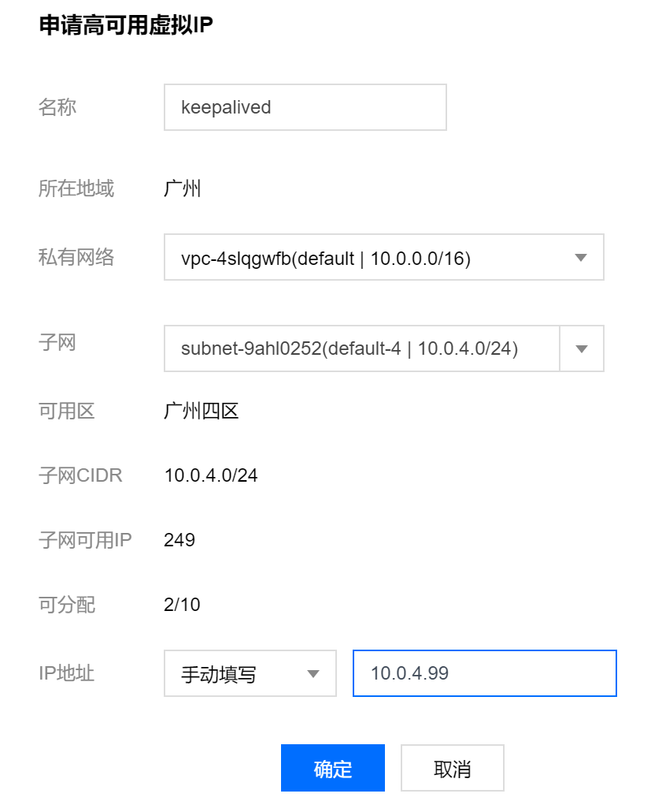
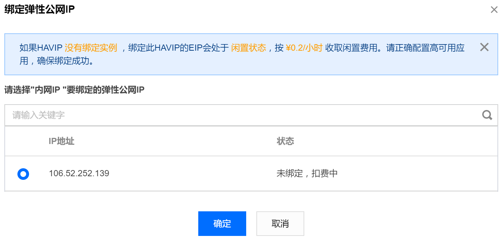

---
date: "2019-06-23"
---  
      
# 41 | 软件部署实战（中）：IAM 系统生产环境部署实战
你好，我是孔令飞。

上一讲，我介绍了IAM部署用到的两个核心组件，Nginx和Keepalived。那么这一讲，我们就来看下，如何使用Nginx和Keepalived来部署一个高可用的IAM应用。下一讲，我再介绍下IAM应用安全和弹性伸缩能力的构建方式。

这一讲，我们会通过下面四个步骤来部署IAM应用：

1.  在服务器上部署IAM应用中的服务。
2.  配置Nginx，实现反向代理功能。通过反向代理，我们可以通过Nginx来访问部署在内网的IAM服务。
3.  配置Nginx，实现负载均衡功能。通过负载均衡，我们可以实现服务的水平扩缩容，使IAM应用具备高可用能力。
4.  配置Keepalived，实现Nginx的高可用。通过Nginx + Keepalived的组合，可以实现整个应用架构的高可用。

## 部署IAM应用

部署一个高可用的IAM应用，需要至少两个节点。所以，我们按照先后顺序，分别在`10.0.4.20`和`10.0.4.21`服务器上部署IAM应用。

### 在`10.0.4.20`服务器上部署IAM应用

首先，我来介绍下如何在`10.0.4.20`服务器上部署IAM应用。

我们要在这个服务器上部署如下组件：

* iam-apiserver
* iam-authz-server
* iam-pump
* MariaDB
* Redis
* MongoDB

<!-- [[[read_end]]] -->

这些组件的部署方式，[03讲](https://time.geekbang.org/column/article/378082) 有介绍，这里就不再说明。

此外，我们还需要设置MariaDB，给来自于`10.0.4.21`服务器的数据库连接授权，授权命令如下：

```
    $ mysql -hlocalhost -P3306 -uroot -proot # 先以root用户登陆数据库
    MariaDB [(none)]> grant all on iam.* TO iam@10.0.4.21 identified by 'iam1234';
    Query OK, 0 rows affected (0.000 sec)
    
    MariaDB [(none)]> flush privileges;
    Query OK, 0 rows affected (0.000 sec)
    

```

### 在`10.0.4.21`服务器上部署IAM应用

然后，在`10.0.4.21`服务器上安装好iam-apiserver、iam-authz-server 和 iam-pump。这些组件通过`10.0.4.20` IP地址，连接`10.0.4.20`服务器上的MariaDB、Redis和MongoDB。

## 配置Nginx作为反向代理

假定要访问的API Server和IAM Authorization Server的域名分别为`iam.api.marmotedu.com`和`iam.authz.marmotedu.com`，我们需要分别为iam-apiserver和iam-authz-server配置Nginx反向代理。整个配置过程可以分为5步（在`10.0.4.20`服务器上操作）。

**第一步，配置iam-apiserver。**

新建Nginx配置文件`/etc/nginx/conf.d/iam-apiserver.conf`，内容如下：

```
    server {
        listen       80;
        server_name  iam.api.marmotedu.com;
        root         /usr/share/nginx/html;
        location / {
        	proxy_set_header X-Forwarded-Host $http_host;
        	proxy_set_header X-Real-IP $remote_addr;
        	proxy_set_header X-Forwarded-For $proxy_add_x_forwarded_for;
        	proxy_pass  http://127.0.0.1:8080/;
        	client_max_body_size 5m;
        }
    
        error_page 404 /404.html;
            location = /40x.html {
        }
    
        error_page 500 502 503 504 /50x.html;
            location = /50x.html {
        }
    }
    

```

有几点你在配置时需要注意，这里说明下。

* `server_name`需要为`iam.api.marmotedu.com`，我们通过`iam.api.marmotedu.com`访问iam-apiserver。
* iam-apiserver默认启动的端口为`8080`。
* 由于Nginx默认允许客户端请求的最大单文件字节数为`1MB`，实际生产环境中可能太小，所以这里将此限制改为5MB（`client_max_body_size 5m`）。如果需要上传图片之类的，可能需要设置成更大的值，比如`50m`。
* server\_name用来说明访问Nginx服务器的域名，例如`curl -H 'Host: iam.api.marmotedu.com' http://x.x.x.x:80/healthz`，`x.x.x.x`为Nginx服务器的IP地址。
* proxy\_pass表示反向代理的路径。因为这里是本机的iam-apiserver服务，所以IP为`127.0.0.1`。端口要和API服务端口一致，为`8080`。

最后还要提醒下，因为 Nginx 配置选项比较多，跟实际需求和环境有关，所以这里的配置是基础的、未经优化的配置，在实际生产环境中需要你再做调节。

**第二步，配置iam-authz-server。**

新建Nginx配置文件`/etc/nginx/conf.d/iam-authz-server.conf`，内容如下：

```
    server {
        listen       80;
        server_name  iam.authz.marmotedu.com;
        root         /usr/share/nginx/html;
        location / {
        	proxy_set_header X-Forwarded-Host $http_host;
        	proxy_set_header X-Real-IP $remote_addr;
        	proxy_set_header X-Forwarded-For $proxy_add_x_forwarded_for;
        	proxy_pass  http://127.0.0.1:9090/;
        	client_max_body_size 5m;
        }
    
        error_page 404 /404.html;
            location = /40x.html {
        }
    
        error_page 500 502 503 504 /50x.html;
            location = /50x.html {
        }
    }
    

```

下面是一些配置说明。

* server\_name需要为`iam.authz.marmotedu.com`，我们通过`iam.authz.marmotedu.com`访问iam-authz-server。
* iam-authz-server默认启动的端口为`9090`。
* 其他配置跟`/etc/nginx/conf.d/iam-apiserver.conf`一致。

**第三步，配置完Nginx后，重启Nginx：**

```
    $ sudo systemctl restart nginx
    

```

**第四步，在/etc/hosts中追加下面两行：**

```
    127.0.0.1 iam.api.marmotedu.com
    127.0.0.1 iam.authz.marmotedu.com
    

```

**第五步，发送HTTP请求：**

```
    $ curl http://iam.api.marmotedu.com/healthz
    {"status":"ok"}
    $ curl http://iam.authz.marmotedu.com/healthz
    {"status":"ok"}
    

```

我们分别请求iam-apiserver和iam-authz-server的健康检查接口，输出了`{"status":"ok"}`，说明我们可以成功通过代理访问后端的API服务。

在用curl请求`http://iam.api.marmotedu.com/healthz`后，后端的请求流程实际上是这样的：

1.  因为在`/etc/hosts`中配置了`127.0.0.1 iam.api.marmotedu.com`，所以请求`http://iam.api.marmotedu.com/healthz`实际上是请求本机的Nginx端口（`127.0.0.1:80`）。
2.  Nginx在收到请求后，会解析请求，得到请求域名为`iam.api.marmotedu.com`。根据请求域名去匹配 Nginx的server配置，匹配到`server_name iam.api.marmotedu.com;`配置。
3.  匹配到server后，把请求转发到该server的`proxy_pass`路径。
4.  等待API服务器返回结果，并返回客户端。

## 配置Nginx作为负载均衡

这门课采用Nginx轮询的负载均衡策略转发请求。负载均衡需要至少两台服务器，所以会分别在`10.0.4.20`和`10.0.4.21`服务器上执行相同的操作。下面我分别来介绍下如何配置这两台服务器，并验证配置是否成功。

### `10.0.4.20`服务器配置

登陆`10.0.4.20`服务器，在`/etc/nginx/nginx.conf`中添加upstream配置，配置过程可以分为3步。

**第一步，在**`/etc/nginx/nginx.conf`**中添加upstream：**

```
    http {
        log_format  main  '$remote_addr - $remote_user [$time_local] "$request" '
                          '$status $body_bytes_sent "$http_referer" '
                          '"$http_user_agent" "$http_x_forwarded_for"';
    
        access_log  /var/log/nginx/access.log  main;
    
        sendfile            on;
        tcp_nopush          on;
        tcp_nodelay         on;
        keepalive_timeout   65;
        types_hash_max_size 2048;
    
        include             /etc/nginx/mime.types;
        default_type        application/octet-stream;
    
        # Load modular configuration files from the /etc/nginx/conf.d directory.
        # See http://nginx.org/en/docs/ngx_core_module.html#include
        # for more information.
        include /etc/nginx/conf.d/*.conf;
        upstream iam.api.marmotedu.com {
            server 127.0.0.1:8080
            server 10.0.4.21:8080
        }
        upstream iam.authz.marmotedu.com {
            server 127.0.0.1:9090
            server 10.0.4.21:9090
        }
    }
    

```

配置说明：

* upstream是配置在`/etc/nginx/nginx.conf`文件中的`http{ … }`部分的。
* 因为我们要分别为iam-apiserver和iam-authz-server配置负载均衡，所以我们创建了两个upstream，分别是`iam.api.marmotedu.com`和`iam.authz.marmotedu.com`。为了便于识别，upstream名称和域名最好保持一致。
* 在upstream中，我们需要分别添加所有的iam-apiserver和iam-authz-server的后端（`ip:port`），本机的后端为了访问更快，可以使用`127.0.0.1:<port>`，其他机器的后端，需要使用`<内网>:port`，例如`10.0.4.21:8080`、`10.0.4.21:9090`。

**第二步，修改proxy\_pass。**

修改`/etc/nginx/conf.d/iam-apiserver.conf`文件，将`proxy_pass`修改为：

```
    proxy_pass http://iam.api.marmotedu.com/;
    

```

修改`/etc/nginx/conf.d/iam-authz-server.conf`文件，将`proxy_pass`修改为：

```
    proxy_pass http://iam.authz.marmotedu.com/;
    

```

当Nginx转发到`http://iam.api.marmotedu.com/`域名时，会从`iam.api.marmotedu.com` upstream配置的后端列表中，根据负载均衡策略选取一个后端，并将请求转发过去。转发`http://iam.authz.marmotedu.com/`域名的逻辑也一样。

**第三步，配置完Nginx后，重启Nginx：**

```
    $ sudo systemctl restart nginx
    

```

最终配置好的配置文件，你可以参考下面这些（保存在[configs/ha/10.0.4.20](https://github.com/marmotedu/iam/tree/v1.0.8/configs/ha/10.0.4.20)目录下）：

* nginx.conf：[configs/ha/10.0.4.20/nginx.conf](https://github.com/marmotedu/iam/blob/v1.0.8/configs/ha/10.0.4.20/nginx.conf)。
* iam-apiserver.conf：[configs/ha/10.0.4.20/iam-apiserver.conf](https://github.com/marmotedu/iam/blob/v1.0.8/configs/ha/10.0.4.20/iam-apiserver.conf)。
* iam-authz-server.conf：[configs/ha/10.0.4.20/iam-authz-server.conf](https://github.com/marmotedu/iam/blob/v1.0.8/configs/ha/10.0.4.20/iam-authz-server.conf)。

### `10.0.4.21`服务器配置

登陆`10.0.4.21`服务器，在`/etc/nginx/nginx.conf`中添加upstream配置。配置过程可以分为下面4步。

**第一步，在**`/etc/nginx/nginx.conf`**中添加upstream：**

```
    http {
        log_format  main  '$remote_addr - $remote_user [$time_local] "$request" '
                          '$status $body_bytes_sent "$http_referer" '
                          '"$http_user_agent" "$http_x_forwarded_for"';
    
        access_log  /var/log/nginx/access.log  main;
    
        sendfile            on;
        tcp_nopush          on;
        tcp_nodelay         on;
        keepalive_timeout   65;
        types_hash_max_size 2048;
    
        include             /etc/nginx/mime.types;
        default_type        application/octet-stream;
    
        # Load modular configuration files from the /etc/nginx/conf.d directory.
        # See http://nginx.org/en/docs/ngx_core_module.html#include
        # for more information.
        include /etc/nginx/conf.d/*.conf;
        upstream iam.api.marmotedu.com {
            server 127.0.0.1:8080
            server 10.0.4.20:8080
        }
        upstream iam.authz.marmotedu.com {
            server 127.0.0.1:9090
            server 10.0.4.20:9090
        }
    }
    

```

upstream中，需要配置`10.0.4.20`服务器上的iam-apiserver和iam-authz-server的后端，例如`10.0.4.20:8080`、`10.0.4.20:9090`。

**第二步，创建**`/etc/nginx/conf.d/iam-apiserver.conf`**文件**（iam-apiserver的反向代理+负载均衡配置），内容如下：

```
    server {
        listen       80;
        server_name  iam.api.marmotedu.com;
        root         /usr/share/nginx/html;
        location / {
        	proxy_set_header X-Forwarded-Host $http_host;
        	proxy_set_header X-Real-IP $remote_addr;
        	proxy_set_header X-Forwarded-For $proxy_add_x_forwarded_for;
        	proxy_pass  http://iam.api.marmotedu.com/;
        	client_max_body_size 5m;
        }
    
        error_page 404 /404.html;
            location = /40x.html {
        }
    
        error_page 500 502 503 504 /50x.html;
            location = /50x.html {
        }
    }
    

```

**第三步，创建**`/etc/nginx/conf.d/iam-authz-server`**文件**（iam-authz-server的反向代理+负载均衡配置），内容如下：

```
    server {
        listen       80;
        server_name  iam.authz.marmotedu.com;
        root         /usr/share/nginx/html;
        location / {
        	proxy_set_header X-Forwarded-Host $http_host;
        	proxy_set_header X-Real-IP $remote_addr;
        	proxy_set_header X-Forwarded-For $proxy_add_x_forwarded_for;
        	proxy_pass  http://iam.authz.marmotedu.com/;
        	client_max_body_size 5m;
        }
    
        error_page 404 /404.html;
            location = /40x.html {
        }
    
        error_page 500 502 503 504 /50x.html;
            location = /50x.html {
        }
    }
    
    

```

**第四步，配置完Nginx后，重启Nginx：**

```
    $ sudo systemctl restart nginx
    

```

最终配置好的配置文件，你可以参考下面这些（保存在[configs/ha/10.0.4.21](https://github.com/marmotedu/iam/tree/v1.0.8/configs/ha/10.0.4.21)目录下）：

* nginx.conf：[configs/ha/10.0.4.21/nginx.conf](https://github.com/marmotedu/iam/blob/v1.0.8/configs/ha/10.0.4.21/nginx.conf)。
* iam-apiserver.conf：[configs/ha/10.0.4.21/iam-apiserver.conf](https://github.com/marmotedu/iam/blob/v1.0.8/configs/ha/10.0.4.21/iam-apiserver.conf)。
* iam-authz-server.conf：[configs/ha/10.0.4.21/iam-authz-server.conf](https://github.com/marmotedu/iam/blob/v1.0.8/configs/ha/10.0.4.21/iam-authz-server.conf)。

### 测试负载均衡

上面，我们配置了Nginx负载均衡器，这里我们还需要测试下是否配置成功。

**第一步，执行测试脚本（**[test/nginx/loadbalance.sh](https://github.com/marmotedu/iam/blob/v1.0.8/test/nginx/loadbalance.sh)**）：**

```
    #!/usr/bin/env bash
    
    for domain in iam.api.marmotedu.com iam.authz.marmotedu.com
    do
      for n in $(seq 1 1 10)
      do
        echo $domain
        nohup curl http://${domain}/healthz &>/dev/null &
      done
    done
    

```

**第二步，分别查看iam-apiserver和iam-authz-server的日志。**

这里我展示下iam-apiserver的日志（iam-authz-server的日志你可自行查看）。

`10.0.4.20`服务器的iam-apiserver日志如下图所示：


`10.0.4.21`服务器的iam-apiserver日志如下图所示：


通过上面两张图，你可以看到`10.0.4.20`和`10.0.4.21`各收到`5`个`/healthz`请求，说明负载均衡配置成功。

## 配置Keepalived

在 [40讲](https://time.geekbang.org/column/article/411663)，我们分别在`10.0.4.20`和`10.0.4.21`服务器上安装了Keepalived。这里，我来介绍下如何配置Keepalived，实现Nginx的高可用。为了避免故障恢复时，VIP切换造成的服务延时，这一讲采用Keepalived的非抢占模式。

配置Keepalived的流程比较复杂，分为创建腾讯云HAVIP、主服务器配置、备服务器配置、测试Keepalived、VIP绑定公网IP和测试公网访问六大步，每一步中都有很多小步骤，下面我们来一步步地看下。

### **第一步：创建腾讯云HAVIP**

公有云厂商的普通内网IP，出于安全考虑（如避免ARP欺骗等），不支持主机通过ARP宣告IP 。如果用户直接在`keepalived.conf`文件中指定一个普通内网IP为virtual IP，当Keepalived将virtual IP从MASTER机器切换到BACKUP机器时，将无法更新IP和MAC地址的映射，而需要调API来进行IP切换。所以，这里的VIP需要申请腾讯云的HAVIP。

申请的流程可以分为下面4步：

1.  登录私有网络控制台**。**
2.  在左侧导航栏中，选择【IP与网卡】>【高可用虚拟IP】。
3.  在HAVIP管理页面，选择所在地域，单击【申请】。
4.  在弹出的【申请高可用虚拟IP】对话框中输入名称，选择HAVIP所在的私有网络和子网等信息，单击【确定】即可。

这里选择的私有网络和子网，需要和`10.0.4.20`、`10.0.4.21`相同。HAVIP 的 IP 地址可以自动分配，也可以手动填写，这里我们手动填写为10.0.4.99。申请页面如下图所示：



### 第二步：主服务器配置

进行主服务器配置，可以分为两步。

**首先，修改Keepalived配置文件。**

登陆服务器`10.0.4.20`，编辑`/etc/keepalived/keepalived.conf`，修改配置，修改后配置内容如下（参考：[configs/ha/10.0.4.20/keepalived.conf](https://github.com/marmotedu/iam/blob/v1.0.8/configs/ha/10.0.4.20/keepalived.conf)）：

```
    # 全局定义，定义全局的配置选项
    global_defs {
    # 指定keepalived在发生切换操作时发送email，发送给哪些email
    # 建议在keepalived_notify.sh中发送邮件
      notification_email {
        acassen@firewall.loc
      }
      notification_email_from Alexandre.Cassen@firewall.loc # 发送email时邮件源地址
        smtp_server 192.168.200.1 # 发送email时smtp服务器地址
        smtp_connect_timeout 30 # 连接smtp的超时时间
        router_id VM-4-20-centos # 机器标识，通常可以设置为hostname
        vrrp_skip_check_adv_addr # 如果接收到的报文和上一个报文来自同一个路由器，则不执行检查。默认是跳过检查
        vrrp_garp_interval 0 # 单位秒，在一个网卡上每组gratuitous arp消息之间的延迟时间，默认为0
        vrrp_gna_interval 0 # 单位秒，在一个网卡上每组na消息之间的延迟时间，默认为0
    }
    # 检测脚本配置
    vrrp_script checkhaproxy
    {
      script "/etc/keepalived/check_nginx.sh" # 检测脚本路径
        interval 5 # 检测时间间隔（秒）
        weight 0 # 根据该权重改变priority，当值为0时，不改变实例的优先级
    }
    # VRRP实例配置
    vrrp_instance VI_1 {
      state BACKUP  # 设置初始状态为'备份'
        interface eth0 # 设置绑定VIP的网卡，例如eth0
        virtual_router_id 51  # 配置集群VRID，互为主备的VRID需要是相同的值
        nopreempt               # 设置非抢占模式，只能设置在state为backup的节点上
        priority 100 # 设置优先级，值范围0～254，值越大优先级越高，最高的为master
        advert_int 1 # 组播信息发送时间间隔，两个节点必须设置一样，默认为1秒
    # 验证信息，两个节点必须一致
        authentication {
          auth_type PASS # 认证方式，可以是PASS或AH两种认证方式
            auth_pass 1111 # 认证密码
        }
      unicast_src_ip 10.0.4.20  # 设置本机内网IP地址
        unicast_peer {
          10.0.4.21             # 对端设备的IP地址
        }
    # VIP，当state为master时添加，当state为backup时删除
      virtual_ipaddress {
        10.0.4.99 # 设置高可用虚拟VIP，如果是腾讯云的CVM，需要填写控制台申请到的HAVIP地址。
      }
      notify_master "/etc/keepalived/keepalived_notify.sh MASTER" # 当切换到master状态时执行脚本
        notify_backup "/etc/keepalived/keepalived_notify.sh BACKUP" # 当切换到backup状态时执行脚本
        notify_fault "/etc/keepalived/keepalived_notify.sh FAULT" # 当切换到fault状态时执行脚本
        notify_stop "/etc/keepalived/keepalived_notify.sh STOP" # 当切换到stop状态时执行脚本
        garp_master_delay 1    # 设置当切为主状态后多久更新ARP缓存
        garp_master_refresh 5   # 设置主节点发送ARP报文的时间间隔
        # 跟踪接口，里面任意一块网卡出现问题，都会进入故障(FAULT)状态
        track_interface {
          eth0
        }
      # 要执行的检查脚本
      track_script {
        checkhaproxy
      }
    }
    

```

这里有几个注意事项：

 *    确保已经配置了garp相关参数。因为Keepalived依赖ARP报文更新IP信息，如果缺少这些参数，会导致某些场景下主设备不发送ARP，进而导致通信异常。garp相关参数配置如下：

```
    garp_master_delay 1
    garp_master_refresh 5
    

```

* 确定没有采用 strict 模式，即需要删除vrrp\_strict配置。
* 配置中的`/etc/keepalived/check_nginx.sh`和`/etc/keepalived/keepalived_notify.sh`脚本文件，可分别拷贝自[scripts/check\_nginx.sh](https://github.com/marmotedu/iam/blob/v1.0.8/scripts/check_nginx.sh)和[scripts/keepalived\_notify.sh](https://github.com/marmotedu/iam/blob/v1.0.8/scripts/keepalived_notify.sh)。

**然后，重启Keepalived：**

```
    $ sudo systemctl restart keepalived
    

```

### 第三步：备服务器配置

进行备服务器配置也分为两步。

**首先，修改Keepalived配置文件。**

登陆服务器`10.0.4.21`，编辑`/etc/keepalived/keepalived.conf`，修改配置，修改后配置内容如下（参考：[configs/ha/10.0.4.21/keepalived.conf](https://github.com/marmotedu/iam/blob/v1.0.8/configs/ha/10.0.4.21/keepalived.conf)）：

```
    # 全局定义，定义全局的配置选项
    global_defs {
    # 指定keepalived在发生切换操作时发送email，发送给哪些email
    # 建议在keepalived_notify.sh中发送邮件
      notification_email {
        acassen@firewall.loc
      }
      notification_email_from Alexandre.Cassen@firewall.loc # 发送email时邮件源地址
        smtp_server 192.168.200.1 # 发送email时smtp服务器地址
        smtp_connect_timeout 30 # 连接smtp的超时时间
        router_id VM-4-21-centos # 机器标识，通常可以设置为hostname
        vrrp_skip_check_adv_addr # 如果接收到的报文和上一个报文来自同一个路由器，则不执行检查。默认是跳过检查
        vrrp_garp_interval 0 # 单位秒，在一个网卡上每组gratuitous arp消息之间的延迟时间，默认为0
        vrrp_gna_interval 0 # 单位秒，在一个网卡上每组na消息之间的延迟时间，默认为0
    }
    # 检测脚本配置
    vrrp_script checkhaproxy
    {
      script "/etc/keepalived/check_nginx.sh" # 检测脚本路径
        interval 5 # 检测时间间隔（秒）
        weight 0 # 根据该权重改变priority，当值为0时，不改变实例的优先级
    }
    # VRRP实例配置
    vrrp_instance VI_1 {
      state BACKUP  # 设置初始状态为'备份'
        interface eth0 # 设置绑定VIP的网卡，例如eth0
        virtual_router_id 51  # 配置集群VRID，互为主备的VRID需要是相同的值
        nopreempt               # 设置非抢占模式，只能设置在state为backup的节点上
        priority 50 # 设置优先级，值范围0～254，值越大优先级越高，最高的为master
        advert_int 1 # 组播信息发送时间间隔，两个节点必须设置一样，默认为1秒
    # 验证信息，两个节点必须一致
        authentication {
          auth_type PASS # 认证方式，可以是PASS或AH两种认证方式
            auth_pass 1111 # 认证密码
        }
      unicast_src_ip 10.0.4.21  # 设置本机内网IP地址
        unicast_peer {
          10.0.4.20             # 对端设备的IP地址
        }
    # VIP，当state为master时添加，当state为backup时删除
      virtual_ipaddress {
        10.0.4.99 # 设置高可用虚拟VIP，如果是腾讯云的CVM，需要填写控制台申请到的HAVIP地址。
      }
      notify_master "/etc/keepalived/keepalived_notify.sh MASTER" # 当切换到master状态时执行脚本
        notify_backup "/etc/keepalived/keepalived_notify.sh BACKUP" # 当切换到backup状态时执行脚本
        notify_fault "/etc/keepalived/keepalived_notify.sh FAULT" # 当切换到fault状态时执行脚本
        notify_stop "/etc/keepalived/keepalived_notify.sh STOP" # 当切换到stop状态时执行脚本
        garp_master_delay 1    # 设置当切为主状态后多久更新ARP缓存
        garp_master_refresh 5   # 设置主节点发送ARP报文的时间间隔
        # 跟踪接口，里面任意一块网卡出现问题，都会进入故障(FAULT)状态
        track_interface {
          eth0
        }
      # 要执行的检查脚本
      track_script {
        checkhaproxy
      }
    }
    

```

**然后，重启Keepalived：**

```
    $ sudo systemctl restart keepalived
    

```

### 第四步：测试Keepalived

上面的配置中，`10.0.4.20`的优先级更高，所以正常情况下`10.0.4.20`将被选择为主节点，如下图所示：


接下来，我们分别模拟一些故障场景，来看下配置是否生效。

**场景1：Keepalived故障**

在`10.0.4.20`服务器上执行`sudo systemctl stop keepalived`模拟Keepalived故障，查看VIP，如下图所示：


可以看到，VIP从`10.0.4.20`服务器上，漂移到了`10.0.4.21`服务器上。查看`/var/log/keepalived.log`，可以看到`10.0.4.20`服务器新增如下一行日志：

```
    [2020-10-14 14:01:51] notify_stop
    

```

`10.0.4.21`服务器新增如下日志：

```
    [2020-10-14 14:01:52] notify_master
    

```

**场景2：Nginx故障**

在`10.0.4.20`和`10.0.4.21`服务器上分别执行`sudo systemctl restart keepalived`，让VIP漂移到`10.0.4.20`服务器上。

在`10.0.4.20`服务器上，执行 `sudo systemctl stop nginx` 模拟Nginx故障，查看VIP，如下图所示：


可以看到，VIP从`10.0.4.20`服务器上，漂移到了`10.0.4.21`服务器上。查看`/var/log/keepalived.log`，可以看到`10.0.4.20`服务器新增如下一行日志：

```
    [2020-10-14 14:02:34] notify_fault
    

```

`10.0.4.21` 服务器新增如下日志：

```
    [2020-10-14 14:02:35] notify_master
    

```

**场景3：Nginx恢复**

基于**场景2**，在`10.0.4.20`服务器上执行`sudo systemctl start nginx`恢复Nginx，查看VIP，如下图所示：


可以看到，VIP仍然在`10.0.4.21`服务器上，没有被`10.0.4.20`抢占。查看`/var/log/keepalived.log`，可以看到`10.0.4.20`服务器新增如下一行日志：

```
    [2020-10-14 14:03:44] notify_backup
    

```

`10.0.4.21`服务器没有新增日志。

### 第五步：VIP绑定公网IP

到这里，我们已经成功配置了Keepalived + Nginx的高可用方案。但是，我们的VIP是内网，还不能通过外网访问。这时候，我们需要将VIP绑定一个外网IP，供外网访问。在腾讯云上，可通过绑定弹性公网IP来实现外网访问，需要先申请公网IP，然后将VIP绑定弹性公网IP。下面我来讲讲具体步骤。

申请公网IP：

1.  登录**私有网络控制台。**
2.  在左侧导航栏中，选择【IP与网卡】>【弹性公网IP】。
3.  在弹性公网IP管理页面，选择所在地域，单击【申请】。

将VIP绑定弹性公网IP：

1.  登录**私有网络控制台**。
2.  在左侧导航栏中，选择【IP与网卡】>【高可用虚拟】。
3.  单击需要绑定的HAVIP所在行的【绑定】。
4.  在弹出界面中，选择需要绑定的公网IP即可，如下图所示：



绑定的弹性公网IP是`106.52.252.139`。

这里提示下，腾讯云平台中，如果HAVIP没有绑定实例，绑定HAVIP的EIP会处于闲置状态，按`¥0.2/小时` 收取闲置费用。所以，你需要正确配置高可用应用，确保绑定成功。

### 第六步：测试公网访问

最后，你可以通过执行如下命令来测试：

```
    $ curl -H"Host: iam.api.marmotedu.com" http://106.52.252.139/healthz -H"iam.api.marmotedu.com"
    {"status":"ok"}
    

```

可以看到，我们可以成功通过公网访问后端的高可用服务。到这里，我们成功部署了一个可用性很高的IAM应用。

## 总结

今天，我主要讲了如何使用Nginx和Keepalived，来部署一个高可用的IAM应用。

为了部署一个高可用的IAM应用，我们至少需要两台服务器，并且部署相同的服务iam-apiserver、iam-authz-server、iam-pump。而且，选择其中一台服务器部署数据库服务：MariaDB、Redis、MongoDB。

为了安全和性能，iam-apiserver、iam-authz-server、iam-pump服务都是通过内网来访问数据库服务的。这一讲，我还介绍了如何配置Nginx来实现负载均衡，如何配置Keepalived来实现Nginx的高可用。

## 课后练习

1.  思考下，当前部署架构下如果iam-apiserver需要扩容，可以怎么扩容？
2.  思考下，当VIP切换时，如何实现告警功能，给系统运维人员告警？

欢迎你在留言区与我交流讨论，我们下一讲见。