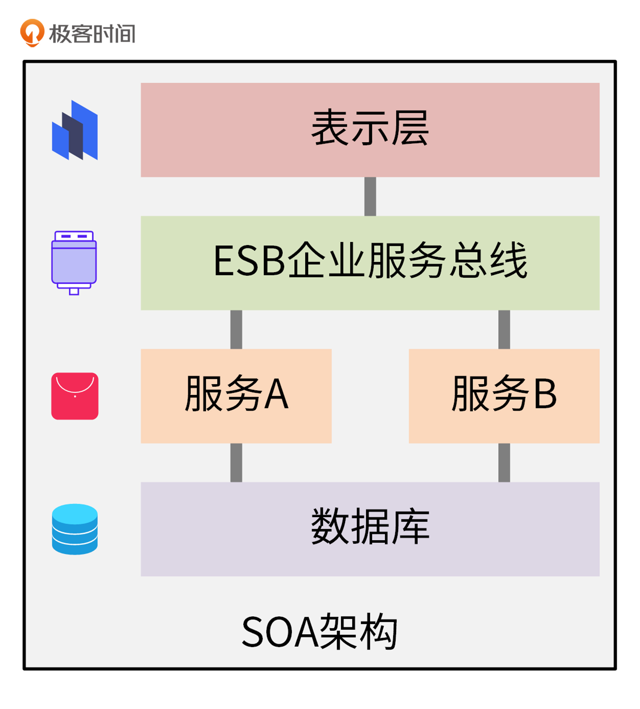
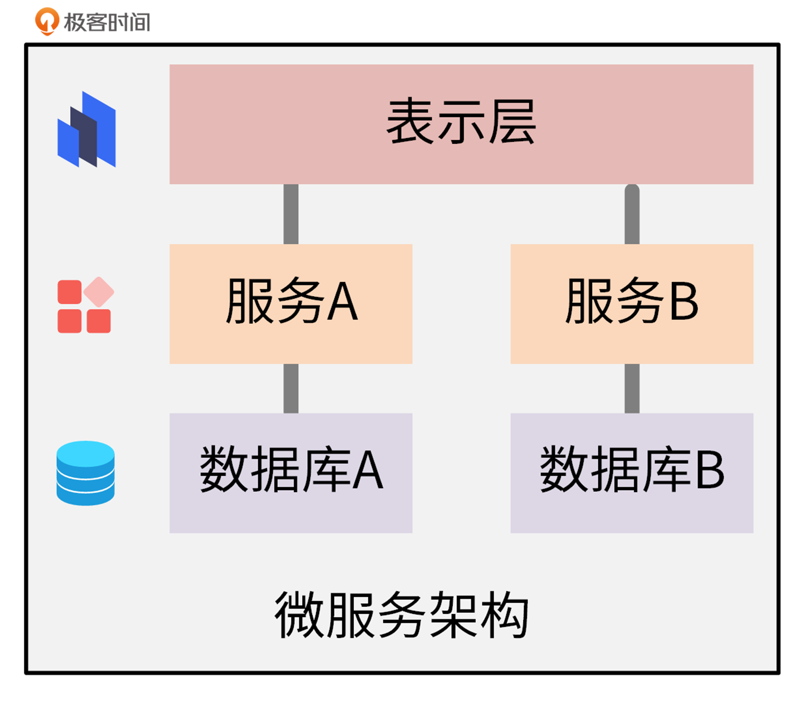
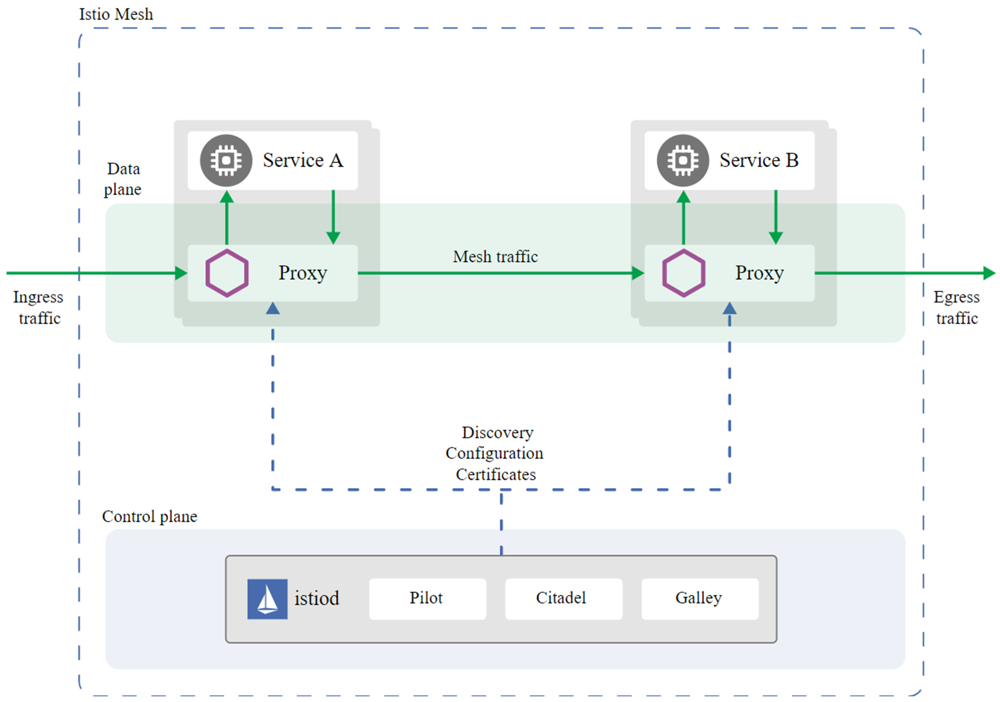
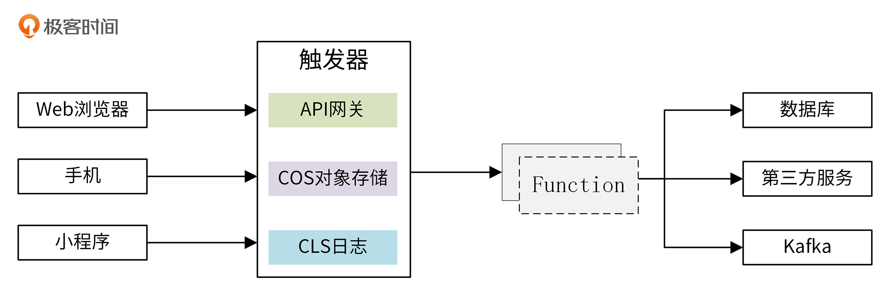
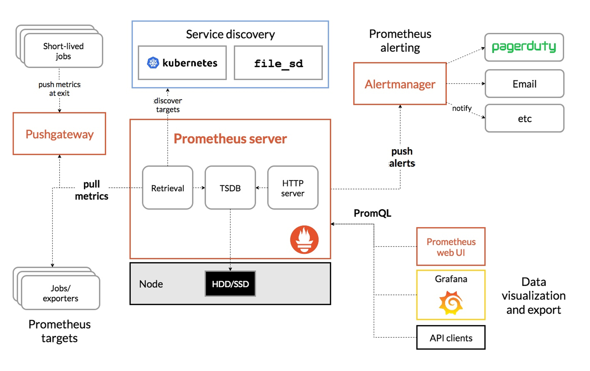
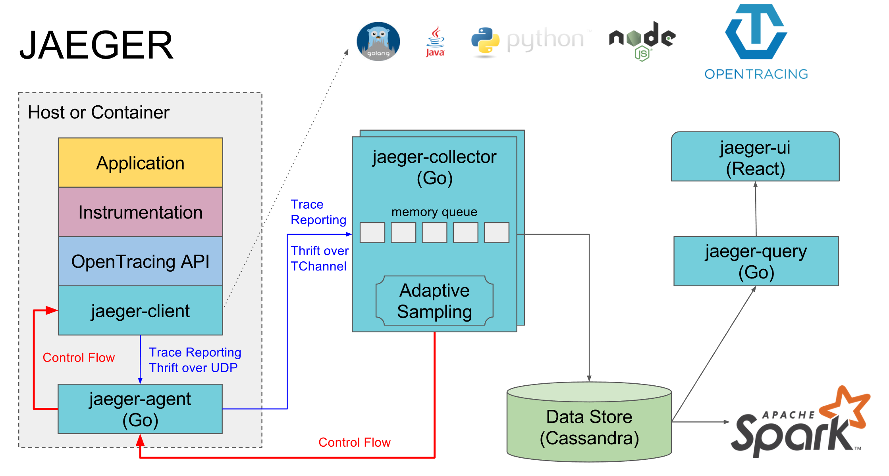
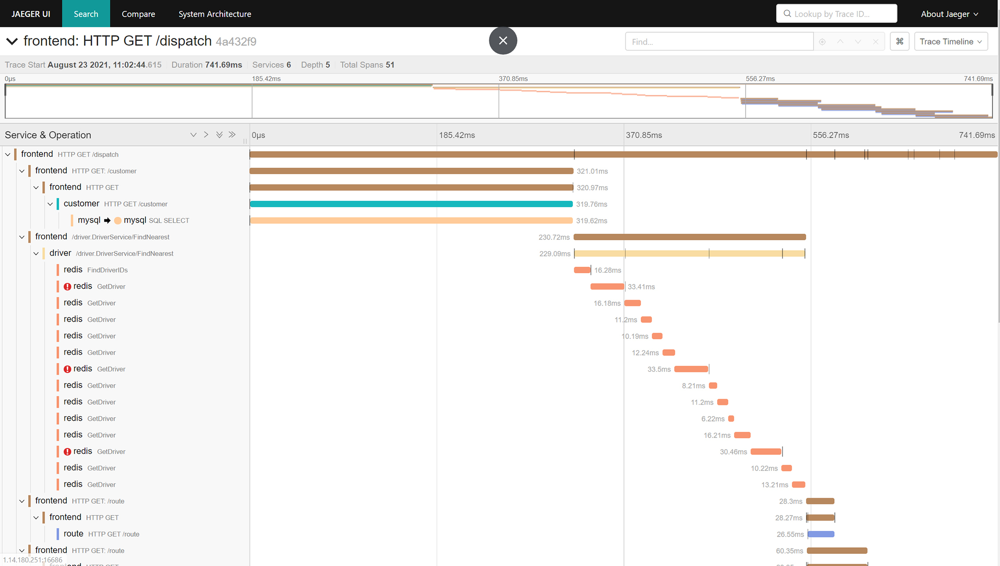
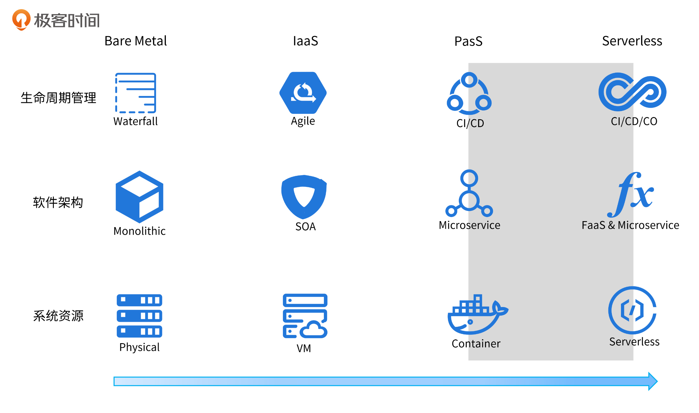

---
date: "2019-06-23"
---  
      
# 44｜技术演进（下）：软件架构和应用生命周期技术演进之路
你好，我是孔令飞。

应用、系统资源、应用生命周期管理这 3 个维度，构成了我们对云的所有诉求。上一讲，我从系统资源维度，介绍了虚拟化技术的演进之路。这一讲，我会介绍下应用维度和应用生命周期管理维度的技术演进。

应用软件架构是用来构建应用的，不同的软件架构，构建应用的方式、效率，以及所构建应用的可维护度、性能都是不同的。随着技术的不断更新迭代，应用软件架构也在不断往前演进。这一讲我们就来看看，应用软件架构都有哪些，这些软件架构都有什么特点，以及它们之间是如何演进的。

至于应用生命周期管理维度，我在 [09讲](https://time.geekbang.org/column/article/384021) 中已经介绍了应用生命周期管理技术的演进，这一讲也会再补充一些核心的技术，比如日志、监控告警、调用链等。

接下来，我们就先来看下软件架构的演进之路。

## 软件架构的演进

软件架构技术演进如下图所示：


最开始，我们使用单体架构来构建应用，后面逐渐演进为SOA架构。不管是单体架构，还是SOA架构，都很难满足互联网时代应用快速迭代的诉求。所以，在互联网时代，应用软件架构又演进成了微服务架构。当前我们正处在微服务架构阶段，也有很多团队的业务正在尝试使用Service Mesh替代微服务架构中的一些功能。

随着Serverless云函数的诞生，也诞生了一种新的软件架构，FaaS架构。这里我先简单介绍下它，后面再详细讲。FaaS架构因为限制多、使用场景局限，目前还仅仅适用于云函数这种系统资源形态，我个人认为它不会成为未来主流的软件架构。还要说明下，业界目前并没有FaaS软件架构这个说法，大家说到FaaS，一般指的都是云函数这种技术形态。这里为了方便描述，我们先这样表达。

<!-- [[[read_end]]] -->

接下来，我仍然以技术演进的思路，来介绍下这些软件架构。首先来看下最早的单体架构。

### 单体架构

在最早的时候，我们用的软件架构是单体架构。在单体架构中，我们会将应用程序的所有功能都存放在一个代码仓库中，并且发布时，也是发布整个代码仓库的代码和功能。

在单体架构中，应用软件一般会包含四层，分别是表示层、业务逻辑层、数据访问层、数据库，如下图所示：


这里简单介绍下每层的功能。

* 表示层：用于直接和用户交互，通常是网页、UI界面。
* 业务逻辑层：用来进行业务逻辑处理。使用表示层传来的参数，进行业务逻辑处理，并将结果返回给表示层。
* 数据访问层：用来操作数据库，通常包括数据的CURD操作。例如，从数据库中查询用户信息，或者往数据库增加一条用户记录。
* 数据库：存储数据的物理介质。我们通过数据访问层来访问数据库中的数据。

单体架构的优点是应用开发简单，技术单一，测试、部署相对简单明了。因此它比较适合用户访问量较小的应用服务端。但它的缺陷也是非常明显的。随着业务的发展，项目越来越大，单体架构会带来开发效率低、发布周期长、维护困难、稳定性差、扩展性差等问题。另外，单体架构的技术栈也不易扩展，只能在原有的基础上，不断地进行局部优化。

### SOA架构

为了解决单体架构在业务代码变大时带来的各种问题，SOA架构出现了。

SOA架构是面向服务的软件架构，它的核心理念是：基于SOA的架构思想，将重复共用的功能抽取为组件，以服务的方式给各系统提供服务，服务之间通过ESB企业服务总线进行通信。如下图所示：



SOA架构中，主要有两个角色，分别是服务提供者和服务消费者。服务消费者可以通过发送消息来调用购买商品、申请售后的服务，这些消息由ESB总线转换后，发送给对应的服务，实现 SOA 服务之间的交互通信。

SOA架构主要适用于大型软件服务企业对外提供服务的场景，至于一般业务场景就并不适用了。这是因为，SOA服务的定义、注册和调用都需要繁琐的编码或者配置来实现，并且ESB总线也容易导致系统的单点风险，并拖累整体性能。

### 微服务架构

在互联网时代，越来越多的企业推出了面向普通大众的网站和应用。这些企业没有能力，也没有必要构建和维护ESB企业服务总线。于是，基于SOA架构，又演进出了微服务架构。

微服务架构由Matrin Fowler在2014年提出，它的理念是将业务系统彻底地组件化和服务化，形成多个可以独立开发、部署和维护的服务或应用的集合。微服务之间采用RESTful等轻量的传输协议，来应对更快的需求变更和更短的开发迭代周期。如下图所示：



微服务架构提出得比较早，但在这几年才逐渐流行起来。这是什么原因呢？一方面，微服务架构基于自身的特点，确实能够解决其他软件架构中存在的一些问题；另一方面，Docker + Kubernetes等云原生技术这几年也发展了起来，能够很好地支撑微服务的部署和生命周期管理。

总体来说，微服务架构有下面这几个特点：

* 微服务遵循单一原则，每个微服务负责一个独立的上下文边界；
* 微服务架构提供的服务之间采用 RESTful 等轻量协议传输，比 ESB 更轻量；
* 每个服务都有自己独立的业务开发活动和周期；
* 微服务一般使用容器技术独立部署，运行在自己的独立进程中，合理分配其所需的系统资源。这样，开发者就可以更加方便地制定每个服务的优化方案，提高系统可维护性。

微服务架构有很多优点，但也存在着问题。因为一个应用被拆分成一个个的微服务，随着微服务的增多，就会引入一些问题，比如微服务过多导致服务部署复杂。微服务的分布式特点也带来了一些复杂度，比如需要提供服务发现能力、调用链难以追踪、测试困难，等等。服务之间相互依赖，有可能形成复杂的依赖链路，往往单个服务异常，其他服务都会受到影响，出现服务雪崩效应。

目前业界针对这些问题也有一些标准的解决方案，比如，可以通过Kubernetes、Helm和CI/CD技术，解决微服务部署复杂的问题。至于微服务的分布式特点所带来的复杂性，可以通过一些微服务开发框架来解决。一些业界比较知名的微服务开发框架，比如Spring Cloud和Dubbo，已经很好地解决了上面的问题。另外，云原生相关的技术也可以解决微服务调用链跟踪复杂、故障排障困难等问题。

另外，在我的日常开发中，经常会有开发者把SOA架构和微服务架构给搞混，所以我在这里再来介绍下二者的相同点和不同点。

微服务架构是SOA架构设计思想的另一种实现方式，这是二者相同的地方。至于区别，主要有三个。理解了下面这三点，以后你在开发中就很容易区分它们了。

* SOA中的服务，其实只能属于某个应用的服务之一，微服务中的服务则是一个独立的服务，可以被多个应用共用。
* SOA强调尽可能多地共享，而微服务强调尽可能少地共享。
* SOA架构中，服务之间通过ESB来通信，而微服务中，服务之间通过轻量化机制，比如RESTful来实现通信。

### Service Mesh

在讲微服务的时候，我提到微服务架构的一些问题可以通过一些微服务开发框架来解决，比如Spring Cloud和Dubbo。但这里也有个问题：这些框架通常是侵入式的，比如语言只能限制在Java，并且开发的时候要按框架的指定方式来开发。这个理念跟微服务的独立技术栈也是相反的。

2017年底Service Mesh（服务网格）的出现解决了这个问题，它是一种非侵入式技术，可以提供服务之间的网络调用、限流、熔断和服务监控等功能。Service Mesh类似于TCP/IP协议，无需应用层感知，开发者只需要开发应用程序即可。所以，Service Mesh是致力于解决服务间通讯的基础设施层，它具有下面这几个特点：

* 应用程序间通讯的中间层。
* 轻量级网络代理。
* 非侵入式，应用程序无感知。
* 可以将服务治理功能，例如重试、超时、监控、链路追踪、服务发现等功能，以及服务本身解耦。

Service Mesh目前的发展比较火热，社区有很多优秀的Service Mesh开源项目，例如 [Istio](https://github.com/istio/istio) 、[Linkerd](https://github.com/linkerd/linkerd2) 等。当前最受欢迎的开源项目是Istio。

Istio是一个完全开源的服务网格，作为透明的一层接入到现有的分布式应用程序里，提供服务治理等功能。它也是一个平台，拥有可以集成任何日志、遥测和策略系统的 API 接口。

Istio的大概实现原理是：每个服务都会被注入一个Sidecar（边车）组件，服务之间通信是先通过Sidecar，然后Sidecar再将流量转发给另一个服务。因为所有流量都经过一个Sidecar，所以可以通过Sidecar实现很多功能，比如认证、限流、调用链等。同时还有一个控制面，控制面通过配置Sidecar来实现各种服务治理功能。

目前Istio的最新版本是1.8，1.8版本的Istio架构图如下：



从图中你可以看到，Istio主要包含两大平面。一个是数据平面（Data plane），由Envoy Proxy充当的Sidecar组成。另一个是控制平面（Control plane），主要由三大核心组件Pilot、Citadel、Galley组成。下面，我来分别介绍下这三大核心组件的功能。

* Pilot：主要用来管理部署在Istio服务网格中的Envoy代理实例，为它们提供服务发现、流量管理以及弹性功能，比如A/B测试、金丝雀发布、超时、重试、熔断等。
* Citadel：Istio的核心安全组件，负责服务的密钥和数字证书管理，用于提供自动生成、分发、轮换及撤销密钥和数据证书的功能。
* Galley：负责向Istio的其他组件提供支撑功能，可以理解为Istio的配置中心，它用于校验进入网络配置信息的格式内容正确性，并将这些配置信息提供给Pilot。

### FaaS架构

这几年，以云函数为代表的Serverless技术异常火爆。伴随着Serverless技术的发展，一个新的软件开发模式也诞生了，这就是FaaS架构。

FaaS架构提供了一种比微服务更加服务碎片化的软件架构模式。简单来说，FaaS架构就是把之前一个完整的业务拆分成一个个Function来部署，通过事件来触发底层Function的执行。

Function里可能会调用第三方组件，比如数据库、消息队列服务等，这些第三方组件在Serverless架构中，统称为BaaS（Backend as a Serivce）。BaaS把这些后端的服务能力抽象成API让用户调用，用户不需要关注这些后端组件的高可用、扩缩容等运维层面的点，只需要去使用就可以了。

下面是FaaS架构的示意图：



从这张图里你可以看到，用户通过浏览器、手机、小程序等客户端请求触发器服务，例如API网关、COS对象存储、CLS日志等。这些触发器服务在收到来自用户的请求之后，会触发它们所绑定的云函数，云函数会根据请求量等数据，实时启动多个并发实例。在触发云函数时，也会传递参数给云函数，并在云函数中使用这些参数，进行一些业务逻辑处理。例如，调用第三方的服务，将处理结果保存在后端数据库中。

在我看来，FaaS架构未来不会成为主流，更多的是存在于云函数的场景中。我这么说是因为，如果将应用拆分成一个个Function，这些Function的部署、维护，以及之间的通信会是一个巨大的挑战，从目前来看，还不存在解决这种挑战的技术和条件。另外，FaaS架构也不适合承载一些较重的业务逻辑，比如还没法大规模迁移企业的应用系统。

## 应用生命周期管理技术：监控告警、日志、调用链

在这门课的 [09讲](https://time.geekbang.org/column/article/384021) 中，我已经详细介绍了应用生命周期管理技术的演进。这里我们可以再回顾一下：应用生命周期，最开始主要是通过研发模式来管理的，按时间线先后出现了瀑布模式、迭代模式、敏捷模式。接着，为了解决研发模式中的一些痛点，出现了另一种管理技术，也就是 CI/CD 技术。随着 CI/CD 技术的成熟，又催生了另一种更高级的管理技术 DevOps。

其他的细节内容，如果有遗忘，你可以返回 [09讲](https://time.geekbang.org/column/article/384021) 再复习一下，这里就不再重复介绍了。接下来，对于应用生命周期管理技术，我会补充一些之前没有讲到的重要技术，包括下面这三个：

* 监控告警组件，Prometheus；
* 统一日志管理框架，EFK；
* 调用链跟踪组件，Jaeger。

需要说明的是，这些技术之间不存在演进关系，而是平级的，共同作为应用生命周期管理技术的补充。

### 监控告警组件：Prometheus

对于应用来说，监控告警功能是必不可少的一项功能，能够让开发者或运维人员及时感知到程序异常，并及时修复。另外，监控也能够收集一些有用的数据，供后面的运营分析使用。云原生技术栈中，也有很多开源的优秀监控告警项目，例如 Zabbix、Prometheus等，其中最受欢迎的是[Prometheus](https://github.com/prometheus/prometheus)。

Prometheus是一款开源的、自带时序数据库的监控告警系统。目前，Prometheus已经成为Kubernetes集群中监控告警系统的标配。它具有下面这几个特点：

* 强大的多维度数据模型；
* 在多维度上灵活地查询语言；
* 不依赖分布式存储，单主节点工作；
* 通过基于HTTP的pull方式，采集时序数据；
* 可以通过Push Gateway进行时序列数据推送；
* 可以通过服务发现或者静态配置，去获取要采集的目标服务器；
* 多种可视化图表及仪表盘支持\(Grafana\)。

Prometheus的架构如下图所示：



从上图可以看出，Prometheus 的主要模块包括Prometheus Server、Exporters、Pushgateway、Alertmanager 以及Grafana图形界面。这些模块，有些是可选的，有些是必选的，大部分组件使用Golang编写。下面我来分别介绍下。

* Prometheus Server（必选）：Prometheus的核心服务，会定期从Jobs/exporters或者Pushgateway中拉取监控数据，并将时间序列（time-series）数据保存TSDB中，TSDB是一个时间序列数据库。
* Client Library（必选）: Prometheus的客户端，应用程序使用Client Library，可以很方便地生成metrics，并暴露一个API接口，供Prometheus server从中拉取（pull）metrics数据。
* Pushgateway（可选）: 接收短期的Jobs（Short-lived）推送（push）过来的metrics数据并缓存，供Prometheus server定期来pull这些监控数据。
* Exporters（可选）: 以agent的形式运行在需要采集监控数据的应用服务器上，收集应用程序监控数据，并提供API接口，供Prometheus server 来 pull metrics数据。
* Alertmanager（可选）: Prometheus的告警组件，接收来自于Prometheus server的alerts，将这些alerts去重、分组，并往配置的接收目的地发送告警。
* Grafana（可选）：Grafana是一款跨平台、开源的可视化数据展示工具，可以用来统计和展示Prometheus监控数据，并带有告警功能，采用Go语言开发。

Prometheus大致的工作流程是：

1.  Prometheus Server 定期从配置好的 jobs 或者 Exporters 中拉 metrics，或者接收来自 Pushgateway 的 metrics，再或者从其他的 Prometheus Server 中拉 metrics。
2.  Prometheus Server 在本地存储收集到的 metrics，并运行已经定义好的 alert.rules，记录新的时间序列，或者向 Alertmanager 推送警报。
3.  Alertmanager 根据配置文件，对接收到的警报进行处理，发出告警。
4.  Grafana在图形界面中，可视化地展示采集数据。

Prometheus会将所有采集到的样本数据以时间序列的方式保存在内存数据库中，并且定时保存到硬盘上。time-series是按照时间戳和值的序列顺序存放的。每条time-series通过指标名称\(metrics name\)和一组标签集\(labelset\)命名，如下所示：

```
    <--------------- metric ---------------------><-timestamp -><-value->
    http_request_total{status="200", method="GET"}@1434417560938 => 94355
    http_request_total{status="200", method="GET"}@1434417561287 => 94334
    
    http_request_total{status="404", method="GET"}@1434417560938 => 38473
    http_request_total{status="404", method="GET"}@1434417561287 => 38544
    
    http_request_total{status="200", method="POST"}@1434417560938 => 4748
    http_request_total{status="200", method="POST"}@1434417561287 => 4785
    

```

在time-series中的每一个点，我们称为一个样本（sample）。样本由下面三个部分组成。

* 指标\(metric\)：metric name和描述当前样本特征的labelsets。
* 时间戳\(timestamp\)：一个精确到毫秒的时间戳。
* 样本值\(value\)： 一个folat64的浮点型数据，表示当前样本的值。

### 统一日志管理框架：EFK

我们通过监控告警服务感知到程序异常，这时候需要开发者或者运维人员介入排障。排障最有效的手段，是查看日志。所以，对于一个应用来说，一个优秀的日志系统也是必不可少的功能。

在一个大型的分布式系统中，有很多组件，这些组件分别部署在不同的服务器上。如果系统出故障，需要查看日志排障。这时候，你可能需要登陆不同的服务器，查看不同组件的日志，这个过程是非常繁琐、低效的，也会导致排障时间变长。故障时间越久，意味着给客户带来的损失越大。

所以，在一个大型系统中，传统的日志查看手段已经满足不了我们的需求了。这时候，我们需要有一个针对分布式系统的日志解决方案。当前，业界有不少成熟的分布式日志解决方案，其中使用最多的是EFK日志解决方案。甚至可以说，EFK已经成为分布式日志解决方案的事实标准。

EFK中包含三个开源的软件，分别是Elasticsearch、FlieBeat、Kibana。下面，我来介绍下这三个开源软件：

* Elasticsearch：简称ES，是一个实时的、分布式的搜索引擎，通常用来索引和搜索大规模的日志数据，并支持全文、结构化的搜索。
* FlieBeat：轻量的数据采集组件，以agent的方式运行在需要采集日志的服务器上。FlieBeat采集指定的文件，并上报给ES。如果采集日志量大，也可以上报给Kafka，再由其他组件消费Kafka中的日志并转储到ES中。
* Kibana：用于展示ES中存储的日志数据，支持通过图表进行高级数据分析及展示。

EFK的架构图如下：


通过Filebeat采集所在服务器上各服务组件的日志，并上传到Kafka中。Logstash消费Kafka中的日志，过滤后上报给Elasticsearch进行存储。最后，通过Kibana可视化平台来检索这些日志。Kibana是通过调用Elasticsearch提供的API接口，来检索日志数据的。

当Filebeat的日志生产速度和Logstash的日志消费速度不匹配时，中间的Kafka服务，会起到削峰填谷的作用。

### 调用链跟踪组件：Jaeger

在云原生架构中，应用普遍采用微服务。一个应用包含多个微服务，微服务之间会相互调用，这会给排障带来很大的挑战。比如，当我们通过前端访问应用报错时，我们根本不知道具体哪个服务、哪个步骤出问题了。所以这时候，应用就需要有分布式链路追踪能力。目前，业界也有多种分布式链路追踪系统，但用得最多的是[Jaeger](https://github.com/jaegertracing/jaeger)。

Jaeger是Uber推出的一款开源分布式追踪系统，兼容OpenTracing API。这里我们先来介绍两个概念：

* [OpenTracing](https://opentracing.io/)：它是一套开源的调用链追踪标准，通过提供厂商无关、平台无关的API，来支持开发人员方便地添加/更换追踪系统的实现。
* 分布式追踪系统：用于记录请求范围内的信息，是我们排查系统问题和系统性能的利器。分布式追踪系统种类繁多，但核心步骤都有三个，分别是代码埋点、数据存储和查询展示。

Jaeger架构图如下：



Jaeger中有7个关键组件，下面我来具体介绍下。

* instrument：将应用程序与jaeger-client装载起来，从而使应用程序可以上报调用链数据到Jaeger。
* jaeger-client：Jaeger的客户端SDK，负责收集并发送应用程序的调用链数据到jaeger-agent。
* jaeger-agent：接收并汇聚Span数据，并将这些数据上报给jaeger-collector。
* jaeger-collector：从jaeger-agent收集traces信息，并通过处理管道处理这些信息，最后写入后端存储。jaeger-collector是无状态的组件，可以根据需要水平扩缩容。
* Data Store：Jaeger的后端存储组件。目前，支持cassandra、elasticsearch。
* jaeger-ui：jaeger的前端界面，用于展示调用链等信息。
* jaeger-query：用于从存储中检索trace，并提供给jaeger-ui。

下面，我通过一个Jaeger官方提供的[All in One教程](https://www.jaegertracing.io/docs/1.25/getting-started/#all-in-one)来让你更好地理解Jaeger。具体可以分成两个操作步骤。

第一步，使用`jaeger-all-in-one`安装Jaeger服务：

```
    $ wget https://github.com/jaegertracing/jaeger/releases/download/v1.25.0/jaeger-1.25.0-linux-amd64.tar.gz
    $ tar -xvzf jaeger-1.25.0-linux-amd64.tar.gz
    $ mv jaeger-1.25.0-linux-amd64/* $HOME/bin
    $ jaeger-all-in-one --collector.zipkin.host-port=:9411
    

```

第二步，启动一个[HotROD](https://github.com/jaegertracing/jaeger/tree/master/examples/hotrod)示例应用，产生调用链：

```
    $ example-hotrod all # 第 1) 我们已经安装了 example-hotrod 命令
    

```

访问`http://$IP:16686/search`可以查找调用链（IP是Jaeger部署的服务器IP地址），如下图所示：


查询到调用链列表后，可以点击任意一个调用链，查看其详细的调用过程，如下图所示：



具体如何使用Jaeger来记录调用链，你可以参考Jaeger官方给出的[hotrod](https://github.com/jaegertracing/jaeger/tree/master/examples/hotrod)示例。

## 总结

最后，我们通过下面这张图，来对整个云技术的演进之路做个整体性的回顾：



通过这张图你可以看到，每种技术并不是孤立存在的，而是相互促进的。在物理机阶段，我们用的是瀑布开发模式和单体架构；在虚拟机阶段，用得比较多的是敏捷开发模式和SOA架构；在容器这个阶段，则使用CI/CD的开发模式和微服务架构。

在Serverless阶段，软件架构仍然采用微服务，不过在一些触发器场景，也可能会编写一些FaaS架构的函数，部署在类似腾讯云云函数这样的FaaS平台上；底层系统资源主要使用Serverless容器，并配合Kubernetes资源编排技术。在一些触发器场景中，也可能会使用云函数。应用程序中的第三方服务（BaaS），也都是越来越Serverless化的服务。应用生命周期管理技术也会演进为CI/CD/CO这种模式，其中CI/CD更加智能化，自动化程度更高。

这张图里，阴影部分是我们当前所处的阶段：容器技术得到了大规模普及，业界也在积极探索Serverless技术，并取得了卓有成效的结果。

## 课后练习

1.  了解下Kubernetes的声明式API机制，并思考下，微服务架构之后的软件架构可能是什么样的？
2.  动手搭建一个Prometheus服务，产生一些数据，并配置Grafana，最终可视化地展示这些监控数据。

欢迎你在留言区与我交流讨论，我们下一讲见。