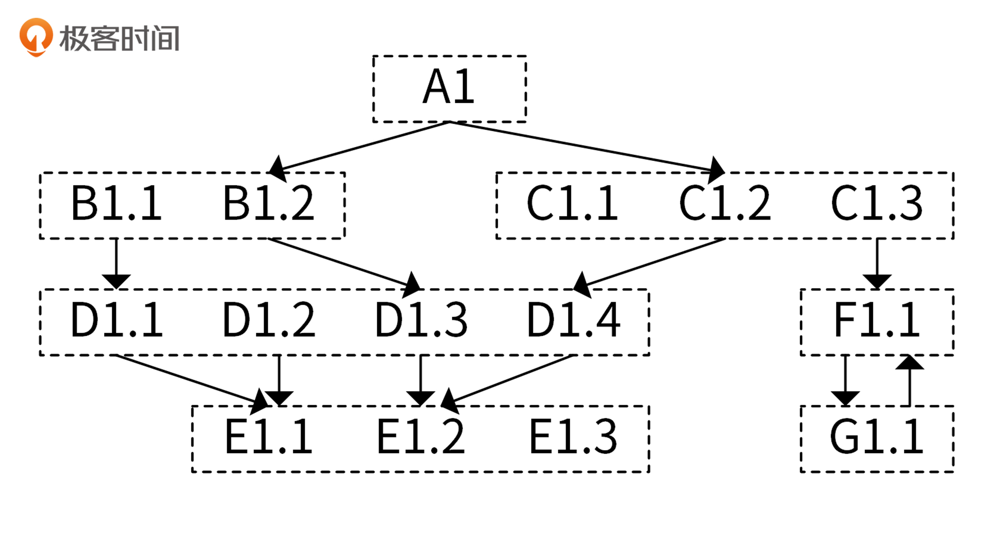
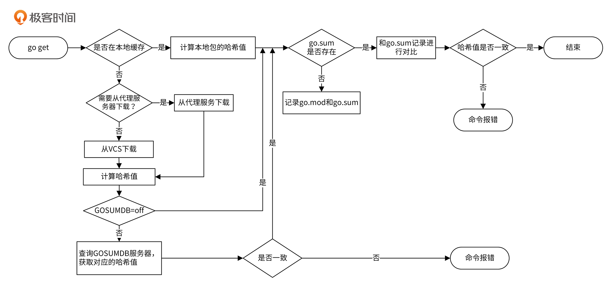

---
date: "2019-06-23"
---  
      
# 特别放送 | Go Modules依赖包管理全讲
你好，我是孔令飞。今天我们更新一期特别放送作为加餐。

在Go项目开发中，依赖包管理是一个非常重要的内容，依赖包处理不好，就会导致编译失败。而且Go的依赖包管理有一定的复杂度，所以，我们有必要系统学习下Go的依赖包管理工具。

这一讲，我会首先介绍下Go依赖包管理工具的历史，并详细介绍下目前官方推荐的依赖包管理方案Go Modules。Go Modules主要包括了 `go mod` 命令行工具、模块下载机制，以及两个核心文件go.mod和go.sum。另外，Go Modules也提供了一些环境变量，用来控制Go Modules的行为。这一讲，我会分别介绍下这些内容。

在正式开始讲解这些内容之前，我们先来对Go Modules有个基本的了解。

## Go Modules简介

Go Modules是Go官方推出的一个Go包管理方案，基于vgo演进而来，具有下面这几个特性：

* 可以使包的管理更加简单。
* 支持版本管理。
* 允许同一个模块多个版本共存。
* 可以校验依赖包的哈希值，确保包的一致性，增加安全性。
* 内置在几乎所有的go命令中，包括`go get`、`go build`、`go install`、`go run`、`go test`、`go list`等命令。
* 具有Global Caching特性，不同项目的相同模块版本，只会在服务器上缓存一份。

<!-- [[[read_end]]] -->

在Go1.14版本以及之后的版本，Go官方建议在生产环境中使用Go Modules。因此，以后的Go包管理方案会逐渐统一到Go Modules。与Go Modules相关的概念很多，我在这里把它们总结为“6-2-2-1-1”，这一讲后面还会详细介绍每个概念。

* 六个环境变量：`GO111MODULE`、`GOPROXY`、`GONOPROXY`、`GOSUMDB`、`GONOSUMDB`、`GOPRIVATE`。
* 两个概念：Go module proxy和Go checksum database。
* 两个主要文件：go.mod和go.sum。
* 一个主要管理命令：go mod。
* 一个build flag。

## Go包管理的历史

在具体讲解Go Modules之前，我们先看一下Go包管理的历史。从Go推出之后，因为没有一个统一的官方方案，所以出现了很多种Go包管理方案，比较混乱，也没有彻底解决Go包管理的一些问题。Go包管理的历史如下图所示：


这张图展示了Go依赖包管理工具经历的几个发展阶段，接下来我会按时间顺序重点介绍下其中的五个阶段。

### **Go1.5版本前：GOPATH**

在Go1.5版本之前，没有版本控制，所有的依赖包都放在GOPATH下。采用这种方式，无法实现包的多版本管理，并且包的位置只能局限在GOPATH目录下。如果A项目和B项目用到了同一个Go包的不同版本，这时候只能给每个项目设置一个GOPATH，将对应版本的包放在各自的GOPATH目录下，切换项目目录时也需要切换GOPATH。这些都增加了开发和实现的复杂度。

### **Go1.5版本：Vendoring**

Go1.5推出了vendor机制，并在Go1.6中默认启用。在这个机制中，每个项目的根目录都可以有一个vendor目录，里面存放了该项目的Go依赖包。在编译Go源码时，Go优先从项目根目录的vendor目录查找依赖；如果没有找到，再去GOPATH下的vendor目录下找；如果还没有找到，就去GOPATH下找。

这种方式解决了多GOPATH的问题，但是随着项目依赖的增多，vendor目录会越来越大，造成整个项目仓库越来越大。在vendor机制下，一个中型项目的vendor目录有几百M的大小一点也不奇怪。

### “百花齐放”：多种Go依赖包管理工具出现

这个阶段，社区也出现了很多Go依赖包管理的工具，这里我介绍三个比较有名的。

* Godep：解决包依赖的管理工具，Docker、Kubernetes、CoreOS等Go项目都曾用过godep来管理其依赖。
* Govendor：它的功能比Godep多一些，通过vendor目录下的`vendor.json`文件来记录依赖包的版本。
* Glide：相对完善的包管理工具，通过`glide.yaml`记录依赖信息，通过`glide.lock`追踪每个包的具体修改。

Govendor、Glide都是在Go支持vendor之后推出的工具，Godep在Go支持vendor之前也可以使用。Go支持vendor之后，Godep也改用了vendor模式。

### Go1.9版本：Dep

对于从0构建项目的新用户来说，Glide功能足够，是个不错的选择。不过，Golang 依赖管理工具混乱的局面最终由官方来终结了：Golang官方接纳了由社区组织合作开发的Dep，作为official experiment。在相当长的一段时间里，Dep作为标准，成为了事实上的官方包管理工具。

因为Dep已经成为了official experiment的过去时，现在我们就不必再去深究了，让我们直接去了解谁才是未来的official experiment吧。

### Go1.11版本之后：Go Modules

Go1.11版本推出了Go Modules机制，Go Modules基于vgo演变而来，是Golang官方的包管理工具。在Go1.13版本，Go语言将Go Modules设置为默认的Go管理工具；在Go1.14版本，Go语言官方正式推荐在生产环境使用Go Modules，并且鼓励所有用户从其他的依赖管理工具迁移过来。至此，Go终于有了一个稳定的、官方的Go包管理工具。

到这里，我介绍了Go依赖包管理工具的历史，下面再来介绍下Go Modules的使用方法。

## 包（package）和模块（module）

Go程序被组织到Go包中，Go包是同一目录中一起编译的Go源文件的集合。在一个源文件中定义的函数、类型、变量和常量，对于同一包中的所有其他源文件可见。

模块是存储在文件树中的Go包的集合，并且文件树根目录有go.mod文件。go.mod文件定义了模块的名称及其依赖包，每个依赖包都需要指定导入路径和语义化版本（Semantic Versioning），通过导入路径和语义化版本准确地描述一个依赖。

这里要注意，`"module" != "package"`，模块和包的关系更像是集合和元素的关系，包属于模块，一个模块是零个或者多个包的集合。下面的代码段，引用了一些包：

```
    import (
        // Go 标准包
        "fmt"
    
        // 第三方包
        "github.com/spf13/pflag"
    
        // 匿名包
         _ "github.com/jinzhu/gorm/dialects/mysql"
    
         // 内部包
        "github.com/marmotedu/iam/internal/apiserver"
    )
    

```

这里的`fmt`、`github.com/spf13/pflag`和`github.com/marmotedu/iam/internal/apiserver`都是Go包。Go中有4种类型的包，下面我来分别介绍下。

* Go标准包：在Go源码目录下，随Go一起发布的包。
* 第三方包：第三方提供的包，比如来自于github.com的包。
* 匿名包：只导入而不使用的包。通常情况下，我们只是想使用导入包产生的副作用，即引用包级别的变量、常量、结构体、接口等，以及执行导入包的`init()`函数。
* 内部包：项目内部的包，位于项目目录下。

下面的目录定义了一个模块：

```
    $ ls hello/
    go.mod  go.sum  hello.go  hello_test.go  world
    

```

hello目录下有一个go.mod文件，说明了这是一个模块，该模块包含了hello包和一个子包world。该目录中也包含了一个go.sum文件，该文件供Go命令在构建时判断依赖包是否合法。这里你先简单了解下，我会在下面讲go.sum文件的时候详细介绍。

## Go Modules 命令

Go Modules的管理命令为`go mod`，`go mod`有很多子命令，你可以通过`go help mod`来获取所有的命令。下面我来具体介绍下这些命令。

* download：下载go.mod文件中记录的所有依赖包。
* edit：编辑go.mod文件。
* graph：查看现有的依赖结构。
* init：把当前目录初始化为一个新模块。
* tidy：添加丢失的模块，并移除无用的模块。默认情况下，Go不会移除go.mod文件中的无用依赖。当依赖包不再使用了，可以使用`go mod tidy`命令来清除它。
* vendor：将所有依赖包存到当前目录下的vendor目录下。
* verify：检查当前模块的依赖是否已经存储在本地下载的源代码缓存中，以及检查下载后是否有修改。
* why：查看为什么需要依赖某模块。

## Go Modules开关

如果要使用Go Modules，在Go1.14中仍然需要确保Go Modules特性处在打开状态。你可以通过环境变量GO111MODULE来打开或者关闭。GO111MODULE有3个值，我来分别介绍下。

* auto：在Go1.14版本中是默认值，在`$GOPATH/src`下，且没有包含go.mod时则关闭Go Modules，其他情况下都开启Go Modules。
* on：启用Go Modules，Go1.14版本推荐打开，未来版本会设为默认值。
* off：关闭Go Modules，不推荐。

所以，如果要打开Go Modules，可以设置环境变量`export GO111MODULE=on`或者`export GO111MODULE=auto`，建议直接设置`export GO111MODULE=on`。

Go Modules使用语义化的版本号，我们开发的模块在发布版本打tag的时候，要注意遵循语义化的版本要求，不遵循语义化版本规范的版本号都是无法拉取的。

## 模块下载

在执行 `go get` 等命令时，会自动下载模块。接下来，我会介绍下go命令是如何下载模块的。主要有三种下载方式：

* 通过代理下载；
* 指定版本号下载；
* 按最小版本下载。

### 通过代理来下载模块

默认情况下，Go命令从VCS（Version Control System，版本控制系统）直接下载模块，例如 GitHub、Bitbucket、Bazaar、Mercurial或者SVN。

在Go 1.13版本，引入了一个新的环境变量GOPROXY，用于设置Go模块代理（Go module proxy）。模块代理可以使Go命令直接从代理服务器下载模块。GOPROXY默认值为`https://proxy.golang.org,direct`，代理服务器可以指定多个，中间用逗号隔开，例如`GOPROXY=https://proxy.golang.org,https://goproxy.cn,direct`。当下载模块时，会优先从指定的代理服务器上下载。如果下载失败，比如代理服务器不可访问，或者HTTP返回码为`404`或`410`，Go命令会尝试从下一个代理服务器下载。

direct是一个特殊指示符，用来指示Go回源到模块的源地址\(比如GitHub等\)去抓取 ，当值列表中上一个Go module proxy返回404或410，Go会自动尝试列表中的下一个，遇见direct时回源，遇见EOF时终止，并抛出类似`invalid version: unknown revision...`的错误。 如果`GOPROXY=off`，则Go命令不会尝试从代理服务器下载模块。

引入Go module proxy会带来很多好处，比如：

* 国内开发者无法访问像golang.org、gopkg.in、go.uber.org这类域名，可以设置GOPROXY为国内可以访问的代理服务器，解决依赖包下载失败的问题。
* Go模块代理会永久缓存和存储所有的依赖，并且这些依赖一经缓存，不可更改，这也意味着我们不需要再维护一个vendor目录，也可以避免因为维护vendor目录所带来的存储空间占用。
* 因为依赖永久存在于代理服务器，这样即使模块从互联网上被删除，也仍然可以通过代理服务器获取到。
* 一旦将Go模块存储在Go代理服务器中，就无法覆盖或删除它，这可以保护开发者免受可能注入相同版本恶意代码所带来的攻击。
* 我们不再需要VCS工具来下载依赖，因为所有的依赖都是通过HTTP的方式从代理服务器下载。
* 因为Go代理通过HTTP独立提供了源代码（.zip存档）和go.mod，所以下载和构建Go模块的速度更快。因为可以独立获取go.mod（而之前必须获取整个仓库），所以解决依赖也更快。
* 当然，开发者也可以设置自己的Go模块代理，这样开发者可以对依赖包有更多的控制，并可以预防VCS停机所带来的下载失败。

在实际开发中，我们的很多模块可能需要从私有仓库拉取，通过代理服务器访问会报错，这时候我们需要将这些模块添加到环境变量GONOPROXY中，这些私有模块的哈希值也不会在checksum database中存在，需要将这些模块添加到GONOSUMDB中。一般来说，我建议直接设置GOPRIVATE环境变量，它的值将作为GONOPROXY和GONOSUMDB的默认值。

GONOPROXY、GONOSUMDB和GOPRIVATE都支持通配符，多个域名用逗号隔开，例如`*.example.com,github.com`。

对于国内的Go开发者来说，目前有3个常用的GOPROXY可供选择，分别是官方、七牛和阿里云。

官方的GOPROXY，国内用户可能访问不到，所以我更推荐使用七牛的`goproxy.cn`，`goproxy.cn`是七牛云推出的非营利性项目，它的目标是为中国和世界上其他地方的Go开发者提供一个免费、可靠、持续在线，且经过 CDN 加速的模块代理。

### 指定版本号下载

通常，我们通过`go get`来下载模块，下载命令格式为`go get <package[@version]>`，如下表所示：


你可以使用`go get \-u`更新package到latest版本，也可以使用`go get \-u=patch`只更新小版本，例如从`v1.2.4`到`v1.2.5`。

### 按最小版本下载

一个模块往往会依赖许多其他模块，并且不同的模块也可能会依赖同一个模块的不同版本，如下图所示：



在上述依赖中，模块A依赖了模块B和模块C，模块B依赖了模块D，模块C依赖了模块D和模块F，模块D又依赖了模块E。并且，同模块的不同版本还依赖了对应模块的不同版本。

那么Go Modules是如何选择版本的呢？Go Modules 会把每个模块的依赖版本清单都整理出来，最终得到一个构建清单，如下图所示：


上图中，rough list和final list的区别在于重复引用的模块 D（`v1.3`、`v1.4`），最终清单选用了D的`v1.4`版本。

这样做的主要原因有两个。第一个是语义化版本的控制。因为模块D的`v1.3`和`v1.4`版本变更都属于次版本号的变更，而在语义化版本的约束下，`v1.4`必须要向下兼容`v1.3`，因此我们要选择高版本的`v1.4`。

第二个是模块导入路径的规范。主版本号不同，模块的导入路径就不一样。所以，如果出现不兼容的情况，主版本号会改变，例如从v1变为v2，模块的导入路径也就改变了，因此不会影响v1版本。

## go.mod和go.sum介绍

在Go Modules中，go.mod和go.sum是两个非常重要的文件，下面我就来详细介绍这两个文件。

### go.mod文件介绍

go.mod文件是Go Modules的核心文件。下面是一个go.mod文件示例：

```
    module github.com/marmotedu/iam
    
    go 1.14
    
    require (
    	github.com/AlekSi/pointer v1.1.0
    	github.com/appleboy/gin-jwt/v2 v2.6.3
    	github.com/asaskevich/govalidator v0.0.0-20200428143746-21a406dcc535
    	github.com/gin-gonic/gin v1.6.3
    	github.com/golangci/golangci-lint v1.30.0 // indirect
    	github.com/google/uuid v1.0.0
        github.com/blang/semver v3.5.0+incompatible
        golang.org/x/text v0.3.2
    )
    
    replace (
        github.com/gin-gonic/gin => /home/colin/gin
        golang.org/x/text v0.3.2 => github.com/golang/text v0.3.2
    )
    
    exclude (
        github.com/google/uuid v1.1.0
    )
    

```

接下来，我会从go.mod语句、go.mod版本号、go.mod文件修改方法三个方面来介绍go.mod。

1.  go.mod语句

go.mod文件中包含了4个语句，分别是module、require、replace 和 exclude。下面我来介绍下它们的功能。

* module：用来定义当前项目的模块路径。
* go：用来设置预期的Go版本，目前只是起标识作用。
* require：用来设置一个特定的模块版本，格式为`<导入包路径> <版本> [// indirect]`。
* exclude：用来从使用中排除一个特定的模块版本，如果我们知道模块的某个版本有严重的问题，就可以使用exclude将该版本排除掉。
* replace：用来将一个模块版本替换为另外一个模块版本。格式为 `$module => $newmodule` ，`$newmodule`可以是本地磁盘的相对路径，例如`github.com/gin-gonic/gin => ./gin`。也可以是本地磁盘的绝对路径，例如`github.com/gin-gonic/gin => /home/lk/gin`。还可以是网络路径，例如`golang.org/x/text v0.3.2 => github.com/golang/text v0.3.2`。

这里需要注意，虽然我们用`$newmodule`替换了`$module`，但是在代码中的导入路径仍然为`$module`。replace在实际开发中经常用到，下面的场景可能需要用到replace：

* 在开启Go Modules后，缓存的依赖包是只读的，但在日常开发调试中，我们可能需要修改依赖包的代码来进行调试，这时可以将依赖包另存到一个新的位置，并在go.mod中替换这个包。
* 如果一些依赖包在Go命令运行时无法下载，就可以通过其他途径下载该依赖包，上传到开发构建机，并在go.mod中替换为这个包。
* 在项目开发初期，A项目依赖B项目的包，但B项目因为种种原因没有push到仓库，这时也可以在go.mod中把依赖包替换为B项目的本地磁盘路径。
* 在国内访问golang.org/x的各个包都需要翻墙，可以在go.mod中使用replace，替换成GitHub上对应的库，例如`golang.org/x/text v0.3.0 => github.com/golang/text v0.3.0`。

有一点要注意，exclude和replace只作用于当前主模块，不影响主模块所依赖的其他模块。

2.  go.mod版本号

go.mod文件中有很多版本号格式，我知道在平时使用中，有很多开发者对此感到困惑。这里，我来详细说明一下。

* 如果模块具有符合语义化版本格式的tag，会直接展示tag的值，例如 `github.com/AlekSi/pointer v1.1.0` 。
* 除了v0和v1外，主版本号必须显试地出现在模块路径的尾部，例如`github.com/appleboy/gin-jwt/v2 v2.6.3`。
* 对于没有tag的模块，Go命令会选择master分支上最新的commit，并根据commit时间和哈希值生成一个符合语义化版本的版本号，例如`github.com/asaskevich/govalidator v0.0.0-20200428143746-21a406dcc535`。
* 如果模块名字跟版本不符合规范，例如模块的名字为`github.com/blang/semver`，但是版本为 `v3.5.0`（正常应该是`github.com/blang/semver/v3`），go会在go.mod的版本号后加`+incompatible`表示。
* 如果go.mod中的包是间接依赖，则会添加`// indirect`注释，例如`github.com/golangci/golangci-lint v1.30.0 // indirect`。

这里要注意，Go Modules要求模块的版本号格式为`v<major>.<minor>.<patch>`，如果`<major>`版本号大于1，它的版本号还要体现在模块名字中，例如模块`github.com/blang/semver`版本号增长到`v3.x.x`，则模块名应为`github.com/blang/semver/v3`。

这里再详细介绍下出现`// indirect`的情况。原则上go.mod中出现的都是直接依赖，但是下面的两种情况只要出现一种，就会在go.mod中添加间接依赖。

* 直接依赖未启用Go Modules：如果模块A依赖模块B，模块B依赖B1和B2，但是B没有go.mod文件，则B1和B2会记录到A的go.mod文件中，并在最后加上`// indirect`。
* 直接依赖go.mod文件中缺失部分依赖：如果模块A依赖模块B，模块B依赖B1和B2，B有go.mod文件，但是只有B1被记录在B的go.mod文件中，这时候B2会被记录到A的go.mod文件中，并在最后加上`// indirect`。

3.  go.mod文件修改方法

要修改go.mod文件，我们可以采用下面这三种方法：

* Go命令在运行时自动修改。
* 手动编辑go.mod文件，编辑之后可以执行`go mod edit -fmt`格式化go.mod文件。
* 执行go mod子命令修改。

在实际使用中，我建议你采用第三种修改方法，和其他两种相比不太容易出错。使用方式如下：

```
    go mod edit -fmt  # go.mod 格式化
    go mod edit -require=golang.org/x/text@v0.3.3  # 添加一个依赖
    go mod edit -droprequire=golang.org/x/text # require的反向操作，移除一个依赖
    go mod edit -replace=github.com/gin-gonic/gin=/home/colin/gin # 替换模块版本
    go mod edit -dropreplace=github.com/gin-gonic/gin # replace的反向操作
    go mod edit -exclude=golang.org/x/text@v0.3.1 # 排除一个特定的模块版本
    go mod edit -dropexclude=golang.org/x/text@v0.3.1 # exclude的反向操作
    

```

### go.sum文件介绍

Go会根据go.mod文件中记载的依赖包及其版本下载包源码，但是下载的包可能被篡改，缓存在本地的包也可能被篡改。单单一个go.mod文件，不能保证包的一致性。为了解决这个潜在的安全问题，Go Modules引入了go.sum文件。

go.sum文件用来记录每个依赖包的hash值，在构建时，如果本地的依赖包hash值与`go.sum`文件中记录的不一致，则会拒绝构建。go.sum中记录的依赖包是所有的依赖包，包括间接和直接的依赖包。

这里提示下，为了避免已缓存的模块被更改，`$GOPATH/pkg/mod`下缓存的包是只读的，不允许修改。

接下来我从go.sum文件内容、go.sum文件生成、校验三个方面来介绍go.sum。

1.  go.sum文件内容

下面是一个go.sum文件的内容：

```
    golang.org/x/text v0.0.0-20170915032832-14c0d48ead0c h1:qgOY6WgZOaTkIIMiVjBQcw93ERBE4m30iBm00nkL0i8=
    golang.org/x/text v0.0.0-20170915032832-14c0d48ead0c/go.mod h1:NqM8EUOU14njkJ3fqMW+pc6Ldnwhi/IjpwHt7yyuwOQ=
    rsc.io/quote v1.5.2 h1:w5fcysjrx7yqtD/aO+QwRjYZOKnaM9Uh2b40tElTs3Y=
    rsc.io/quote v1.5.2/go.mod h1:LzX7hefJvL54yjefDEDHNONDjII0t9xZLPXsUe+TKr0=
    rsc.io/sampler v1.3.0 h1:7uVkIFmeBqHfdjD+gZwtXXI+RODJ2Wc4O7MPEh/QiW4=
    rsc.io/sampler v1.3.0/go.mod h1:T1hPZKmBbMNahiBKFy5HrXp6adAjACjK9JXDnKaTXpA=
    

```

go.sum文件中，每行记录由模块名、版本、哈希算法和哈希值组成，如`<module> <version>[/go.mod] <algorithm>:<hash>`。目前，从Go1.11到Go1.14版本，只有一个算法SHA-256，用h1表示。

正常情况下，每个依赖包会包含两条记录，分别是依赖包所有文件的哈希值和该依赖包go.mod的哈希值，例如：

```
    rsc.io/quote v1.5.2 h1:w5fcysjrx7yqtD/aO+QwRjYZOKnaM9Uh2b40tElTs3Y=
    rsc.io/quote v1.5.2/go.mod h1:LzX7hefJvL54yjefDEDHNONDjII0t9xZLPXsUe+TKr0=
    

```

但是，如果一个依赖包没有go.mod文件，就只记录依赖包所有文件的哈希值，也就是只有第一条记录。额外记录go.mod的哈希值，主要是为了在计算依赖树时不必下载完整的依赖包版本，只根据go.mod即可计算依赖树。

2.  go.sum文件生成

在Go Modules开启时，如果我们的项目需要引入一个新的包，通常会执行`go get`命令，例如：

```
    $ go get rsc.io/quote
    

```

当执行`go get rsc.io/quote`命令后，`go get`命令会先将依赖包下载到`$GOPATH/pkg/mod/cache/download`，下载的依赖包文件名格式为`$version.zip`，例如`v1.5.2.zip`。

下载完成之后，`go get`会对该zip包做哈希运算，并将结果存在`$version.ziphash`文件中，例如`v1.5.2.ziphash`。如果在项目根目录下执行`go get`命令，则`go get`会同时更新go.mod和go.sum文件。例如，go.mod新增一行`require rsc.io/quote v1.5.2`，go.sum新增两行：

```
    rsc.io/quote v1.5.2 h1:w5fcysjrx7yqtD/aO+QwRjYZOKnaM9Uh2b40tElTs3Y=
    rsc.io/quote v1.5.2/go.mod h1:LzX7hefJvL54yjefDEDHNONDjII0t9xZLPXsUe+TKr0=
    

```

3.  校验

在我们执行构建时，go命令会从本地缓存中查找所有的依赖包，并计算这些依赖包的哈希值，然后与go.sum中记录的哈希值进行对比。如果哈希值不一致，则校验失败，停止构建。

校验失败可能是因为本地指定版本的依赖包被修改过，也可能是go.sum中记录的哈希值是错误的。但是Go命令倾向于相信依赖包被修改过，因为当我们在go get依赖包时，包的哈希值会经过校验和数据库（checksum database）进行校验，校验通过才会被加入到go.sum文件中。也就是说，go.sum文件中记录的哈希值是可信的。

校验和数据库可以通过环境变量`GOSUMDB`指定，`GOSUMDB`的值是一个web服务器，默认值是`sum.golang.org`。该服务可以用来查询依赖包指定版本的哈希值，保证拉取到的模块版本数据没有经过篡改。

如果设置`GOSUMDB`为`off`，或者使用`go get`的时候启用了`-insecure`参数，Go就不会去对下载的依赖包做安全校验，这存在一定的安全隐患，所以我建议你开启校验和数据库。如果对安全性要求很高，同时又访问不了`sum.golang.org`，你也可以搭建自己的校验和数据库。

值得注意的是，Go checksum database可以被Go module proxy代理，所以当我们设置了`GOPROXY`后，通常情况下不用再设置`GOSUMDB`。还要注意的是，go.sum文件也应该提交到你的 Git 仓库中去。

## 模块下载流程

上面，我介绍了模块下载的整体流程，还介绍了go.mod和go.sum这两个文件。因为内容比较多，这里用一张图片来做个总结：



最后还想介绍下Go modules的全局缓存。Go modules中，相同版本的模块只会缓存一份，其他所有模块公用。目前，所有模块版本数据都缓存在 `$GOPATH/pkg/mod` 和 `$GOPATH/pkg/sum` 下，未来有可能移到 `$GOCACHE/mod` 和 `$GOCACHE/sum` 下，我认为这可能发生在 `GOPATH` 被淘汰后。你可以使用 `go clean \-modcache` 清除所有的缓存。

## 总结

Go依赖包管理是Go语言中一个重点的功能。在Go1.11版本之前，并没有官方的依赖包管理工具，业界虽然存在多个Go依赖包管理方案，但效果都不理想。直到Go1.11版本，Go才推出了官方的依赖包管理工具，Go Modules。这也是我建议你在进行Go项目开发时选择的依赖包管理工具。

Go Modules提供了 `go mod` 命令，来管理Go的依赖包。 `go mod` 有很多子命令，这些子命令可以完成不同的功能。例如，初始化当前目录为一个新模块，添加丢失的模块，移除无用的模块，等等。

在Go Modules中，有两个非常重要的文件：go.mod和go.sum。go.mod文件是Go Modules的核心文件，Go会根据go.mod文件中记载的依赖包及其版本下载包源码。go.sum文件用来记录每个依赖包的hash值，在构建时，如果本地的依赖包hash值与go.sum文件中记录的不一致，就会拒绝构建。

Go在下载依赖包时，可以通过代理来下载，也可以指定版本号下载。如果不指定版本号，Go Modules会根据自定义的规则，选择最小版本来下载。

## 课后练习

1.  思考下，如果不提交go.sum，会有什么风险？
2.  找一个没有使用Go Modules管理依赖包的Go项目，把它的依赖包管理方式切换为Go Modules。

欢迎你在留言区与我交流讨论，我们下一讲见。