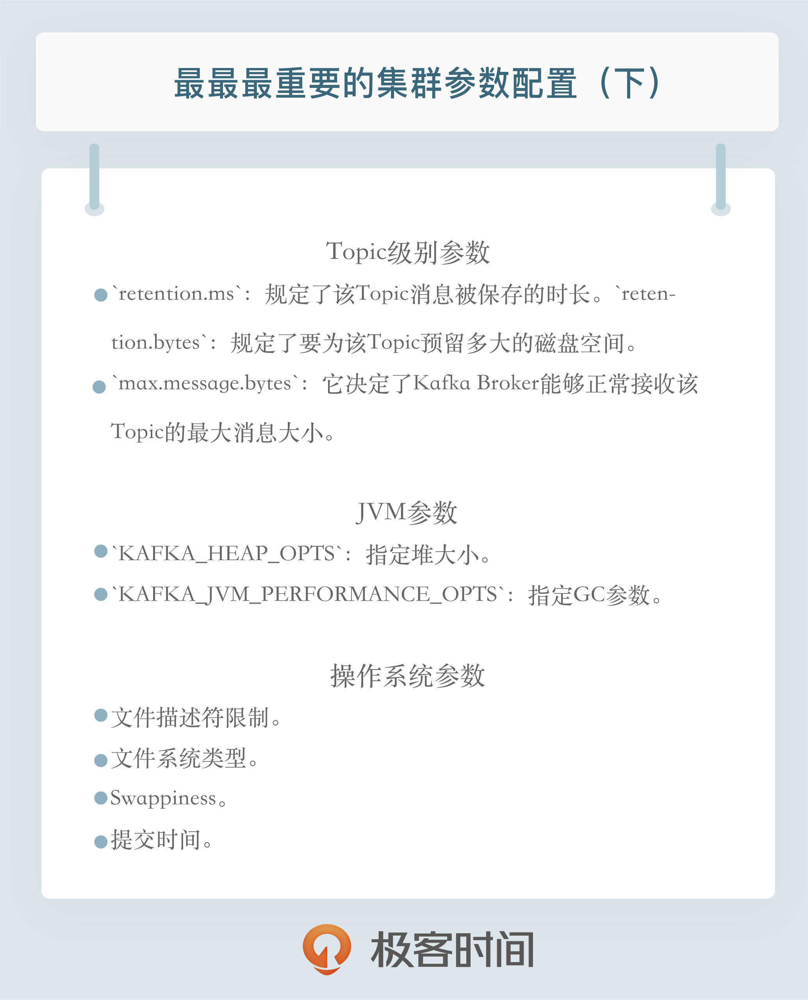

---
date: "2019-06-23"
---  
      
# 08 | 最最最重要的集群参数配置（下）
今天我们继续来聊那些重要的Kafka集群配置，下半部分主要是Topic级别参数、JVM参数以及操作系统参数的设置。

在上一期中，我们讨论了Broker端参数设置的一些法则，但其实Kafka也支持为不同的Topic设置不同的参数值。当前最新的2.2版本总共提供了大约25个Topic级别的参数，当然我们也不必全部了解它们的作用，这里我挑出了一些最关键的参数，你一定要把它们掌握清楚。除了Topic级别的参数，我今天还会给出一些重要的JVM参数和操作系统参数，正确设置这些参数是搭建高性能Kafka集群的关键因素。

## Topic级别参数

说起Topic级别的参数，你可能会有这样的疑问：如果同时设置了Topic级别参数和全局Broker参数，到底听谁的呢？哪个说了算呢？答案就是Topic级别参数会覆盖全局Broker参数的值，而每个Topic都能设置自己的参数值，这就是所谓的Topic级别参数。

举个例子说明一下，上一期我提到了消息数据的留存时间参数，在实际生产环境中，如果为所有Topic的数据都保存相当长的时间，这样做既不高效也无必要。更适当的做法是允许不同部门的Topic根据自身业务需要，设置自己的留存时间。如果只能设置全局Broker参数，那么势必要提取所有业务留存时间的最大值作为全局参数值，此时设置Topic级别参数把它覆盖，就是一个不错的选择。

<!-- [[[read_end]]] -->

下面我们依然按照用途分组的方式引出重要的Topic级别参数。从保存消息方面来考量的话，下面这组参数是非常重要的：

* `retention.ms`：规定了该Topic消息被保存的时长。默认是7天，即该Topic只保存最近7天的消息。一旦设置了这个值，它会覆盖掉Broker端的全局参数值。
* `retention.bytes`：规定了要为该Topic预留多大的磁盘空间。和全局参数作用相似，这个值通常在多租户的Kafka集群中会有用武之地。当前默认值是-1，表示可以无限使用磁盘空间。

上面这些是从保存消息的维度来说的。如果从能处理的消息大小这个角度来看的话，有一个参数是必须要设置的，即`max.message.bytes`。它决定了Kafka Broker能够正常接收该Topic的最大消息大小。我知道目前在很多公司都把Kafka作为一个基础架构组件来运行，上面跑了很多的业务数据。如果在全局层面上，我们不好给出一个合适的最大消息值，那么不同业务部门能够自行设定这个Topic级别参数就显得非常必要了。在实际场景中，这种用法也确实是非常常见的。

好了，你要掌握的Topic级别的参数就这么几个。下面我来说说怎么设置Topic级别参数吧。其实说到这个事情，我是有点个人看法的：我本人不太赞同那种做一件事情开放给你很多种选择的设计方式，看上去好似给用户多种选择，但实际上只会增加用户的学习成本。特别是系统配置，如果你告诉我只能用一种办法来做，我会很努力地把它学会；反之，如果你告诉我说有两种方法甚至是多种方法都可以实现，那么我可能连学习任何一种方法的兴趣都没有了。Topic级别参数的设置就是这种情况，我们有两种方式可以设置：

* 创建Topic时进行设置
* 修改Topic时设置

我们先来看看如何在创建Topic时设置这些参数。我用上面提到的`retention.ms`和`max.message.bytes`举例。设想你的部门需要将交易数据发送到Kafka进行处理，需要保存最近半年的交易数据，同时这些数据很大，通常都有几MB，但一般不会超过5MB。现在让我们用以下命令来创建Topic：

```
    bin/kafka-topics.sh --bootstrap-server localhost:9092 --create --topic transaction --partitions 1 --replication-factor 1 --config retention.ms=15552000000 --config max.message.bytes=5242880
    

```

我们只需要知道Kafka开放了`kafka-topics`命令供我们来创建Topic即可。对于上面这样一条命令，请注意结尾处的`--config`设置，我们就是在config后面指定了想要设置的Topic级别参数。

下面看看使用另一个自带的命令`kafka-configs`来修改Topic级别参数。假设我们现在要发送最大值是10MB的消息，该如何修改呢？命令如下：

```
    bin/kafka-configs.sh --zookeeper localhost:2181 --entity-type topics --entity-name transaction --alter --add-config max.message.bytes=10485760
    

```

总体来说，你只能使用这么两种方式来设置Topic级别参数。我个人的建议是，你最好始终坚持使用第二种方式来设置，并且在未来，Kafka社区很有可能统一使用`kafka-configs`脚本来调整Topic级别参数。

## JVM参数

我在专栏前面提到过，Kafka服务器端代码是用Scala语言编写的，但终归还是编译成Class文件在JVM上运行，因此JVM参数设置对于Kafka集群的重要性不言而喻。

首先我先说说Java版本，我个人极其不推荐将Kafka运行在Java 6或7的环境上。Java 6实在是太过陈旧了，没有理由不升级到更新版本。另外Kafka自2.0.0版本开始，已经正式摒弃对Java 7的支持了，所以有条件的话至少使用Java 8吧。

说到JVM端设置，堆大小这个参数至关重要。虽然在后面我们还会讨论如何调优Kafka性能的问题，但现在我想无脑给出一个通用的建议：将你的JVM堆大小设置成6GB吧，这是目前业界比较公认的一个合理值。我见过很多人就是使用默认的Heap Size来跑Kafka，说实话默认的1GB有点小，毕竟Kafka Broker在与客户端进行交互时会在JVM堆上创建大量的ByteBuffer实例，Heap Size不能太小。

JVM端配置的另一个重要参数就是垃圾回收器的设置，也就是平时常说的GC设置。如果你依然在使用Java 7，那么可以根据以下法则选择合适的垃圾回收器：

* 如果Broker所在机器的CPU资源非常充裕，建议使用CMS收集器。启用方法是指定`-XX:+UseCurrentMarkSweepGC`。
* 否则，使用吞吐量收集器。开启方法是指定`-XX:+UseParallelGC`。

当然了，如果你在使用Java 8，那么可以手动设置使用G1收集器。在没有任何调优的情况下，G1表现得要比CMS出色，主要体现在更少的Full GC，需要调整的参数更少等，所以使用G1就好了。

现在我们确定好了要设置的JVM参数，我们该如何为Kafka进行设置呢？有些奇怪的是，这个问题居然在Kafka官网没有被提及。其实设置的方法也很简单，你只需要设置下面这两个环境变量即可：

* `KAFKA_HEAP_OPTS`：指定堆大小。
* `KAFKA_JVM_PERFORMANCE_OPTS`：指定GC参数。

比如你可以这样启动Kafka Broker，即在启动Kafka Broker之前，先设置上这两个环境变量：

```
    $> export KAFKA_HEAP_OPTS=--Xms6g  --Xmx6g
    $> export KAFKA_JVM_PERFORMANCE_OPTS= -server -XX:+UseG1GC -XX:MaxGCPauseMillis=20 -XX:InitiatingHeapOccupancyPercent=35 -XX:+ExplicitGCInvokesConcurrent -Djava.awt.headless=true
    $> bin/kafka-server-start.sh config/server.properties
    

```

## 操作系统参数

最后我们来聊聊Kafka集群通常都需要设置哪些操作系统参数。通常情况下，Kafka并不需要设置太多的OS参数，但有些因素最好还是关注一下，比如下面这几个：

* 文件描述符限制
* 文件系统类型
* Swappiness
* 提交时间

首先是`ulimit \-n`。我觉得任何一个Java项目最好都调整下这个值。实际上，文件描述符系统资源并不像我们想象的那样昂贵，你不用太担心调大此值会有什么不利的影响。通常情况下将它设置成一个超大的值是合理的做法，比如`ulimit \-n 1000000`。还记得电影《让子弹飞》里的对话吗：“你和钱，谁对我更重要？都不重要，没有你对我很重要！”。这个参数也有点这么个意思。其实设置这个参数一点都不重要，但不设置的话后果很严重，比如你会经常看到“Too many open files”的错误。

其次是文件系统类型的选择。这里所说的文件系统指的是如ext3、ext4或XFS这样的日志型文件系统。根据官网的测试报告，XFS的性能要强于ext4，所以生产环境最好还是使用XFS。对了，最近有个Kafka使用ZFS的[数据报告](https://www.confluent.io/kafka-summit-sf18/kafka-on-zfs)，貌似性能更加强劲，有条件的话不妨一试。

第三是swap的调优。网上很多文章都提到设置其为0，将swap完全禁掉以防止Kafka进程使用swap空间。我个人反倒觉得还是不要设置成0比较好，我们可以设置成一个较小的值。为什么呢？因为一旦设置成0，当物理内存耗尽时，操作系统会触发OOM killer这个组件，它会随机挑选一个进程然后kill掉，即根本不给用户任何的预警。但如果设置成一个比较小的值，当开始使用swap空间时，你至少能够观测到Broker性能开始出现急剧下降，从而给你进一步调优和诊断问题的时间。基于这个考虑，我个人建议将swappniess配置成一个接近0但不为0的值，比如1。

最后是提交时间或者说是Flush落盘时间。向Kafka发送数据并不是真要等数据被写入磁盘才会认为成功，而是只要数据被写入到操作系统的页缓存（Page Cache）上就可以了，随后操作系统根据LRU算法会定期将页缓存上的“脏”数据落盘到物理磁盘上。这个定期就是由提交时间来确定的，默认是5秒。一般情况下我们会认为这个时间太频繁了，可以适当地增加提交间隔来降低物理磁盘的写操作。当然你可能会有这样的疑问：如果在页缓存中的数据在写入到磁盘前机器宕机了，那岂不是数据就丢失了。的确，这种情况数据确实就丢失了，但鉴于Kafka在软件层面已经提供了多副本的冗余机制，因此这里稍微拉大提交间隔去换取性能还是一个合理的做法。

## 小结

今天我和你分享了关于Kafka集群设置的各类配置，包括Topic级别参数、JVM参数以及操作系统参数，连同上一篇一起构成了完整的Kafka参数配置列表。我希望这些最佳实践能够在你搭建Kafka集群时助你一臂之力，但切记配置因环境而异，一定要结合自身业务需要以及具体的测试来验证它们的有效性。



## 开放讨论

很多人争论Kafka不需要为Broker设置太大的堆内存，而应该尽可能地把内存留给页缓存使用。对此你是怎么看的？在你的实际使用中有哪些好的法则来评估Kafka对内存的使用呢？

欢迎写下你的思考和答案，我们一起讨论。如果你觉得有所收获，也欢迎把文章分享给你的朋友。