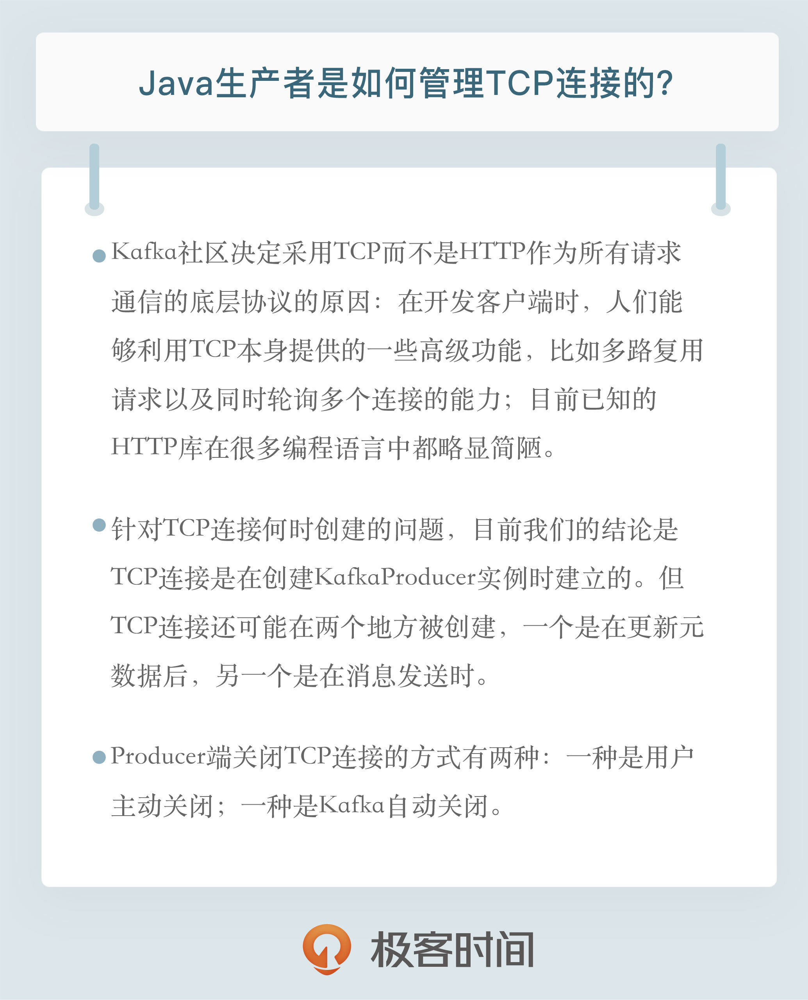

---
date: "2019-06-23"
---  
      
# 13 |  Java生产者是如何管理TCP连接的？
你好，我是胡夕。今天我要和你分享的主题是：Kafka的Java生产者是如何管理TCP连接的。

## 为何采用TCP？

Apache Kafka的所有通信都是基于TCP的，而不是基于HTTP或其他协议。无论是生产者、消费者，还是Broker之间的通信都是如此。你可能会问，为什么Kafka不使用HTTP作为底层的通信协议呢？其实这里面的原因有很多，但最主要的原因在于TCP和HTTP之间的区别。

从社区的角度来看，在开发客户端时，人们能够利用TCP本身提供的一些高级功能，比如多路复用请求以及同时轮询多个连接的能力。

所谓的多路复用请求，即multiplexing request，是指将两个或多个数据流合并到底层单一物理连接中的过程。TCP的多路复用请求会在一条物理连接上创建若干个虚拟连接，每个虚拟连接负责流转各自对应的数据流。其实严格来说，TCP并不能多路复用，它只是提供可靠的消息交付语义保证，比如自动重传丢失的报文。

更严谨地说，作为一个基于报文的协议，TCP能够被用于多路复用连接场景的前提是，上层的应用协议（比如HTTP）允许发送多条消息。不过，我们今天并不是要详细讨论TCP原理，因此你只需要知道这是社区采用TCP的理由之一就行了。

<!-- [[[read_end]]] -->

除了TCP提供的这些高级功能有可能被Kafka客户端的开发人员使用之外，社区还发现，目前已知的HTTP库在很多编程语言中都略显简陋。

基于这两个原因，Kafka社区决定采用TCP协议作为所有请求通信的底层协议。

## Kafka生产者程序概览

Kafka的Java生产者API主要的对象就是KafkaProducer。通常我们开发一个生产者的步骤有4步。

第1步：构造生产者对象所需的参数对象。

第2步：利用第1步的参数对象，创建KafkaProducer对象实例。

第3步：使用KafkaProducer的send方法发送消息。

第4步：调用KafkaProducer的close方法关闭生产者并释放各种系统资源。

上面这4步写成Java代码的话大概是这个样子：

```
    Properties props = new Properties ();
    props.put(“参数1”, “参数1的值”)；
    props.put(“参数2”, “参数2的值”)；
    ……
    try (Producer<String, String> producer = new KafkaProducer<>(props)) {
                producer.send(new ProducerRecord<String, String>(……), callback);
    	……
    }
    

```

这段代码使用了Java 7 提供的try-with-resource特性，所以并没有显式调用producer.close\(\)方法。无论是否显式调用close方法，所有生产者程序大致都是这个路数。

现在问题来了，当我们开发一个Producer应用时，生产者会向Kafka集群中指定的主题（Topic）发送消息，这必然涉及与Kafka Broker创建TCP连接。那么，Kafka的Producer客户端是如何管理这些TCP连接的呢？

## 何时创建TCP连接？

要回答上面这个问题，我们首先要弄明白生产者代码是什么时候创建TCP连接的。就上面的那段代码而言，可能创建TCP连接的地方有两处：Producer producer = new KafkaProducer\(props\)和producer.send\(msg, callback\)。你觉得连向Broker端的TCP连接会是哪里创建的呢？前者还是后者，抑或是两者都有？请先思考5秒钟，然后我给出我的答案。

首先，生产者应用在创建KafkaProducer实例时是会建立与Broker的TCP连接的。其实这种表述也不是很准确，应该这样说：**在创建KafkaProducer实例时，生产者应用会在后台创建并启动一个名为Sender的线程，该Sender线程开始运行时首先会创建与Broker的连接**。我截取了一段测试环境中的日志来说明这一点：

> \[2018-12-09 09:35:45,620\] DEBUG \[Producer clientId=producer-1\] Initialize connection to node localhost:9093 \(id: \-2 rack: null\) for sending metadata request \(org.apache.kafka.clients.NetworkClient:1084\)

> \[2018-12-09 09:35:45,622\] DEBUG \[Producer clientId=producer-1\] Initiating connection to node localhost:9093 \(id: \-2 rack: null\) using address localhost/127.0.0.1 \(org.apache.kafka.clients.NetworkClient:914\)

> \[2018-12-09 09:35:45,814\] DEBUG \[Producer clientId=producer-1\] Initialize connection to node localhost:9092 \(id: \-1 rack: null\) for sending metadata request \(org.apache.kafka.clients.NetworkClient:1084\)

> \[2018-12-09 09:35:45,815\] DEBUG \[Producer clientId=producer-1\] Initiating connection to node localhost:9092 \(id: \-1 rack: null\) using address localhost/127.0.0.1 \(org.apache.kafka.clients.NetworkClient:914\)

> \[2018-12-09 09:35:45,828\] DEBUG \[Producer clientId=producer-1\] Sending metadata request \(type=MetadataRequest, topics=\) to node localhost:9093 \(id: \-2 rack: null\) \(org.apache.kafka.clients.NetworkClient:1068\)

你也许会问：怎么可能是这样？如果不调用send方法，这个Producer都不知道给哪个主题发消息，它又怎么能知道连接哪个Broker呢？难不成它会连接bootstrap.servers参数指定的所有Broker吗？嗯，是的，Java Producer目前还真是这样设计的。

我在这里稍微解释一下bootstrap.servers参数。它是Producer的核心参数之一，指定了这个Producer启动时要连接的Broker地址。请注意，这里的“启动时”，代表的是Producer启动时会发起与这些Broker的连接。因此，如果你为这个参数指定了1000个Broker连接信息，那么很遗憾，你的Producer启动时会首先创建与这1000个Broker的TCP连接。

在实际使用过程中，我并不建议把集群中所有的Broker信息都配置到bootstrap.servers中，通常你指定3～4台就足以了。因为Producer一旦连接到集群中的任一台Broker，就能拿到整个集群的Broker信息，故没必要为bootstrap.servers指定所有的Broker。

让我们回顾一下上面的日志输出，请注意我标为橙色的内容。从这段日志中，我们可以发现，在KafkaProducer实例被创建后以及消息被发送前，Producer应用就开始创建与两台Broker的TCP连接了。当然了，在我的测试环境中，我为bootstrap.servers配置了localhost:9092、localhost:9093来模拟不同的Broker，但是这并不影响后面的讨论。另外，日志输出中的最后一行也很关键：它表明Producer向某一台Broker发送了METADATA请求，尝试获取集群的元数据信息——这就是前面提到的Producer能够获取集群所有信息的方法。

讲到这里，我有一些个人的看法想跟你分享一下。通常情况下，我都不认为社区写的代码或做的设计就一定是对的，因此，很多类似的这种“质疑”会时不时地在我脑子里冒出来。

拿今天的这个KafkaProducer创建实例来说，社区的官方文档中提及KafkaProducer类是线程安全的。我本人并没有详尽地去验证过它是否真的就是thread-safe的，但是大致浏览一下源码可以得出这样的结论：KafkaProducer实例创建的线程和前面提到的Sender线程共享的可变数据结构只有RecordAccumulator类，故维护了RecordAccumulator类的线程安全，也就实现了KafkaProducer类的线程安全。

你不需要了解RecordAccumulator类是做什么的，你只要知道它主要的数据结构是一个ConcurrentMap\<TopicPartition, Deque>。TopicPartition是Kafka用来表示主题分区的Java对象，本身是不可变对象。而RecordAccumulator代码中用到Deque的地方都有锁的保护，所以基本上可以认定RecordAccumulator类是线程安全的。

说了这么多，我其实是想说，纵然KafkaProducer是线程安全的，我也不赞同创建KafkaProducer实例时启动Sender线程的做法。写了《Java并发编程实践》的那位布赖恩·格茨（Brian Goetz）大神，明确指出了这样做的风险：在对象构造器中启动线程会造成this指针的逃逸。理论上，Sender线程完全能够观测到一个尚未构造完成的KafkaProducer实例。当然，在构造对象时创建线程没有任何问题，但最好是不要同时启动它。

好了，我们言归正传。针对TCP连接何时创建的问题，目前我们的结论是这样的：**TCP连接是在创建KafkaProducer实例时建立的**。那么，我们想问的是，它只会在这个时候被创建吗？

当然不是！**TCP连接还可能在两个地方被创建：一个是在更新元数据后，另一个是在消息发送时**。为什么说是可能？因为这两个地方并非总是创建TCP连接。当Producer更新了集群的元数据信息之后，如果发现与某些Broker当前没有连接，那么它就会创建一个TCP连接。同样地，当要发送消息时，Producer发现尚不存在与目标Broker的连接，也会创建一个。

接下来，我们来看看Producer更新集群元数据信息的两个场景。

场景一：当Producer尝试给一个不存在的主题发送消息时，Broker会告诉Producer说这个主题不存在。此时Producer会发送METADATA请求给Kafka集群，去尝试获取最新的元数据信息。

场景二：Producer通过metadata.max.age.ms参数定期地去更新元数据信息。该参数的默认值是300000，即5分钟，也就是说不管集群那边是否有变化，Producer每5分钟都会强制刷新一次元数据以保证它是最及时的数据。

讲到这里，我们可以“挑战”一下社区对Producer的这种设计的合理性。目前来看，一个Producer默认会向集群的所有Broker都创建TCP连接，不管是否真的需要传输请求。这显然是没有必要的。再加上Kafka还支持强制将空闲的TCP连接资源关闭，这就更显得多此一举了。

试想一下，在一个有着1000台Broker的集群中，你的Producer可能只会与其中的3～5台Broker长期通信，但是Producer启动后依次创建与这1000台Broker的TCP连接。一段时间之后，大约有995个TCP连接又被强制关闭。这难道不是一种资源浪费吗？很显然，这里是有改善和优化的空间的。

## 何时关闭TCP连接？

说完了TCP连接的创建，我们来说说它们何时被关闭。

Producer端关闭TCP连接的方式有两种：**一种是用户主动关闭；一种是Kafka自动关闭**。

我们先说第一种。这里的主动关闭实际上是广义的主动关闭，甚至包括用户调用kill \-9主动“杀掉”Producer应用。当然最推荐的方式还是调用producer.close\(\)方法来关闭。

第二种是Kafka帮你关闭，这与Producer端参数connections.max.idle.ms的值有关。默认情况下该参数值是9分钟，即如果在9分钟内没有任何请求“流过”某个TCP连接，那么Kafka会主动帮你把该TCP连接关闭。用户可以在Producer端设置connections.max.idle.ms=-1禁掉这种机制。一旦被设置成-1，TCP连接将成为永久长连接。当然这只是软件层面的“长连接”机制，由于Kafka创建的这些Socket连接都开启了keepalive，因此keepalive探活机制还是会遵守的。

值得注意的是，在第二种方式中，TCP连接是在Broker端被关闭的，但其实这个TCP连接的发起方是客户端，因此在TCP看来，这属于被动关闭的场景，即passive close。被动关闭的后果就是会产生大量的CLOSE\_WAIT连接，因此Producer端或Client端没有机会显式地观测到此连接已被中断。

## 小结

我们来简单总结一下今天的内容。对最新版本的Kafka（2.1.0）而言，Java Producer端管理TCP连接的方式是：

1.  KafkaProducer实例创建时启动Sender线程，从而创建与bootstrap.servers中所有Broker的TCP连接。
2.  KafkaProducer实例首次更新元数据信息之后，还会再次创建与集群中所有Broker的TCP连接。
3.  如果Producer端发送消息到某台Broker时发现没有与该Broker的TCP连接，那么也会立即创建连接。
4.  如果设置Producer端connections.max.idle.ms参数大于0，则步骤1中创建的TCP连接会被自动关闭；如果设置该参数=-1，那么步骤1中创建的TCP连接将无法被关闭，从而成为“僵尸”连接。



## 开放讨论

对于今天我们“挑战”的社区设计，你有什么改进的想法吗？

欢迎写下你的思考和答案，我们一起讨论。如果你觉得有所收获，也欢迎把文章分享给你的朋友。