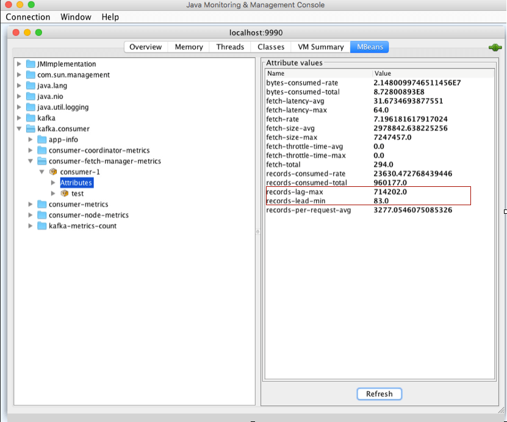
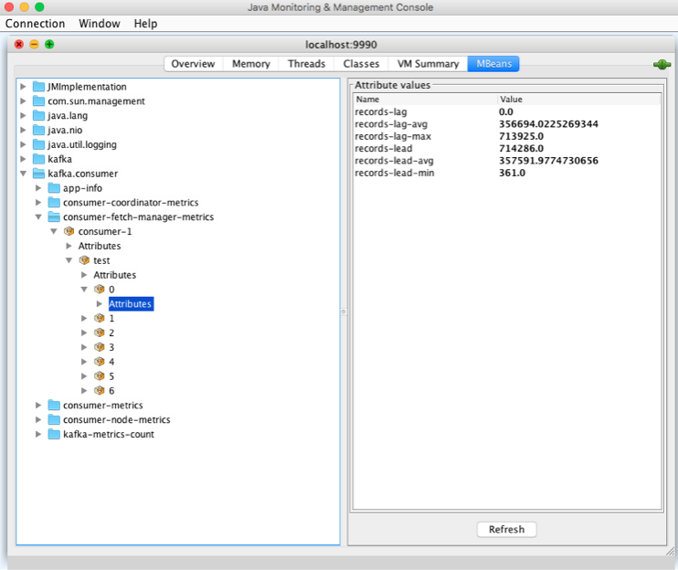
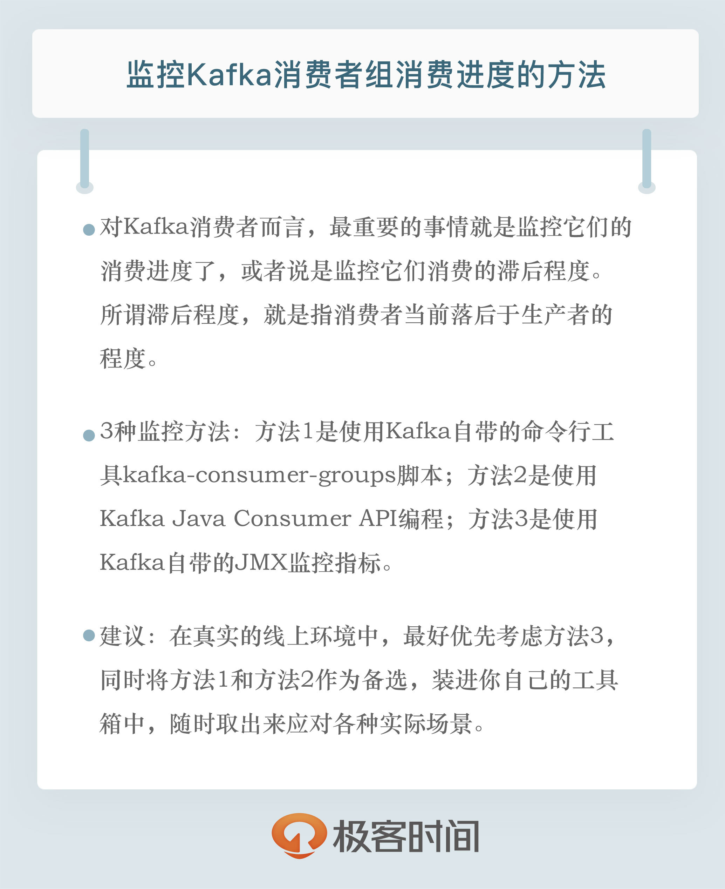

---
date: "2019-06-23"
---  
      
# 22 | 消费者组消费进度监控都怎么实现？
你好，我是胡夕。今天我要跟你分享的主题是：消费者组消费进度监控如何实现。

对于Kafka消费者来说，最重要的事情就是监控它们的消费进度了，或者说是监控它们消费的滞后程度。这个滞后程度有个专门的名称：消费者Lag或Consumer Lag。

**所谓滞后程度，就是指消费者当前落后于生产者的程度**。比方说，Kafka生产者向某主题成功生产了100万条消息，你的消费者当前消费了80万条消息，那么我们就说你的消费者滞后了20万条消息，即Lag等于20万。

通常来说，Lag的单位是消息数，而且我们一般是在主题这个级别上讨论Lag的，但实际上，Kafka监控Lag的层级是在分区上的。如果要计算主题级别的，你需要手动汇总所有主题分区的Lag，将它们累加起来，合并成最终的Lag值。

我们刚刚说过，对消费者而言，Lag应该算是最最重要的监控指标了。它直接反映了一个消费者的运行情况。一个正常工作的消费者，它的Lag值应该很小，甚至是接近于0的，这表示该消费者能够及时地消费生产者生产出来的消息，滞后程度很小。反之，如果一个消费者Lag值很大，通常就表明它无法跟上生产者的速度，最终Lag会越来越大，从而拖慢下游消息的处理速度。

<!-- [[[read_end]]] -->

更可怕的是，由于消费者的速度无法匹及生产者的速度，极有可能导致它消费的数据已经不在操作系统的页缓存中了。这样的话，消费者就不得不从磁盘上读取它们，这就进一步拉大了与生产者的差距，进而出现马太效应，即那些Lag原本就很大的消费者会越来越慢，Lag也会越来越大。

鉴于这些原因，**你在实际业务场景中必须时刻关注消费者的消费进度**。一旦出现Lag逐步增加的趋势，一定要定位问题，及时处理，避免造成业务损失。

既然消费进度这么重要，我们应该怎么监控它呢？简单来说，有3种方法。

1.  使用Kafka自带的命令行工具kafka-consumer-groups脚本。
2.  使用Kafka Java Consumer API编程。
3.  使用Kafka自带的JMX监控指标。

接下来，我们分别来讨论下这3种方法。

## Kafka自带命令

我们先来了解下第一种方法：使用Kafka自带的命令行工具bin/kafka-consumer-groups.sh\(bat\)。**kafka-consumer-groups脚本是Kafka为我们提供的最直接的监控消费者消费进度的工具**。当然，除了监控Lag之外，它还有其他的功能。今天，我们主要讨论如何使用它来监控Lag。

如果只看名字，你可能会以为它只是操作和管理消费者组的。实际上，它也能够监控独立消费者（Standalone Consumer）的Lag。我们之前说过，**独立消费者就是没有使用消费者组机制的消费者程序**。和消费者组相同的是，它们也要配置group.id参数值，但和消费者组调用KafkaConsumer.subscribe\(\)不同的是，独立消费者调用KafkaConsumer.assign\(\)方法直接消费指定分区。今天的重点不是要学习独立消费者，你只需要了解接下来我们讨论的所有内容都适用于独立消费者就够了。

使用kafka-consumer-groups脚本很简单。该脚本位于Kafka安装目录的bin子目录下，我们可以通过下面的命令来查看某个给定消费者的Lag值：

```
    $ bin/kafka-consumer-groups.sh --bootstrap-server <Kafka broker连接信息> --describe --group <group名称>
    

```

**Kafka连接信息就是\<主机名：端口>对，而group名称就是你的消费者程序中设置的group.id值**。我举个实际的例子来说明具体的用法，请看下面这张图的输出：


在运行命令时，我指定了Kafka集群的连接信息，即localhost:9092。另外，我还设置了要查询的消费者组名：testgroup。kafka-consumer-groups脚本的输出信息很丰富。首先，它会按照消费者组订阅主题的分区进行展示，每个分区一行数据；其次，除了主题、分区等信息外，它会汇报每个分区当前最新生产的消息的位移值（即LOG-END-OFFSET列值）、该消费者组当前最新消费消息的位移值（即CURRENT-OFFSET值）、LAG值（前两者的差值）、消费者实例ID、消费者连接Broker的主机名以及消费者的CLIENT-ID信息。

毫无疑问，在这些数据中，我们最关心的当属LAG列的值了，图中每个分区的LAG值大约都是60多万，这表明，在我的这个测试中，消费者组远远落后于生产者的进度。理想情况下，我们希望该列所有值都是0，因为这才表明我的消费者完全没有任何滞后。

有的时候，你运行这个脚本可能会出现下面这种情况，如下图所示：


简单比较一下，我们很容易发现它和前面那张图输出的区别，即CONSUMER-ID、HOST和CLIENT-ID列没有值！如果碰到这种情况，你不用惊慌，这是因为我们运行kafka-consumer-groups脚本时没有启动消费者程序。请注意我标为橙色的文字，它显式地告诉我们，当前消费者组没有任何active成员，即没有启动任何消费者实例。虽然这些列没有值，但LAG列依然是有效的，它依然能够正确地计算出此消费者组的Lag值。

除了上面这三列没有值的情形，还可能出现的一种情况是该命令压根不返回任何结果。此时，你也不用惊慌，这是因为你使用的Kafka版本比较老，kafka-consumer-groups脚本还不支持查询非active消费者组。一旦碰到这个问题，你可以选择升级你的Kafka版本，也可以采用我接下来说的其他方法来查询。

## Kafka Java Consumer API

很多时候，你可能对运行命令行工具查询Lag这种方式并不满意，而是希望用程序的方式自动化监控。幸运的是，社区的确为我们提供了这样的方法。这就是我们今天要讲的第二种方法。

简单来说，社区提供的Java Consumer API分别提供了查询当前分区最新消息位移和消费者组最新消费消息位移两组方法，我们使用它们就能计算出对应的Lag。

下面这段代码展示了如何利用Consumer端API监控给定消费者组的Lag值：

```
    public static Map<TopicPartition, Long> lagOf(String groupID, String bootstrapServers) throws TimeoutException {
            Properties props = new Properties();
            props.put(CommonClientConfigs.BOOTSTRAP_SERVERS_CONFIG, bootstrapServers);
            try (AdminClient client = AdminClient.create(props)) {
                ListConsumerGroupOffsetsResult result = client.listConsumerGroupOffsets(groupID);
                try {
                    Map<TopicPartition, OffsetAndMetadata> consumedOffsets = result.partitionsToOffsetAndMetadata().get(10, TimeUnit.SECONDS);
                    props.put(ConsumerConfig.ENABLE_AUTO_COMMIT_CONFIG, false); // 禁止自动提交位移
                    props.put(ConsumerConfig.GROUP_ID_CONFIG, groupID);
                    props.put(ConsumerConfig.KEY_DESERIALIZER_CLASS_CONFIG, StringDeserializer.class.getName());
                    props.put(ConsumerConfig.VALUE_DESERIALIZER_CLASS_CONFIG, StringDeserializer.class.getName());
                    try (final KafkaConsumer<String, String> consumer = new KafkaConsumer<>(props)) {
                        Map<TopicPartition, Long> endOffsets = consumer.endOffsets(consumedOffsets.keySet());
                        return endOffsets.entrySet().stream().collect(Collectors.toMap(entry -> entry.getKey(),
                                entry -> entry.getValue() - consumedOffsets.get(entry.getKey()).offset()));
                    }
                } catch (InterruptedException e) {
                    Thread.currentThread().interrupt();
                    // 处理中断异常
                    // ...
                    return Collections.emptyMap();
                } catch (ExecutionException e) {
                    // 处理ExecutionException
                    // ...
                    return Collections.emptyMap();
                } catch (TimeoutException e) {
                    throw new TimeoutException("Timed out when getting lag for consumer group " + groupID);
                }
            }
        }
    

```

你不用完全了解上面这段代码每一行的具体含义，只需要记住3处地方即可：第1处是调用AdminClient.listConsumerGroupOffsets方法获取给定消费者组的最新消费消息的位移；第2处则是获取订阅分区的最新消息位移；最后1处就是执行相应的减法操作，获取Lag值并封装进一个Map对象。

我把这段代码送给你，你可以将lagOf方法直接应用于你的生产环境，以实现程序化监控消费者Lag的目的。**不过请注意，这段代码只适用于Kafka 2.0.0及以上的版本**，2.0.0之前的版本中没有AdminClient.listConsumerGroupOffsets方法。

## Kafka JMX监控指标

上面这两种方式，都可以很方便地查询到给定消费者组的Lag信息。但在很多实际监控场景中，我们借助的往往是现成的监控框架。如果是这种情况，以上这两种办法就不怎么管用了，因为它们都不能集成进已有的监控框架中，如Zabbix或Grafana。下面我们就来看第三种方法，使用Kafka默认提供的JMX监控指标来监控消费者的Lag值。

当前，Kafka消费者提供了一个名为kafka.consumer:type=consumer-fetch-manager-metrics,client-id=“\{client-id\}”的JMX指标，里面有很多属性。和我们今天所讲内容相关的有两组属性：**records-lag-max和records-lead-min**，它们分别表示此消费者在测试窗口时间内曾经达到的最大的Lag值和最小的Lead值。

Lag值的含义我们已经反复讲过了，我就不再重复了。**这里的Lead值是指消费者最新消费消息的位移与分区当前第一条消息位移的差值**。很显然，Lag和Lead是一体的两个方面：**Lag越大的话，Lead就越小，反之也是同理**。

你可能会问，为什么要引入Lead呢？我只监控Lag不就行了吗？这里提Lead的原因就在于这部分功能是我实现的。开个玩笑，其实社区引入Lead的原因是，只看Lag的话，我们也许不能及时意识到可能出现的严重问题。

试想一下，监控到Lag越来越大，可能只会给你一个感受，那就是消费者程序变得越来越慢了，至少是追不上生产者程序了，除此之外，你可能什么都不会做。毕竟，有时候这也是能够接受的。但反过来，一旦你监测到Lead越来越小，甚至是快接近于0了，你就一定要小心了，这可能预示着消费者端要丢消息了。

为什么？我们知道Kafka的消息是有留存时间设置的，默认是1周，也就是说Kafka默认删除1周前的数据。倘若你的消费者程序足够慢，慢到它要消费的数据快被Kafka删除了，这时你就必须立即处理，否则一定会出现消息被删除，从而导致消费者程序重新调整位移值的情形。这可能产生两个后果：一个是消费者从头消费一遍数据，另一个是消费者从最新的消息位移处开始消费，之前没来得及消费的消息全部被跳过了，从而造成丢消息的假象。

这两种情形都是不可忍受的，因此必须有一个JMX指标，清晰地表征这种情形，这就是引入Lead指标的原因。所以，Lag值从100万增加到200万这件事情，远不如Lead值从200减少到100这件事来得重要。**在实际生产环境中，请你一定要同时监控Lag值和Lead值**。当然了，这个lead JMX指标的确也是我开发的，这一点倒是事实。

接下来，我给出一张使用JConsole工具监控此JMX指标的截图。从这张图片中，我们可以看到，client-id为consumer-1的消费者在给定的测量周期内最大的Lag值为714202，最小的Lead值是83，这说明此消费者有很大的消费滞后性。



**Kafka消费者还在分区级别提供了额外的JMX指标，用于单独监控分区级别的Lag和Lead值**。JMX名称为：kafka.consumer:type=consumer-fetch-manager-metrics,partition=“\{partition\}”,topic=“\{topic\}”,client-id=“\{client-id\}”。

在我们的例子中，client-id还是consumer-1，主题和分区分别是test和0。下图展示出了分区级别的JMX指标：



分区级别的JMX指标中多了records-lag-avg和records-lead-avg两个属性，可以计算平均的Lag值和Lead值。在实际场景中，我们会更多地使用这两个JMX指标。

## 小结

我今天完整地介绍了监控消费者组以及独立消费者程序消费进度的3种方法。从使用便捷性上看，应该说方法1是最简单的，我们直接运行Kafka自带的命令行工具即可。方法2使用Consumer API组合计算Lag，也是一种有效的方法，重要的是它能集成进很多企业级的自动化监控工具中。不过，集成性最好的还是方法3，直接将JMX监控指标配置到主流的监控框架就可以了。

在真实的线上环境中，我建议你优先考虑方法3，同时将方法1和方法2作为备选，装进你自己的工具箱中，随时取出来应对各种实际场景。



## 开放讨论

请说说你对这三种方法的看法。另外，在真实的业务场景中，你是怎么监控消费者进度的呢？

欢迎写下你的思考和答案，我们一起讨论。如果你觉得有所收获，也欢迎把文章分享给你的朋友。