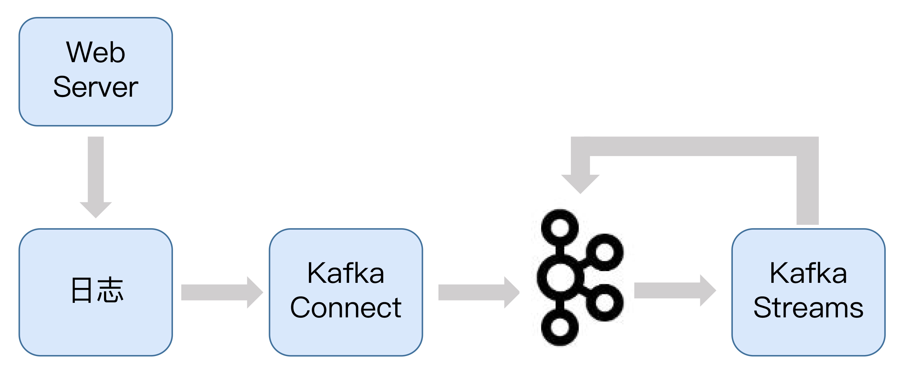
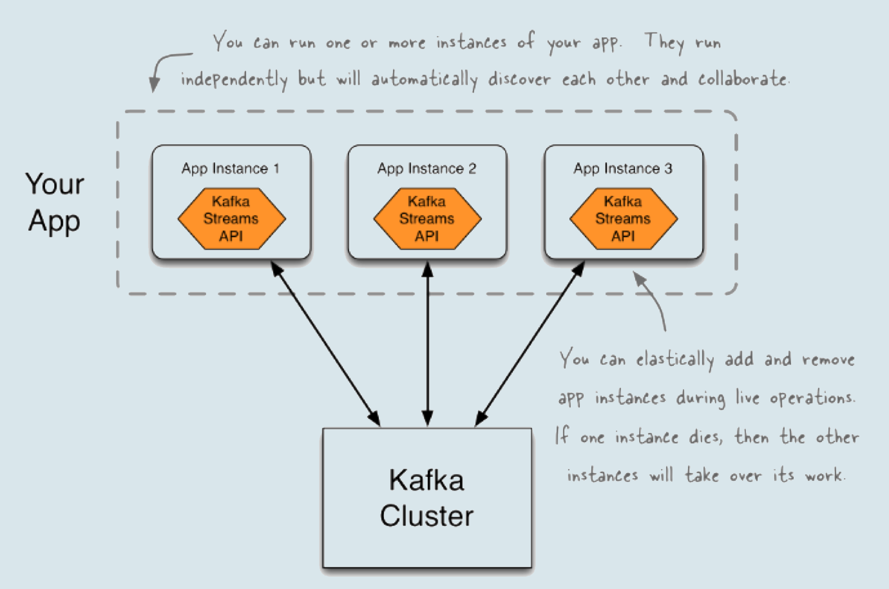

---
date: "2019-06-23"
---  
      
# 39 | 从0搭建基于Kafka的企业级实时日志流处理平台
你好，我是胡夕。今天我要和你分享的主题是：从0搭建基于Kafka的企业级实时日志流处理平台。

简单来说，我们要实现一些大数据组件的组合，就如同玩乐高玩具一样，把它们“插”在一起，“拼”成一个更大一点的玩具。

在任何一个企业中，服务器每天都会产生很多的日志数据。这些数据内容非常丰富，包含了我们的**线上业务数据**、**用户行为数据**以及**后端系统数据**。实时分析这些数据，能够帮助我们更快地洞察潜在的趋势，从而有针对性地做出决策。今天，我们就使用Kafka搭建一个这样的平台。

## 流处理架构

如果在网上搜索实时日志流处理，你应该能够搜到很多教你搭建实时流处理平台做日志分析的教程。这些教程使用的技术栈大多是Flume+Kafka+Storm、Spark Streaming或Flink。特别是Flume+Kafka+Flink的组合，逐渐成为了实时日志流处理的标配。不过，要搭建这样的处理平台，你需要用到3个框架才能实现，这既增加了系统复杂度，也提高了运维成本。

今天，我来演示一下如何使用Apache Kafka这一个框架，实现一套实时日志流处理系统。换句话说，我使用的技术栈是Kafka Connect+Kafka Core+Kafka Streams的组合。

<!-- [[[read_end]]] -->

下面这张图展示了基于Kafka的实时日志流处理平台的流程。



从图中我们可以看到，日志先从Web服务器被不断地生产出来，随后被实时送入到Kafka Connect组件，Kafka Connect组件对日志进行处理后，将其灌入Kafka的某个主题上，接着发送到Kafka Streams组件，进行实时分析。最后，Kafka Streams将分析结果发送到Kafka的另一个主题上。

我在专栏前面简单介绍过Kafka Connect和Kafka Streams组件，前者可以实现外部系统与Kafka之间的数据交互，而后者可以实时处理Kafka主题中的消息。

现在，我们就使用这两个组件，结合前面学习的所有Kafka知识，一起构建一个实时日志分析平台。

## Kafka Connect组件

我们先利用Kafka Connect组件**收集数据**。如前所述，Kafka Connect组件负责连通Kafka与外部数据系统。连接外部数据源的组件叫连接器（Connector）。**常见的外部数据源包括数据库、KV存储、搜索系统或文件系统等。**

今天我们使用文件连接器（File Connector）实时读取Nginx的access日志。假设access日志的格式如下：

```
    10.10.13.41 - - [13/Aug/2019:03:46:54 +0800] "GET /v1/open/product_list?user_key=****&user_phone=****&screen_height=1125&screen_width=2436&from_page=1&user_type=2&os_type=ios HTTP/1.0" 200 1321
    

```

在这段日志里，请求参数中的os\_type字段目前有两个值：ios和android。我们的目标是实时计算当天所有请求中ios端和android端的请求数。

### 启动Kafka Connect

当前，Kafka Connect支持单机版（Standalone）和集群版（Cluster），我们用集群的方式来启动Connect组件。

首先，我们要启动Kafka集群，假设Broker的连接地址是localhost:9092。

启动好Kafka集群后，我们启动Connect组件。在Kafka安装目录下有个config/connect-distributed.properties文件，你需要修改下列项：

```
    bootstrap.servers=localhost:9092
    rest.host.name=localhost
    rest.port=8083
    

```

第1项是指定**要连接的Kafka集群**，第2项和第3项分别指定Connect组件开放的REST服务的**主机名和端口**。保存这些变更之后，我们运行下面的命令启动Connect。

```
    cd kafka_2.12-2.3.0
    bin/connect-distributed.sh config/connect-distributed.properties
    

```

如果一切正常，此时Connect应该就成功启动了。现在我们在浏览器访问localhost:8083的Connect REST服务，应该能看到下面的返回内容：

```
    {"version":"2.3.0","commit":"fc1aaa116b661c8a","kafka_cluster_id":"XbADW3mnTUuQZtJKn9P-hA"}
    

```

### 添加File Connector

看到该JSON串，就表明Connect已经成功启动了。此时，我们打开一个终端，运行下面这条命令来查看一下当前都有哪些Connector。

```
    $ curl http://localhost:8083/connectors
    []
    

```

结果显示，目前我们没有创建任何Connector。

现在，我们来创建对应的File Connector。该Connector读取指定的文件，并为每一行文本创建一条消息，并发送到特定的Kafka主题上。创建命令如下：

```
    $ curl -H "Content-Type:application/json" -H "Accept:application/json" http://localhost:8083/connectors -X POST --data '{"name":"file-connector","config":{"connector.class":"org.apache.kafka.connect.file.FileStreamSourceConnector","file":"/var/log/access.log","tasks.max":"1","topic":"access_log"}}'
    {"name":"file-connector","config":{"connector.class":"org.apache.kafka.connect.file.FileStreamSourceConnector","file":"/var/log/access.log","tasks.max":"1","topic":"access_log","name":"file-connector"},"tasks":[],"type":"source"}
    

```

这条命令本质上是向Connect REST服务发送了一个POST请求，去创建对应的Connector。在这个例子中，我们的Connector类是Kafka默认提供的**FileStreamSourceConnector**。我们要读取的日志文件在/var/log目录下，要发送到Kafka的主题名称为access\_log。

现在，我们再次运行curl http: // localhost:8083/connectors， 验证一下刚才的Connector是否创建成功了。

```
    $ curl http://localhost:8083/connectors
    ["file-connector"]
    

```

显然，名为file-connector的新Connector已经创建成功了。如果我们现在使用Console Consumer程序去读取access\_log主题的话，应该会发现access.log中的日志行数据已经源源不断地向该主题发送了。

如果你的生产环境中有多台机器，操作也很简单，在每台机器上都创建这样一个Connector，只要保证它们被送入到相同的Kafka主题以供消费就行了。

## Kafka Streams组件

数据到达Kafka还不够，我们还需要对其进行实时处理。下面我演示一下如何编写Kafka Streams程序来实时分析Kafka主题数据。

我们知道，Kafka Streams是Kafka提供的用于实时流处理的组件。

与其他流处理框架不同的是，它仅仅是一个类库，用它编写的应用被编译打包之后就是一个普通的Java应用程序。你可以使用任何部署框架来运行Kafka Streams应用程序。

同时，你只需要简单地启动多个应用程序实例，就能自动地获得负载均衡和故障转移，因此，和Spark Streaming或Flink这样的框架相比，Kafka Streams自然有它的优势。

下面这张来自Kafka官网的图片，形象地展示了多个Kafka Streams应用程序组合在一起，共同实现流处理的场景。图中清晰地展示了3个Kafka Streams应用程序实例。一方面，它们形成一个组，共同参与并执行流处理逻辑的计算；另一方面，它们又都是独立的实体，彼此之间毫无关联，完全依靠Kafka Streams帮助它们发现彼此并进行协作。



关于Kafka Streams的原理，我会在专栏后面进行详细介绍。今天，我们只要能够学会利用它提供的API编写流处理应用，帮我们找到刚刚提到的请求日志中ios端和android端发送请求数量的占比数据就行了。

### 编写流处理应用

要使用Kafka Streams，你需要在你的Java项目中显式地添加kafka-streams依赖。我以最新的2.3版本为例，分别演示下Maven和Gradle的配置方法。

```
    Maven:
    <dependency>
        <groupId>org.apache.kafka</groupId>
        <artifactId>kafka-streams</artifactId>
        <version>2.3.0</version>
    </dependency>
    

```

```
    Gradle:
    compile group: 'org.apache.kafka', name: 'kafka-streams', version: '2.3.0'
    

```

现在，我先给出完整的代码，然后我会详细解释一下代码中关键部分的含义。

```
    package com.geekbang.kafkalearn;
    
    import com.google.gson.Gson;
    import org.apache.kafka.common.serialization.Serdes;
    import org.apache.kafka.streams.KafkaStreams;
    import org.apache.kafka.streams.StreamsBuilder;
    import org.apache.kafka.streams.StreamsConfig;
    import org.apache.kafka.streams.Topology;
    import org.apache.kafka.streams.kstream.KStream;
    import org.apache.kafka.streams.kstream.Produced;
    import org.apache.kafka.streams.kstream.TimeWindows;
    import org.apache.kafka.streams.kstream.WindowedSerdes;
    
    import java.time.Duration;
    import java.util.Properties;
    import java.util.concurrent.CountDownLatch;
    
    public class OSCheckStreaming {
    
        public static void main(String[] args) {
    
    
            Properties props = new Properties();
            props.put(StreamsConfig.APPLICATION_ID_CONFIG, "os-check-streams");
            props.put(StreamsConfig.BOOTSTRAP_SERVERS_CONFIG, "localhost:9092");
            props.put(StreamsConfig.DEFAULT_KEY_SERDE_CLASS_CONFIG, Serdes.String().getClass());
            props.put(StreamsConfig.DEFAULT_VALUE_SERDE_CLASS_CONFIG, Serdes.String().getClass());
            props.put(StreamsConfig.DEFAULT_WINDOWED_KEY_SERDE_INNER_CLASS, Serdes.StringSerde.class.getName());
    
            final Gson gson = new Gson();
            final StreamsBuilder builder = new StreamsBuilder();
    
            KStream<String, String> source = builder.stream("access_log");
            source.mapValues(value -> gson.fromJson(value, LogLine.class)).mapValues(LogLine::getPayload)
                    .groupBy((key, value) -> value.contains("ios") ? "ios" : "android")
                    .windowedBy(TimeWindows.of(Duration.ofSeconds(2L)))
                    .count()
                    .toStream()
                    .to("os-check", Produced.with(WindowedSerdes.timeWindowedSerdeFrom(String.class), Serdes.Long()));
    
            final Topology topology = builder.build();
    
            final KafkaStreams streams = new KafkaStreams(topology, props);
            final CountDownLatch latch = new CountDownLatch(1);
    
            Runtime.getRuntime().addShutdownHook(new Thread("streams-shutdown-hook") {
                @Override
                public void run() {
                    streams.close();
                    latch.countDown();
                }
            });
    
            try {
                streams.start();
                latch.await();
            } catch (Exception e) {
                System.exit(1);
            }
            System.exit(0);
        }
    }
    
    
    class LogLine {
        private String payload;
        private Object schema;
    
        public String getPayload() {
            return payload;
        }
    }
    

```

这段代码会实时读取access\_log主题，每2秒计算一次ios端和android端请求的总数，并把这些数据写入到os-check主题中。

首先，我们构造一个Properties对象。这个对象负责初始化Streams应用程序所需要的关键参数设置。比如，在上面的例子中，我们设置了bootstrap.servers参数、application.id参数以及默认的序列化器（Serializer）和解序列化器（Deserializer）。

bootstrap.servers参数你应该已经很熟悉了，我就不多讲了。这里的application.id是Streams程序中非常关键的参数，你必须要指定一个集群范围内唯一的字符串来标识你的Kafka Streams程序。序列化器和解序列化器设置了默认情况下Streams程序执行序列化和反序列化时用到的类。在这个例子中，我们设置的是String类型，这表示，序列化时会将String转换成字节数组，反序列化时会将字节数组转换成String。

构建好Properties实例之后，下一步是创建StreamsBuilder对象。稍后我们会用这个Builder去实现具体的流处理逻辑。

在这个例子中，我们实现了这样的流计算逻辑：每2秒去计算一下ios端和android端各自发送的总请求数。还记得我们的原始数据长什么样子吗？它是一行Nginx日志，只不过Connect组件在读取它后，会把它包装成JSON格式发送到Kafka，因此，我们需要借助Gson来帮助我们把JSON串还原为Java对象，这就是我在代码中创建LogLine类的原因。

代码中的mapValues调用将接收到的JSON串转换成LogLine对象，之后再次调用mapValues方法，提取出LogLine对象中的payload字段，这个字段保存了真正的日志数据。这样，经过两次mapValues方法调用之后，我们成功地将原始数据转换成了实际的Nginx日志行数据。

值得注意的是，代码使用的是Kafka Streams提供的mapValues方法。顾名思义，**这个方法就是只对消息体（Value）进行转换，而不变更消息的键（Key）**。

其实，Kafka Streams也提供了map方法，允许你同时修改消息Key。通常来说，我们认为**mapValues要比map方法更高效**，因为Key的变更可能导致下游处理算子（Operator）的重分区，降低性能。如果可能的话最好尽量使用mapValues方法。

拿到真实日志行数据之后，我们调用groupBy方法进行统计计数。由于我们要统计双端（ios端和android端）的请求数，因此，我们groupBy的Key是ios或android。在上面的那段代码中，我仅仅依靠日志行中是否包含特定关键字的方式来确定是哪一端。更正宗的做法应该是，**分析Nginx日志格式，提取对应的参数值，也就是os\_type的值**。

做完groupBy之后，我们还需要限定要统计的时间窗口范围，即我们统计的双端请求数是在哪个时间窗口内计算的。在这个例子中，我调用了**windowedBy方法**，要求Kafka Streams每2秒统计一次双端的请求数。设定好了时间窗口之后，下面就是调用**count方法**进行统计计数了。

这一切都做完了之后，我们需要调用**toStream方法**将刚才统计出来的表（Table）转换成事件流，这样我们就能实时观测它里面的内容。我会在专栏的最后几讲中解释下流处理领域内的流和表的概念以及它们的区别。这里你只需要知道toStream是将一个Table变成一个Stream即可。

最后，我们调用**to方法**将这些时间窗口统计数据不断地写入到名为os-check的Kafka主题中，从而最终实现我们对Nginx日志进行实时分析处理的需求。

### 启动流处理应用

由于Kafka Streams应用程序就是普通的Java应用，你可以用你熟悉的方式对它进行编译、打包和部署。本例中的OSCheckStreaming.java就是一个可执行的Java类，因此直接运行它即可。如果一切正常，它会将统计数据源源不断地写入到os-check主题。

### 查看统计结果

如果我们想要查看统计的结果，一个简单的方法是使用Kafka自带的kafka-console-consumer脚本。命令如下：

```
    $ bin/kafka-console-consumer.sh --bootstrap-server localhost:9092 --topic os-check --from-beginning --property value.deserializer=org.apache.kafka.common.serialization.LongDeserializer --property print.key=true --property key.deserializer=org.apache.kafka.streams.kstream.TimeWindowedDeserializer --property key.deserializer.default.windowed.key.serde.inner=org.apache.kafka.common.serialization.Serdes\$StringSerde
    [android@1565743788000/9223372036854775807] 1522
    [ios@1565743788000/9223372036854775807] 478
    [ios@1565743790000/9223372036854775807] 1912
    [android@1565743790000/9223372036854775807] 5313
    [ios@1565743792000/9223372036854775807] 780
    [android@1565743792000/9223372036854775807] 1949
    [android@1565743794000/9223372036854775807] 37
    ……
    

```

由于我们统计的结果是某个时间窗口范围内的，因此承载这个统计结果的消息的Key封装了该时间窗口信息，具体格式是：**\[ios或android\@开始时间/结束时间\]**，而消息的Value就是一个简单的数字，表示这个时间窗口内的总请求数。

如果把上面ios相邻输出行中的开始时间相减，我们就会发现，它们的确是每2秒输出一次，每次输出会同时计算出ios端和android端的总请求数。接下来，你可以订阅这个Kafka主题，将结果实时导出到你期望的其他数据存储上。

## 小结

至此，基于Apache Kafka的实时日志流处理平台就简单搭建完成了。在搭建的过程中，我们只使用Kafka这一个大数据框架就完成了所有组件的安装、配置和代码开发。比起Flume+Kafka+Flink这样的技术栈，纯Kafka的方案在运维和管理成本上有着极大的优势。如果你打算从0构建一个实时流处理平台，不妨试一下Kafka Connect+Kafka Core+Kafka Streams的组合。

其实，Kafka Streams提供的功能远不止做计数这么简单。今天，我只是为你展示了Kafka Streams的冰山一角。在专栏的后几讲中，我会重点向你介绍Kafka Streams组件的使用和管理，敬请期待。


## 开放讨论

请比较一下Flume+Kafka+Flink方案和纯Kafka方案，思考一下它们各自的优劣之处。在实际场景中，我们该如何选择呢？

欢迎写下你的思考和答案，我们一起讨论。如果你觉得有所收获，也欢迎把文章分享给你的朋友。