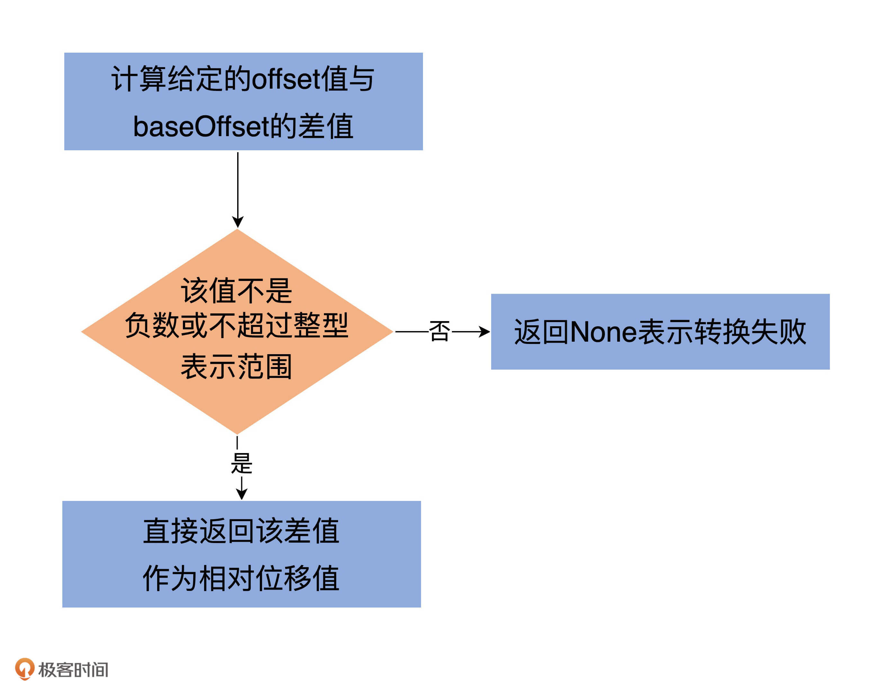
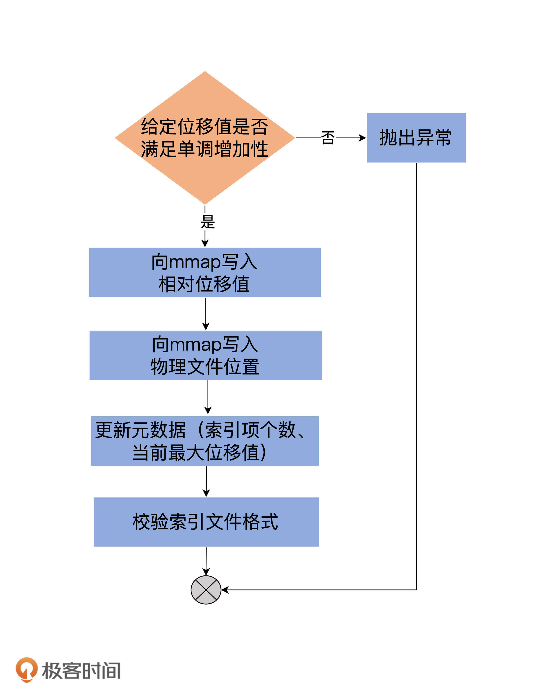
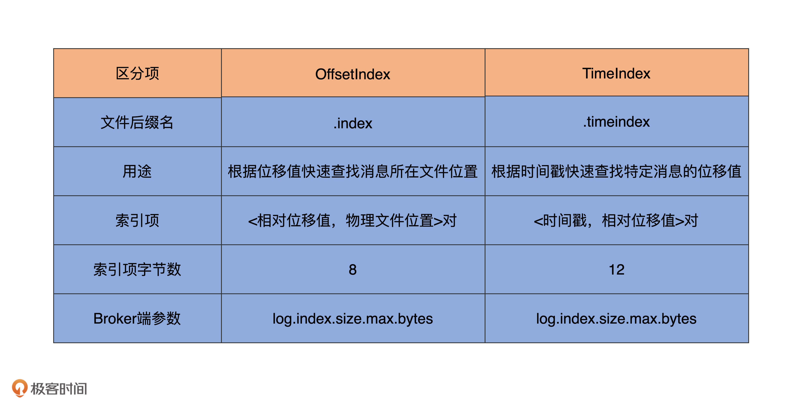

---
date: "2019-06-23"
---  
      
# 05 | 索引（下）：位移索引和时间戳索引的区别是什么？
你好，我是胡夕。今天，我们继续说索引那些事儿。

在上节课，我带你重点学习了Kafka源码中索引的抽象父类AbstractIndex。我分析了AbstractIndex类的大体对象结构，还介绍了社区改进版的二分查找算法在Kafka索引上的应用。

前面说过，Kafka索引类型有三大类：位移索引、时间戳索引和已中止事务索引。相比于最后一类索引，前两类索引的出镜率更高一些。在Kafka的数据路径下，你肯定看到过很多.index和.timeindex后缀的文件。不知你是否有过这样的疑问：“这些文件是用来做什么的呢？” 现在我可以明确告诉你：.index文件就是Kafka中的位移索引文件，而.timeindex文件则是时间戳索引文件。

那么，位移索引和时间戳索引到底是做什么用的呢？它们之间的区别是什么？今天，我就为你揭晓这些问题的答案。

## 位移索引

在学习Kafka的任何一类索引的时候，我们都要关注两个问题：

1.  索引中的索引项是如何定义的？
2.  如何向索引写入新的索引项？

看到这里，你可能会很疑惑：“等等，难道我们不需要关心如何查询索引吗？” 当然需要啦！上节课我们不是讲过二分查找算法在索引中的应用了吗？如果你觉得有点生疏了，那就赶快先去复习一下吧。

<!-- [[[read_end]]] -->

现在，我们先来看下索引项的定义。

### 索引项的定义

位移索引也就是所谓的OffsetIndex，它可是一个老资历的组件了。如果我没记错的话，国内大面积使用Kafka应该是在0.8时代。从那个时候开始，OffsetIndex就已经存在了。每当Consumer需要从主题分区的某个位置开始读取消息时，Kafka就会用到OffsetIndex直接定位物理文件位置，从而避免了因为从头读取消息而引入的昂贵的I/O操作。

在上节课，我提到过，不同索引类型保存不同的\<Key, Value>对。就OffsetIndex而言，Key就是消息的相对位移，Value是保存该消息的日志段文件中该消息第一个字节的物理文件位置。

这里我来具体解释一下相对位移的含义。还记得AbstractIndex类中的抽象方法entrySize吗？它定义了单个\<Key, Value>对所用的字节数。对于OffsetIndex来说，entrySize就是8，如OffsetIndex.scala中定义的那样：

```
        override def entrySize = 8
    

```

为什么是8呢？相对位移是一个整型（Integer），占用4个字节，物理文件位置也是一个整型，同样占用4个字节，因此总共是8个字节。

那相对位移是什么值呢？我们知道，Kafka中的消息位移值是一个长整型（Long），应该占用8个字节才对。在保存OffsetIndex的\<Key, Value>对时，Kafka做了一些优化。每个OffsetIndex对象在创建时，都已经保存了对应日志段对象的起始位移，因此，OffsetIndex索引项没必要保存完整的8字节位移值。相反地，它只需要保存与起始位移的差值（Delta）就够了，而这个差值是可以被整型容纳的。这种设计可以让OffsetIndex每个索引项都节省4个字节。

举个简单的例子。假设一个索引文件保存了1000个索引项，使用相对位移值就能节省大约4MB的空间，这是不是一件很划算的事情呢？

OffsetIndex定义了专门的方法，用于将一个Long型的位移值转换成相对位移，如下所示：

```
    def relativeOffset(offset: Long): Int = {
        val relativeOffset = toRelative(offset)
        if (relativeOffset.isEmpty)
          // 如果无法转换成功（比如差值超过了整型表示范围)，则抛出异常
          throw new IndexOffsetOverflowException(s"Integer overflow for offset: $offset (${file.getAbsoluteFile})")
        relativeOffset.get
    }
    

```

relativeOffset方法调用了父类的toRelative方法执行真正的转换。我们来看一下toRelative方法的实现。

```
    private def toRelative(offset: Long): Option[Int] = {
      val relativeOffset = offset - baseOffset
      if (relativeOffset < 0 || relativeOffset > Int.MaxValue)
        None
      else
        Some(relativeOffset.toInt)
    }
    

```

逻辑很简单：第一步是计算给定的offset值与baseOffset的差值；第二步是校验该差值不能是负数或不能超过整型表示范围。如果校验通过，就直接返回该差值作为相对位移值，否则就返回None表示转换失败。



现在，你知道OffsetIndex中的索引项为什么是8个字节以及位移值是如何被转换成相对位移了吧？

当读取OffsetIndex时，源码还需要将相对位移值还原成之前的完整位移。这个是在parseEntry方法中实现的。

```
    override protected def parseEntry(buffer: ByteBuffer, n: Int): OffsetPosition = {
      OffsetPosition(baseOffset + relativeOffset(buffer, n), physical(buffer, n))
    }
    

```

我来给你解释下具体的实现方法。

这个方法返回一个OffsetPosition类型。该类有两个方法，分别返回索引项的Key和Value。

**这里的parseEntry方法，就是要构造OffsetPosition所需的Key和Value**。Key是索引项中的完整位移值，**代码使用baseOffset + relativeOffset\(buffer, n\)的方式将相对位移值还原成完整位移值**；Value是这个位移值上消息在日志段文件中的物理位置，代码调用physical方法计算这个物理位置并把它作为Value。

最后，parseEntry方法把Key和Value封装到一个OffsetPosition实例中，然后将这个实例返回。

由于索引文件的总字节数就是索引项字节数乘以索引项数，因此，代码结合entrySize和buffer.getInt方法能够轻松地计算出第n个索引项所处的物理文件位置。这就是physical方法做的事情。

### 写入索引项

好了，有了这些基础，下面的内容就很容易理解了。我们来看下OffsetIndex中最重要的操作——**写入索引项append方法的实现**。

```
    def append(offset: Long, position: Int): Unit = {
      inLock(lock) {
        // 索引文件如果已经写满，直接抛出异常
        require(!isFull, "Attempt to append to a full index (size = " + _entries + ").")
        // 要保证待写入的位移值offset比当前索引文件中所有现存的位移值都要大
        // 这主要是为了维护索引的单调增加性
        if (_entries == 0 || offset > _lastOffset) {
          trace(s"Adding index entry $offset => $position to ${file.getAbsolutePath}")
          mmap.putInt(relativeOffset(offset)) // 向mmap写入相对位移值
          mmap.putInt(position) // 向mmap写入物理文件位置
          _entries += 1 // 更新索引项个数
          _lastOffset = offset // 更新当前索引文件最大位移值
          // 确保写入索引项格式符合要求
          require(_entries * entrySize == mmap.position(), s"$entries entries but file position in index is ${mmap.position()}.")
        } else {
          throw new InvalidOffsetException(s"Attempt to append an offset ($offset) to position $entries no larger than" +
            s" the last offset appended (${_lastOffset}) to ${file.getAbsolutePath}.")
        }
      }
    }
    

```

append方法接收两个参数：**Long型的位移值**和**Integer型的物理文件位置**。**该方法最重要的两步，就是分别向mmap写入相对位移值和物理文件位置**。我使用一张图，来总结下append方法的执行流程：



除了append方法，索引还有一个常见的操作：截断操作（Truncation）。**截断操作是指，将索引文件内容直接裁剪掉一部分**。比如，OffsetIndex索引文件中当前保存了100个索引项，我想只保留最开始的40个索引项。源码定义了truncateToEntries方法来实现这个需求：

```
    private def truncateToEntries(entries: Int): Unit = {
      inLock(lock) {
        _entries = entries
        mmap.position(_entries * entrySize)
        _lastOffset = lastEntry.offset
        debug(s"Truncated index ${file.getAbsolutePath} to $entries entries;" +
          s" position is now ${mmap.position()} and last offset is now ${_lastOffset}")
      }
    }
    
    

```

这个方法接收entries参数，表示**要截取到哪个槽**，主要的逻辑实现是调用mmap的position方法。源码中的\_entries \* entrySize就是mmap要截取到的字节处。

下面，我来说说OffsetIndex的使用方式。

既然OffsetIndex被用来快速定位消息所在的物理文件位置，那么必然需要定义一个方法执行对应的查询逻辑。这个方法就是lookup。

```
    def lookup(targetOffset: Long): OffsetPosition = {
      maybeLock(lock) {
        val idx = mmap.duplicate // 使用私有变量复制出整个索引映射区
        // largestLowerBoundSlotFor方法底层使用了改进版的二分查找算法寻找对应的槽
        val slot = largestLowerBoundSlotFor(idx, targetOffset, IndexSearchType.KEY)
        // 如果没找到，返回一个空的位置，即物理文件位置从0开始，表示从头读日志文件
    	// 否则返回slot槽对应的索引项
        if(slot == -1)
          OffsetPosition(baseOffset, 0)
        else
          parseEntry(idx, slot)
      }
    }
    

```

我把主要的逻辑以注释的方式加到了代码中。该方法返回的，是不大于给定位移值targetOffset的最大位移值，以及对应的物理文件位置。你大致可以把这个方法，理解为位移值的FLOOR函数。

## 时间戳索引

说完了OffsetIndex，我们来看另一大类索引：时间戳索引，即TimeIndex。与OffsetIndex类似，我们重点关注TimeIndex中索引项的定义，以及如何写入TimeIndex索引项。

### 索引项的定义

与OffsetIndex不同的是，TimeIndex保存的是\<时间戳，相对位移值>对。时间戳需要一个长整型来保存，相对位移值使用Integer来保存。因此，TimeIndex单个索引项需要占用12个字节。这也揭示了一个重要的事实：**在保存同等数量索引项的基础上，TimeIndex会比OffsetIndex占用更多的磁盘空间**。

### 写入索引项

TimeIndex也有append方法，只不过它叫作maybeAppend。我们来看下它的实现逻辑。

```
    def maybeAppend(timestamp: Long, offset: Long, skipFullCheck: Boolean = false): Unit = {
      inLock(lock) {
        if (!skipFullCheck)
          // 如果索引文件已写满，抛出异常
          require(!isFull, "Attempt to append to a full time index (size = " + _entries + ").")
        // 确保索引单调增加性
        if (_entries != 0 && offset < lastEntry.offset)
          throw new InvalidOffsetException(s"Attempt to append an offset ($offset) to slot ${_entries} no larger than" +
            s" the last offset appended (${lastEntry.offset}) to ${file.getAbsolutePath}.")
        // 确保时间戳的单调增加性
        if (_entries != 0 && timestamp < lastEntry.timestamp)
          throw new IllegalStateException(s"Attempt to append a timestamp ($timestamp) to slot ${_entries} no larger" +
            s" than the last timestamp appended (${lastEntry.timestamp}) to ${file.getAbsolutePath}.")
    
        if (timestamp > lastEntry.timestamp) {
          trace(s"Adding index entry $timestamp => $offset to ${file.getAbsolutePath}.")
          mmap.putLong(timestamp) // 向mmap写入时间戳
          mmap.putInt(relativeOffset(offset)) // 向mmap写入相对位移值
          _entries += 1 // 更新索引项个数
          _lastEntry = TimestampOffset(timestamp, offset) // 更新当前最新的索引项
          require(_entries * entrySize == mmap.position(), s"${_entries} entries but file position in index is ${mmap.position()}.")
        }
      }
    }
    

```

和OffsetIndex类似，向TimeIndex写入索引项的主体逻辑，是向mmap分别写入时间戳和相对位移值。只不过，**除了校验位移值的单调增加性之外，TimeIndex还会确保顺序写入的时间戳也是单调增加的**。

说到这里，我想到我当年读到这段代码时候的一个想法。那个时候，这段代码还没有加上时间戳单调增加的校验逻辑，我灵机一动，萌发了向TimeIndex写入一个过期时间戳的想法。一番动手操作之后，我真的向TimeIndex索引文件中写入了一个过期时间戳和位移。

你猜结果怎样？结果是引发了消费者端程序的彻底混乱。这是因为，当消费者端程序根据时间戳信息去过滤待读取的消息时，它读到了这个过期的时间戳并拿到了错误的位移值，因此返回了错误的数据。

为此，我还给社区提交了一个Jira，当时被驳回了——理由是不允许向TimeIndex写入过期时间戳。跟你说这个趣事儿只是想说明，有的时候，读源码会诱发很多灵感或奇思妙想，而这些东西是你在平时使用过程中不会想到的。这也算是阅读源码的一大收获吧。

## 区别

讲到这里，这节课就接近尾声了。最后，我用一张表格汇总下OffsetIndex和TimeIndex的特点和区别，希望能够帮助你更好地理解和消化今天的重点内容。



## 总结

今天，我带你详细分析了OffsetIndex和TimeIndex，以及它们的不同之处。虽然OffsetIndex和TimeIndex是不同类型的索引，但Kafka内部是把二者结合使用的。通常的流程是，先使用TimeIndex寻找满足时间戳要求的消息位移值，然后再利用OffsetIndex去定位该位移值所在的物理文件位置。因此，它们其实是合作的关系。

最后，我还想提醒你一点：**不要对索引文件做任何修改！**我碰到过因用户擅自重命名索引文件，从而导致Broker崩溃无法启动的场景。另外，虽然Kafka能够重建索引，但是随意地删除索引文件依然是一个很危险的操作。在生产环境中，我建议你尽量不要执行这样的操作。

## 课后讨论

OffsetIndex中的lookup方法实现了类似于FLOOR函数的位移查找逻辑。你能否对应写一个类似于CEILING函数的位移查找逻辑，即返回不小于给定位移值targetOffset的最小位移值和对应的物理文件位置？

欢迎你在留言区畅所欲言，跟我交流讨论，也欢迎你把今天的内容分享给你的朋友。