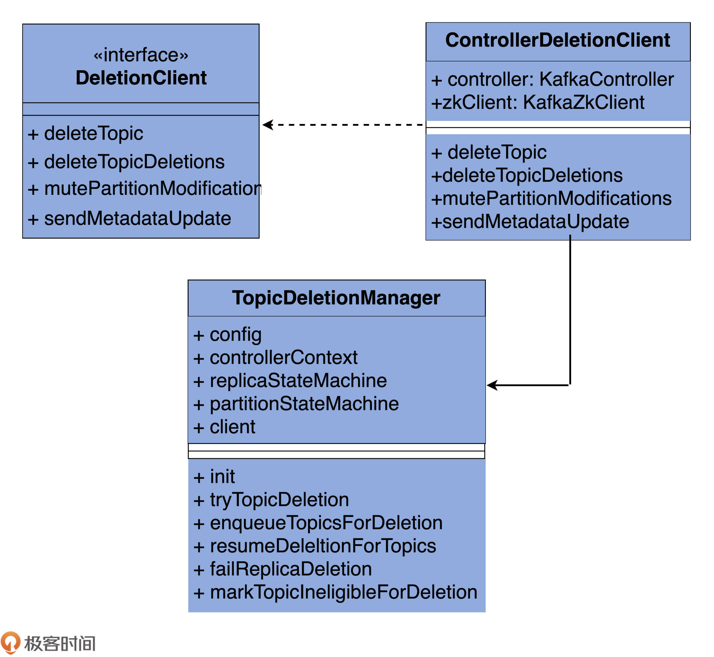
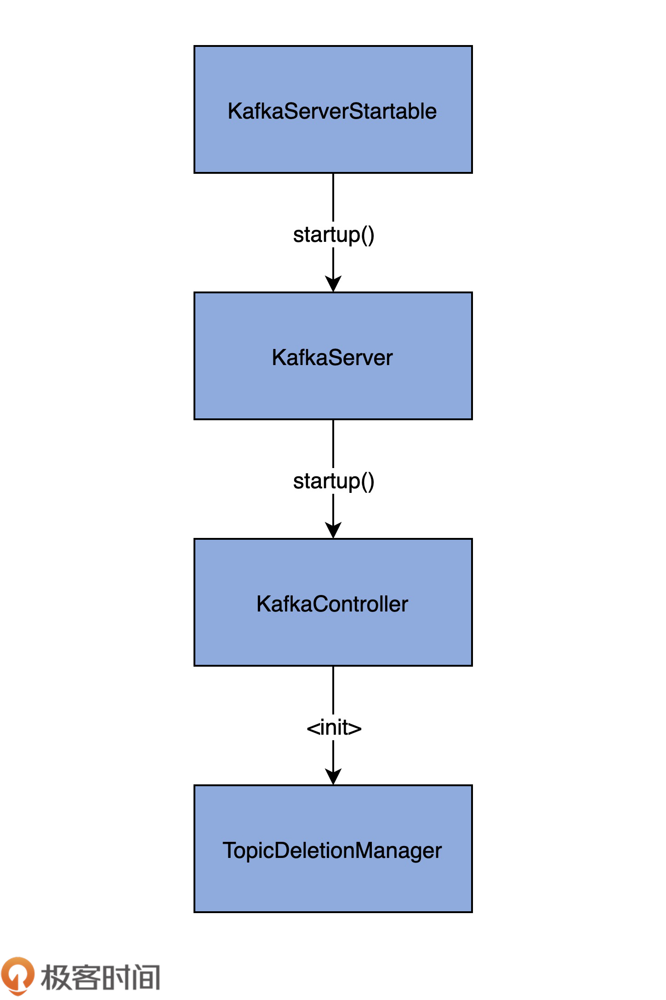
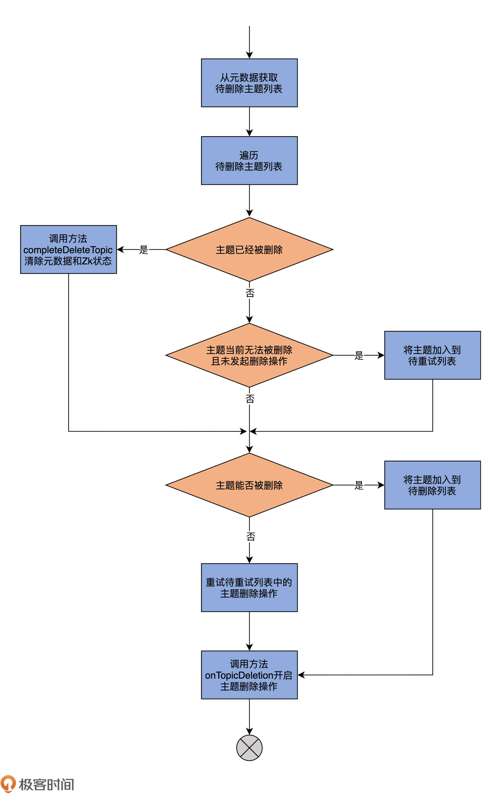
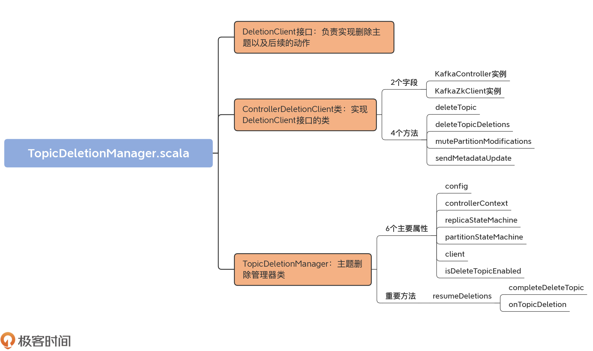

---
date: "2019-06-23"
---  
      
# 16 | TopicDeletionManager： Topic是怎么被删除的？
你好，我是胡夕。今天，我们正式进入到第四大模块“状态机”的学习。

Kafka源码中有很多状态机和管理器，比如之前我们学过的Controller通道管理器ControllerChannelManager、处理Controller事件的ControllerEventManager，等等。这些管理器和状态机，大多与各自的“宿主”组件关系密切，可以说是大小不同、功能各异。就比如Controller的这两个管理器，必须要与Controller组件紧耦合在一起才能实现各自的功能。

不过，Kafka中还是有一些状态机和管理器具有相对独立的功能框架，不严重依赖使用方，也就是我在这个模块为你精选的TopicDeletionManager（主题删除管理器）、ReplicaStateMachine（副本状态机）和PartitionStateMachine（分区状态机）。

* TopicDeletionManager：负责对指定Kafka主题执行删除操作，清除待删除主题在集群上的各类“痕迹”。
* ReplicaStateMachine：负责定义Kafka副本状态、合法的状态转换，以及管理状态之间的转换。
* PartitionStateMachine：负责定义Kafka分区状态、合法的状态转换，以及管理状态之间的转换。

<!-- [[[read_end]]] -->

无论是主题、分区，还是副本，它们在Kafka中的生命周期通常都有多个状态。而这3个状态机，就是来管理这些状态的。而如何实现正确、高效的管理，就是源码要解决的核心问题。

今天，我们先来学习TopicDeletionManager，看一下Kafka是如何删除一个主题的。

## 课前导读

刚开始学习Kafka的时候，我对Kafka删除主题的认识非常“浅薄”。之前我以为成功执行了kafka-topics.sh \--delete命令后，主题就会被删除。我相信，很多人可能都有过这样的错误理解。

这种不正确的认知产生的一个结果就是，我们经常发现主题没有被删除干净。于是，网上流传着一套终极“武林秘籍”：手动删除磁盘上的日志文件，以及手动删除ZooKeeper下关于主题的各个节点。

就我个人而言，我始终不推荐你使用这套“秘籍”，理由有二：

* 它并不完整。事实上，除非你重启Broker，否则，这套“秘籍”无法清理Controller端和各个Broker上元数据缓存中的待删除主题的相关条目。
* 它并没有被官方所认证，换句话说就是后果自负。从某种程度上说，它会带来什么不好的结果，是你没法把控的。

所谓“本事大不如不摊上”，我们与其琢磨删除主题失败之后怎么自救，不如踏踏实实地研究下Kafka底层是怎么执行这个操作的。搞明白它的原理之后，再有针对性地使用“秘籍”，才能做到有的放矢。你说是不是？

## TopicDeletionManager概览

好了，我们就正式开始学习TopicDeletionManager吧。

这个管理器位于kafka.controller包下，文件名是TopicDeletionManager.scala。在总共不到400行的源码中，它定义了3个类结构以及20多个方法。总体而言，它还是比较容易学习的。

为了让你先有个感性认识，我画了一张TopicDeletionManager.scala的代码UML图：



TopicDeletionManager.scala这个源文件，包括3个部分。

* DeletionClient接口：负责实现删除主题以及后续的动作，比如更新元数据等。这个接口里定义了4个方法，分别是deleteTopic、deleteTopicDeletions、mutePartitionModifications和sendMetadataUpdate。我们后面再详细学习它们的代码。
* ControllerDeletionClient类：实现DeletionClient接口的类，分别实现了刚刚说到的那4个方法。
* TopicDeletionManager类：主题删除管理器类，定义了若干个方法维护主题删除前后集群状态的正确性。比如，什么时候才能删除主题、什么时候主题不能被删除、主题删除过程中要规避哪些操作，等等。

## DeletionClient接口及其实现

接下来，我们逐一讨论下这3部分。首先是DeletionClient接口及其实现类。

就像前面说的，DeletionClient接口定义的方法用于删除主题，并将删除主题这件事儿同步给其他Broker。

目前，DeletionClient这个接口只有一个实现类，即ControllerDeletionClient。我们看下这个实现类的代码：

```
    class ControllerDeletionClient(controller: KafkaController, zkClient: KafkaZkClient) extends DeletionClient {
      // 删除给定主题
      override def deleteTopic(topic: String, epochZkVersion: Int): Unit = {
        // 删除/brokers/topics/<topic>节点
        zkClient.deleteTopicZNode(topic, epochZkVersion)
        // 删除/config/topics/<topic>节点
        zkClient.deleteTopicConfigs(Seq(topic), epochZkVersion)
        // 删除/admin/delete_topics/<topic>节点
        zkClient.deleteTopicDeletions(Seq(topic), epochZkVersion)
      }
      // 删除/admin/delete_topics下的给定topic子节点
      override def deleteTopicDeletions(topics: Seq[String], epochZkVersion: Int): Unit = {
        zkClient.deleteTopicDeletions(topics, epochZkVersion)
      }
      // 取消/brokers/topics/<topic>节点数据变更的监听
      override def mutePartitionModifications(topic: String): Unit = {
        controller.unregisterPartitionModificationsHandlers(Seq(topic))
      }
      // 向集群Broker发送指定分区的元数据更新请求
      override def sendMetadataUpdate(partitions: Set[TopicPartition]): Unit = {
        controller.sendUpdateMetadataRequest(
          controller.controllerContext.liveOrShuttingDownBrokerIds.toSeq, partitions)
      }
    }
    

```

这个类的构造函数接收两个字段。同时，由于是DeletionClient接口的实现类，因而该类实现了DeletionClient接口定义的四个方法。

先来说构造函数的两个字段：KafkaController实例和KafkaZkClient实例。KafkaController实例，我们已经很熟悉了，就是Controller组件对象；而KafkaZkClient实例，就是Kafka与ZooKeeper交互的客户端对象。

接下来，我们再结合代码看下DeletionClient接口实现类ControllerDeletionClient定义的4个方法。我来简单介绍下这4个方法大致是做什么的。

**1.deleteTopic**

它用于删除主题在ZooKeeper上的所有“痕迹”。具体方法是，分别调用KafkaZkClient的3个方法去删除ZooKeeper下/brokers/topics/节点、/config/topics/节点和/admin/delete\_topics/节点。

**2.deleteTopicDeletions**

它用于删除ZooKeeper下待删除主题的标记节点。具体方法是，调用KafkaZkClient的deleteTopicDeletions方法，批量删除一组主题在/admin/delete\_topics下的子节点。注意，deleteTopicDeletions这个方法名结尾的Deletions，表示/admin/delete\_topics下的子节点。所以，deleteTopic是删除主题，deleteTopicDeletions是删除/admin/delete\_topics下的对应子节点。

到这里，我们还要注意的一点是，这两个方法里都有一个epochZkVersion的字段，代表期望的Controller Epoch版本号。如果你使用一个旧的Epoch版本号执行这些方法，ZooKeeper会拒绝，因为和它自己保存的版本号不匹配。如果一个Controller的Epoch值小于ZooKeeper中保存的，那么这个Controller很可能是已经过期的Controller。这种Controller就被称为Zombie Controller。epochZkVersion字段的作用，就是隔离Zombie Controller发送的操作。

**3.mutePartitionModifications**

它的作用是屏蔽主题分区数据变更监听器，具体实现原理其实就是取消/brokers/topics/节点数据变更的监听。这样当该主题的分区数据发生变更后，由于对应的ZooKeeper监听器已经被取消了，因此不会触发Controller相应的处理逻辑。

那为什么要取消这个监听器呢？其实，主要是为了避免操作之间的相互干扰。设想下，用户A发起了主题删除，而同时用户B为这个主题新增了分区。此时，这两个操作就会相互冲突，如果允许Controller同时处理这两个操作，势必会造成逻辑上的混乱以及状态的不一致。为了应对这种情况，在移除主题副本和分区对象前，代码要先执行这个方法，以确保不再响应用户对该主题的其他操作。

mutePartitionModifications方法的实现原理很简单，它会调用unregisterPartitionModificationsHandlers，并接着调用KafkaZkClient的unregisterZNodeChangeHandler方法，取消ZooKeeper上对给定主题的分区节点数据变更的监听。

**4.sendMetadataUpdate**

它会调用KafkaController的sendUpdateMetadataRequest方法，给集群所有Broker发送更新请求，告诉它们不要再为已删除主题的分区提供服务。代码如下：

```
    override def sendMetadataUpdate(partitions: Set[TopicPartition]): Unit = {
      // 给集群所有Broker发送UpdateMetadataRequest
      // 通知它们给定partitions的状态变化
      controller.sendUpdateMetadataRequest(
        controller.controllerContext.liveOrShuttingDownBrokerIds.toSeq, partitions)
    }
    

```

该方法会给集群中的所有Broker发送更新元数据请求，告知它们要同步给定分区的状态。

## TopicDeletionManager定义及初始化

有了这些铺垫，我们再来看主题删除管理器的主要入口：TopicDeletionManager类。这个类的定义代码，如下：

```
    class TopicDeletionManager(
      // KafkaConfig类，保存Broker端参数
      config: KafkaConfig, 
      // 集群元数据
      controllerContext: ControllerContext,
      // 副本状态机，用于设置副本状态
      replicaStateMachine: ReplicaStateMachine,
      // 分区状态机，用于设置分区状态
      partitionStateMachine: PartitionStateMachine,
      // DeletionClient接口，实现主题删除
      client: DeletionClient) extends Logging {
      this.logIdent = s"[Topic Deletion Manager ${config.brokerId}] "
      // 是否允许删除主题
      val isDeleteTopicEnabled: Boolean = config.deleteTopicEnable
      ......
    }
    

```

该类主要的属性有6个，我们分别来看看。

* config：KafkaConfig实例，可以用作获取Broker端参数delete.topic.enable的值。该参数用于控制是否允许删除主题，默认值是true，即Kafka默认允许用户删除主题。
* controllerContext：Controller端保存的元数据信息。删除主题必然要变更集群元数据信息，因此TopicDeletionManager需要用到controllerContext的方法，去更新它保存的数据。
* replicaStateMachine和partitionStateMachine：副本状态机和分区状态机。它们各自负责副本和分区的状态转换，以保持副本对象和分区对象在集群上的一致性状态。这两个状态机是后面两讲的重要知识点。
* client：前面介绍的DeletionClient接口。TopicDeletionManager通过该接口执行ZooKeeper上节点的相应更新。
* isDeleteTopicEnabled：表明主题是否允许被删除。它是Broker端参数delete.topic.enable的值，默认是true，表示Kafka允许删除主题。源码中大量使用这个字段判断主题的可删除性。前面的config参数的主要目的就是设置这个字段的值。被设定之后，config就不再被源码使用了。

好了，知道这些字段的含义，我们再看看TopicDeletionManager类实例是如何被创建的。

实际上，这个实例是在KafkaController类初始化时被创建的。在KafkaController类的源码中，你可以很容易地找到这行代码：

```
    val topicDeletionManager = new TopicDeletionManager(config, controllerContext, replicaStateMachine,
      partitionStateMachine, new ControllerDeletionClient(this, zkClient))
    

```

可以看到，代码实例化了一个全新的ControllerDeletionClient对象，然后利用这个对象实例和replicaStateMachine、partitionStateMachine，一起创建TopicDeletionManager实例。

为了方便你理解，我再给你画一张流程图：



## TopicDeletionManager重要方法

除了类定义和初始化，TopicDeletionManager类还定义了16个方法。在这些方法中，最重要的当属resumeDeletions方法。它是重启主题删除操作过程的方法。

主题因为某些事件可能一时无法完成删除，比如主题分区正在进行副本重分配等。一旦这些事件完成后，主题重新具备可删除的资格。此时，代码就需要调用resumeDeletions重启删除操作。

这个方法之所以很重要，是因为它还串联了TopicDeletionManager类的很多方法，如completeDeleteTopic和onTopicDeletion等。因此，你完全可以从resumeDeletions方法开始，逐渐深入到其他方法代码的学习。

那我们就先学习resumeDeletions的实现代码吧。

```
    private def resumeDeletions(): Unit = {
      // 从元数据缓存中获取要删除的主题列表
      val topicsQueuedForDeletion = Set.empty[String] ++ controllerContext.topicsToBeDeleted
      // 待重试主题列表
      val topicsEligibleForRetry = mutable.Set.empty[String]
      // 待删除主题列表
      val topicsEligibleForDeletion = mutable.Set.empty[String]
      if (topicsQueuedForDeletion.nonEmpty)
        info(s"Handling deletion for topics ${topicsQueuedForDeletion.mkString(",")}")
      // 遍历每个待删除主题
      topicsQueuedForDeletion.foreach { topic =>
        // 如果该主题所有副本已经是ReplicaDeletionSuccessful状态
        // 即该主题已经被删除  
        if (controllerContext.areAllReplicasInState(topic, ReplicaDeletionSuccessful)) {
          // 调用completeDeleteTopic方法完成后续操作即可
          completeDeleteTopic(topic)
          info(s"Deletion of topic $topic successfully completed")
         // 如果主题删除尚未开始并且主题当前无法执行删除的话
        } else if (!controllerContext.isAnyReplicaInState(topic, ReplicaDeletionStarted)) {
          if (controllerContext.isAnyReplicaInState(topic, ReplicaDeletionIneligible)) {
            // 把该主题加到待重试主题列表中用于后续重试
            topicsEligibleForRetry += topic
          }
        }
        // 如果该主题能够被删除
        if (isTopicEligibleForDeletion(topic)) {
          info(s"Deletion of topic $topic (re)started")
          topicsEligibleForDeletion += topic
        }
      }
      // 重试待重试主题列表中的主题删除操作
      if (topicsEligibleForRetry.nonEmpty) {
        retryDeletionForIneligibleReplicas(topicsEligibleForRetry)
      }
      // 调用onTopicDeletion方法，对待删除主题列表中的主题执行删除操作
      if (topicsEligibleForDeletion.nonEmpty) {
        onTopicDeletion(topicsEligibleForDeletion)
      }
    }
    

```

通过代码我们发现，这个方法**首先**从元数据缓存中获取要删除的主题列表，之后定义了两个空的主题列表，分别保存待重试删除主题和待删除主题。

**然后**，代码遍历每个要删除的主题，去看它所有副本的状态。如果副本状态都是ReplicaDeletionSuccessful，就表明该主题已经被成功删除，此时，再调用completeDeleteTopic方法，完成后续的操作就可以了。对于那些删除操作尚未开始，并且暂时无法执行删除的主题，源码会把这类主题加到待重试主题列表中，用于后续重试；如果主题是能够被删除的，就将其加入到待删除列表中。

**最后**，该方法调用retryDeletionForIneligibleReplicas方法，来重试待重试主题列表中的主题删除操作。对于待删除主题列表中的主题则调用onTopicDeletion删除之。

值得一提的是，retryDeletionForIneligibleReplicas方法用于重试主题删除。这是通过将对应主题副本的状态，从ReplicaDeletionIneligible变更到OfflineReplica来完成的。这样，后续再次调用resumeDeletions时，会尝试重新删除主题。

看到这里，我们再次发现，Kafka的方法命名真的是非常规范。得益于这一点，很多时候，我们不用深入到方法内部，就能知道这个方法大致是做什么用的。比如：

* topicsQueuedForDeletion方法，应该是保存待删除的主题列表；
* controllerContext.isAnyReplicaInState方法，应该是判断某个主题下是否有副本处于某种状态；
* 而onTopicDeletion方法，应该就是执行主题删除操作用的。

这时，你再去阅读这3个方法的源码，就会发现它们的作用确实如其名字标识的那样。这也再次证明了Kafka源码质量是非常不错的。因此，不管你是不是Kafka的使用者，都可以把Kafka的源码作为阅读开源框架源码、提升自己竞争力的一个选择。

下面，我再用一张图来解释下resumeDeletions方法的执行流程：



到这里，resumeDeletions方法的逻辑我就讲完了，它果然是串联起了TopicDeletionManger中定义的很多方法。其中，比较关键的两个操作是**completeDeleteTopic**和**onTopicDeletion**。接下来，我们就分别看看。

先来看completeDeleteTopic方法代码，我给每行代码都加标了注解。

```
    private def completeDeleteTopic(topic: String): Unit = {
      // 第1步：注销分区变更监听器，防止删除过程中因分区数据变更
      // 导致监听器被触发，引起状态不一致
      client.mutePartitionModifications(topic)
      // 第2步：获取该主题下处于ReplicaDeletionSuccessful状态的所有副本对象，
      // 即所有已经被成功删除的副本对象
      val replicasForDeletedTopic = controllerContext.replicasInState(topic, ReplicaDeletionSuccessful)
      // 第3步：利用副本状态机将这些副本对象转换成NonExistentReplica状态。
      // 等同于在状态机中删除这些副本
      replicaStateMachine.handleStateChanges(
        replicasForDeletedTopic.toSeq, NonExistentReplica)
      // 第4步：更新元数据缓存中的待删除主题列表和已开始删除的主题列表
      // 因为主题已经成功删除了，没有必要出现在这两个列表中了
      controllerContext.topicsToBeDeleted -= topic
      controllerContext.topicsWithDeletionStarted -= topic
      // 第5步：移除ZooKeeper上关于该主题的一切“痕迹”
      client.deleteTopic(topic, controllerContext.epochZkVersion)
      // 第6步：移除元数据缓存中关于该主题的一切“痕迹”
      controllerContext.removeTopic(topic)
    }
    

```

整个过程如行云流水般一气呵成，非常容易理解，我就不多解释了。

再来看看onTopicDeletion方法的代码：

```
    private def onTopicDeletion(topics: Set[String]): Unit = {
      // 找出给定待删除主题列表中那些尚未开启删除操作的所有主题
      val unseenTopicsForDeletion = topics.diff(controllerContext.topicsWithDeletionStarted)
      if (unseenTopicsForDeletion.nonEmpty) {
        // 获取到这些主题的所有分区对象
        val unseenPartitionsForDeletion = unseenTopicsForDeletion.flatMap(controllerContext.partitionsForTopic)
        // 将这些分区的状态依次调整成OfflinePartition和NonExistentPartition
        // 等同于将这些分区从分区状态机中删除
        partitionStateMachine.handleStateChanges(
          unseenPartitionsForDeletion.toSeq, OfflinePartition)
        partitionStateMachine.handleStateChanges(
          unseenPartitionsForDeletion.toSeq, NonExistentPartition)
        // 把这些主题加到“已开启删除操作”主题列表中
        controllerContext.beginTopicDeletion(unseenTopicsForDeletion)
      }
      // 给集群所有Broker发送元数据更新请求，告诉它们不要再为这些主题处理数据了
      client.sendMetadataUpdate(
        topics.flatMap(controllerContext.partitionsForTopic))
      // 分区删除操作会执行底层的物理磁盘文件删除动作
      onPartitionDeletion(topics)
    }
    

```

我在代码中用注释的方式，已经把onTopicDeletion方法的逻辑解释清楚了。你可以发现，这个方法也基本是串行化的流程，没什么难理解的。我再给你梳理下其中的核心点。

onTopicDeletion方法会多次使用分区状态机，来调整待删除主题的分区状态。在后两讲的分区状态机和副本状态机的课里面，我还会和你详细讲解它们，包括它们都定义了哪些状态，这些状态彼此之间的转换规则都是什么，等等。

onTopicDeletion方法的最后一行调用了onPartitionDeletion方法，来执行真正的底层物理磁盘文件删除。实际上，这是通过副本状态机状态转换操作完成的。下节课，我会和你详细聊聊这个事情。

学到这里，我还想提醒你的是，在学习TopicDeletionManager方法的时候，非常重要一点的是，你要理解主题删除的脉络。对于其他部分的源码，也是这个道理。一旦你掌握了整体的流程，阅读那些细枝末节的方法代码就没有任何难度了。照着这个方法去读源码，搞懂Kafka源码也不是什么难事！

## 总结

今天，我们主要学习了TopicDeletionManager.scala中关于主题删除的代码。这里有几个要点，需要你记住。

* 在主题删除过程中，Kafka会调整集群中三个地方的数据：ZooKeeper、元数据缓存和磁盘日志文件。删除主题时，ZooKeeper上与该主题相关的所有ZNode节点必须被清除；Controller端元数据缓存中的相关项，也必须要被处理，并且要被同步到集群的其他Broker上；而磁盘日志文件，更是要清理的首要目标。这三个地方必须要统一处理，就好似我们常说的原子性操作一样。现在回想下开篇提到的那个“秘籍”，你就会发现它缺少了非常重要的一环，那就是：**无法清除Controller端的元数据缓存项**。因此，你要尽力避免使用这个“大招”。
* DeletionClient接口的作用，主要是操作ZooKeeper，实现ZooKeeper节点的删除等操作。
* TopicDeletionManager，是在KafkaController创建过程中被初始化的，主要通过与元数据缓存进行交互的方式，来更新各类数据。



今天我们看到的代码中出现了大量的replicaStateMachine和partitionStateMachine，其实这就是我今天反复提到的副本状态机和分区状态机。接下来两讲，我会逐步带你走进它们的代码世界，让你领略下Kafka通过状态机机制管理副本和分区的风采。

## 课后讨论

上节课，我们在学习processTopicDeletion方法的代码时，看到了一个名为markTopicIneligibleForDeletion的方法，这也是和主题删除相关的方法。现在，你能说说，它是做什么用的、它的实现原理又是怎样的吗？

欢迎你在留言区畅所欲言，跟我交流讨论，也欢迎你把今天的内容分享给你的朋友。