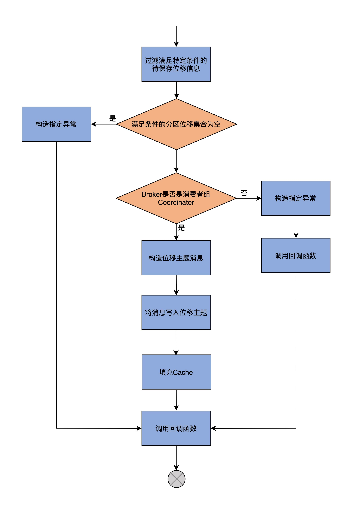
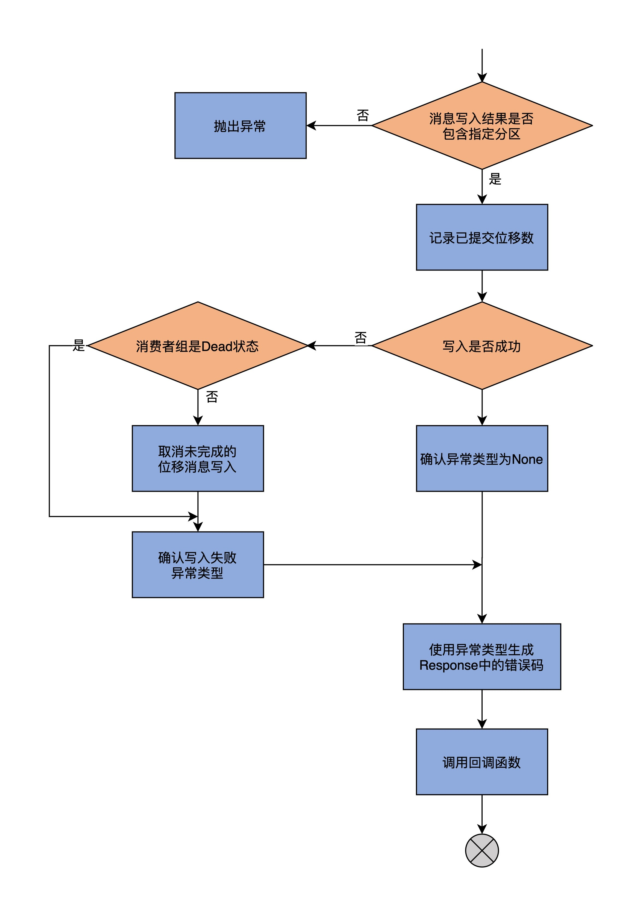
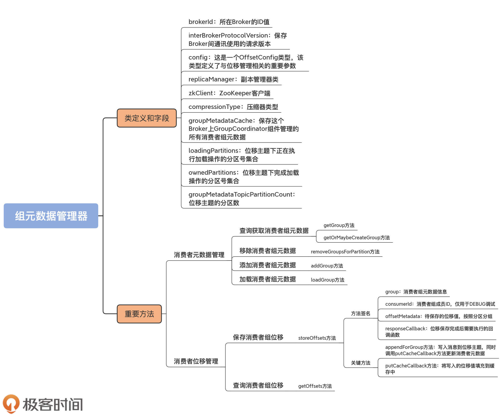

---
date: "2019-06-23"
---  
      
# 29 | GroupMetadataManager：组元数据管理器是个什么东西？
你好，我是胡夕。今天，我们学习GroupMetadataManager类的源码。从名字上来看，它是组元数据管理器，但是，从它提供的功能来看，我更愿意将它称作消费者组管理器，因为它定义的方法，提供的都是添加消费者组、移除组、查询组这样组级别的基础功能。

不过，这个类的知名度不像KafkaController、GroupCoordinator那么高，你之前可能都没有听说过它。但是，它其实是非常重要的消费者组管理类。

GroupMetadataManager类是在消费者组Coordinator组件被创建时被实例化的。这就是说，每个Broker在启动过程中，都会创建并维持一个GroupMetadataManager实例，以实现对该Broker负责的消费者组进行管理。更重要的是，生产环境输出日志中的与消费者组相关的大多数信息，都和它息息相关。

我举一个简单的例子。你应该见过这样的日志输出：

```
    Removed ××× expired offsets in ××× milliseconds.
    

```

这条日志每10分钟打印一次。你有没有想过，它为什么要这么操作呢？其实，这是由GroupMetadataManager类创建的定时任务引发的。如果你不清楚GroupMetadataManager的原理，虽然暂时不会影响你使用，但是，一旦你在实际环境中看到了有关消费者组的错误日志，仅凭日志输出，你是无法定位错误原因的。要解决这个问题，就只有一个办法：**通过阅读源码，彻底搞懂底层实现原理，做到以不变应万变**。

<!-- [[[read_end]]] -->

关于这个类，最重要的就是要掌握它是如何管理消费者组的，以及它对内部位移主题的操作方法。这两个都是重磅功能，我们必须要吃透它们的原理，这也是我们这三节课的学习重点。今天，我们先学习它的类定义和管理消费者组的方法。

# 类定义与字段

GroupMetadataManager类定义在coordinator.group包下的同名scala文件中。这个类的代码将近1000行，逐行分析的话，显然效率不高，也没有必要。所以，我从类定义和字段、重要方法两个维度给出主要逻辑的代码分析。下面的代码是该类的定义，以及我选取的重要字段信息。

```
    // brokerId：所在Broker的Id
    // interBrokerProtocolVersion：Broker端参数inter.broker.protocol.version值
    // config: 内部位移主题配置类
    // replicaManager: 副本管理器类
    // zkClient: ZooKeeper客户端
    class GroupMetadataManager(
      brokerId: Int, 
      interBrokerProtocolVersion: ApiVersion,
      config: OffsetConfig, 
      replicaManager: ReplicaManager, 
      zkClient: KafkaZkClient, 
      time: Time,
      metrics: Metrics) extends Logging with KafkaMetricsGroup {
      // 压缩器类型。向位移主题写入消息时执行压缩操作
      private val compressionType: CompressionType = CompressionType.forId(config.offsetsTopicCompressionCodec.codec)
      // 消费者组元数据容器，保存Broker管理的所有消费者组的数据
      private val groupMetadataCache = new Pool[String, GroupMetadata]
      // 位移主题下正在执行加载操作的分区
      private val loadingPartitions: mutable.Set[Int] = mutable.Set()
      // 位移主题下完成加载操作的分区
      private val ownedPartitions: mutable.Set[Int] = mutable.Set()
      // 位移主题总分区数
      private val groupMetadataTopicPartitionCount = getGroupMetadataTopicPartitionCount
      ......
    }
    

```

这个类的构造函数需要7个参数，后面的time和metrics只是起辅助作用，因此，我重点解释一下前5个参数的含义。

* brokerId：这个参数我们已经无比熟悉了。它是所在Broker的ID值，也就是broker.id参数值。
* interBrokerProtocolVersion：保存Broker间通讯使用的请求版本。它是Broker端参数inter.broker.protocol.version值。这个参数的主要用途是**确定位移主题消息格式的版本**。
* config：这是一个OffsetConfig类型。该类型定义了与位移管理相关的重要参数，比如位移主题日志段大小设置、位移主题备份因子、位移主题分区数配置等。
* replicaManager：副本管理器类。GroupMetadataManager类使用该字段实现获取分区对象、日志对象以及写入分区消息的目的。
* zkClient：ZooKeeper客户端。该类中的此字段只有一个目的：从ZooKeeper中获取位移主题的分区数。

除了构造函数所需的字段，该类还定义了其他关键字段，我给你介绍几个非常重要的。

**1.compressionType**

**压缩器类型**。Kafka向位移主题写入消息前，可以选择对消息执行压缩操作。是否压缩，取决于Broker端参数offsets.topic.compression.codec值，默认是不进行压缩。如果你的位移主题占用的磁盘空间比较多的话，可以考虑启用压缩，以节省资源。

**2.groupMetadataCache**

**该字段是GroupMetadataManager类上最重要的属性，它****保存这个Broker上GroupCoordinator组件管理的所有消费者组元数据。**它的Key是消费者组名称，Value是消费者组元数据，也就是GroupMetadata。源码通过该字段实现对消费者组的添加、删除和遍历操作。

**3.loadingPartitions**

**位移主题下正在执行加载操作的分区号集合**。这里需要注意两点：首先，这些分区都是位移主题分区，也就是\_\_consumer\_offsets主题下的分区；其次，所谓的加载，是指读取位移主题消息数据，填充GroupMetadataCache字段的操作。

**4.ownedPartitions**

**位移主题下完成加载操作的分区号集合**。与loadingPartitions类似的是，该字段保存的分区也是位移主题下的分区。和loadingPartitions不同的是，它保存的分区都是**已经完成加载操作**的分区。

**5.groupMetadataTopicPartitionCount**

**位移主题的分区数**。它是Broker端参数offsets.topic.num.partitions的值，默认是50个分区。若要修改分区数，除了变更该参数值之外，你也可以手动创建位移主题，并指定不同的分区数。

在这些字段中，groupMetadataCache是最重要的，GroupMetadataManager类大量使用该字段实现对消费者组的管理。接下来，我们就重点学习一下该类是如何管理消费者组的。

# 重要方法

管理消费者组包含两个方面，对消费者组元数据的管理以及对消费者组位移的管理。组元数据和组位移都是Coordinator端重要的消费者组管理对象。

## 消费者组元数据管理

消费者组元数据管理分为查询获取组信息、添加组、移除组和加载组信息。从代码复杂度来讲，查询获取、移除和添加的逻辑相对简单，加载的过程稍微费事些。我们先说说查询获取。

### 查询获取消费者组元数据

GroupMetadataManager类中查询及获取组数据的方法有很多。大多逻辑简单，你一看就能明白，比如下面的getGroup方法和getOrMaybeCreateGroup方法：

```
    // getGroup方法：返回给定消费者组的元数据信息。
    // 若该组信息不存在，返回None
    def getGroup(groupId: String): Option[GroupMetadata] = {
      Option(groupMetadataCache.get(groupId))
    }
    // getOrMaybeCreateGroup方法：返回给定消费者组的元数据信息。
    // 若不存在，则视createIfNotExist参数值决定是否需要添加该消费者组
    def getOrMaybeCreateGroup(groupId: String, createIfNotExist: Boolean): Option[GroupMetadata] = {
      if (createIfNotExist)
        // 若不存在且允许添加，则添加一个状态是Empty的消费者组元数据对象
        Option(groupMetadataCache.getAndMaybePut(groupId, new GroupMetadata(groupId, Empty, time)))
      else
        Option(groupMetadataCache.get(groupId))
    }
    

```

GroupMetadataManager类的上层组件GroupCoordinator会大量使用这两个方法来获取给定消费者组的数据。这两个方法都会返回给定消费者组的元数据信息，但是它们之间是有区别的。

对于getGroup方法而言，如果该组信息不存在，就返回None，而这通常表明，消费者组确实不存在，或者是，该组对应的Coordinator组件变更到其他Broker上了。

而对于getOrMaybeCreateGroup方法而言，若组信息不存在，就根据createIfNotExist参数值决定是否需要添加该消费者组。而且，getOrMaybeCreateGroup方法是在消费者组第一个成员加入组时被调用的，用于把组创建出来。

在GroupMetadataManager类中，还有一些地方也散落着组查询获取的逻辑。不过它们与这两个方法中的代码大同小异，很容易理解，课下你可以自己阅读下。

### 移除消费者组元数据

接下来，我们看下如何移除消费者组信息。当Broker卸任某些消费者组的Coordinator角色时，它需要将这些消费者组从groupMetadataCache中全部移除掉，这就是removeGroupsForPartition方法要做的事情。我们看下它的源码：

```
    def removeGroupsForPartition(offsetsPartition: Int,
                                 onGroupUnloaded: GroupMetadata => Unit): Unit = {
      // 位移主题分区
      val topicPartition = new TopicPartition(Topic.GROUP_METADATA_TOPIC_NAME, offsetsPartition)
      info(s"Scheduling unloading of offsets and group metadata from $topicPartition")
      // 创建异步任务，移除组信息和位移信息
      scheduler.schedule(topicPartition.toString, () => removeGroupsAndOffsets)
      // 内部方法，用于移除组信息和位移信息
      def removeGroupsAndOffsets(): Unit = {
        var numOffsetsRemoved = 0
        var numGroupsRemoved = 0
        inLock(partitionLock) {
          // 移除ownedPartitions中特定位移主题分区记录
          ownedPartitions.remove(offsetsPartition)
          // 遍历所有消费者组信息
          for (group <- groupMetadataCache.values) {
            // 如果该组信息保存在特定位移主题分区中
            if (partitionFor(group.groupId) == offsetsPartition) {
              // 执行组卸载逻辑
              onGroupUnloaded(group)
              // 关键步骤！将组信息从groupMetadataCache中移除
              groupMetadataCache.remove(group.groupId, group)
              // 把消费者组从producer对应的组集合中移除
              removeGroupFromAllProducers(group.groupId)
              // 更新已移除组计数器
              numGroupsRemoved += 1
              // 更新已移除位移值计数器
              numOffsetsRemoved += group.numOffsets
            }
          }
        }
        info(s"Finished unloading $topicPartition. Removed $numOffsetsRemoved cached offsets " +
          s"and $numGroupsRemoved cached groups.")
      }
    }
    

```

该方法的主要逻辑是，先定义一个内部方法removeGroupsAndOffsets，然后创建一个异步任务，调用该方法来执行移除消费者组信息和位移信息。

那么，怎么判断要移除哪些消费者组呢？这里的依据就是**传入的位移主题分区**。每个消费者组及其位移的数据，都只会保存在位移主题的一个分区下。一旦给定了位移主题分区，那么，元数据保存在这个位移主题分区下的消费者组就要被移除掉。removeGroupsForPartition方法传入的offsetsPartition参数，表示Leader发生变更的位移主题分区，因此，这些分区保存的消费者组都要从该Broker上移除掉。

具体的执行逻辑是什么呢？我来解释一下。

首先，异步任务从ownedPartitions中移除给定位移主题分区。

其次，遍历消费者组元数据缓存中的所有消费者组对象，如果消费者组正是在给定位移主题分区下保存的，就依次执行下面的步骤。

* 第1步，调用onGroupUnloaded方法执行组卸载逻辑。这个方法的逻辑是上层组件GroupCoordinator传过来的。它主要做两件事情：将消费者组状态变更到Dead状态；封装异常表示Coordinator已发生变更，然后调用回调函数返回。
* 第2步，把消费者组信息从groupMetadataCache中移除。这一步非常关键，目的是彻底清除掉该组的“痕迹”。
* 第3步，把消费者组从producer对应的组集合中移除。这里的producer，是给Kafka事务用的。
* 第4步，增加已移除组计数器。
* 第5步，更新已移除位移值计数器。

到这里，方法结束。

### 添加消费者组元数据

下面，我们学习添加消费者组的管理方法，即addGroup。它特别简单，仅仅是调用putIfNotExists将给定组添加进groupMetadataCache中而已。代码如下：

```
    def addGroup(group: GroupMetadata): GroupMetadata = {
      val currentGroup = groupMetadataCache.putIfNotExists(group.groupId, group)
      if (currentGroup != null) {
        currentGroup
      } else {
        group
      }
    }
    

```

### 加载消费者组元数据

现在轮到相对复杂的加载消费者组了。GroupMetadataManager类中定义了一个loadGroup方法执行对应的加载过程。

```
    private def loadGroup(
      group: GroupMetadata, offsets: Map[TopicPartition, CommitRecordMetadataAndOffset],
      pendingTransactionalOffsets: Map[Long, mutable.Map[TopicPartition, CommitRecordMetadataAndOffset]]): Unit = {
      trace(s"Initialized offsets $offsets for group ${group.groupId}")
      // 初始化消费者组的位移信息
      group.initializeOffsets(offsets, pendingTransactionalOffsets.toMap)
      // 调用addGroup方法添加消费者组
      val currentGroup = addGroup(group)
      if (group != currentGroup)
        debug(s"Attempt to load group ${group.groupId} from log with generation ${group.generationId} failed " +
          s"because there is already a cached group with generation ${currentGroup.generationId}")
    }
    

```

该方法的逻辑有两步。

第1步，通过initializeOffsets方法，将位移值添加到offsets字段标识的消费者组提交位移元数据中，实现加载消费者组订阅分区提交位移的目的。

第2步，调用addGroup方法，将该消费者组元数据对象添加进消费者组元数据缓存，实现加载消费者组元数据的目的。

## 消费者组位移管理

除了消费者组的管理，GroupMetadataManager类的另一大类功能，是提供消费者组位移的管理，主要包括位移数据的保存和查询。我们总说，位移主题是保存消费者组位移信息的地方。实际上，**当消费者组程序在查询位移时，Kafka总是从内存中的位移缓存数据查询，而不会直接读取底层的位移主题数据。**

### 保存消费者组位移

storeOffsets方法负责保存消费者组位移。该方法的代码很长，我先画一张图来展示下它的完整流程，帮助你建立起对这个方法的整体认知。接下来，我们再从它的方法签名和具体代码两个维度，来具体了解一下它的执行逻辑。



我先给你解释一下保存消费者组位移的全部流程。

**首先**，storeOffsets方法要过滤出满足特定条件的待保存位移信息。是否满足特定条件，要看validateOffsetMetadataLength方法的返回值。这里的特定条件，是指位移提交记录中的自定义数据大小，要小于Broker端参数offset.metadata.max.bytes的值，默认值是4KB。

如果没有一个分区满足条件，就构造OFFSET\_METADATA\_TOO\_LARGE异常，并调用回调函数。这里的回调函数执行发送位移提交Response的动作。

倘若有分区满足了条件，**接下来**，方法会判断当前Broker是不是该消费者组的Coordinator，如果不是的话，就构造NOT\_COORDINATOR异常，并提交给回调函数；如果是的话，就构造位移主题消息，并将消息写入进位移主题下。

**然后**，调用一个名为putCacheCallback的内置方法，填充groupMetadataCache中各个消费者组元数据中的位移值，**最后**，调用回调函数返回。

接下来，我们结合代码来查看下storeOffsets方法的实现逻辑。

首先我们看下它的方法签名。既然是保存消费者组提交位移的，那么，我们就要知道上层调用方都给这个方法传入了哪些参数。

```
    // group：消费者组元数据
    // consumerId：消费者组成员ID
    // offsetMetadata：待保存的位移值，按照分区分组
    // responseCallback：处理完成后的回调函数
    // producerId：事务型Producer ID
    // producerEpoch：事务型Producer Epoch值
    def storeOffsets(
      group: GroupMetadata,
      consumerId: String,
      offsetMetadata: immutable.Map[TopicPartition, OffsetAndMetadata],
      responseCallback: immutable.Map[TopicPartition, Errors] => Unit,
      producerId: Long = RecordBatch.NO_PRODUCER_ID,
      producerEpoch: Short = RecordBatch.NO_PRODUCER_EPOCH): Unit = {
      ......
    }
    
    

```

这个方法接收6个参数，它们的含义我都用注释的方式标注出来了。producerId和producerEpoch这两个参数是与Kafka事务相关的，你简单了解下就行。我们要重点掌握前面4个参数的含义。

* group：消费者组元数据信息。该字段的类型就是我们之前学到的GroupMetadata类。
* consumerId：消费者组成员ID，仅用于DEBUG调试。
* offsetMetadata：待保存的位移值，按照分区分组。
* responseCallback：位移保存完成后需要执行的回调函数。

接下来，我们看下storeOffsets的代码。为了便于你理解，我删除了与Kafka事务操作相关的部分。

```
    // 过滤出满足特定条件的待保存位移数据
    val filteredOffsetMetadata = offsetMetadata.filter { case (_, offsetAndMetadata) =>
      validateOffsetMetadataLength(offsetAndMetadata.metadata)
    }
    ......
    val isTxnOffsetCommit = producerId != RecordBatch.NO_PRODUCER_ID
    // 如果没有任何分区的待保存位移满足特定条件
    if (filteredOffsetMetadata.isEmpty) {
      // 构造OFFSET_METADATA_TOO_LARGE异常并调用responseCallback返回
      val commitStatus = offsetMetadata.map { case (k, _) => k -> Errors.OFFSET_METADATA_TOO_LARGE }
      responseCallback(commitStatus)
      None
    } else {
      // 查看当前Broker是否为给定消费者组的Coordinator
      getMagic(partitionFor(group.groupId)) match {
        // 如果是Coordinator
        case Some(magicValue) =>
          val timestampType = TimestampType.CREATE_TIME
          val timestamp = time.milliseconds()
          // 构造位移主题的位移提交消息
          val records = filteredOffsetMetadata.map { case (topicPartition, offsetAndMetadata) =>
            val key = GroupMetadataManager.offsetCommitKey(group.groupId, topicPartition)
            val value = GroupMetadataManager.offsetCommitValue(offsetAndMetadata, interBrokerProtocolVersion)
            new SimpleRecord(timestamp, key, value)
          }
          val offsetTopicPartition = new TopicPartition(Topic.GROUP_METADATA_TOPIC_NAME, partitionFor(group.groupId))
          // 为写入消息创建内存Buffer
          val buffer = ByteBuffer.allocate(AbstractRecords.estimateSizeInBytes(magicValue, compressionType, records.asJava))
          if (isTxnOffsetCommit && magicValue < RecordBatch.MAGIC_VALUE_V2)
            throw Errors.UNSUPPORTED_FOR_MESSAGE_FORMAT.exception("Attempting to make a transaction offset commit with an invalid magic: " + magicValue)
          val builder = MemoryRecords.builder(buffer, magicValue, compressionType, timestampType, 0L, time.milliseconds(),
            producerId, producerEpoch, 0, isTxnOffsetCommit, RecordBatch.NO_PARTITION_LEADER_EPOCH)
          records.foreach(builder.append)
          val entries = Map(offsetTopicPartition -> builder.build())
          // putCacheCallback函数定义......
          if (isTxnOffsetCommit) {
            ......
          } else {
            group.inLock {
              group.prepareOffsetCommit(offsetMetadata)
            }
          }
          // 写入消息到位移主题，同时调用putCacheCallback方法更新消费者元数据
          appendForGroup(group, entries, putCacheCallback)
        // 如果是Coordinator
        case None =>
          // 构造NOT_COORDINATOR异常并提交给responseCallback方法
          val commitStatus = offsetMetadata.map {
            case (topicPartition, _) =>
              (topicPartition, Errors.NOT_COORDINATOR)
          }
          responseCallback(commitStatus)
          None
      }
    }
    

```

我为方法的关键步骤都标注了注释，具体流程前面我也介绍过了，应该很容易理解。不过，这里还需要注意两点，也就是appendForGroup和putCacheCallback方法。前者是向位移主题写入消息；后者是填充元数据缓存的。我们结合代码来学习下。

appendForGroup方法负责写入消息到位移主题，同时传入putCacheCallback方法，更新消费者元数据。以下是它的代码：

```
    private def appendForGroup(
      group: GroupMetadata,
      records: Map[TopicPartition, MemoryRecords],
      callback: Map[TopicPartition, PartitionResponse] => Unit): Unit = {
      replicaManager.appendRecords(
        timeout = config.offsetCommitTimeoutMs.toLong,
        requiredAcks = config.offsetCommitRequiredAcks,
        internalTopicsAllowed = true,
        origin = AppendOrigin.Coordinator,
        entriesPerPartition = records,
        delayedProduceLock = Some(group.lock),
        responseCallback = callback)
    }
    

```

可以看到，该方法就是调用ReplicaManager的appendRecords方法，将消息写入到位移主题中。

下面，我们再关注一下putCacheCallback方法的实现，也就是将写入的位移值填充到缓存中。我先画一张图来展示下putCacheCallback的逻辑。



现在，我们结合代码，学习下它的逻辑实现。

```
    def putCacheCallback(responseStatus: Map[TopicPartition, PartitionResponse]): Unit = {
      // 确保消息写入到指定位移主题分区，否则抛出异常
      if (responseStatus.size != 1 || !responseStatus.contains(offsetTopicPartition))
        throw new IllegalStateException("Append status %s should only have one partition %s"
          .format(responseStatus, offsetTopicPartition))
      // 更新已提交位移数指标
      offsetCommitsSensor.record(records.size)
      val status = responseStatus(offsetTopicPartition)
      val responseError = group.inLock {
        // 写入结果没有错误
        if (status.error == Errors.NONE) {
          // 如果不是Dead状态
          if (!group.is(Dead)) {
            filteredOffsetMetadata.foreach { case (topicPartition, offsetAndMetadata) =>
              if (isTxnOffsetCommit)
                ......
              else
                // 调用GroupMetadata的onOffsetCommitAppend方法填充元数据
                group.onOffsetCommitAppend(topicPartition, CommitRecordMetadataAndOffset(Some(status.baseOffset), offsetAndMetadata))
            }
          }
          Errors.NONE
        // 写入结果有错误
        } else {
          if (!group.is(Dead)) {
            ......
            filteredOffsetMetadata.foreach { case (topicPartition, offsetAndMetadata) =>
              if (isTxnOffsetCommit)
                group.failPendingTxnOffsetCommit(producerId, topicPartition)
              else
                // 取消未完成的位移消息写入
                group.failPendingOffsetWrite(topicPartition, offsetAndMetadata)
            }
          }
          ......
          // 确认异常类型
          status.error match {
            case Errors.UNKNOWN_TOPIC_OR_PARTITION
                 | Errors.NOT_ENOUGH_REPLICAS
                 | Errors.NOT_ENOUGH_REPLICAS_AFTER_APPEND =>
              Errors.COORDINATOR_NOT_AVAILABLE
    
            case Errors.NOT_LEADER_FOR_PARTITION
                 | Errors.KAFKA_STORAGE_ERROR =>
              Errors.NOT_COORDINATOR
    
            case Errors.MESSAGE_TOO_LARGE
                 | Errors.RECORD_LIST_TOO_LARGE
                 | Errors.INVALID_FETCH_SIZE =>
              Errors.INVALID_COMMIT_OFFSET_SIZE
            case other => other
          }
        }
      }
      // 利用异常类型构建提交返回状态
      val commitStatus = offsetMetadata.map { case (topicPartition, offsetAndMetadata) =>
        if (validateOffsetMetadataLength(offsetAndMetadata.metadata))
          (topicPartition, responseError)
        else
          (topicPartition, Errors.OFFSET_METADATA_TOO_LARGE)
      }
      // 调用回调函数
      responseCallback(commitStatus)
    }
    

```

putCacheCallback方法的主要目的，是将多个消费者组位移值填充到GroupMetadata的offsets元数据缓存中。

**首先**，该方法要确保位移消息写入到指定位移主题分区，否则就抛出异常。

**之后**，更新已提交位移数指标，然后判断写入结果是否有错误。

如果没有错误，只要组状态不是Dead状态，就调用GroupMetadata的onOffsetCommitAppend方法填充元数据。onOffsetCommitAppend方法的主体逻辑，是将消费者组订阅分区的位移值写入到offsets字段保存的集合中。当然，如果状态是Dead，则什么都不做。

如果刚才的写入结果有错误，那么，就通过failPendingOffsetWrite方法取消未完成的位移消息写入。

**接下来**，代码要将日志写入的异常类型转换成表征提交状态错误的异常类型。具体来说，就是将UNKNOWN\_TOPIC\_OR\_PARTITION、NOT\_LEADER\_FOR\_PARTITION和MESSAGE\_TOO\_LARGE这样的异常，转换到COORDINATOR\_NOT\_AVAILABLE和NOT\_COORDINATOR这样的异常。之后，再将这些转换后的异常封装进commitStatus字段中传给回调函数。

**最后**，调用回调函数返回。至此，方法结束。

好了，保存消费者组位移信息的storeOffsets方法，我们就学完了，它的关键逻辑，是构造位移主题消息并写入到位移主题，然后将位移值填充到消费者组元数据中。

### 查询消费者组位移

现在，我再说说查询消费者组位移，也就是getOffsets方法的代码实现。比起storeOffsets，这个方法要更容易理解。我们看下它的源码：

```
    def getOffsets(
      groupId: String, 
      requireStable: Boolean, 
      topicPartitionsOpt: Option[Seq[TopicPartition]]): Map[TopicPartition, PartitionData] = {
      ......
      // 从groupMetadataCache字段中获取指定消费者组的元数据
      val group = groupMetadataCache.get(groupId)
      // 如果没有组数据，返回空数据
      if (group == null) {
        topicPartitionsOpt.getOrElse(Seq.empty[TopicPartition]).map { topicPartition =>
          val partitionData = new PartitionData(OffsetFetchResponse.INVALID_OFFSET,
            Optional.empty(), "", Errors.NONE)
          topicPartition -> partitionData
        }.toMap
      // 如果存在组数据
      } else {
        group.inLock {
          // 如果组处于Dead状态，则返回空数据
          if (group.is(Dead)) {
            topicPartitionsOpt.getOrElse(Seq.empty[TopicPartition]).map { topicPartition =>
              val partitionData = new PartitionData(OffsetFetchResponse.INVALID_OFFSET,
                Optional.empty(), "", Errors.NONE)
              topicPartition -> partitionData
            }.toMap
          } else {
            val topicPartitions = topicPartitionsOpt.getOrElse(group.allOffsets.keySet)
            topicPartitions.map { topicPartition =>
              if (requireStable && group.hasPendingOffsetCommitsForTopicPartition(topicPartition)) {
                topicPartition -> new PartitionData(OffsetFetchResponse.INVALID_OFFSET,
                  Optional.empty(), "", Errors.UNSTABLE_OFFSET_COMMIT)
              } else {
                val partitionData = group.offset(topicPartition) match {
                  // 如果没有该分区位移数据，返回空数据
                  case None =>
                    new PartitionData(OffsetFetchResponse.INVALID_OFFSET,
                      Optional.empty(), "", Errors.NONE)
                  // 从消费者组元数据中返回指定分区的位移数据
                  case Some(offsetAndMetadata) =>
                    new PartitionData(offsetAndMetadata.offset,
                      offsetAndMetadata.leaderEpoch, offsetAndMetadata.metadata, Errors.NONE)
                }
                topicPartition -> partitionData
              }
            }.toMap
          }
        }
      }
    }
    

```

getOffsets方法首先会读取groupMetadataCache中的组元数据，如果不存在对应的记录，则返回空数据集，如果存在，就接着判断组是否处于Dead状态。

如果是Dead状态，就说明消费者组已经被销毁了，位移数据也被视为不可用了，依然返回空数据集；若状态不是Dead，就提取出消费者组订阅的分区信息，再依次为它们获取对应的位移数据并返回。至此，方法结束。

# 总结

今天，我们学习了GroupMetadataManager类的源码。作为消费者组管理器，它负责管理消费者组的方方面面。其中，非常重要的两个管理功能是消费者组元数据管理和消费者组位移管理，分别包括查询获取、移除、添加和加载消费者组元数据，以及保存和查询消费者组位移，这些方法是上层组件GroupCoordinator倚重的重量级功能载体，你一定要彻底掌握它们。

我画了一张思维导图，帮助你复习一下今天的重点内容。



实际上，GroupMetadataManager类的地位举足轻重。虽然它在Coordinator组件中不显山不露水，但却是一些线上问题的根源所在。

我再跟你分享一个小案例。

之前，我碰到过一个问题：在消费者组成员超多的情况下，无法完成位移加载，这导致Consumer端总是接收到Marking the coordinator dead的错误。

当时，我查遍各种资料，都无法定位问题，最终，还是通过阅读源码，发现是这个类的doLoadGroupsAndOffsets方法中创建的buffer过小导致的。后来，通过调大offsets.load.buffer.size参数值，我们顺利地解决了问题。

试想一下，如果当时没有阅读这部分的源码，仅凭日志，我们肯定无法解决这个问题。因此，我们花三节课的时间，专门阅读GroupMetadataManager类源码，是非常值得的。下节课，我将带你继续研读GroupMetadataManager源码，去探寻有关位移主题的那些代码片段。

# 课后讨论

请思考这样一个问题：在什么场景下，需要移除GroupMetadataManager中保存的消费者组记录？

欢迎在留言区写下你的思考和答案，跟我交流讨论，也欢迎你把今天的内容分享给你的朋友。