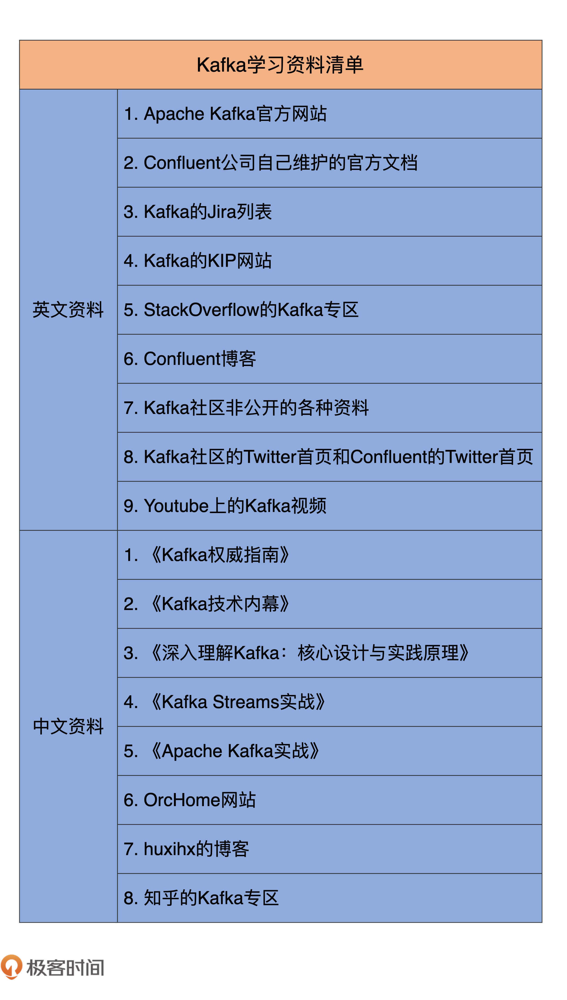

---
date: "2019-06-23"
---  
      
# 特别放送（一）| 经典的Kafka学习资料有哪些？
你好，我是胡夕。我们的课程已经更新一段时间了，你每节课都按时学了吗？如果你一直跟着学习的话，相信你一定会有很多收获的。

当然了，我也知道，在学习源码的过程中，除了有进步的快乐，可能还会有一些痛苦，毕竟，源码并不是那么容易就可以掌握的。

如果你在学习的过程中遇到任何问题，都可以给我留言，我会尽快回复你，帮助你解决问题。如果你发现自己被一些不好的情绪包围了，除了要努力坚持以外，我建议你学着从这种情绪中暂时跳脱出来，让自己转换到一些轻松的话题上。今天，我要讲的特别放送的内容就非常让人放松，因为我会给你分享一些Kafka的学习资料。

实际上，在更新的这段时间里，经常有同学问我：“老师，我想更多地了解下Kafka，你能给我推荐一些相关的学习资料吗？”今天，我就借着这个特别放送的环节，专门为你搜罗了各种Kafka学习资料，包括书籍、视频、博客等一切影音像资料，我还把它们做成了清单，一起分享给你。

这些资料的深浅程度不一样，有的偏重于基础理论，有的深入底层架构，有的侧重于实际案例，有的是分享最佳实践。

如果你期望得到实际使用上的指导，那么可以重点关注下我提到的社区维护的文档以及各类Kafka实战书籍。如果你对Kafka源码的学习兴趣更加浓厚，那么，这节课里的各类大神级的博客以及视频资料是你需要重点关注的。因为他们经常会直接给出源码级的分析，学习这类资料既能开拓我们的思路与视野，也能加深我们对源码知识的理解，可以说是具有多重好处。

<!-- [[[read_end]]] -->

总之，我建议你基于自身的学习目标与兴趣，有针对性地利用这些资料。

我把这份清单大体分为英文资料和中文资料两大部分，我先给出收集到的所有英文资料清单。

## 英文资料

1.[Apache Kafka官方网站](https://kafka.apache.org/documentation/)

我不知道你有没有认真地读过官网上面的文字，这里面的所有内容都是出自Kafka Committer之手，文字言简意赅，而且内容翔实丰富。我推荐你重点研读一下其中的**Configuration篇**、**Operations篇**以及**Security篇**，特别是Configuration中的参数部分。熟练掌握这些关键的参数配置，是进阶学习Kafka的必要条件。

2.Confluent公司自己维护的[官方文档](http://docs.confluent.io/current/)

Confluent公司是Kafka初创团队创建的商业化公司，主要是为了提供基于Kafka的商业化解决方案。我们经常把他们提供的产品称为Confluent Kafka。就我个人的感觉而言，这个公司的官网质量要比社区版（即Apache Kafka官网）上乘，特别是关于Security和Kafka Streams两部分的介绍，明显高出社区版一筹。因此，我推荐你重点学习Confluent官网上关于[Security配置](https://docs.confluent.io/current/security/index.html)和[Kafka Streams组件](https://docs.confluent.io/current/streams/index.html)的文档。

3.Kafka的[Jira列表](<https://issues.apache.org/jira/issues/?filter=-4&jql=project = KAFKA ORDER BY created DESC>)，也就是我们俗称的Bug列表

你可以在这个页面上搜索自己在实际环境中碰到的Kafka异常名称，然后结合自己的Kafka版本来看，这样的话，你通常能判断出该异常是不是由已知Bug造成的，从而避免浪费更多的时间去定位问题原因。另外，你还可以通过认领Jira的方式来为社区贡献代码。后面我会单独再用一节课的时间，给你具体介绍一下为社区贡献代码的完整流程。

4.Kafka的[KIP网站](https://cwiki.apache.org/confluence/display/KAFKA/Kafka+Improvement+Proposals)

KIP的完整名称是Kafka Improvement Proposals，即Kafka的新功能提案。在这里你能够了解到Kafka社区关于新功能的所有提案与相关讨论。有意思的是，有些KIP的讨论要比KIP本身精彩得多。针对各种新功能，全球开发者在这里审思明辨，彼此讨论，有时协同互利，有时针锋相对，实在是酣畅淋漓。KIP的另一大魅力则在于它非常民主——**任何人都能申请新功能提案，将自己的想法付诸实践**。

5.StackOverflow的[Kafka专区](https://stackoverflow.com/questions/tagged/apache-kafka?sort=newest&pageSize=15)

大名鼎鼎的StackOverflow网站我就不过多介绍了。这上面的Kafka问题五花八门，而且难度参差不齐，不过你通常都能找到你想要的答案。同时，如果你对Kafka非常了解，不妨尝试回答一些问题，不仅能赚取一些积分，还能和全球的使用者一起交流，实在是一举两得。

6.[Confluent博客](https://www.confluent.io/blog/)

这里面的文章含金量特别高，你一定要仔细研读下。举个简单的例子，我已经被太多人问过这样的问题了：“一个Kafka集群到底能支撑多少分区？”其实我们都知道这种问题是没有标准答案的，你需要了解的是原理！碰巧，Confluent博客上就有一篇这样的原理性解释[文章](https://www.confluent.jp/blog/apache-kafka-supports-200k-partitions-per-cluster/)，是Kafka创始人饶军写的，你不妨看一看。

7.Kafka社区非公开的各种资料，这包括社区维护的[Confluence文档](https://cwiki.apache.org/confluence/display/KAFKA/Index)和Google Docs

你几乎能在Confluence Space中找到所有的Kafka设计文档，其中关于Controller和新版Clients设计的文章非常值得一读；而Google Docs主要是两篇：一篇是Kafka事务的[详细设计文档](https://docs.google.com/document/d/11Jqy_GjUGtdXJK94XGsEIK7CP1SnQGdp2eF0wSw9ra8/edit)，另一篇是[Controller重设计文档](https://docs.google.com/document/d/1rLDmzDOGQQeSiMANP0rC2RYp_L7nUGHzFD9MQISgXYM/edit)。这两篇是我目前所见过的最详细的Kafka设计文档。国内的很多Kafka书籍和博客多是援引这两篇文章，甚至是直接翻译的，足见它们的价值非凡。

8.Kafka社区的[Twitter首页](https://twitter.com/apachekafka)和Confluent的[Twitter首页](https://twitter.com/confluentinc)

你可能会说，Twitter算哪门子学习资料啊？但实际上，很多时候，你就是能够在这上面搜罗到有价值的Kafka文章，特别是Confluent的Twitter，它会定期推送关于Kafka最佳实践方面的内容。每次看到这类文章， 我都有一种意外淘到宝藏的感觉。我给你举个例子，Kafka Twitter在2019年10月12日转载了一篇名为[_Exploit Apache Kafka’s Message Format to Save Storage and Bandwidth_](https://medium.com/swlh/exploit-apache-kafkas-message-format-to-save-storage-and-bandwidth-7e0c533edf26) 的文章，这里面的内容水准很高，读起来非常过瘾，我建议你好好读一读。

9.YouTube上的[Kafka视频](https://www.youtube.com/results?search_query=apache+kafka&sp=EgIIAw%253D%253D)

这些视频内容主要包括Kafka原理的讲解、业界牛人分享等。有的时候，你会发现，我们对文字类资料的掌握程度远不如看视频来得深入。如果你的英语基础还不错的话，我推荐你重点关注下YouTube上的这些分享视频。

好了，上面这九个资料就是我总结的Kafka英文学习资料。总体上看，这些资料都不要求太高的英文基础。即使是像YouTube上的英文视频，也是支持实时翻译的，你不用担心出现无法理解内容的情况。

接下来，我来给出中文资料清单。

## 中文资料

首先，我给出我认为比较好的五本Apache Kafka书籍。

1.[《Kafka权威指南》](https://book.douban.com/subject/27665114/)

这本书是“Kafka Definitive Guide”的中译本。实际上，这本书的中英两个版本我都看过，应该说中文版翻译得很棒，你直接看中译本就行了。这本书虽然很薄，但它包含的内容几乎囊括了Kafka的方方面面，而且这本书由Committer执笔，质量上无可挑剔。

2.[《Kafka技术内幕》](https://book.douban.com/subject/27179953/)

这本书出版后一跃成为市面上能见到的Kafka最好书籍。这本书当得起“技术内幕”这四个字，里面很多Kafka原理的讲解清晰而深入，我自己读起来觉得收获很大。

3.[《深入理解Kafka：核心设计与实践原理》](https://book.douban.com/subject/30437872/)

我与这本书的作者相识，他同时精通Kafka和RabbitMQ，可以说是消息中间件领域内的大家。这本书成书于2019年，是目前市面上最新的一本Kafka书籍。我推荐你买来读一下。

4.[《Kafka Streams实战》](https://book.douban.com/subject/33425155/)

这本书是“Kafka Streams in action”的中译本，由Kafka Committer撰写而成。该书是我见到的**最深入讲解Kafka Streams的书籍**。如果你想学习基于Kafka Streams的实时流处理，那么这本书是不能不看的。

5.[《Apache Kafka实战》](https://book.douban.com/subject/30221096/)

我这本书是2018年出版的，和之前那些面向Kafka设计原理的国内佳作不同的是，该书以讨论Kafka实际应用为主。我在里面分享了我这几年参与Kafka社区以及在使用Kafka的过程中积累的各种“江湖杂技”。如果你以使用为主，那么我推荐你看下这本书。

书籍的推荐告一段落，下面，我再介绍三个网站给你。

第一个是OrcHome。据我所知，OrcHome是国人自己维护的一个Kafka教程网站。这个网站最具特色的是它有个[Kafka问答区](https://www.orchome.com/kafka/issues)，你可以在这上面提问，会有人专门负责解答你提出的问题。

第二个是我本人的[博客](https://www.cnblogs.com/huxi2b/)。这个博客里大多是关于Kafka或者是其他大数据技术的原创文章。另外，我也会定期分享转载一些国内外的优秀博客。

第三个是知乎的[Kafka专区](https://www.zhihu.com/topic/20012159/newest)。和StackOverflow不同的是，这个专区上的问题多以理论探讨为主。通常大家对于这类问题的解答还是很踊跃的，我也经常在这里回复问题。如果你对Kafka的某些原理想要做深入的了解，不妨在知乎的这个专区上提出你的问题，我相信很快就会有人回复的。

## 总结

好了，上面的这些内容就是我总结的Kafka学习资料清单，希望它们对你是有帮助的。我把它们整理在了一张表格里，你可以重点看下。

另外，我强烈建议你把社区官网和Confluent官网文档仔仔细细地读几遍，我保证你一定会有很大的收获，毕竟，相比于清单上的其他项，官网文档是最最权威的第一手资料。

## 课后讨论

最后，我也请你分享一下你自己的Kafka学习书单、网站、影音像资料以及好的学习方法。

欢迎你在留言区畅所欲言，跟我交流讨论，也欢迎你把今天的内容分享给你的朋友。