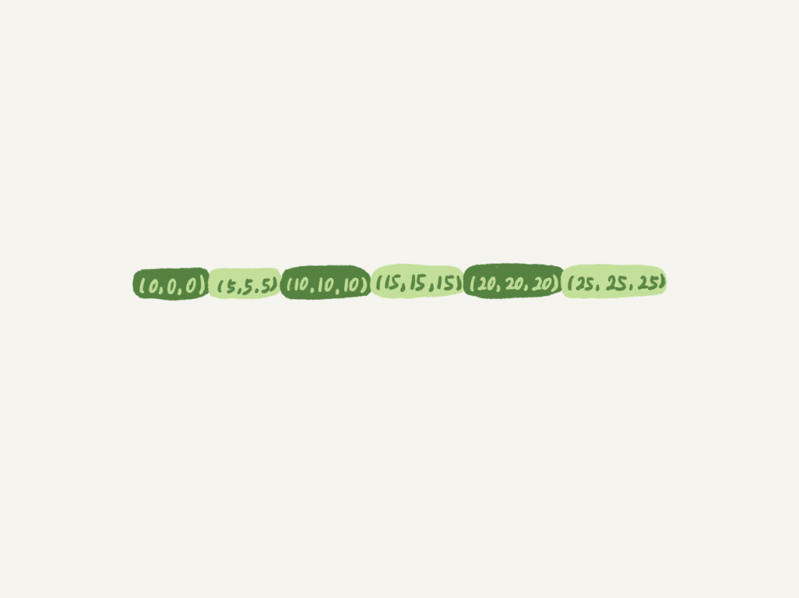
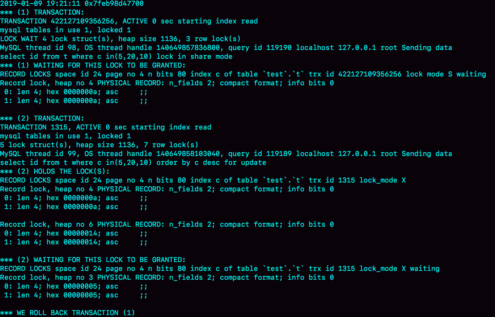
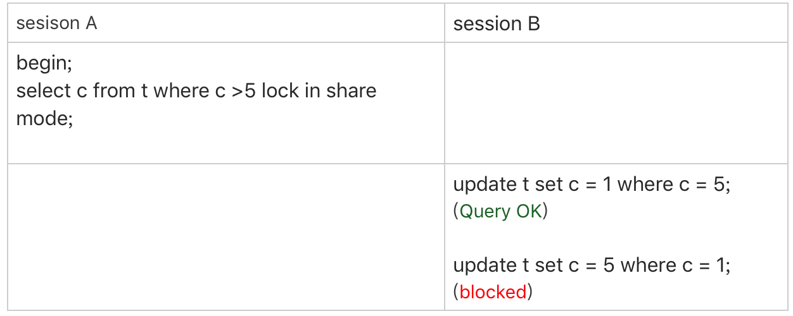

---
date: "2019-06-23"
---  
      
# 30 | 答疑文章（二）：用动态的观点看加锁
在第[20](https://time.geekbang.org/column/article/75173)和[21](https://time.geekbang.org/column/article/75659)篇文章中，我和你介绍了InnoDB的间隙锁、next-key lock，以及加锁规则。在这两篇文章的评论区，出现了很多高质量的留言。我觉得通过分析这些问题，可以帮助你加深对加锁规则的理解。

所以，我就从中挑选了几个有代表性的问题，构成了今天这篇答疑文章的主题，即：用动态的观点看加锁。

**为了方便你理解，我们再一起复习一下加锁规则。这个规则中，包含了两个“原则”、两个“优化”和一个“bug”：**

* 原则1：加锁的基本单位是next-key lock。希望你还记得，next-key lock是前开后闭区间。
* 原则2：查找过程中访问到的对象才会加锁。
* 优化1：索引上的等值查询，给唯一索引加锁的时候，next-key lock退化为行锁。
* 优化2：索引上的等值查询，向右遍历时且最后一个值不满足等值条件的时候，next-key lock退化为间隙锁。
* 一个bug：唯一索引上的范围查询会访问到不满足条件的第一个值为止。

接下来，我们的讨论还是基于下面这个表t：

```
    CREATE TABLE `t` (
      `id` int(11) NOT NULL,
      `c` int(11) DEFAULT NULL,
      `d` int(11) DEFAULT NULL,
      PRIMARY KEY (`id`),
      KEY `c` (`c`)
    ) ENGINE=InnoDB;
    
    insert into t values(0,0,0),(5,5,5),
    (10,10,10),(15,15,15),(20,20,20),(25,25,25);
    

```

# 不等号条件里的等值查询

有同学对“等值查询”提出了疑问：等值查询和“遍历”有什么区别？为什么我们文章的例子里面，where条件是不等号，这个过程里也有等值查询？

<!-- [[[read_end]]] -->

我们一起来看下这个例子，分析一下这条查询语句的加锁范围：

```
    begin;
    select * from t where id>9 and id<12 order by id desc for update;
    

```

利用上面的加锁规则，我们知道这个语句的加锁范围是主键索引上的 \(0,5\]、\(5,10\]和\(10, 15\)。也就是说，id=15这一行，并没有被加上行锁。为什么呢？

我们说加锁单位是next-key lock，都是前开后闭区间，但是这里用到了优化2，即索引上的等值查询，向右遍历的时候id=15不满足条件，所以next-key lock退化为了间隙锁 \(10, 15\)。

但是，我们的查询语句中where条件是大于号和小于号，这里的“等值查询”又是从哪里来的呢？

要知道，加锁动作是发生在语句执行过程中的，所以你在分析加锁行为的时候，要从索引上的数据结构开始。这里，我再把这个过程拆解一下。

如图1所示，是这个表的索引id的示意图。



图1 索引id示意图

1.  首先这个查询语句的语义是order by id desc，要拿到满足条件的所有行，优化器必须先找到“第一个id\<12的值”。

2.  这个过程是通过索引树的搜索过程得到的，在引擎内部，其实是要找到id=12的这个值，只是最终没找到，但找到了\(10,15\)这个间隙。

3.  然后向左遍历，在遍历过程中，就不是等值查询了，会扫描到id=5这一行，所以会加一个next-key lock \(0,5\]。

也就是说，在执行过程中，通过树搜索的方式定位记录的时候，用的是“等值查询”的方法。

# 等值查询的过程

与上面这个例子对应的，是\@发条橙子同学提出的问题：下面这个语句的加锁范围是什么？

```
    begin;
    select id from t where c in(5,20,10) lock in share mode;
    

```

这条查询语句里用的是in，我们先来看这条语句的explain结果。  


图2 in语句的explain结果

可以看到，这条in语句使用了索引c并且rows=3，说明这三个值都是通过B+树搜索定位的。

在查找c=5的时候，先锁住了\(0,5\]。但是因为c不是唯一索引，为了确认还有没有别的记录c=5，就要向右遍历，找到c=10才确认没有了，这个过程满足优化2，所以加了间隙锁\(5,10\)。

同样的，执行c=10这个逻辑的时候，加锁的范围是\(5,10\] 和 \(10,15\)；执行c=20这个逻辑的时候，加锁的范围是\(15,20\] 和 \(20,25\)。

通过这个分析，我们可以知道，这条语句在索引c上加的三个记录锁的顺序是：先加c=5的记录锁，再加c=10的记录锁，最后加c=20的记录锁。

你可能会说，这个加锁范围，不就是从\(5,25\)中去掉c=15的行锁吗？为什么这么麻烦地分段说呢？

因为我要跟你强调这个过程：这些锁是“在执行过程中一个一个加的”，而不是一次性加上去的。

理解了这个加锁过程之后，我们就可以来分析下面例子中的死锁问题了。

如果同时有另外一个语句，是这么写的：

```
    select id from t where c in(5,20,10) order by c desc for update;
    

```

此时的加锁范围，又是什么呢？

我们现在都知道间隙锁是不互锁的，但是这两条语句都会在索引c上的c=5、10、20这三行记录上加记录锁。

这里你需要注意一下，由于语句里面是order by c desc， 这三个记录锁的加锁顺序，是先锁c=20，然后c=10，最后是c=5。

也就是说，这两条语句要加锁相同的资源，但是加锁顺序相反。当这两条语句并发执行的时候，就可能出现死锁。

关于死锁的信息，MySQL只保留了最后一个死锁的现场，但这个现场还是不完备的。

有同学在评论区留言到，希望我能展开一下怎么看死锁。现在，我就来简单分析一下上面这个例子的死锁现场。

# 怎么看死锁？

图3是在出现死锁后，执行show engine innodb status命令得到的部分输出。这个命令会输出很多信息，有一节LATESTDETECTED DEADLOCK，就是记录的最后一次死锁信息。  


图3 死锁现场

我们来看看这图中的几个关键信息。

1.  这个结果分成三部分：

    * \(1\) TRANSACTION，是第一个事务的信息；
    * \(2\) TRANSACTION，是第二个事务的信息；
    * WE ROLL BACK TRANSACTION \(1\)，是最终的处理结果，表示回滚了第一个事务。

2.  第一个事务的信息中：

    * WAITING FOR THIS LOCK TO BE GRANTED，表示的是这个事务在等待的锁信息；
    * index c of table \`test\`.\`t\`，说明在等的是表t的索引c上面的锁；
    * lock mode S waiting 表示这个语句要自己加一个读锁，当前的状态是等待中；
    * Record lock说明这是一个记录锁；
    * n\_fields 2表示这个记录是两列，也就是字段c和主键字段id；
    * 0: len 4; hex 0000000a; asc ;;是第一个字段，也就是c。值是十六进制a，也就是10；
    * 1: len 4; hex 0000000a; asc ;;是第二个字段，也就是主键id，值也是10；
    * 这两行里面的asc表示的是，接下来要打印出值里面的“可打印字符”，但10不是可打印字符，因此就显示空格。
    * 第一个事务信息就只显示出了等锁的状态，在等待\(c=10,id=10\)这一行的锁。
    * 当然你是知道的，既然出现死锁了，就表示这个事务也占有别的锁，但是没有显示出来。别着急，我们从第二个事务的信息中推导出来。

3.  第二个事务显示的信息要多一些：

    * “ HOLDS THE LOCK\(S\)”用来显示这个事务持有哪些锁；
    * index c of table \`test\`.\`t\` 表示锁是在表t的索引c上；
    * hex 0000000a和hex 00000014表示这个事务持有c=10和c=20这两个记录锁；
    * WAITING FOR THIS LOCK TO BE GRANTED，表示在等\(c=5,id=5\)这个记录锁。

从上面这些信息中，我们就知道：

1.  “lock in share mode”的这条语句，持有c=5的记录锁，在等c=10的锁；

2.  “for update”这个语句，持有c=20和c=10的记录锁，在等c=5的记录锁。

因此导致了死锁。这里，我们可以得到两个结论：

1.  由于锁是一个个加的，要避免死锁，对同一组资源，要按照尽量相同的顺序访问；

2.  在发生死锁的时刻，for update 这条语句占有的资源更多，回滚成本更大，所以InnoDB选择了回滚成本更小的lock in share mode语句，来回滚。

# 怎么看锁等待？

看完死锁，我们再来看一个锁等待的例子。

在第21篇文章的评论区，\@Geek\_9ca34e 同学做了一个有趣验证，我把复现步骤列出来：


图4 delete导致间隙变化

可以看到，由于session A并没有锁住c=10这个记录，所以session B删除id=10这一行是可以的。但是之后，session B再想insert id=10这一行回去就不行了。

现在我们一起看一下此时show engine innodb status的结果，看看能不能给我们一些提示。锁信息是在这个命令输出结果的TRANSACTIONS这一节。你可以在文稿中看到这张图片  


图 5 锁等待信息

我们来看几个关键信息。

1.  index PRIMARY of table \`test\`.\`t\` ，表示这个语句被锁住是因为表t主键上的某个锁。

2.  lock\_mode X locks gap before rec insert intention waiting 这里有几个信息：

    * insert intention表示当前线程准备插入一个记录，这是一个插入意向锁。为了便于理解，你可以认为它就是这个插入动作本身。
    * gap before rec 表示这是一个间隙锁，而不是记录锁。

3.  那么这个gap是在哪个记录之前的呢？接下来的0\~4这5行的内容就是这个记录的信息。

4.  n\_fields 5也表示了，这一个记录有5列：

    * 0: len 4; hex 0000000f; asc ;;第一列是主键id字段，十六进制f就是id=15。所以，这时我们就知道了，这个间隙就是id=15之前的，因为id=10已经不存在了，它表示的就是\(5,15\)。
    * 1: len 6; hex 000000000513; asc ;;第二列是长度为6字节的事务id，表示最后修改这一行的是trx id为1299的事务。
    * 2: len 7; hex b0000001250134; asc \% 4;; 第三列长度为7字节的回滚段信息。可以看到，这里的acs后面有显示内容\(\%和4\)，这是因为刚好这个字节是可打印字符。
    * 后面两列是c和d的值，都是15。

因此，我们就知道了，由于delete操作把id=10这一行删掉了，原来的两个间隙\(5,10\)、\(10,15）变成了一个\(5,15\)。

说到这里，你可以联合起来再思考一下这两个现象之间的关联：

1.  session A执行完select语句后，什么都没做，但它加锁的范围突然“变大”了；

2.  第21篇文章的课后思考题，当我们执行select \* from t where c>=15 and c\<=20 order by c desc lock in share mode; 向左扫描到c=10的时候，要把\(5, 10\]锁起来。

也就是说，所谓“间隙”，其实根本就是由“这个间隙右边的那个记录”定义的。

# update的例子

看过了insert和delete的加锁例子，我们再来看一个update语句的案例。在留言区中\@信信 同学做了这个试验：



图 6 update 的例子

你可以自己分析一下，session A的加锁范围是索引c上的 \(5,10\]、\(10,15\]、\(15,20\]、\(20,25\]和\(25,supremum\]。

> 注意：根据c>5查到的第一个记录是c=10，因此不会加\(0,5\]这个next-key lock。

之后session B的第一个update语句，要把c=5改成c=1，你可以理解为两步：

1.  插入\(c=1, id=5\)这个记录；

2.  删除\(c=5, id=5\)这个记录。

按照我们上一节说的，索引c上\(5,10\)间隙是由这个间隙右边的记录，也就是c=10定义的。所以通过这个操作，session A的加锁范围变成了图7所示的样子：  


图 7 session B修改后， session A的加锁范围

好，接下来session B要执行 update t set c = 5 where c = 1这个语句了，一样地可以拆成两步：

1.  插入\(c=5, id=5\)这个记录；

2.  删除\(c=1, id=5\)这个记录。

第一步试图在已经加了间隙锁的\(1,10\)中插入数据，所以就被堵住了。

# 小结

今天这篇文章，我用前面[第20](https://time.geekbang.org/column/article/75173)和[第21篇](https://time.geekbang.org/column/article/75659)文章评论区的几个问题，再次跟你复习了加锁规则。并且，我和你重点说明了，分析加锁范围时，一定要配合语句执行逻辑来进行。

在我看来，每个想认真了解MySQL原理的同学，应该都要能够做到：通过explain的结果，就能够脑补出一个SQL语句的执行流程。达到这样的程度，才算是对索引组织表、索引、锁的概念有了比较清晰的认识。你同样也可以用这个方法，来验证自己对这些知识点的掌握程度。

在分析这些加锁规则的过程中，我也顺便跟你介绍了怎么看show engine innodb status输出结果中的事务信息和死锁信息，希望这些内容对你以后分析现场能有所帮助。

老规矩，即便是答疑文章，我也还是要留一个课后问题给你的。

上面我们提到一个很重要的点：所谓“间隙”，其实根本就是由“这个间隙右边的那个记录”定义的。

那么，一个空表有间隙吗？这个间隙是由谁定义的？你怎么验证这个结论呢？

你可以把你关于分析和验证方法写在留言区，我会在下一篇文章的末尾和你讨论这个问题。感谢你的收听，也欢迎你把这篇文章分享给更多的朋友一起阅读。

# 上期问题时间

我在上一篇文章最后留给的问题，是分享一下你关于业务监控的处理经验。

在这篇文章的评论区，很多同学都分享了不错的经验。这里，我就选择几个比较典型的留言，和你分享吧：

* \@老杨同志 回答得很详细。他的主要思路就是关于服务状态和服务质量的监控。其中，服务状态的监控，一般都可以用外部系统来实现；而服务的质量的监控，就要通过接口的响应时间来统计。
* \@Ryoma 同学，提到服务中使用了healthCheck来检测，其实跟我们文中提到的select 1的模式类似。
* \@强哥 同学，按照监控的对象，将监控分成了基础监控、服务监控和业务监控，并分享了每种监控需要关注的对象。

这些都是很好的经验，你也可以根据具体的业务场景借鉴适合自己的方案。