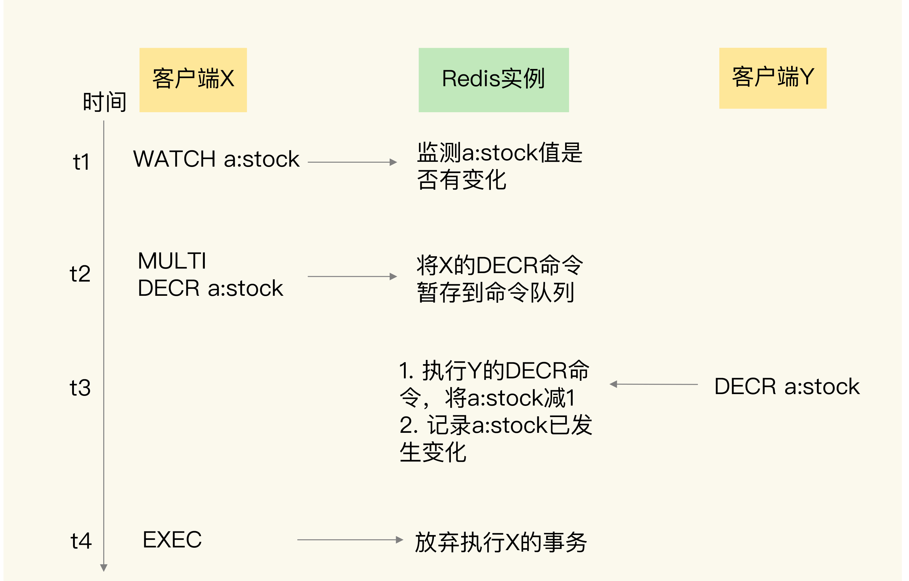
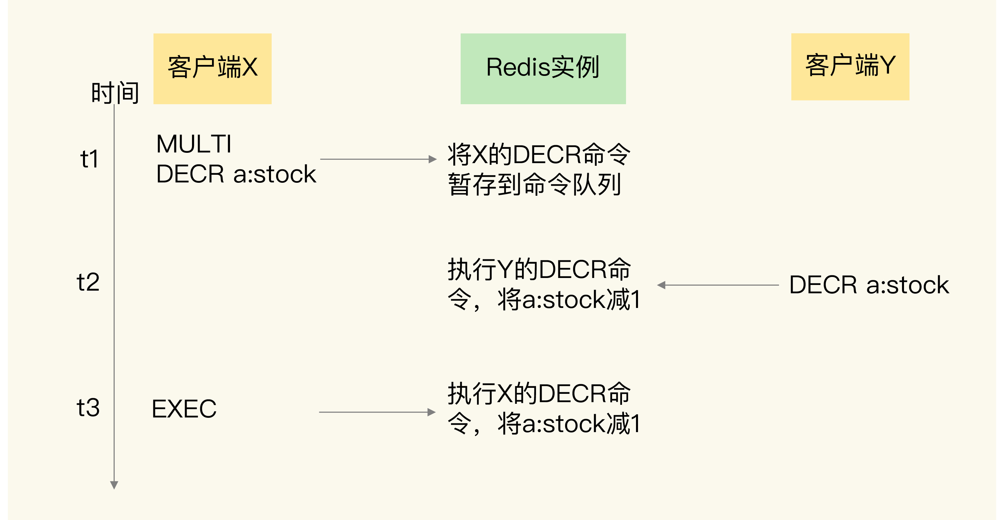
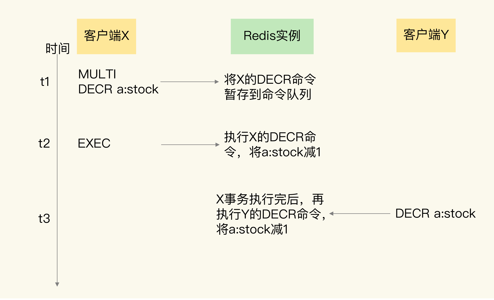

---
date: "2019-06-23"
---  
      
# 31 | 事务机制：Redis能实现ACID属性吗？
你好，我是蒋德钧。

事务是数据库的一个重要功能。所谓的事务，就是指对数据进行读写的一系列操作。事务在执行时，会提供专门的属性保证，包括原子性（Atomicity）、一致性（Consistency）、隔离性（Isolation）和持久性（Durability），也就是ACID属性。这些属性既包括了对事务执行结果的要求，也有对数据库在事务执行前后的数据状态变化的要求。

那么，Redis可以完全保证ACID属性吗？毕竟，如果有些属性在一些场景下不能保证的话，很可能会导致数据出错，所以，我们必须要掌握Redis对这些属性的支持情况，并且提前准备应对策略。

接下来，我们就先了解ACID属性对事务执行的具体要求，有了这个知识基础后，我们才能准确地判断Redis的事务机制能否保证ACID属性。

## 事务ACID属性的要求

首先来看原子性。原子性的要求很明确，就是一个事务中的多个操作必须都完成，或者都不完成。业务应用使用事务时，原子性也是最被看重的一个属性。

我给你举个例子。假如用户在一个订单中购买了两个商品A和B，那么，数据库就需要把这两个商品的库存都进行扣减。如果只扣减了一个商品的库存，那么，这个订单完成后，另一个商品的库存肯定就错了。

<!-- [[[read_end]]] -->

第二个属性是一致性。这个很容易理解，就是指数据库中的数据在事务执行前后是一致的。

第三个属性是隔离性。它要求数据库在执行一个事务时，其它操作无法存取到正在执行事务访问的数据。

我还是借助用户下单的例子给你解释下。假设商品A和B的现有库存分别是5和10，用户X对A、B下单的数量分别是3、6。如果事务不具备隔离性，在用户X下单事务执行的过程中，用户Y一下子也购买了5件B，这和X购买的6件B累加后，就超过B的总库存值了，这就不符合业务要求了。

最后一个属性是持久性。数据库执行事务后，数据的修改要被持久化保存下来。当数据库重启后，数据的值需要是被修改后的值。

了解了ACID属性的具体要求后，我们再来看下Redis是如何实现事务机制的。

## Redis如何实现事务？

事务的执行过程包含三个步骤，Redis提供了MULTI、EXEC两个命令来完成这三个步骤。下面我们来分析下。

第一步，客户端要使用一个命令显式地表示一个事务的开启。在Redis中，这个命令就是MULTI。

第二步，客户端把事务中本身要执行的具体操作（例如增删改数据）发送给服务器端。这些操作就是Redis本身提供的数据读写命令，例如GET、SET等。不过，这些命令虽然被客户端发送到了服务器端，但Redis实例只是把这些命令暂存到一个命令队列中，并不会立即执行。

第三步，客户端向服务器端发送提交事务的命令，让数据库实际执行第二步中发送的具体操作。Redis提供的**EXEC命令**就是执行事务提交的。当服务器端收到EXEC命令后，才会实际执行命令队列中的所有命令。

下面的代码就显示了使用MULTI和EXEC执行一个事务的过程，你可以看下。

```
    #开启事务
    127.0.0.1:6379> MULTI
    OK
    #将a:stock减1，
    127.0.0.1:6379> DECR a:stock
    QUEUED
    #将b:stock减1
    127.0.0.1:6379> DECR b:stock
    QUEUED
    #实际执行事务
    127.0.0.1:6379> EXEC
    1) (integer) 4
    2) (integer) 9
    

```

我们假设a:stock、b:stock两个键的初始值是5和10。在MULTI命令后执行的两个DECR命令，是把a:stock、b:stock两个键的值分别减1，它们执行后的返回结果都是QUEUED，这就表示，这些操作都被暂存到了命令队列，还没有实际执行。等到执行了EXEC命令后，可以看到返回了4、9，这就表明，两个DECR命令已经成功地执行了。

好了，通过使用MULTI和EXEC命令，我们可以实现多个操作的共同执行，但是这符合事务要求的ACID属性吗？接下来，我们就来具体分析下。

## Redis的事务机制能保证哪些属性？

原子性是事务操作最重要的一个属性，所以，我们先来分析下Redis事务机制能否保证原子性。

### 原子性

如果事务正常执行，没有发生任何错误，那么，MULTI和EXEC配合使用，就可以保证多个操作都完成。但是，如果事务执行发生错误了，原子性还能保证吗？我们需要分三种情况来看。

第一种情况是，**在执行EXEC命令前，客户端发送的操作命令本身就有错误**（比如语法错误，使用了不存在的命令），在命令入队时就被Redis实例判断出来了。

对于这种情况，在命令入队时，Redis就会报错并且记录下这个错误。此时，我们还能继续提交命令操作。等到执行了EXEC命令之后，Redis就会拒绝执行所有提交的命令操作，返回事务失败的结果。这样一来，事务中的所有命令都不会再被执行了，保证了原子性。

我们来看一个因为事务操作入队时发生错误，而导致事务失败的小例子。

```
    #开启事务
    127.0.0.1:6379> MULTI
    OK
    #发送事务中的第一个操作，但是Redis不支持该命令，返回报错信息
    127.0.0.1:6379> PUT a:stock 5
    (error) ERR unknown command `PUT`, with args beginning with: `a:stock`, `5`, 
    #发送事务中的第二个操作，这个操作是正确的命令，Redis把该命令入队
    127.0.0.1:6379> DECR b:stock
    QUEUED
    #实际执行事务，但是之前命令有错误，所以Redis拒绝执行
    127.0.0.1:6379> EXEC
    (error) EXECABORT Transaction discarded because of previous errors.
    

```

在这个例子中，事务里包含了一个Redis本身就不支持的PUT命令，所以，在PUT命令入队时，Redis就报错了。虽然，事务里还有一个正确的DECR命令，但是，在最后执行EXEC命令后，整个事务被放弃执行了。

我们再来看第二种情况。

和第一种情况不同的是，**事务操作入队时，命令和操作的数据类型不匹配，但Redis实例没有检查出错误**。但是，在执行完EXEC命令以后，Redis实际执行这些事务操作时，就会报错。不过，需要注意的是，虽然Redis会对错误命令报错，但还是会把正确的命令执行完。在这种情况下，事务的原子性就无法得到保证了。

举个小例子。事务中的LPOP命令对String类型数据进行操作，入队时没有报错，但是，在EXEC执行时报错了。LPOP命令本身没有执行成功，但是事务中的DECR命令却成功执行了。

```
    #开启事务
    127.0.0.1:6379> MULTI
    OK
    #发送事务中的第一个操作，LPOP命令操作的数据类型不匹配，此时并不报错
    127.0.0.1:6379> LPOP a:stock
    QUEUED
    #发送事务中的第二个操作
    127.0.0.1:6379> DECR b:stock
    QUEUED
    #实际执行事务，事务第一个操作执行报错
    127.0.0.1:6379> EXEC
    1) (error) WRONGTYPE Operation against a key holding the wrong kind of value
    2) (integer) 8
    

```

看到这里，你可能有个疑问，传统数据库（例如MySQL）在执行事务时，会提供回滚机制，当事务执行发生错误时，事务中的所有操作都会撤销，已经修改的数据也会被恢复到事务执行前的状态，那么，在刚才的例子中，如果命令实际执行时报错了，是不是可以用回滚机制恢复原来的数据呢？

其实，Redis中并没有提供回滚机制。虽然Redis提供了DISCARD命令，但是，这个命令只能用来主动放弃事务执行，把暂存的命令队列清空，起不到回滚的效果。

DISCARD命令具体怎么用呢？我们来看下下面的代码。

```
    #读取a:stock的值4
    127.0.0.1:6379> GET a:stock
    "4"
    #开启事务
    127.0.0.1:6379> MULTI 
    OK
    #发送事务的第一个操作，对a:stock减1
    127.0.0.1:6379> DECR a:stock
    QUEUED
    #执行DISCARD命令，主动放弃事务
    127.0.0.1:6379> DISCARD
    OK
    #再次读取a:stock的值，值没有被修改
    127.0.0.1:6379> GET a:stock
    "4"
    

```

这个例子中，a:stock键的值一开始为4，然后，我们执行一个事务，想对a:stock的值减1。但是，在事务的最后，我们执行的是DISCARD命令，所以事务就被放弃了。我们再次查看a:stock的值，会发现仍然为4。

最后，我们再来看下第三种情况：**在执行事务的EXEC命令时，Redis实例发生了故障，导致事务执行失败**。

在这种情况下，如果Redis开启了AOF日志，那么，只会有部分的事务操作被记录到AOF日志中。我们需要使用redis-check-aof工具检查AOF日志文件，这个工具可以把未完成的事务操作从AOF文件中去除。这样一来，我们使用AOF恢复实例后，事务操作不会再被执行，从而保证了原子性。

当然，如果AOF日志并没有开启，那么实例重启后，数据也都没法恢复了，此时，也就谈不上原子性了。

好了，到这里，你了解了Redis对事务原子性属性的保证情况，我们来简单小结下：

* 命令入队时就报错，会放弃事务执行，保证原子性；
* 命令入队时没报错，实际执行时报错，不保证原子性；
* EXEC命令执行时实例故障，如果开启了AOF日志，可以保证原子性。

接下来，我们再来学习下一致性属性的保证情况。

### 一致性

事务的一致性保证会受到错误命令、实例故障的影响。所以，我们按照命令出错和实例故障的发生时机，分成三种情况来看。

**情况一：命令入队时就报错**

在这种情况下，事务本身就会被放弃执行，所以可以保证数据库的一致性。

**情况二：命令入队时没报错，实际执行时报错**

在这种情况下，有错误的命令不会被执行，正确的命令可以正常执行，也不会改变数据库的一致性。

**情况三：EXEC命令执行时实例发生故障**

在这种情况下，实例故障后会进行重启，这就和数据恢复的方式有关了，我们要根据实例是否开启了RDB或AOF来分情况讨论下。

如果我们没有开启RDB或AOF，那么，实例故障重启后，数据都没有了，数据库是一致的。

如果我们使用了RDB快照，因为RDB快照不会在事务执行时执行，所以，事务命令操作的结果不会被保存到RDB快照中，使用RDB快照进行恢复时，数据库里的数据也是一致的。

如果我们使用了AOF日志，而事务操作还没有被记录到AOF日志时，实例就发生了故障，那么，使用AOF日志恢复的数据库数据是一致的。如果只有部分操作被记录到了AOF日志，我们可以使用redis-check-aof清除事务中已经完成的操作，数据库恢复后也是一致的。

所以，总结来说，在命令执行错误或Redis发生故障的情况下，Redis事务机制对一致性属性是有保证的。接下来，我们再继续分析下隔离性。

### 隔离性

事务的隔离性保证，会受到和事务一起执行的并发操作的影响。而事务执行又可以分成命令入队（EXEC命令执行前）和命令实际执行（EXEC命令执行后）两个阶段，所以，我们就针对这两个阶段，分成两种情况来分析：

1.  并发操作在EXEC命令前执行，此时，隔离性的保证要使用WATCH机制来实现，否则隔离性无法保证；
2.  并发操作在EXEC命令后执行，此时，隔离性可以保证。

我们先来看第一种情况。一个事务的EXEC命令还没有执行时，事务的命令操作是暂存在命令队列中的。此时，如果有其它的并发操作，我们就需要看事务是否使用了WATCH机制。

WATCH机制的作用是，在事务执行前，监控一个或多个键的值变化情况，当事务调用EXEC命令执行时，WATCH机制会先检查监控的键是否被其它客户端修改了。如果修改了，就放弃事务执行，避免事务的隔离性被破坏。然后，客户端可以再次执行事务，此时，如果没有并发修改事务数据的操作了，事务就能正常执行，隔离性也得到了保证。

WATCH机制的具体实现是由WATCH命令实现的，我给你举个例子，你可以看下下面的图，进一步理解下WATCH命令的使用。



我来给你具体解释下图中的内容。

在t1时，客户端X向实例发送了WATCH命令。实例收到WATCH命令后，开始监测a:stock的值的变化情况。

紧接着，在t2时，客户端X把MULTI命令和DECR命令发送给实例，实例把DECR命令暂存入命令队列。

在t3时，客户端Y也给实例发送了一个DECR命令，要修改a:stock的值，实例收到命令后就直接执行了。

等到t4时，实例收到客户端X发送的EXEC命令，但是，实例的WATCH机制发现a:stock已经被修改了，就会放弃事务执行。这样一来，事务的隔离性就可以得到保证了。

当然，如果没有使用WATCH机制，在EXEC命令前执行的并发操作是会对数据进行读写的。而且，在执行EXEC命令的时候，事务要操作的数据已经改变了，在这种情况下，Redis并没有做到让事务对其它操作隔离，隔离性也就没有得到保障。下面这张图显示了没有WATCH机制时的情况，你可以看下。



在t2时刻，客户端X发送的EXEC命令还没有执行，但是客户端Y的DECR命令就执行了，此时，a:stock的值会被修改，这就无法保证X发起的事务的隔离性了。

刚刚说的是并发操作在EXEC命令前执行的情况，下面我再来说一说第二种情况：**并发操作在EXEC命令之后被服务器端接收并执行**。

因为Redis是用单线程执行命令，而且，EXEC命令执行后，Redis会保证先把命令队列中的所有命令执行完。所以，在这种情况下，并发操作不会破坏事务的隔离性，如下图所示：



最后，我们来分析一下Redis事务的持久性属性保证情况。

### 持久性

因为Redis是内存数据库，所以，数据是否持久化保存完全取决于Redis的持久化配置模式。

如果Redis没有使用RDB或AOF，那么事务的持久化属性肯定得不到保证。如果Redis使用了RDB模式，那么，在一个事务执行后，而下一次的RDB快照还未执行前，如果发生了实例宕机，这种情况下，事务修改的数据也是不能保证持久化的。

如果Redis采用了AOF模式，因为AOF模式的三种配置选项no、everysec和always都会存在数据丢失的情况，所以，事务的持久性属性也还是得不到保证。

所以，不管Redis采用什么持久化模式，事务的持久性属性是得不到保证的。

## 小结

在这节课上，我们学习了Redis中的事务实现。Redis通过MULTI、EXEC、DISCARD和WATCH四个命令来支持事务机制，这4个命令的作用，我总结在下面的表中，你可以再看下。


事务的ACID属性是我们使用事务进行正确操作的基本要求。通过这节课的分析，我们了解到了，Redis的事务机制可以保证一致性和隔离性，但是无法保证持久性。不过，因为Redis本身是内存数据库，持久性并不是一个必须的属性，我们更加关注的还是原子性、一致性和隔离性这三个属性。

原子性的情况比较复杂，只有当事务中使用的命令语法有误时，原子性得不到保证，在其它情况下，事务都可以原子性执行。

所以，我给你一个小建议：**严格按照Redis的命令规范进行程序开发，并且通过code review确保命令的正确性**。这样一来，Redis的事务机制就能被应用在实践中，保证多操作的正确执行。

## 每课一问

按照惯例，我给你提个小问题，在执行事务时，如果Redis实例发生故障，而Redis使用了RDB机制，那么，事务的原子性还能得到保证吗？

欢迎在留言区写下你的思考和答案，我们一起交流讨论。如果你觉得今天的内容对你有所帮助，也欢迎你分享给你的朋友或同事。我们下节课见。