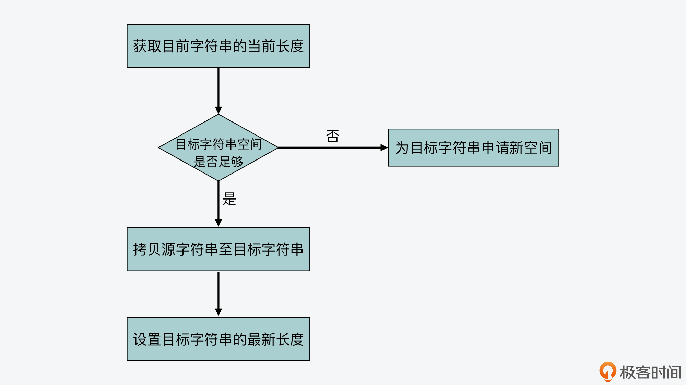

---
date: "2019-06-23"
---  
      
# 02 | 键值对中字符串的实现，用char*还是结构体？
你好，我是蒋德钧。

字符串在我们平时的应用开发中十分常见，比如我们要记录用户信息、商品信息、状态信息等等，这些都会用到字符串。

而对于Redis来说，键值对中的键是字符串，值有时也是字符串。我们在Redis中写入一条用户信息，记录了用户姓名、性别、所在城市等，这些都是字符串，如下所示：

```
    SET user:id:100 {“name”: “zhangsan”, “gender”: “M”,“city”:"beijing"}
    

```

此外，Redis实例和客户端交互的命令和数据，也都是用字符串表示的。

那么，既然字符串的使用如此广泛和关键，就使得我们在实现字符串时，需要尽量满足以下三个要求：

* 能支持丰富且高效的字符串操作，比如字符串追加、拷贝、比较、获取长度等；
* 能保存任意的二进制数据，比如图片等；
* 能尽可能地节省内存开销。

其实，如果你开发过C语言程序，你应该就知道，在C语言中可以使用**char\*字符数组**来实现字符串。同时，C语言标准库string.h中也定义了多种字符串的操作函数，比如字符串比较函数strcmp、字符串长度计算函数strlen、字符串追加函数strcat等，这样就便于开发者直接调用这些函数来完成字符串操作。

所以这样看起来，**Redis好像完全可以复用C语言中对字符串的实现呀？**

但实际上，我们在使用C语言字符串时，经常需要手动检查和分配字符串空间，而这就会增加代码开发的工作量。而且，图片等数据还无法用字符串保存，也就限制了应用范围。

<!-- [[[read_end]]] -->

那么，从系统设计的角度来看，我们该如何设计实现字符串呢？

其实，Redis设计了**简单动态字符串**（Simple Dynamic String，SDS）的结构，用来表示字符串。相比于C语言中的字符串实现，SDS这种字符串的实现方式，会**提升字符串的操作效率，并且可以用来保存二进制数据**。

所以今天这节课，我就来给你介绍下SDS结构的设计思想和实现技巧，这样你就既可以掌握char\*实现方法的不足和SDS的优势，还能学习到紧凑型内存结构的实现技巧。如果你要在自己的系统软件中实现字符串类型，就可以参考Redis的设计思想，来更好地提升操作效率，节省内存开销。

好，接下来，我们先来了解下为什么Redis没有复用C语言的字符串实现方法。

## 为什么Redis不用char\*？

实际上，要想解答这个问题，我们需要先知道char\*字符串数组的结构特点，还有Redis对字符串的需求是什么，所以下面我们就来具体分析一下。

### char\*的结构设计

首先，我们来看看char\*字符数组的结构。

`char*`字符数组的结构很简单，就是**一块连续的内存空间，依次存放了字符串中的每一个字符**。比如，下图显示的就是字符串“redis”的`char*`数组结构。


从图中可以看到，字符数组的最后一个字符是“\\0”，这个字符的作用是什么呢？其实，C语言在对字符串进行操作时，char\*指针只是指向字符数组的起始位置，而**字符数组的结尾位置就用“\\0”表示，意思是指字符串的结束**。

这样一来，C语言标准库中字符串的操作函数，就会通过检查字符数组中是否有“\\0”，来判断字符串是否结束。比如，strlen函数就是一种字符串操作函数，它可以返回一个字符串的长度。这个函数会遍历字符数组中的每一个字符，并进行计数，直到检查的字符为“\\0”。此时，strlen函数会停止计数，返回已经统计到的字符个数。下图显示了strlen函数的执行流程：


我们再通过一段代码，来看下**“\\0”结束字符对字符串长度的影响**。这里我创建了两个字符串变量a和b，分别给它们赋值为“red\\0is”和“redis\\0”。然后，我用strlen函数计算这两个字符串长度，如下所示：

```
    	#include <stdio.h>
    	#include <string.h>
    	int main()
    	{
    	   char *a = "red\0is";
    	   char *b = "redis\0";
    	   printf("%lu\n", strlen(a));
    	   printf("%lu\n", strlen(b));
    	   return 0;
    	}
    

```

当程序执行完这段代码后，输出的结果分别是3和5，表示a和b的长度分别是3个字符和5个字符。这是因为a中在“red”这3个字符后，就有了结束字符“\\0”，而b中的结束字符是在“redis”5个字符后。

也就是说，char\*字符串以“\\0”表示字符串的结束，其实会给我们保存数据带来一定的负面影响。如果我们要保存的数据中，本身就有“\\0”，那么数据在“\\0”处就会被截断，而这就**不符合Redis希望能保存任意二进制数据的需求**了。

### 操作函数复杂度

而除了char\*字符数组结构的设计问题以外，使用“\\0”作为字符串的结束字符，虽然可以让字符串操作函数判断字符串的结束位置，但它也会带来另一方面的负面影响，也就是会导致操作函数的复杂度增加。

我还是以strlen函数为例，该函数需要遍历字符数组中的每一个字符，才能得到字符串长度，所以这个操作函数的复杂度是O\(N\)。

我们再来看另一个常用的操作函数：**字符串追加函数strcat**。strcat函数是将一个源字符串src追加到一个目标字符串的末尾。该函数的代码如下所示：

```
    	char *strcat(char *dest, const char *src) {
    	   //将目标字符串复制给tmp变量
    	   char *tmp = dest;
    	   //用一个while循环遍历目标字符串，直到遇到“\0”跳出循环，指向目标字符串的末尾
    	   while(*dest)
    	      dest++;
    	   //将源字符串中的每个字符逐一赋值到目标字符串中，直到遇到结束字符
    	   while((*dest++ = *srC加加) != '\0' )
    	   return tmp;
    	}
    

```

从代码中可以看到，strcat函数和strlen函数类似，复杂度都很高，也都需要先通过遍历字符串才能得到目标字符串的末尾。然后对于strcat函数来说，还要再遍历源字符串才能完成追加。另外，它在把源字符串追加到目标字符串末尾时，还需要确认目标字符串具有足够的可用空间，否则就无法追加。

所以，这就要求开发人员在调用strcat时，要保证目标字符串有足够的空间，不然就需要开发人员动态分配空间，从而增加了编程的复杂度。而操作函数的复杂度一旦增加，就会影响字符串的操作效率，这就**不符合Redis对字符串高效操作的需求**了。

好了，综合以上在C语言中使用char\*实现字符串的两大不足之处以后，我们现在就需要找到新的实现字符串的方式了。所以接下来，我们就来学习下，Redis是如何对字符串的实现进行设计考虑的。

## SDS的设计思想

因为Redis是使用C语言开发的，所以为了保证能尽量复用C标准库中的字符串操作函数，Redis保留了使用字符数组来保存实际的数据。但是，和C语言仅用字符数组不同，Redis还专门设计了SDS（即简单动态字符串）的数据结构。下面我们一起来看看。

### SDS结构设计

首先，SDS结构里包含了一个字符数组buf\[\]，用来保存实际数据。同时，SDS结构里还包含了三个元数据，分别是**字符数组现有长度len**、**分配给字符数组的空间长度alloc**，以及**SDS类型flags**。其中，Redis给len和alloc这两个元数据定义了多种数据类型，进而可以用来表示不同类型的SDS，稍后我会给你具体介绍。下图显示了SDS的结构，你可以先看下。


另外，如果你在Redis源码中查找过SDS的定义，那你可能会看到，Redis使用typedef给char\*类型定义了一个别名，这个别名就是sds，如下所示：

```
    typedef char *sds;
    

```

其实，这是因为SDS本质还是字符数组，只是在字符数组基础上增加了额外的元数据。在Redis中需要用到字符数组时，就直接使用sds这个别名。

同时，在创建新的字符串时，Redis会调用SDS创建函数sdsnewlen。sdsnewlen函数会新建sds类型变量（也就是char\*类型变量），并新建SDS结构体，把SDS结构体中的数组buf\[\] 赋给sds类型变量。最后，sdsnewlen函数会把要创建的字符串拷贝给sds变量。下面的代码就显示了sdsnewlen函数的这个操作逻辑，你可以看下。

```
    sds sdsnewlen(const void *init, size_t initlen) {
        void *sh;  //指向SDS结构体的指针
        sds s;     //sds类型变量，即char*字符数组
    
        ...
        sh = s_malloc(hdrlen+initlen+1);   //新建SDS结构，并分配内存空间
        ...
        s = (char*)sh+hdrlen;              //sds类型变量指向SDS结构体中的buf数组，sh指向SDS结构体起始位置，hdrlen是SDS结构体中元数据的长度
        ...
        if (initlen && init)
            memcpy(s, init, initlen);    //将要传入的字符串拷贝给sds变量s
        s[initlen] = '\0';               //变量s末尾增加\0，表示字符串结束
        return s;
    

```

好了，了解了SDS结构的定义后，我们再来看看，相比传统C语言字符串，SDS操作效率的改进之处。

### SDS操作效率

因为SDS结构中记录了字符数组已占用的空间和被分配的空间，这就比传统C语言实现的字符串能带来更高的操作效率。

我还是以字符串追加操作为例。Redis中实现字符串追加的函数是sds.c文件中的**sdscatlen函数**。这个函数的参数一共有三个，分别是目标字符串s、源字符串t和要追加的长度len，源码如下所示：

```
    sds sdscatlen(sds s, const void *t, size_t len) {
        //获取目标字符串s的当前长度
        size_t curlen = sdslen(s);
        //根据要追加的长度len和目标字符串s的现有长度，判断是否要增加新的空间
        s = sdsMakeRoomFor(s,len);
        if (s == NULL) return NULL;
        //将源字符串t中len长度的数据拷贝到目标字符串结尾
        memcpy(s+curlen, t, len);
        //设置目标字符串的最新长度：拷贝前长度curlen加上拷贝长度
        sdssetlen(s, curlen+len);
        //拷贝后，在目标字符串结尾加上\0
        s[curlen+len] = '\0';
        return s;
    }
    

```

通过分析这个函数的源码，我们可以看到sdscatlen的实现较为简单，其执行过程分为三步：

* 首先，获取目标字符串的当前长度，并调用sdsMakeRoomFor函数，根据当前长度和要追加的长度，判断是否要给目标字符串新增空间。这一步主要是保证，目标字符串有足够的空间接收追加的字符串。
* 其次，在保证了目标字符串的空间足够后，将源字符串中指定长度len的数据追加到目标字符串。
* 最后，设置目标字符串的最新长度。

我画了一张图，显示了sdscatlen的执行过程，你可以看下。



所以，到这里你就能发现，和C语言中的字符串操作相比，SDS通过记录字符数组的使用长度和分配空间大小，避免了对字符串的遍历操作，降低了操作开销，进一步就可以帮助诸多字符串操作更加高效地完成，比如创建、追加、复制、比较等，这一设计思想非常值得我们学习。

此外，SDS把目标字符串的**空间检查和扩容封装在了sdsMakeRoomFor函数中**，并且在涉及字符串空间变化的操作中，如追加、复制等，会直接调用该函数。

这一设计实现，就避免了开发人员因忘记给目标字符串扩容，而导致操作失败的情况。比如，我们使用函数strcpy \(char \*dest, const char \*src\)时，如果src的长度大于dest的长度，代码中我们也没有做检查的话，就会造成内存溢出。所以这种封装操作的设计思想，同样值得我们学习。

那么，除了使用元数据记录字符串数组长度和封装操作的设计思想，SDS还有什么优秀的设计与实现值得我们学习呢？这就和我刚才给你介绍的Redis对内存节省的需求相关了。

所以接下来，我们就来看看SDS在编程技巧上是如何实现节省内存的。

## 紧凑型字符串结构的编程技巧

前面我提到，SDS结构中有一个元数据flags，表示的是SDS类型。事实上，SDS一共设计了5种类型，分别是sdshdr5、sdshdr8、sdshdr16、sdshdr32和sdshdr64。这5种类型的**主要区别就在于**，它们数据结构中的字符数组现有长度len和分配空间长度alloc，这两个元数据的数据类型不同。

因为sdshdr5这一类型Redis已经不再使用了，所以我们这里主要来了解下剩余的4种类型。以sdshdr8为例，它的定义如下所示：

```
    struct __attribute__ ((__packed__)) sdshdr8 {
        uint8_t len; /* 字符数组现有长度*/
        uint8_t alloc; /* 字符数组的已分配空间，不包括结构体和\0结束字符*/
        unsigned char flags; /* SDS类型*/
        char buf[]; /*字符数组*/
    };
    

```

我们可以看到，现有长度len和已分配空间alloc的数据类型都是uint8\_t。**uint8\_t是8位无符号整型**，会占用1字节的内存空间。当字符串类型是sdshdr8时，它能表示的字符数组长度（包括数组最后一位\\0）不会超过256字节（2的8次方等于256）。

而对于sdshdr16、sdshdr32、sdshdr64三种类型来说，它们的len和alloc数据类型分别是uint16\_t、uint32\_t、uint64\_t，即它们能表示的字符数组长度，分别不超过2的16次方、32次方和64次方。这两个元数据各自占用的内存空间在sdshdr16、sdshdr32、sdshdr64类型中，则分别是2字节、4字节和8字节。

实际上，**SDS之所以设计不同的结构头（即不同类型），是为了能灵活保存不同大小的字符串，从而有效节省内存空间。**因为在保存不同大小的字符串时，结构头占用的内存空间也不一样，这样一来，在保存小字符串时，结构头占用空间也比较少。

否则，假设SDS都设计一样大小的结构头，比如都使用uint64\_t类型表示len和alloc，那么假设要保存的字符串是10个字节，而此时结构头中len和alloc本身就占用了16个字节了，比保存的数据都多了。所以这样的设计对内存并不友好，也不满足Redis节省内存的需求。

好了，除了设计不同类型的结构头，Redis在编程上还**使用了专门的编译优化来节省内存空间**。在刚才介绍的sdshdr8结构定义中，我们可以看到，在struct和sdshdr8之间使用了`__attribute__ ((__packed__))`，如下所示：

```
    struct __attribute__ ((__packed__)) sdshdr8
    

```

其实这里，`__attribute__ ((__packed__))`的作用就是告诉编译器，在编译sdshdr8结构时，不要使用字节对齐的方式，而是**采用紧凑的方式分配内存**。这是因为在默认情况下，编译器会按照8字节对齐的方式，给变量分配内存。也就是说，即使一个变量的大小不到8个字节，编译器也会给它分配8个字节。

为了方便你理解，我给你举个例子。假设我定义了一个结构体s1，它有两个成员变量，类型分别是char和int，如下所示：

```
    	#include <stdio.h>
    	int main() {
    	   struct s1 {
    	      char a;
    	      int b;
    	   } ts1;
    	   printf("%lu\n", sizeof(ts1));
    	   return 0;
    	}
    

```

虽然char类型占用1个字节，int类型占用4个字节，但是如果你运行这段代码，就会发现打印出来的结果是8。这就是因为在默认情况下，编译器会给s1结构体分配8个字节的空间，而这样其中就有3个字节被浪费掉了。

为了节省内存，Redis在这方面的设计上可以说是精打细算的。所以，Redis采用了`__attribute__ ((__packed__))`属性定义结构体，这样一来，结构体实际占用多少内存空间，编译器就分配多少空间。

比如，我用`__attribute__ ((__packed__))`属性定义结构体s2，同样包含char和int两个类型的成员变量，代码如下所示：

```
    	#include <stdio.h>
    	int main() {
    	   struct __attribute__((packed)) s2{
    	      char a;
    	      int b;
    	   } ts2;
    	   printf("%lu\n", sizeof(ts2));
    	   return 0;
    	}
    

```

当你运行这段代码时，你可以看到，打印的结果是5，表示编译器用了紧凑型内存分配，s2结构体只占用5个字节的空间。

好了，总而言之，如果你在开发程序时，希望能节省数据结构的内存开销，就可以把`__attribute__ ((__packed__))`这个编程方法用起来。

## 小结

这节课我主要给你介绍了Redis中字符串的设计与实现。你要知道，字符串的实现需要考虑操作高效、能保存任意二进制数据，以及节省内存的需求。而Redis中设计实现字符串的方式，就非常值得你学习和借鉴。

因此这节课，你需要重点关注三个要点，分别是：

* C语言中使用char\*实现字符串的不足，主要是因为使用“\\0”表示字符串结束，操作时需遍历字符串，效率不高，并且无法完整表示包含“\\0”的数据，因而这就无法满足Redis的需求。
* Redis中字符串的设计思想与实现方法。Redis专门设计了SDS数据结构，在字符数组的基础上，增加了字符数组长度和分配空间大小等元数据。这样一来，需要基于字符串长度进行的追加、复制、比较等操作，就可以直接读取元数据，效率也就提升了。而且，SDS不通过字符串中的“\\0”字符判断字符串结束，而是直接将其作为二进制数据处理，可以用来保存图片等二进制数据。
* SDS中是通过设计不同SDS类型来表示不同大小的字符串，并使用`__attribute__ ((__packed__))`这个编程小技巧，来实现紧凑型内存布局，达到节省内存的目的。

字符串看起来简单，但通过今天这节课的学习，你可以看到实现字符串有很多需要精巧设计的地方。C语言字符串的实现方法和SDS的联系与区别，也是Redis面试时经常会被问到的问题，所以我也希望你能通过今天这节课，掌握好它俩的区别。

## 每课一问

SDS字符串在Redis内部模块实现中也被广泛使用，你能在Redis server和客户端的实现中，找到使用SDS字符串的地方么？

欢迎在留言区分享你的思考和操作过程，我们一起交流讨论。如果觉得有收获，也欢迎你把今天的内容分享给更多的朋友。