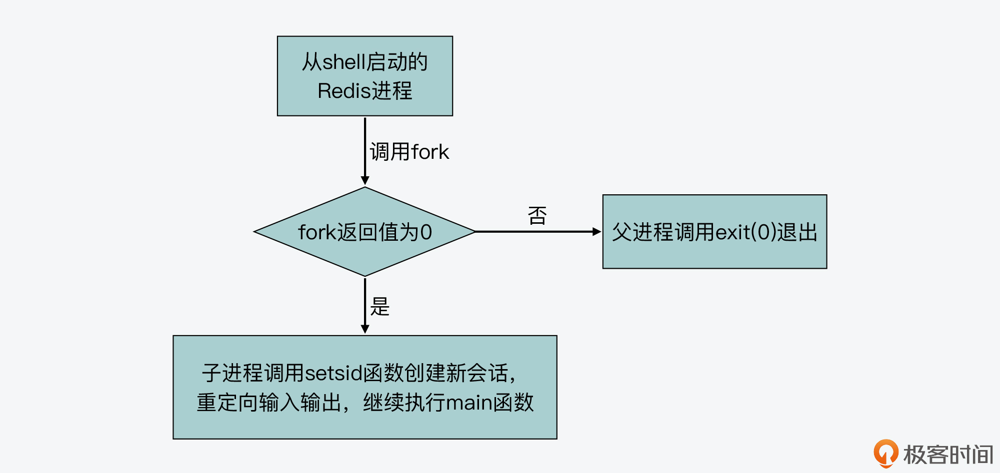
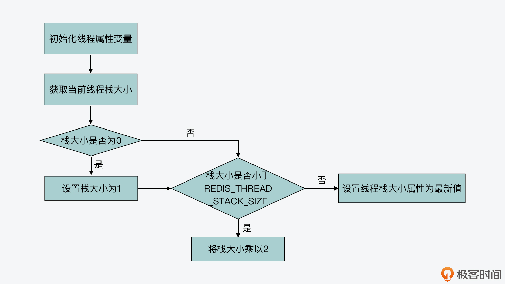
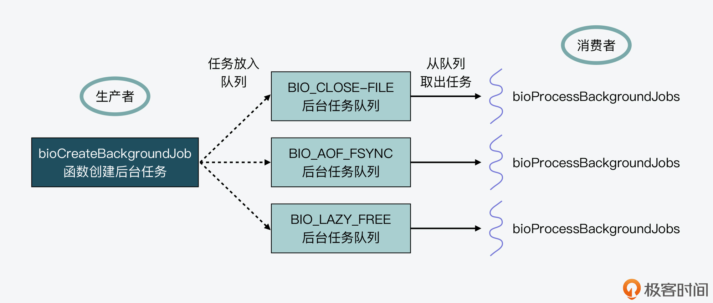

---
date: "2019-06-23"
---  
      
# 12 | Redis真的是单线程吗？
你好，我是蒋德钧。今天这节课，我们来聊聊Redis的执行模型。

所谓的执行模型，就是指Redis运行时使用的进程、子进程和线程的个数，以及它们各自负责的工作任务。

你在实际使用Redis的时候，可能经常会听到类似“Redis是单线程”“Redis的主IO线程”，“Redis包含多线程”等不同说法。我也听到不少同学提出困惑和疑问：**Redis到底是不是一个单线程的程序？**

其实，彻底理解这个问题，有助于指导我们保持Redis高性能、低延迟的特性。如果说Redis就是单线程程序，那么，我们就需要避免所有容易引起线程阻塞的操作；而如果说Redis不只是单线程，还有其他线程在工作，那么，我们就需要了解多线程各自负责什么任务，负责请求解析和数据读写的线程有几个，有哪些操作是后台线程在完成，而不会影响请求解析和数据读写的。

所以，今天这节课，我就从Redis server启动后运行的进程开始，带你一边学习Redis源码中子进程和线程的创建方式，一边掌握Redis server运行时涉及到的进程、子进程和线程情况。

下面，我们先来看Redis server启动时的进程运行。

## 从shell命令执行到Redis进程创建

我们在启动Redis实例时，可以在shell命令行环境中，执行redis-server这个可执行文件，如下所示：

<!-- [[[read_end]]] -->

```
    ./redis-server  /etc/redis/redis.conf
    

```

shell运行这个命令后，它实际会调用fork系统调用函数，来新建一个进程。因为shell本身是一个进程，所以，这个通过fork新创建的进程就被称为是shell进程的子进程，而shell进程被称为父进程。关于fork函数的具体用法，我一会儿还会给你具体介绍。

紧接着，shell进程会调用execve系统调用函数，将子进程执行的主体替换成Redis的可执行文件。而Redis可执行文件的入口函数就是main函数，这样一来，子进程就会开始执行Redis server的main函数了。

下面的代码显示了execve系统调用函数原型。其中，filename是要运行的程序的文件名，argv\[\]和envp\[\]分别是要运行程序的参数和环境变量。

```
    int execve(const char *filename, char *const argv[], char *const envp[]))
    

```

下图显示了从shell执行命令到创建Redis进程的过程，你可以看下。


当我们用刚才介绍的shell命令运行Redis server后，我们会看到Redis server启动后的日志输出会打印到终端屏幕上，如下所示：

```
    37807:M 19 Aug 2021 07:29:36.372 # Server initialized
    37807:M 19 Aug 2021 07:29:36.372 * DB loaded from disk: 0.000 seconds
    37807:M 19 Aug 2021 07:29:36.372 * Ready to accept connections
    

```

这是因为shell进程调用fork函数创建的子进程，会从父进程中继承一些属性，比如父进程打开的文件描述符。对于shell进程来说，它打开的文件描述符包括0和1，这两个描述符分别代表了标准输入和标准输出。而execve函数只是把子进程的执行内容替换成Redis可执行文件，子进程从shell父进程继承到的标准输入和标准输出保持不变。

所以，Redis运行时通过serverLog函数打印的日志信息，就会默认输出到终端屏幕上了，也就是shell进程的标准输出。

而一旦Redis进程创建开始运行后，它就会从main函数开始执行。我们在[第8讲](https://time.geekbang.org/column/article/406556)中已经学习了main函数的主要执行过程，所以我们会发现，它会调用不同的函数来执行相关功能。比如，main函数调用initServerConfig函数初始化Redis server的运行参数，调用loadServerConfig函数解析配置文件参数。当main函数调用这些函数时，这些函数仍然是由原来的进程执行的。所以，在这种情况下，Redis仍然是单个进程在运行。

不过，在main函数完成参数解析后，会根据两个配置参数daemonize和supervised，来设置变量background的值。它们的含义分别是：

* 参数daemonize表示，是否要设置Redis以守护进程方式运行；
* 参数supervised表示，是否使用upstart或是systemd这两种守护进程的管理程序来管理Redis。

那么，我们来进一步了解下守护进程。守护进程是在系统后台运行的进程，独立于shell终端，不再需要用户在shell中进行输入了。一般来说，守护进程用于执行周期性任务或是等待相应事件发生再进行处理。Redis server本身就是在启动后，等待客户端输入，再进行处理。所以对于Redis这类服务器程序来说，我们通常会让它以守护进程方式运行。

好了，如果设置了Redis以守护进程方式执行，那么守护进程具体是怎么创建的呢？这就和main函数调用的daemonize函数相关了。daemonize函数就是用来将Redis进程转换为守护进程来运行。

下面的代码显示了main函数根据变量background值，来判断是否执行daemonize函数的逻辑，你可以看下。

```
    //如果配置参数daemonize为1，supervised值为0，那么设置background值为1，否则，设置其为0。
    int main(int argc, char **argv) {
    …
    int background = server.daemonize && !server.supervised;
    //如果background值为1，调用daemonize函数。
    if (background) daemonize();
    …
    }
    

```

也就是说，如果background的值为1，就表示Redis被设置为以守护进程方式运行，因此main函数就会调用daemonize函数。

那么，接下来，我们就来学习下daemonize函数是如何将Redis转为守护进程运行的。

## 从daemonize函数的执行学习守护进程的创建

我们首先来看daemonize函数的部分执行内容，如下所示。我们可以看到，daemonize函数调用了fork函数，并根据fork函数返回值有不同的分支代码。

```
    void daemonize(void) {
    …
    if (fork() != 0) exit(0); //fork成功执行或失败，则父进程退出
    setsid(); //创建新的session
    …
    }
    

```

从刚才的介绍中，我们已经知道，当我们在一个程序的函数中调用fork函数时，fork函数会创建一个子进程。而原本这个程序对应的进程，就称为这个子进程的父进程。那么，fork函数执行后的不同分支和父、子进程是什么关系呢？这就和fork函数的使用有关了。

实际上，fork函数的使用是比较有意思的，我们可以根据fork函数的不同返回值，来编写相应的分支代码，这些分支代码就对应了父进程和子进程各自要执行的逻辑。

为了便于你理解，我给你举个例子。我写了一段示例代码，这段代码的main函数会调用fork函数，并进一步根据fork函数的返回值是小于0、等于0，还是大于0，来执行不同的分支。注意，fork函数的不同返回值，其实代表了不同的含义，具体来说：

* 当返回值小于0时，此时表明fork函数执行有误；
* 当返回值等于0时，此时，返回值对应的代码分支就会在子进程中运行；
* 当返回值大于0时，此时，返回值对应的代码分支仍然会在父进程中运行。

这段示例代码如下：

```
    #include <stdio.h>
    #include <unistd.h>
     
    int main(int argc, char *argv[]) {
    	printf("hello main\n");
        int rv = fork(); //fork函数的返回值
        //返回值小于0，表示fork执行错误
        if (rv < 0) {
            fprintf(stderr, "fork failed\n");
    	}
    	//返回值等于0，对应子进程执行
        else if (rv == 0) {
            printf("I am child process %d\n", getpid());
    	}
    	//返回值大于0，对应父进程执行
        else {
            printf("I am parent process of (%d), %d\n", rc, getpid());
        }
        return 0;
    }
    

```

在这段代码中，我根据fork函数的返回值，分别写了三个分支代码，其中返回值等于0对应的代码分支，是子进程执行的代码。子进程会打印字符串“I am child process”，并打印子进程的进程号。而返回值大于0对应的代码分支，是父进程的代码。父进程会打印字符串“I am parent process of”，并打印它所创建的子进程进程号和它自身的进程号。

那么，如果你把这段代码编译后执行，你可以看到类似如下的结果，父进程打印了它的进程号62794，而子进程则打印了它的进程号62795。这表明刚才示例代码中的不同分支的确是由父、子进程来执行的。这也就是说，我们可以在fork函数执行后，使用不同分支，让父、子进程执行不同内容。

```
    hello main
    I am parent process of (62795), 62794
    I am child process 62795
    

```

好了，了解了fork函数创建子进程的知识后，我们再来看下刚才介绍的daemonize函数。

现在我们已经知道，daemonize函数调用fork函数后，可以根据fork函数返回值设置不同代码分支，对应父、子进程执行内容。其实，daemonize函数也的确设置了两个代码分支。

* **分支一**

这个分支对应fork函数返回值不为0，表示fork函数成功执行后的父进程执行逻辑或是fork函数执行失败的执行逻辑。此时，父进程会调用exit\(0\)函数退出。也就是说，如果fork函数成功执行，父进程就退出了。当然，如果fork函数执行失败了，那么子进程也没有能成功创建，父进程也就退出执行了。你可以看下下面的代码，展示了这个分支。

```
    void daemonize(void) {
    …
    if (fork() != 0) exit(0); //fork成功执行或失败，则父进程退出
    …
    }
    

```

* **分支二**

这个分支对应fork函数返回值为0，为子进程的执行逻辑。子进程首先会调用setsid函数，创建一个新的会话。

然后，子进程会用open函数打开/dev/null设备，并把它的标准输入、标准输出和标准错误输出，重新定向到/dev/null设备。因为守护进程是在后台运行，它的输入输出是独立于shell终端的。所以，为了让Redis能以守护进程方式运行，这几步操作的目的就是把当前子进程的输入、输出由原来的shell终端，转向/dev/null设备，这样一来，就不再依赖于shell终端了，满足了守护进程的要求。

我把daemonize函数的代码放在这里，你可以看下。

```
    void daemonize(void) {
        …
        setsid(); //为子进程创建新的session
       
        //将子进程的标准输入、标准输出、标准错误输出重定向到/dev/null中
        if ((fd = open("/dev/null", O_RDWR, 0)) != -1) {
            dup2(fd, STDIN_FILENO);
            dup2(fd, STDOUT_FILENO);
            dup2(fd, STDERR_FILENO);
            if (fd > STDERR_FILENO) close(fd);
        }
    }
    

```

好了，到这里，我们就了解了，Redis的main函数会根据配置参数daemonize和supervised，来判断是否以守护进程方式运行Redis。

那么，一旦Redis要以守护进程方式运行，main函数会调用daemonize函数。daemonize函数会进一步调用fork函数创建子进程，并根据返回值，分别执行父进程和子进程的代码分支。其中，父进程会退出。而子进程会代替原来的父进程，继续执行main函数的代码。

下面的图展示了daemonize函数调用fork函数后的两个分支的执行逻辑，你可以再回顾下。



事实上，Redis server启动后无论是否以守护进程形式运行，都还是一个进程在运行。对于一个进程来说，如果该进程启动后没有创建新的线程，那么这个进程的工作任务默认就是由一个线程来执行的，而这个线程我一般也称它为主线程。

对于Redis来说，它的主要工作，包括接收客户端请求、解析请求和进行数据读写等操作，都没有创建新线程来执行，所以，Redis主要工作的确是由单线程来执行的，这也是我们常说Redis是单线程程序的原因。因为Redis主要工作都是IO读写操作，所以，我也会把这个单线程称为主IO线程。

但其实，Redis 在3.0版本后，除了主IO线程外，的确还会启动一些后台线程来处理部分任务，从而避免这些任务对主IO线程的影响。那么，这些后台线程是在哪里启动的，又是如何执行的呢？

这就和Redis的[bio.c](https://github.com/redis/redis/tree/5.0/src/bio.c)文件相关了。接下来，我们就来从这个文件中学习下Redis的后台线程。

## 从bio.c文件学习Redis的后台线程

我们先来看下main函数在初始化过程最后调用的InitServerLast函数。InitServerLast函数的作用是进一步调用bioInit函数，来创建后台线程，让Redis把部分任务交给后台线程处理。这个过程如下所示。

```
    void InitServerLast() {
        bioInit();
        …
    }
    

```

bioInit函数是在[bio.c](https://github.com/redis/redis/tree/5.0/src/bio.c)文件中实现的，它的主要作用调用pthread\_create函数创建多个后台线程。不过在具体了解bioInit函数之前，我们先来看下bio.c文件中定义的主要数组，这也是在bioInit函数中要进行初始化的。

bio.c文件针对要创建的线程，定义了pthread\_t类型的数组bio\_threads，用来保存创建的线程描述符。此外，bio.c文件还创建了一个保存互斥锁的数组bio\_mutex，以及两个保存条件变量的数组bio\_newjob\_cond和bio\_step\_cond。以下代码展示了这些数组的创建逻辑，你可以看下。

```
    //保存线程描述符的数组
    static pthread_t bio_threads[BIO_NUM_OPS]; 
    //保存互斥锁的数组
    static pthread_mutex_t bio_mutex[BIO_NUM_OPS];
    //保存条件变量的两个数组
    static pthread_cond_t bio_newjob_cond[BIO_NUM_OPS];
    static pthread_cond_t bio_step_cond[BIO_NUM_OPS];
    

```

从中你可以注意到，这些数组的大小都是宏定义BIO\_NUM\_OPS，这个宏定义是在[bio.h](https://github.com/redis/redis/tree/5.0/src/bio.h)文件中定义的，默认值为3。

同时在bio.h文件中，你还可以看到另外三个宏定义，分别是BIO\_CLOSE\_FILE、BIO\_AOF\_FSYNC和BIO\_LAZY\_FREE。它们的代码如下所示：

```
    #define BIO_CLOSE_FILE    0 /* Deferred close(2) syscall. */
    #define BIO_AOF_FSYNC    1 /* Deferred AOF fsync. */
    #define BIO_LAZY_FREE     2 /* Deferred objects freeing. */
    #define BIO_NUM_OPS       3
    

```

其中，BIO\_NUM\_OPS表示的是Redis后台任务的类型有三种。而BIO\_CLOSE\_FILE、BIO\_AOF\_FSYNC和BIO\_LAZY\_FREE，它们分别表示三种后台任务的操作码，这些操作码可以用来标识不同的任务。

* **BIO\_CLOSE\_FILE**：文件关闭后台任务。
* **BIO\_AOF\_FSYNC**：AOF日志同步写回后台任务。
* **BIO\_LAZY\_FREE**：惰性删除后台任务。

实际上，bio.c文件创建的线程数组、互斥锁数组和条件变量数组，大小都是包含三个元素，也正是对应了这三种任务。

### bioInit函数：初始化数组

接下来，我们再来了解下bio.c文件中的初始化和线程创建函数bioInit。我刚才也给你介绍过这个函数，它是main函数执行完server初始化后，通过InitServerLast函数调用的。也就是说，Redis在完成server初始化后，就会创建线程来执行后台任务。

所以从这里来看，**Redis在运行时其实已经不止是单个线程（也就是主IO线程）在运行了，还会有后台线程在运行**。如果你以后遇到Redis是否是单线程的问题时，你就可以给出准确答案了。

bioInit函数首先会初始化互斥锁数组和条件变量数组。然后，该函数会调用listCreate函数，给bio\_jobs这个数组的每个元素创建一个列表，同时给bio\_pending数组的每个元素赋值为0。这部分代码如下所示：

```
      for (j = 0; j < BIO_NUM_OPS; j++) {
            pthread_mutex_init(&bio_mutex[j],NULL);
            pthread_cond_init(&bio_newjob_cond[j],NULL);
            pthread_cond_init(&bio_step_cond[j],NULL);
            bio_jobs[j] = listCreate();
            bio_pending[j] = 0;
        }
    

```

那么，要想了解给bio\_jobs数组和bio\_pending数组元素赋值的作用，我们就需要先搞清楚这两个数组的含义：

* **bio\_jobs数组**的元素是bio\_jobs结构体类型，用来表示后台任务。该结构体的成员变量包括了后台任务的创建时间time，以及任务的参数。为该数组的每个元素创建一个列表，其实就是为每个后台线程创建一个要处理的任务列表。
* **bio\_pending数组**的元素类型是unsigned long long，用来表示每种任务中，处于等待状态的任务个数。将该数组每个元素初始化为0，其实就是表示初始时，每种任务都没有待处理的具体任务。

下面的代码展示了bio\_job结构体，以及bio\_jobs和bio\_pending这两个数组的定义，你也可以看下。

```
    struct bio_job {
        time_t time; //任务创建时间
        void *arg1, *arg2, *arg3;  //任务参数
    };
    //以后台线程方式运行的任务列表
    static list *bio_jobs[BIO_NUM_OPS];
    //被阻塞的后台任务数组
    static unsigned long long bio_pending[BIO_NUM_OPS];
    

```

好了，到这里，你就了解了bioInit函数执行时，会把线程互斥锁、条件变量对应数组初始化为NULL，同时会给每个后台线程创建一个任务列表（对应bio\_jobs数组的元素），以及会设置每种任务的待处理个数为0（对应bio\_pending数组的元素）。

### bioInit函数：设置线程属性并创建线程

在完成了初始化之后，接下来，bioInit函数会先通过pthread\_attr\_t类型的变量，给线程设置属性。然后，bioInit函数会调用前面我提到的pthread\_create函数来创建线程。

不过，为了能更好地理解bioInit函数设置线程属性和创建线程的过程，我们需要先对pthread\_create函数本身有所了解，该函数的原型如下所示：

```
    int  pthread_create(pthread_t *tidp, const  pthread_attr_t *attr,
    ( void *)(*start_routine)( void *), void  *arg);
    

```

可以看到，pthread\_create函数一共有4个参数，分别是：

* \***tidp**，指向线程数据结构pthread\_t的指针；
* \***attr**，指向线程属性结构pthread\_attr\_t的指针；
* \***start\_routine**，线程所要运行的函数的起始地址，也是指向函数的指针；
* \***arg**，传给运行函数的参数。

了解了pthread\_create函数之后，我们来看下bioInit函数的具体操作。

首先，bioInit函数会调用pthread\_attr\_init函数，初始化线程属性变量attr，然后调用pthread\_attr\_getstacksize函数，获取线程的栈大小这一属性的当前值，并根据当前栈大小和REDIS\_THREAD\_STACK\_SIZE宏定义的大小（默认值为4MB），来计算最终的栈大小属性值。紧接着，bioInit函数会调用pthread\_attr\_setstacksize函数，来设置栈大小这一属性值。

下面的代码展示了线程属性的获取、计算和设置逻辑，你可以看下。

```
    pthread_attr_init(&attr);
    pthread_attr_getstacksize(&attr,&stacksize);
    if (!stacksize) stacksize = 1; /针对Solaris系统做处理
        while (stacksize < REDIS_THREAD_STACK_SIZE) stacksize *= 2;
        pthread_attr_setstacksize(&attr, stacksize);
    

```

我也画了一张图，展示了线程属性的这一操作过程，你可以看下。



在完成线程属性的设置后，接下来，bioInit函数会通过一个for循环，来依次为每种后台任务创建一个线程。循环的次数是由BIO\_NUM\_OPS宏定义决定的，也就是3次。相应的，bioInit函数就会调用3次pthread\_create函数，并创建3个线程。bioInit函数让这3个线程执行的函数都是**bioProcessBackgroundJobs**。

不过这里要注意一点，就是在这三次线程的创建过程中，传给这个函数的参数分别是0、1、2。这个创建过程如下所示：

```
    for (j = 0; j < BIO_NUM_OPS; j++) {
            void *arg = (void*)(unsigned long) j;
            if (pthread_create(&thread,&attr,bioProcessBackgroundJobs,arg) != 0) {
                … //报错信息
            }
            bio_threads[j] = thread;
        }
    

```

你看了这个代码，可能会有一个小疑问：**为什么创建的3个线程，它们所运行的bioProcessBackgroundJobs函数接收的参数分别是0、1、2呢？**

这就和bioProcessBackgroundJobs函数的实现有关了，我们来具体看下。

### bioProcessBackgroundJobs函数：处理后台任务

首先，bioProcessBackgroundJobs函数会把接收到的参数arg，转成unsigned long类型，并赋值给type变量，如下所示：

```
    void *bioProcessBackgroundJobs(void *arg) {
        …
    	unsigned long type = (unsigned long) arg;
    	…
    }
    

```

而**type变量表示的就是后台任务的操作码**。这也是我刚才给你介绍的三种后台任务类型BIO\_CLOSE\_FILE、BIO\_AOF\_FSYNC和BIO\_LAZY\_FREE对应的操作码，它们的取值分别为0、1、2。

bioProcessBackgroundJobs函数的主要执行逻辑是一个while\(1\)的循环。在这个循环中，bioProcessBackgroundJobs函数会从bio\_jobs这个数组中取出相应任务，并根据任务类型，调用具体的函数来执行。

我刚才已经介绍过，bio\_jobs数组的每一个元素是一个队列。而因为bio\_jobs数组的元素个数，等于后台任务的类型个数（也就是BIO\_NUM\_OPS），所以，bio\_jobs数组的每个元素，实际上是对应了某一种后台任务的任务队列。

在了解了这一点后，我们就容易理解bioProcessBackgroundJobs函数中的while循环了。因为传给bioProcessBackgroundJobs函数的参数，分别是0、1、2，对应了三种任务类型，所以在这个循环中，bioProcessBackgroundJobs函数会一直不停地从某一种任务队列中，取出一个任务来执行。

同时，bioProcessBackgroundJobs函数会根据传入的任务操作类型调用相应函数，具体来说：

* 任务类型是BIO\_CLOSE\_FILE，则调用close函数；
* 任务类型是BIO\_AOF\_FSYNC，则调用redis\_fsync函数；
* 任务类型是BIO\_LAZY\_FREE，则再根据参数个数等情况，分别调用lazyfreeFreeObjectFromBioThread、lazyfreeFreeDatabaseFromBioThread和lazyfreeFreeSlotsMapFromBioThread这三个函数。

最后，当某个任务执行完成后，bioProcessBackgroundJobs函数会从任务队列中，把这个任务对应的数据结构删除。我把这部分代码放在这里，你可以看下。

```
    while(1) {
            listNode *ln;
     
            …
            //从类型为type的任务队列中获取第一个任务
            ln = listFirst(bio_jobs[type]);
            job = ln->value;
            
            …
            //判断当前处理的后台任务类型是哪一种
            if (type == BIO_CLOSE_FILE) {
                close((long)job->arg1);  //如果是关闭文件任务，那就调用close函数
            } else if (type == BIO_AOF_FSYNC) {
                redis_fsync((long)job->arg1); //如果是AOF同步写任务，那就调用redis_fsync函数
            } else if (type == BIO_LAZY_FREE) {
                //如果是惰性删除任务，那根据任务的参数分别调用不同的惰性删除函数执行
                if (job->arg1)
                    lazyfreeFreeObjectFromBioThread(job->arg1);
                else if (job->arg2 && job->arg3)
                    lazyfreeFreeDatabaseFromBioThread(job->arg2,job->arg3);
                else if (job->arg3)
                    lazyfreeFreeSlotsMapFromBioThread(job->arg3);
            } else {
                serverPanic("Wrong job type in bioProcessBackgroundJobs().");
            }
            …
            //任务执行完成后，调用listDelNode在任务队列中删除该任务
            listDelNode(bio_jobs[type],ln);
            //将对应的等待任务个数减一。
            bio_pending[type]--;
            …
        }
    

```

所以说，bioInit函数其实就是创建了3个线程，每个线程不停地去查看任务队列中是否有任务，如果有任务，就调用具体函数执行。

你可以再参考回顾下图所展示的bioInit函数和bioProcessBackgroundJobs函数的基本处理流程。


不过接下来你或许还会疑惑：既然bioProcessBackgroundJobs函数是负责执行任务的，**那么哪个函数负责生成任务呢？**

这就是下面，我要给你介绍的**后台任务创建函数bioCreateBackgroundJob**。

### bioCreateBackgroundJob函数：创建后台任务

bioCreateBackgroundJob函数的原型如下，它会接收4个参数，其中，参数type表示该后台任务的类型，剩下来的3个参数，则对应了后台任务函数的参数，如下所示：

```
    void bioCreateBackgroundJob(int type, void *arg1, void *arg2, void *arg3)
    

```

bioCreateBackgroundJob函数在执行时，会先创建bio\_job，这是后台任务对应的数据结构。然后，后台任务数据结构中的参数，会被设置为bioCreateBackgroundJob函数传入的参数arg1、arg2和arg3。

最后，bioCreateBackgroundJob函数调用listAddNodeTail函数，将刚才创建的任务加入到对应的bio\_jobs队列中，同时，将bio\_pending数组的对应值加1，表示有个任务在等待执行。

```
    {
        //创建新的任务
        struct bio_job *job = zmalloc(sizeof(*job));
        //设置任务数据结构中的参数
        job->time = time(NULL);
        job->arg1 = arg1;
        job->arg2 = arg2;
        job->arg3 = arg3;
        pthread_mutex_lock(&bio_mutex[type]);
        listAddNodeTail(bio_jobs[type],job);  //将任务加到bio_jobs数组的对应任务列表中
        bio_pending[type]++; //将对应任务列表上等待处理的任务个数加1
        pthread_cond_signal(&bio_newjob_cond[type]);
        pthread_mutex_unlock(&bio_mutex[type]);
    }
    

```

好了，这样一来，当Redis进程想要启动一个后台任务时，只要调用bioCreateBackgroundJob函数，并设置好该任务对应的类型和参数即可。然后，bioCreateBackgroundJob函数就会把创建好的任务数据结构，放到后台任务对应的队列中。另一方面，bioInit函数在Redis server启动时，创建的线程会不断地轮询后台任务队列，一旦发现有任务可以执行，就会将该任务取出并执行。

其实，这种设计方式是典型的**生产者-消费者模型**。bioCreateBackgroundJob函数是生产者，负责往每种任务队列中加入要执行的后台任务，而bioProcessBackgroundJobs函数是消费者，负责从每种任务队列中取出任务来执行。然后Redis创建的后台线程，会调用bioProcessBackgroundJobs函数，从而实现一直循环检查任务队列。

下图展示的就是bioCreateBackgroundJob和bioProcessBackgroundJobs两者间的生产者-消费者模型，你可以看下。



好了，到这里，我们就学习了Redis后台线程的创建和运行机制。简单来说，主要是以下三个关键点：

* Redis是先通过bioInit函数初始化和创建后台线程；
* 后台线程运行的是bioProcessBackgroundJobs函数，这个函数会轮询任务队列，并根据要处理的任务类型，调用相应函数进行处理；
* 后台线程要处理的任务是由bioCreateBackgroundJob函数来创建的，这些任务创建后会被放到任务队列中，等待bioProcessBackgroundJobs函数处理。

## 小结

今天这节课，我给你介绍了Redis的执行模型，并且也从源码的角度出发，通过分析代码，带你了解了Redis进程创建、以子进程方式创建的守护进程、以及后台线程和它们负责的工作任务。同时，这也解答了你在面试中可能经常会被问到的问题：**Redis是单线程程序吗？**

事实上，Redis server启动后，它的主要工作包括接收客户端请求、解析请求和进行数据读写等操作，是由单线程来执行的，这也是我们常说Redis是单线程程序的原因。

但是，学完这节课你应该也知道，Redis还启动了3个线程来执行文件关闭、AOF同步写和惰性删除等操作，从这个角度来说，Redis又不能算单线程程序，它还是有多线程的。而且，在下节课，我会给你介绍Redis 6.0中多IO线程的实现，从多IO线程角度看，Redis也无法称为是单线程程序了。

另外学完了这节课之后，你还需要重点注意下，fork函数使用和生产者-消费者模型这两个关键知识点。

**首先是fork函数的使用**。fork函数可以在一个进程运行时，再创建一个子进程。当Redis被配置为以守护进程方式运行时，Redis的main函数就是调用fork函数，创建子进程，让子进程以守护进程形式执行，并让一开始启动执行的父进程退出。因为，子进程会从父进程那继承代码，所以main函数中的执行逻辑就交给了子进程继续执行。

**其次是生产者-消费者模型**。Redis在bio.c和bio.h文件中创建了后台线程，并实现了后台任务的执行。你要重点关注一下这里使用的生产者-消费者执行模型，这也是bio.c实现后台任务执行的核心设计思想。而且，当你需要实现异步的任务执行时，生产者-消费者模型就是一个很好的解决方案，你可以从Redis源码中掌握这个方案的实现思路。

## 每课一问

Redis后台任务使用bio\_job结构体来描述，该结构体用了三个指针变量来表示任务参数，如下所示。如果我们创建的任务，所需要的参数大于3个，你有什么应对方法来传参么？

```
    struct bio_job {
        time_t time;
        void *arg1, *arg2, *arg3;  //传递给任务的参数
    };
    

```

欢迎在留言区分享你的答案和思考过程，如果觉得有收获，也欢迎你把今天的内容分享给更多的朋友。