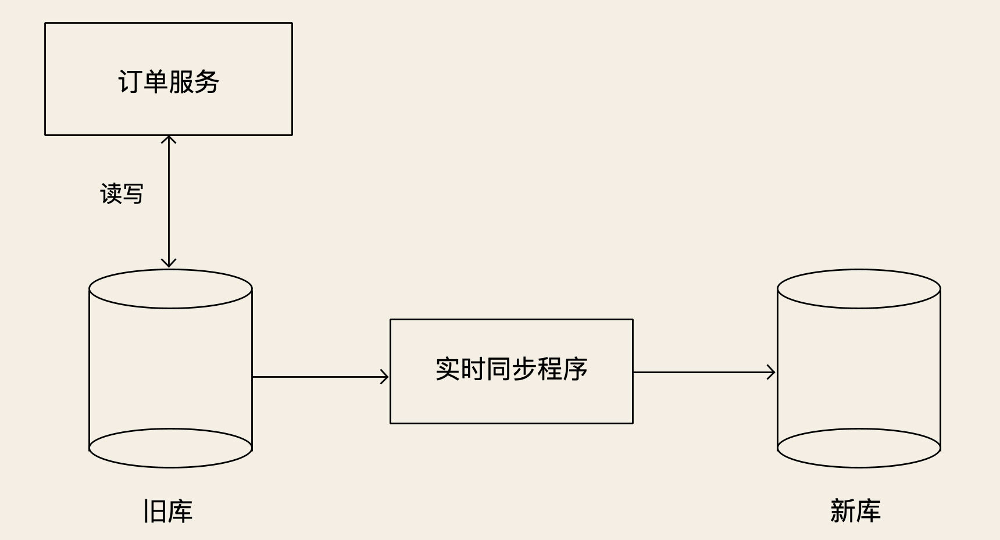
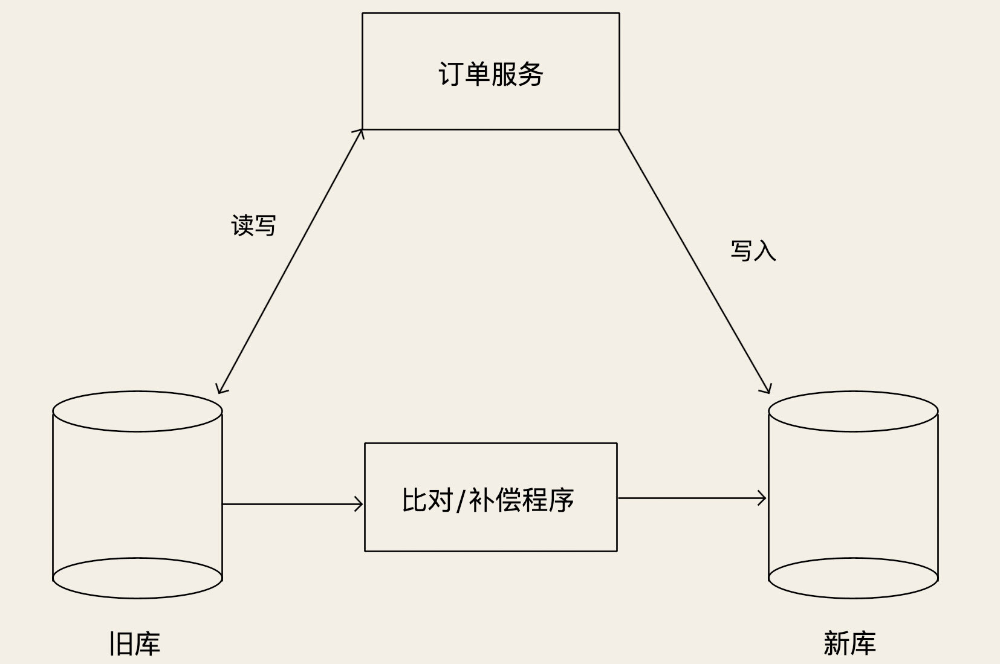

---
date: "2019-06-23"
---  
      
# 20 | 如何在不停机的情况下，安全地更换数据库？
你好，我是李玥。

随着我们的系统规模逐渐增长，总会遇到需要更换数据库的问题。我们来说几种常见的情况。

* 对MySQL做了分库分表之后，需要从原来的单实例数据库迁移到新的数据库集群上。
* 系统从传统部署方式向云上迁移的时候，也需要从自建的数据库迁移到云数据库上。
* 一些在线分析类的系统，MySQL性能不够用的时候，就需要更换成一些专门的分析类数据库，比如说HBase。

更换数据库这个事儿，是一个非常大的技术挑战，因为我们需要保证整个迁移过程中，既不能长时间停服，也不能丢数据。

那么，今天这节课我们就来说一下，如何在不停机的情况下，安全地迁移数据更换数据库。

## 如何实现不停机更换数据库？

我们都知道墨菲定律：“如果事情有变坏的可能，不管这种可能性有多小，它总会发生。”放到这里呢，也就是说，我们在更换数据库的过程中，只要有一点儿可能会出问题的地方，哪怕是出现问题的概率非常小，它总会出问题。

实际上，无论是新版本的程序，还是新的数据库，即使我们做了严格的验证测试，做了高可用方案，刚刚上线的系统，它的稳定性总是没有那么好的，需要一个磨合的过程，才能逐步达到一个稳定的状态，这是一个客观规律。这个过程中一旦出现故障，如果不能及时恢复，造成的损失往往是我们承担不起的。

<!-- [[[read_end]]] -->

所以我们在设计迁移方案的时候，一定要做到，每一步都是可逆的。**要保证，每执行一个步骤后，一旦出现问题，能快速地回滚到上一个步骤**。这是很多同学在设计这种升级类技术方案的时候，容易忽略的问题。

接下来我们还是以订单库为例子，说一下这个迁移方案应该如何来设计。

首先要做的就是，把旧库的数据复制到新库中。因为旧库还在服务线上业务，所以不断会有订单数据写入旧库，我们不仅要往新库复制数据，还要保证新旧两个库的数据是实时同步的。所以，我们需要用一个同步程序来实现新旧两个数据库实时同步。

怎么来实现两个异构数据库之间的数据实时同步，这个方法我们上节课刚刚讲过，我们可以使用Binlog实时同步数据。如果源库不是MySQL的话，就麻烦一点儿，但也可以参考我们讲过的，复制状态机理论来实现。这一步不需要回滚，原因是，只增加了一个新库和一个同步程序，对系统的旧库和程序都没有任何改变。即使新上线的同步程序影响到了旧库，只要停掉同步程序就可以了。

然后，我们需要改造一下订单服务，业务逻辑部分不需要变，DAO层需要做如下改造：

1.  支持双写新旧两个库，并且预留热切换开关，能通过开关控制三种写状态：只写旧库、只写新库和同步双写。
2.  支持读新旧两个库，同样预留热切换开关，控制读旧库还是新库。

然后上线新版的订单服务，这个时候订单服务仍然是只读写旧库，不读写新库。让这个新版的订单服务需要稳定运行至少一到二周的时间，期间除了验证新版订单服务的稳定性以外，还要验证新旧两个订单库中的数据是否是一致的。这个过程中，如果新版订单服务有问题，可以立即下线新版订单服务，回滚到旧版本的订单服务。

稳定一段时间之后，就可以开启订单服务的双写开关了。开启双写开关的同时，需要停掉同步程序。这里面有一个问题需要注意一下，就是**这个双写的业务逻辑，一定是先写旧库，再写新库，并且以写旧库的结果为准**。

旧库写成功，新库写失败，返回写成功，但这个时候要记录日志，后续我们会用到这个日志来验证新库是否还有问题。旧库写失败，直接返回失败，就不写新库了。这么做的原因是，不能让新库影响到现有业务的可用性和数据准确性。上面这个过程如果出现问题，可以关闭双写，回滚到只读写旧库的状态。

切换到双写之后，新库与旧库的数据可能会存在不一致的情况，原因有两个：一是停止同步程序和开启双写，这两个过程很难做到无缝衔接，二是双写的策略也不保证新旧库强一致，这时候我们需要上线一个对比和补偿的程序，这个程序对比旧库最近的数据变更，然后检查新库中的数据是否一致，如果不一致，还要进行补偿。

开启双写后，还需要至少稳定运行至少几周的时间，并且期间我们要不断地检查，确保不能有旧库写成功，新库写失败的情况出现。对比程序也没有发现新旧两个库的数据有不一致的情况，这个时候，我们就可以认为，新旧两个库的数据是一直保持同步的。

接下来就可以用类似灰度发布的方式，把读请求一点儿一点儿地切到新库上。同样，期间如果出问题的话，可以再切回旧库。全部读请求都切换到新库上之后，这个时候其实读写请求就已经都切换到新库上了，实际的切换已经完成了，但还有后续的收尾步骤。

再稳定一段时间之后，就可以停掉对比程序，把订单服务的写状态改为只写新库。到这里，旧库就可以下线了。注意，整个迁移过程中，只有这个步骤是不可逆的。但是，这步的主要操作就是摘掉已经不再使用的旧库，对于在用的新库并没有什么改变，实际出问题的可能性已经非常小了。

到这里，我们就完成了在线更换数据库的全部流程。双写版本的订单服务也就完成了它的历史使命，可以在下一次升级订单服务版本的时候，下线双写功能。

## 如何实现对比和补偿程序？

在上面的整个切换过程中，如何实现这个对比和补偿程序，是整个这个切换设计方案中的一个难点。这个对比和补偿程序的难度在于，我们要对比的是两个都在随时变换的数据库中的数据。这种情况下，我们没有类似复制状态机这样理论上严谨实际操作还很简单的方法，来实现对比和补偿。但还是可以根据业务数据的实际情况，来针对性地实现对比和补偿，经过一段时间，把新旧两个数据库的差异，逐渐收敛到一致。

像订单这类时效性强的数据，是比较好对比和补偿的。因为订单一旦完成之后，就几乎不会再变了，那我们的对比和补偿程序，就可以依据订单完成时间，每次只对比这个时间窗口内完成的订单。补偿的逻辑也很简单，发现不一致的情况后，直接用旧库的订单数据覆盖新库的订单数据就可以了。

这样，切换双写期间，少量不一致的订单数据，等到订单完成之后，会被补偿程序修正。后续只要不是双写的时候，新库频繁写入失败，就可以保证两个库的数据完全一致。

比较麻烦的是更一般的情况，比如像商品信息这类数据，随时都有可能会变化。如果说数据上有更新时间，那我们的对比程序可以利用这个更新时间，每次在旧库取一个更新时间窗口内的数据，去新库上找相同主键的数据进行对比，发现数据不一致，还要对比一下更新时间。如果新库数据的更新时间晚于旧库数据，那可能是对比期间数据发生了变化，这种情况暂时不要补偿，放到下个时间窗口去继续对比。另外，时间窗口的结束时间，不要选取当前时间，而是要比当前时间早一点儿，比如1分钟前，避免去对比正在写入的数据。

如果数据连时间戳也没有，那只能去旧库读取Binlog，获取数据变化，然后去新库对比和补偿。

有一点需要说明的是，上面这些方法，如果严格推敲，都不是百分之百严谨的，都不能保证在任何情况下，经过对比和补偿后，新库的数据和旧库就是完全一样的。但是，在大多数情况下，这些实践方法还是可以有效地收敛新旧两个库的数据差异，你可以酌情采用。

## 小结

设计在线切换数据库的技术方案，首先要保证安全性，确保每一个步骤一旦失败，都可以快速回滚。此外，还要确保迁移过程中不丢数据，这主要是依靠实时同步程序和对比补偿程序来实现。

我把这个复杂的切换过程的要点，按照顺序总结成下面这个列表，供你参考：

1.  上线同步程序，从旧库中复制数据到新库中，并实时保持同步；
2.  上线双写订单服务，只读写旧库；
3.  开启双写，同时停止同步程序；
4.  开启对比和补偿程序，确保新旧数据库数据完全一样；
5.  逐步切量读请求到新库上；
6.  下线对比补偿程序，关闭双写，读写都切换到新库上；
7.  下线旧库和订单服务的双写功能。

## 思考题

我们整个切换的方案中，只有一个步骤是不可逆的，就是由双写切换为单写新库这一步。如果说不计成本，如何修改我们的迁移方案，让这一步也能做到快速回滚？你可以思考一下这个问题，欢迎你在留言区与我交流讨论。

感谢你的阅读，如果你觉得今天的内容对你有帮助，也欢迎把它分享给你的朋友。