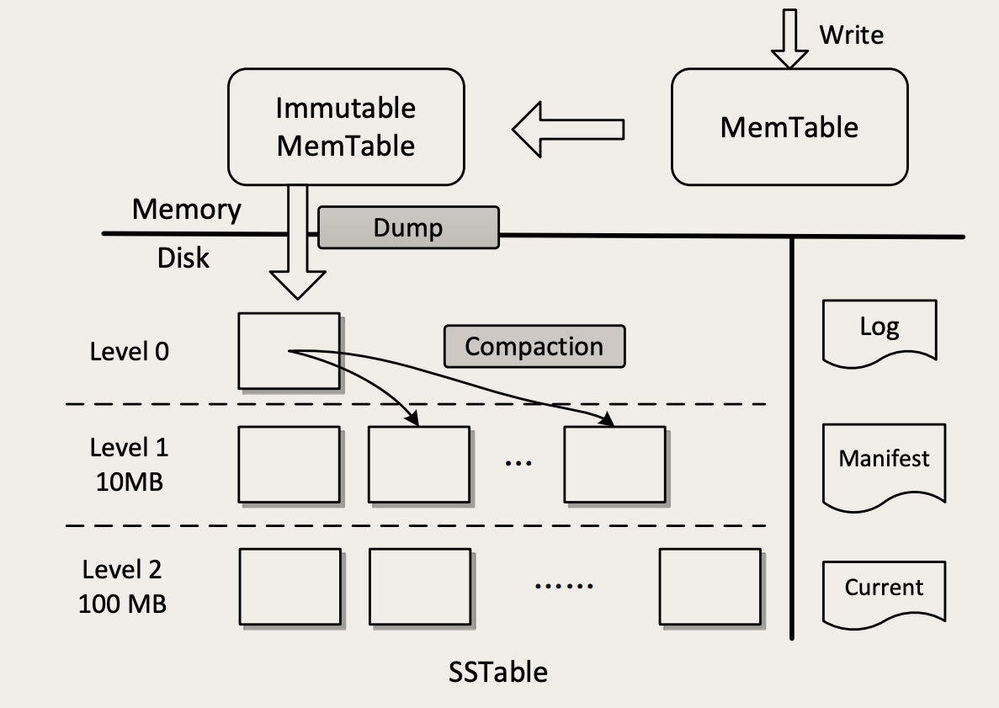

---
date: "2019-06-23"
---  
      
# 24 | RocksDB：不丢数据的高性能KV存储
你好，我是李玥。

上节课我们在讲解CockroachDB的时候提到过，CockroachDB的存储引擎是一个分布式的KV存储集群，它用了一系列成熟的技术来解决集群问题，但是在集群的每个节点上，还需要一个单机的KV存储来保存数据，这个地方CockroachDB直接使用RocksDB作为它的KV存储引擎。

[RocksDB](https://github.com/facebook/rocksdb)是Facebook开源的一个高性能持久化KV存储。目前，你可能很少见到过哪个项目会直接使用RocksDB来保存数据，在未来，RocksDB大概率也不会像Redis那样被业务系统直接使用。那我们为什么要关注它呢？

因为越来越多的新生代数据库，都不约而同地选择RocksDB作为它们的存储引擎。在将来，很有可能出现什么样的情况呢？我们使用的很多不同的数据库，它们背后采用的存储引擎都是RocksDB。

我来给你举几个例子。我们上节课讲到的CockroachDB用到了RocksDB作为它的存储引擎。再说几个比较有名的，[MyRocks](http://myrocks.io/)这个开源项目，你看它这个名字就知道它是干什么的了。它在用RocksDB给MySQL做存储引擎，目的是取代现有的InnoDB存储引擎。并且，MySQL的亲兄弟MariaDB已经接纳了MyRocks，作为它的一个可选的存储引擎。还有大家都经常用的实时计算引擎[Flink](https://flink.apache.org/)，用过的同学都知道，Flink的State就是一个KV的存储，它使用的也是RocksDB。还有包括MongoDB、Cassandra等等很多的数据库，都在开发基于RocksDB的存储引擎。

<!-- [[[read_end]]] -->

今天这节课，我们就一起来了解一下RocksDB这颗“未来之星”。

## 同样是KV存储，RocksDB有哪些不同？

说到KV存储，我们最熟悉的就是Redis了，接下来我们就来对比一下RocksDB和Redis这两个KV存储。

其实Redis和RocksDB之间没什么可比性，一个是缓存，一个是数据库存储引擎，放在一起比就像“关公战秦琼”一样。那我们把这两个KV放在一起对比，目的不是为了比谁强谁弱，而是为了让你快速了解RocksDB能力。

我们知道Redis是一个内存数据库，它之所以能做到非常好的性能，主要原因就是，它的数据都是保存在内存中的。从Redis官方给出的测试数据来看，它的随机读写性能大约在50万次/秒左右。而RocksDB相应的随机读写性能大约在20万次/秒左右，虽然性能还不如Redis，但是已经可以算是同一个量级的水平了。

这里面你需要注意到的一个重大差异是，Redis是一个内存数据库，并不是一个可靠的存储。数据写到内存中就算成功了，它并不保证安全地保存到磁盘上。而RocksDB它是一个持久化的KV存储，它需要保证每条数据都要安全地写到磁盘上，这也是很多数据库产品的基本要求。这么一比，我们就看出来RocksDB的优势了，我们知道，磁盘的读写性能和内存读写性能差着一两个数量级，读写磁盘的RocksDB，能和读写内存的Redis做到相近的性能，这就是RocksDB的价值所在了。

RocksDB为什么能在保证数据持久化的前提下，还能做到这么强的性能呢？我们之前反复讲到过，一个存储系统，它的读写性能主要取决于什么？取决于它的存储结构，也就是数据是如何组织的。

RocksDB采用了一个非常复杂的数据存储结构，并且这个存储结构采用了内存和磁盘混合存储方式，使用磁盘来保证数据的可靠存储，并且利用速度更快的内存来提升读写性能。或者说，RocksDB的存储结构本身就自带了内存缓存。

那我们知道，内存缓存可以很好地提升读性能，但是写入数据的时候，你是绕不过要写磁盘的。因为，要保证数据持久化，数据必须真正写到磁盘上才行。RocksDB为什么能做到这么高的写入性能？还是因为它特殊的数据结构。

大多数存储系统，为了能做到快速查找，都会采用树或者哈希表这样的存储结构，数据在写入的时候，必须写入到特定的位置上。比如说，我们在往B+树中写入一条数据，必须按照B+树的排序方式，写入到某个固定的节点下面。哈希表也是类似，必须要写入到特定的哈希槽中去。

这些数据结构会导致在写入数据的时候，不得不在磁盘上这里写一点儿，再去那里写一点儿，这样跳来跳去地写，也就是我们说的“随机写”。而RocksDB它的数据结构，可以让绝大多数写入磁盘的操作都是顺序写。那我们知道，无论是SSD还是HDD顺序写的性能都要远远好于随机写，这就是RocksDB能够做到高性能写入的根本原因。

那我们在《[21 | 类似“点击流”这样的海量数据应该如何存储？](https://time.geekbang.org/column/article/224162)》这节课中讲到过，Kafka也是采用顺序读写的方式，所以它的读写性能也是超级快。但是这种顺序写入的数据基本上是没法查询的，因为数据没有结构，想要查询的话，只能去遍历。RocksDB究竟使用了什么样的数据结构，在保证数据顺序写入的前提下还能兼顾很好的查询性能呢？这种数据结构就是**LSM-Tree**。

## LSM-Tree如何兼顾读写性能？

LSM-Tree的全称是：**The Log-Structured Merge-Tree**，是一种非常复杂的复合数据结构，它包含了WAL（Write Ahead Log）、跳表（SkipList）和一个分层的有序表（SSTable，Sorted String Table）。下面这张图就是LSM-Tree的结构图（图片来自于论文: [An Efficient Design and Implementation of LSM-Tree based Key-Value Store on Open-Channel SSD](http://ranger.uta.edu/~sjiang/pubs/papers/wang14-LSM-SDF.pdf)）

看起来非常复杂是吧？实际上它的结构比这个图更复杂。那我们尽量忽略没那么重要的细节，把它的核心原理讲清楚。首先需要注意的是，这个图上有一个横向的实线，是内存和磁盘的分界线，上面的部分是内存，下面的部分是磁盘。

我们先来看数据是如何写入的。当LSM-Tree收到一个写请求，比如说：PUT foo bar，把Key foo的值设置为bar。首先，这条操作命令会被写入到磁盘的WAL日志中（图中右侧的Log），这是一个顺序写磁盘的操作，性能很好。这个日志的唯一作用就是用于故障恢复，一旦系统宕机，可以从日志中把内存中还没有来得及写入磁盘的数据恢复出来。这个地方用的还是之前我们多次讲过的复制状态机理论。

写完日志之后，数据可靠性的问题就解决了。然后数据会被写入到内存中的MemTable中，这个MemTable就是一个按照Key组织的跳表（SkipList），跳表和平衡树有着类似的查找性能，但实现起来更简单一些。写MemTable是个内存操作，速度也非常快。数据写入到MemTable之后，就可以返回写入成功了。这里面有一点需要注意的是，**LSM-Tree在处理写入的过程中，直接就往MemTable里写，并不去查找这个Key是不是已经存在了**。

这个内存中MemTable不能无限地往里写，一是内存的容量毕竟有限，另外，MemTable太大了读写性能都会下降。所以，MemTable有一个固定的上限大小，一般是32M。MemTable写满之后，就被转换成Immutable MemTable，然后再创建一个空的MemTable继续写。这个Immutable MemTable，也就是只读的MemTable，它和MemTable的数据结构完全一样，唯一的区别就是不允许再写入了。

Immutable MemTable也不能在内存中无限地占地方，会有一个后台线程，不停地把Immutable MemTable复制到磁盘文件中，然后释放内存空间。每个Immutable MemTable对应一个磁盘文件，MemTable的数据结构跳表本身就是一个有序表，写入的文件也是一个按照Key排序的结构，这些文件就是SSTable。把MemTable写入SSTable这个写操作，因为它是把整块内存写入到整个文件中，这同样是一个顺序写操作。

到这里，虽然数据已经保存到磁盘上了，但还没结束，因为这些SSTable文件，虽然每个文件中的Key是有序的，但是文件之间是完全无序的，还是没法查找。这里SSTable采用了一个很巧妙的分层合并机制来解决乱序的问题。

SSTable被分为很多层，越往上层，文件越少，越往底层，文件越多。每一层的容量都有一个固定的上限，一般来说，下一层的容量是上一层的10倍。当某一层写满了，就会触发后台线程往下一层合并，数据合并到下一层之后，本层的SSTable文件就可以删除掉了。合并的过程也是排序的过程，除了Level 0（第0层，也就是MemTable直接dump出来的磁盘文件所在的那一层。）以外，每一层内的文件都是有序的，文件内的KV也是有序的，这样就比较便于查找了。

然后我们再来说LSM-Tree如何查找数据。查找的过程也是分层查找，先去内存中的MemTable和Immutable MemTable中找，然后再按照顺序依次在磁盘的每一层SSTable文件中去找，只要找到了就直接返回。这样的查找方式其实是很低效的，有可能需要多次查找内存和多个文件才能找到一个Key，但实际的效果也没那么差，因为这样一个分层的结构，它会天然形成一个非常有利于查找的情况：越是被经常读写的热数据，它在这个分层结构中就越靠上，对这样的Key查找就越快。

比如说，最经常读写的Key很大概率会在内存中，这样不用读写磁盘就完成了查找。即使内存中查不到，真正能穿透很多层SStable一直查到最底层的请求还是很少的。另外，在工程上还会对查找做很多的优化，比如说，在内存中缓存SSTable文件的Key，用布隆过滤器避免无谓的查找等来加速查找过程。这样综合优化下来，可以获得相对还不错的查找性能。

## 小结

RocksDB是一个高性能持久化的KV存储，被很多新生代的数据库作为存储引擎。RocksDB在保证不错的读性能的前提下，大幅地提升了写入性能，这主要得益于它的数据结构：LSM-Tree。

LSM-Tree通过混合内存和磁盘内的多种数据结构，将随机写转换为顺序写来提升写性能，通过异步向下合并分层SSTable文件的方式，让热数据的查找更高效，从而获得还不错的综合查找性能。

通过分析LSM-Tree的数据结构可以看出来，这种数据结构还是偏向于写入性能的优化，更适合在线交易类场景，因为在这类场景下，需要频繁写入数据。

## 思考题

我们刚刚讲了LSM-Tree是如何读写数据的，但是并没有提到数据是如何删除的。课后请你去看一下RocksDB或者是LevelDB相关的文档，总结一下LSM-Tree删除数据的过程，也欢迎你在留言区分享你的总结。

感谢你的阅读，如果你觉得今天的内容对你有帮助，也欢迎把它分享给你的朋友。