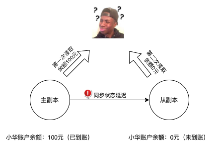

---
date: "2019-06-23"
---  
      
# 特别放送 | 如何平衡存储系统的一致性和可用性？
你好，我是李玥。

非常开心在结课近两年后的今天，我又有机会和你分享这段时间，我对存储技术一点新的思考。

最近我的工作重心有了一些变化，更加关注高可用架构在大规模系统落地工程实践方法。在存储技术领域，对平衡存储系统的一致性和可用性的设计方法，也有了一些新的认知，在这里分享给你。

**无论技术如何发展，保证系统高可用最基础也是最本质的方法从没有改变过。相信你已经猜到这种方法是什么了，是的，就是冗余。**简单地说，冗余就是为你的系统准备多个副本，或者说是多个实例，它们提供同样的服务，共同工作。这样即使其中一个副本或者实例出现了故障，其它的实例仍然可以替这个故障实例承担工作，保证你的系统持续可用。

对于数据库、KV存储等存储系统来说，同样是通过冗余，或者说多副本的方法来实现其高可用架构的。但相比于无状态的系统，有状态的存储系统使用这种冗余的方法时，需要额外维护多个副本上的数据一致性。[第13讲](https://time.geekbang.org/column/article/215383)中，我们讲的MySQL主从同步，以及在这一讲末尾给你总结的复制状态机理论，就是MySQL维护主库和从库数据一致性的方法。

在分布式存储系统中，让系统中多个实例的状态保持一致，是一个比较难处理的问题。尤其是当系统出现故障时，系统能否始终保持一致性，很大程度上影响了系统的可用性和数据的可靠性。

<!-- [[[read_end]]] -->

典型的由不一致导致的重大事故是这样的：正常情况下，系统通过某种数据同步机制保持各实例上状态的一致性，当发生实例宕机、网络分区等故障时，这种同步机制无法正常工作，一致性被打破。

这种情况下，出现了多份不一致的状态数据，系统很难自动去判断到底哪份状态数据才是“正确的”，也就没有办法自动恢复。更糟糕的是，一旦这种不一致的状态被其它系统读取，错误的状态将被传递到其它系统中，造成不可预期的结果。这种复杂的数据错误，即使人工处理也是非常难恢复，往往恢复时间需要几小时或几天，严重情况下甚至于无法恢复。

可以看出，在故障情况下仍然保持一致性，是系统能快速从故障中恢复的前提条件，有助于提升系统的可用性。但为了保证一致性，在数据更新时，往往需要协调参与的各个模块，确保它们同步更新。比如，使用各种分布式事务。但这会导致这些模块在可用性上紧密耦合在一起，反而降低了系统的可用性。这种场景下，可用性和一致性又存在矛盾。

接下来我将和你一起，从高可用视角来重新审视数据一致性问题，讨论如何在可用性和一致性上取得相对的平衡。

## 如无必要，勿增副本

在考虑如何平衡一致性与可用性之前，最重要的是要意识到，在分布式系统中解决一致性问题需要付出非常大的代价，这些代价可能包括：可用性降低、性能下降、用户体验变差或者是极大的增加了系统的复杂度。

因此，不要人为制造一致性难题。但是，很多情况下，因为缺少这方面的意识，我们无意间为系统制造了本无必要的一致性难题，然后又付出了巨大的代价去解决这个难题，得不偿失。

为系统中的状态数据设计多个副本的情况并不罕见，常见的多副本设计包括：

* 以不同格式或数据结构存储多个副本。
* 在不同类型的外部存储中存储多个副本。
* 在本地磁盘或内存中缓存数据的副本。  
  以上这些都是我们时常会用到的设计模式，难道说它们都是“不好的设计”么？

当然不是这样的。

架构设计是平衡的艺术，当架构师选择某种设计或架构时，一定要充分了解当前选择的优势和代价，确保优点是我们所需要的，代价是我们能接受的。这样的设计才是在当前场景下最优的选择。

为数据增加副本会带来一致性难题，开发者需要为此付出巨大的代价去维护数据一致性。所以，在设计过程中需要慎重考虑，为系统增加副本所带来的收益和付出的代价，二者相比是不是值得做出这样的选择。

**我们需要避免的是，在设计过程中未经仔细思考随意增加副本的行为。**

这里，我和你分享几个常见的错误示例：

* 仅仅是为了写代码的时候更方便地读取数据，就随意增加副本。比如，为了便于查询，将数据库中A表中的部分字段，在B表中也保存一份。
* 系统中存在多个外部存储，为了读写方便，在每个外部存储都保存一份数据副本。比如，集群的元数据保存在ZooKeeper中，为了方便管理控制台操作，也在MySQL中保存一份同样的数据。
* 不考虑系统的性能实际要求，为了让系统速度更快一些，在Redis和内存中缓存数据。

## 一致性与可用性的矛盾

在现有硬件技术条件下，对分布式系统中每个节点更新操作，总会有先后，不可能做到绝对的“同时”，也就无法保证系统的多个副本在“任何时刻”状态都相同。

因此，**这里我们讨论的一致性是，系统作为一个整体对外部所表现出的一致性**。换句话说就是，分布式系统内部可以存在不一致的状态，但只要这种不一致的状态对外部是不可见的，那就可以认为这个系统具备一致性。

在分布式系统中，既要保证高可用又要保证一致性是几乎不可能实现的。我们把分布式系统抽象成最简单的模型：一个只有两个有状态节点系统。然后在这个最简模型下来分析一致性问题：如何保证这两个节点上的状态，在任何时刻都是相同的？

即使在这样一个最简模型下，**保持一致性仍然面临下面的3个难题**。

**第一个难题是，如何处理更新操作失败的情况**。

要保持两个节点上状态的一致性，理论上需要每次更新状态时同步更新两个节点上的状态。如果某一个节点上的更新操作失败了，系统将变成如下不一致的状态：一个节点更新成功，而另外一个节点更新失败。在这种情况下，还要保持系统的一致性，就需要将这种不一致状态隔离在系统内部，不能让外部系统感知，并且尽快修复不一致的状态。

要修复这种不一致状态，一般有两种方法，分别是重试和回滚。

* 重试指的是，让失败的节点重新执行更新操作。如果重试成功，系统将重新回到一致的状态。
* 回滚指的是，让之前更新成功的节点执行回滚操作，回到更新前的状态，也可以让系统重新回到一致状态。  
  但重试和回滚的实现代价都很大。

通过重试来解决一致性的前提是，被重试的更新操作必须具备幂等性和原子性。幂等性，可以保证多次重试同一个更新操作不会改变状态的正确性；原子性，则可以避免在更新具有复杂数据结构的状态失败时，只更新了部分状态的尴尬局面。如果系统的状态不是保存在关系型数据库中，要实现幂等性和原子性其实很不容易。

实现回滚同样要保证原子性，此外为了能将状态恢复到更新之前，需要在执行更新操作之前记录原始状态，系统还要考虑如何处理回滚失败的问题。

**第二个难题是，如何在其中一个节点不可用的情况下保证系统一致性。**

当系统其中的一个节点不可用时，另外一个节点仍然可以提供读写服务。当故障节点恢复后，理论上只要把状态数据从可用节点同步到之前故障的节点上，系统就可以重新回到一致性状态了。而在现实中实现好数据同步，既要做到快速同步，又要保证不重不漏，难度和代价都比较大。

最简单的方法是全量数据同步，清空故障节点上的状态数据，然后将可用节点上的状态数据全部复制到故障节点上。全量同步相对比较耗时，如果数据量比较大，就必须采用增量同步的方法。

而增量同步，则需要精准地界定出哪些数据属于“增量数据”。这对于大多数采用多线程并行处理请求的服务来说，几乎不可能实现。同时，另一个不得不考虑的极端情况是，如果在一段时间内两个节点交替多次出现不可用的情况，系统将很难判定哪个节点上的状态才是“正确可信的状态”，也就无法恢复系统的一致性状态。

**第三个难题是，如何在网络分区情况下保证系统的一致性。**

网络分区，指的是由于网络设备故障，造成网络分裂为多个独立的区域。典型场景是两个机房间的网络中断，这两个机房就形成了两个互不联通的分区。

假设发生了网络分区，系统的两个节点恰巧分别位于不同分区，这种情况下，虽然没有节点不可用，但节点间无法通信，也就无法保证系统一致性。如果系统不能容忍“不一致”，唯一的办法就是在网络分区期间停止对外提供服务，也就是说需要牺牲“可用性”。

上面我们讨论的情况，就是著名的CAP理论的一种典型场景：在网络分区的情况下，一致性和可用性只能二选其一。

鉴于一致性与可用性存在冲突，以及实现一致性的代价过高这两个原因，在设计分布式系统时，**放弃对严格一致性的约束，让系统去适应相对宽松一致性，从而在一致性、可用性和性能上取得相对可接受的平衡，是更加理性的选择。**

所谓“宽松一致”，是在隔离性和性能等方面适当放宽要求后的一系列降级版一致性。相对的，我们之前讨论的一致性，也被称为“强一致”。最终一致是普遍采用的一种宽松一致。

比如上面的例子，在网络分区的情况下，如果可以接受最终一致，则系统仍然可以在其中的一个分区提供提供读写服务，另一个分区提供只读服务，极大增强系统的可用性。只要待网络故障结束后，再通过单向数据同步即可恢复系统一致性。

## 在一致性与可用性之间保持平衡

牺牲强一致后，当系统故障时，由于系统存在多个副本，就比较容易继续维持可用性。无论是发生网络故障还是服务器宕机，只要调用端还能访问某个存活的副本，系统仍然可以提供服务。

BASE给出了一种平衡一致性和可用性的策略，这种策略适用范围广泛，实现难度不大，在一致性和可用性上都有不错的表现。BASE是“**基本可用（Basically Available）**”“**软状态（Soft State）**”和“**最终一致（Eventually Consistent）**”这三个词的缩写。

其中：

* 基本可用是对可用性的妥协，指的是在故障时，系统以响应时间变长、部分功能不可用或者部分请求失败为代价，换取整个系统仍然可以提供基本的服务能力。
* 软状态和最终一致则是对一致性的妥协。具体地说，就是牺牲了原子性和隔离性，允许系统内出现外部可见的“中间状态”，但需要在短时间内恢复为一致状态，达成最终一致。  
  在多个组件构成的分布式系统中，如果某个组件在设计上降低了可用性和一致性的等级，依赖这个组件的其它组件或外部服务为了能够兼容这种降级设计，往往需要付出额外的代价。因此，**设计者需要针对系统的实际情况来权衡决策，谨慎降级可用性和一致性。基本可用不等于不可用，最终一致也不等于不一致。**

接下来，我将和你介绍实践BASE理论的常用方法和常见误区。

“最终一致”允许不一致的中间状态被外部可见，但需要在短时间内恢复为一致状态。这里面的“短时间”能否量化呢？

要回答这个问题，我们需要分系统正常和故障二种情况来分别讨论。

在系统正常时，**达成最终一致的时间要求是“在系统外部几乎不可感知”**，具体来说应该与需要同步状态的节点之间的网络时延差不多。比如，如果系统的节点都部署在同一个数据中心内，达成最终一致的时延不应超过几个毫秒；对于一个全球部署的系统，达成最终一致的时延可能需要几十至几百毫秒。在系统发生网络分区故障时，为了尽可能保证系统的可用性，需要进一步牺牲达成最终一致的时延，最长可能需要等到故障恢复后系统才能达成最终一致。

图1 系统故障时需要更长的时间达成最终一致

**牺牲一致性需要守住两个底线：防止脑裂和要保证单调读写。**

我们首先来讨论底线一：防止脑裂。

例如，传统MySQL主从结构中，如果主库宕机，或者网络分区导致无法访问主库，也不应该去更新从库中的数据，否则在故障结束后，系统面对主库和从库二份不一样的数据，是无法自动恢复的。这种情况被称为“脑裂（Split-brain）”，出现脑裂后，理论上系统的一致性不可恢复。

工程实践中，一般都需要人工介入，借助数据的业务属性（比如，同一订单支付操作一定早于发货操作，则可以判断“已发货”状态是比“已支付”更新的状态），才有可能完成数据的一致性修复。

特别注意的是，**不应该以状态更新的时间戳来判断状态数据的新旧并用于恢复一致性**。状态数据中记录的时间戳来自客户端或服务端应用所在的多个节点，而现有的时间同步技术所能保证的误差（10\~500ms）过大，所以用时间戳来判断状态新旧极其不可靠。人工恢复脑裂的代价往往是“部分数据丢失”和“更长的故障恢复时长”。

那么，如何防止脑裂呢？

在我看来，关键是确保故障后能够恢复最终一致。其前提则是，系统需要具备足够的信息，以判断出最新的状态。然后才能将所有副本的状态都恢复至这一状态。在系统故障时，即使为了保证可用性，也不应该违反更新操作的一致性约束。

这里，“更新操作的一致性约束”指的是，系统为了保证一致性，而对状态更新操作施加的约束条件。比如，最简单的主从模式下，只能通过主副本更新状态，无论任何原因无法更新主副本，那就要让本次更新失败，牺牲更新操作的可用性。

Paxos等一致性协议，采用了多数派（Quorum）机制保证更新操作的一致性。简单地说，就是每次更新操作必须在超过半数的副本上达成一致才算更新成功，如果在系统故障时，更新请求不能达成多数派一致，也必须让本次更新失败。

接下来，我们讨论单调读写。

最终一致系统在故障时，为了保证系统持续可用，应允许客户端从任意一个尚可访问的节点上读取状态数据。尽管这个时候，客户端读到的可能并非最新状态。对于绝大多数系统来说，短时间内读到一个并非最新状态都是可接受的。

先来看第一个例子。小明用手机银行给小华转了100元，当小明完成了转账操作后，实际上这笔钱已经转入到小华的账户。如果这个时候因为系统故障，小华的手机银行上显示尚未到账，然后过了一段时间之后才显示到账，也并非是完全不可接受。

然后我们再来看第二个例子，同样还是以小明给小华转账来说明。如图二所示，在一个只有主从二副本的最终一致性系统中，转账成功后主副本的状态已更新，小明转给小华的钱已到账，小华的账户余额是100元。但由于同步延迟，从副本中转账还未到账，小华的账户余额还是0元。

假设小华第一次查询账户的请求被分配到主副本上，App显示余额100元。小华再次查询，这次查询请求被分配到了从副本上，App显示余额0元！刚到账的钱没了！对小明来说也可能出现类似的问题，转账成功后再查询账户，如果这个查询请求被分配到了从副本上（这在配置了读写分离的数据库集群上是默认的行为），发现账户余额并没有减少，小明以为转账没成功，再次发起了转账，结果多转了100元。

以上这两种情况，对外部系统来说无法判断读到的状态是否准确，显然是不可接受的。

图2 状态时序错乱问题

要避免这两个问题，就需要保证在客户端视角的一致性。所谓单调读写，要求对每一个客户端来说，每次读到的状态不能比上次一读写到的状态更旧。简单的说就是“**不能时序错乱**”。实现单调读写有两种常用的方法。

**第一种方法是通过保持会话（Sticky Session）的方式**，让同一个客户端的请求总是由与之建立会话的那个特定的服务端节点（副本）处理。客户端只与服务端一个节点交互，自然就不会出现“时序错乱”的问题。

保持会话的方式实现比较简单，很多网关都内置了保持会话的功能。如果系统是通过网关对外提供服务，则可以直接使用。即使系统没有使用网关，只要在客户端首次连接成功时，返回服务端节点的唯一标识（ID）或URL给客户端，后续客户端就可以用这个ID或URL继续访问同一个服务端节点了。

但保持会话这种实现方式的问题是，在系统故障时需要降级。如果客户端连不上会话中的那个服务端节点，只能选择去连接其它服务端节点创建新的会话。这个会话切换的过程中，仍然存在时序错乱的可能性。

幸运的是时序错乱只可能发生在会话切换过程中，而会话切换只在系统故障时才发生，发生概率很低。而且，客户端是可以感知到会话切换，从而主动从业务逻辑上做一些补偿。此外，因为需要维持会话，无法使用负载均衡策略，系统的弹性（Elasticity）将受到很大的限制，容易出现热点问题，并且扩缩容也会受到会话的限制。

**另一种方法是，通过记录和比较状态的版本号来实现单调读写**。

系统需要为状态数据维护一个版本号系统，状态版本号是状态的一部分，并且要确保每次状态更新，对应版本号都单调递增。这个状态版本号的目的是，标记状态更新的先后顺序，在英文中也称为Ephoc或者Logical timestamps。

客户端需要记录上一次读写状态的版本号，然后在每一次读取状态之前比对本次版本号和上次版本号，如果本次版本号不小于上次版本号，就可以认为本次读取的状态是可信的。否则，需要丢弃本次读取结果，等待一会儿或者连接其它服务端重试，以获取新版本的状态数据。通过状态版本号的方式实现单调读写，可以完美地保证客户端视角的一致性，但服务端的实现则更加复杂。

## 小结

今天这节课的分享就到这里了，我们来回顾下核心内容。

在分布式系统中，平衡可用性和一致性是一个难题，因此在设计过程中，需要避免未经仔细思考而随意增加副本的行为。

我们推荐设计者在设计系统一致性时能够兼容最终一致，这样可以极大提升系统在面临故障时保持高可用的难度，在一致性和可用性上取得相对较好的平衡。但系统最终一致也不等于不一致，需要防止系统出现脑裂，并通过单调读写保证客户端视角的一致性。

## 思考题

有些系统为了保证最终一致性，会在系统外增加一层防御性设计。定期比对各副本状态数据的一致性，用于自动发现和修复状态数据不一致的问题。

请你思考一下这种防御性的设计，是必要的么？