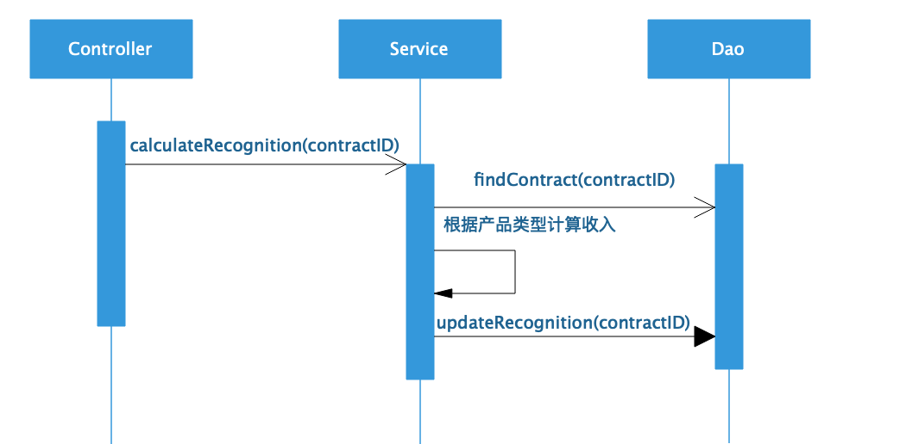
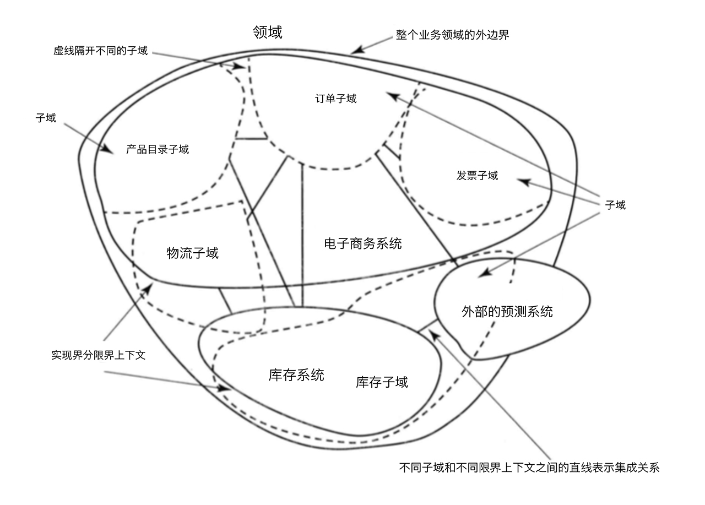
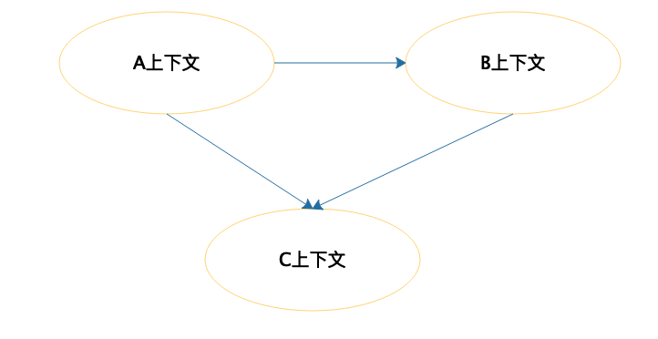
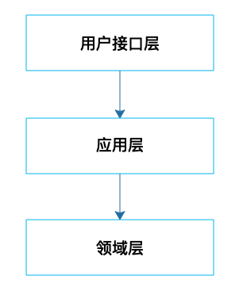

---
date: "2019-06-23"
---  
      
# 20 | 领域驱动设计：35岁的程序员应该写什么样的代码？
我在阿里巴巴工作的头一年，坐在我对面的同事负责开发一个公司统一的运维系统。他对这个系统经过谨慎的调研和认真的思考，花费了半年多的时间开发，终于开发完了。然后邀请各个部门的相关同事做发布评审，如果大家没什么意见就发布上线，全公司范围统一推广使用。

结果在这个发布会上，几乎所有部门的同事都提出了不同的意见：虽然这个功能是我们需要的，但是那个特性却是不能接受的，我们以往不是这样的……

最糟糕的是，不同部门的这个功能和那个特性又几乎不相同。最终讨论的结果是，这个系统不发布推广，需要重新设计。

这个同事又花了几个月的时间尝试满足所有部门的不同的需求，最终发现无法统一这些功能需求，于是辞职了……

他离职后，有次会上我们又讨论起这个项目为什么会失败，其中有个同事的话让我印象深刻，他的话的大意是：如果你对自己要开发的业务领域没有清晰的定义和边界，**没有设计系统的领域模型**，而仅仅跟着所谓的需求不断开发功能，一旦需求来自多个方面，就可能发生需求冲突，或者随着时间的推移，前后功能也会发生冲突，这时你越是试图弥补这些冲突，就越是陷入更大的冲突之中。

回想一下我经历的各种项目，似乎确实如此。用户或者产品经理的需求零零散散，不断变更。工程师在各处代码中寻找可以实现这些需求变更的代码，修修补补。软件只有需求分析，并没有真正的设计，系统没有一个统一的领域模型维持其内在的逻辑一致性。功能特性并不是按照领域模型内在的逻辑设计，而是按照各色人等自己的主观想象设计。项目时间一长，各种困难重重，需求不断延期，线上bug不断，管理者考虑是不是要推到重来，而程序员则考虑是不是要跑路。

<!-- [[[read_end]]] -->

## 领域模型模式

目前企业级应用开发中，业务逻辑的组织方式主要是**事务脚本**模式。事务脚本按照业务处理的过程组织业务逻辑，每个过程处理来自客户端的单个请求。客户端的每次请求都包含了一定的业务处理逻辑，而程序则按照每次请求的业务逻辑进行划分。

事务脚本模式典型的就是Controller→Service→Dao这样的程序设计模式。Controller封装用户请求，根据请求参数构造一些数据对象调用Service，Service里面包含大量的业务逻辑代码，完成对数据的处理，期间可能需要通过Dao从数据库中获取数据，或者将数据写入数据库中。

比如这样一个业务场景：每个销售合同都包含一个产品，根据销售的不同产品类型计算收入，当用户支付的时候，需要计算合同收入。

按照事务脚本模式，也就是我们目前习惯的方法，程序设计可能是这样的：

用户发起请求到Controller，Controller调用Service的calculateRecognition方法，并将合同ID传递过去计算确认收入。Service根据合同ID调用Dao查找合同信息，根据合同获得产品类型，再根据产品类型计算收入，然后把确认收入保存到数据库。

这里一个很大的问题在于，不同产品类型收入的计算方法不同，如果修改计算方法，或者增加新的产品类型，都需要修改这个Service类，随着业务不断复杂，这个类会变得越来越难以维护。

在这里，Service只是用来放收入计算方法的一个类，并没有什么设计的约束。如果有一天，另一个客户端需要计算另一种产品类型收入，很大可能会重新写一个Service。于是，相同的业务在不同的地方维护，事情变得更加复杂。

由于事务脚本模式中，Service、Dao这些对象只有方法，没有数值成员变量，而方法调用时传递的数值对象没有方法（或者只有一些getter、setter方法），因此事务脚本又被称作**贫血模型**。

**领域模型**模式和事务脚本模式不同。在领域模型模式下，业务逻辑围绕领域模型设计。比如收入确认是和合同强相关的，是合同对象的一个职责，那么合同对象就应该提供一个calculateRecognition方法计算收入。

领域模型中的对象和事务脚本中的对象有很大的不同，比如事务脚本中也有合同Contract这个对象，但是这个Contract只包含合同的数据信息，不包含和合同有关的计算逻辑，计算逻辑在Service类里。

而领域模型的对象则包含了对象的数据和计算逻辑，比如合同对象，既包含合同数据，也包含合同相关的计算。因此从面向对象的角度看，领域模型才是真正的面向对象。如果用领域模型设计上面的合同收入确认，是这样的：

计算收入的请求直接提交给合同对象Contract，这个时候，就无需传递合同ID，因为请求的合同对象就是这个ID的对象。合同对象聚合了一个产品对Product，并调用这个product的calculateRecognition方法，把合同对象传递过去。不同产品关联不同的收入确认策略recognitionStrategy，调用recognitionStrategy的calculateRecognition，完成收入对象revenueRecognition的创建，也就完成了收入计算。

这里Contract和Product都是领域模型对象，**领域模型是合并了行为和数据的领域的对象模型**。通过领域模型对象的交互完成业务逻辑的实现，也就是说，设计好了领域模型对象，也就设计好了业务逻辑实现。和事务脚本被称作贫血模型相对应的，领域模型也被称为充血模型。

对于复杂的业务逻辑实现来说，用领域模型模式更有优势。特别是在持续的需求变更和业务迭代过程中，把握好领域模型，对业务逻辑本身也会有更清晰的认识。使用领域模型增加新的产品类型的时候，就不需要修改现有的代码，只需要扩展新的产品类和收入策略类就可以了。

在需求变更过程中，如果一个需求和领域模型有冲突，和模型的定义以及模型间的交互逻辑不一致，那么很有可能这个需求本身就是伪需求。很多看似合理的需求其实和业务的内在逻辑是有冲突的，这样的需求也不会带来业务的价值，通过领域模型分析，可以识别出这样的伪需求，使系统更好地保持一致性，也可以使开发资源投入到更有价值的地方去。

## 领域驱动设计（DDD）

前面我讲到领域模型模式，那么如何用领域模型模式设计一个完整而复杂的系统，有没有完整的方法和过程指导整个系统的设计？领域驱动设计，即DDD就是用来解决这一问题的。

**领域**是一个组织所做的事情以及其包含的一切，通俗地说，就是组织的业务范围和做事方式，也是软件开发的目标范围。比如对于淘宝这样一个以电子商务为主要业务的组织，C2C电子商务就是它的领域。**领域驱动设计就是从领域出发，分析领域内模型及其关系，进而设计软件系统的方法。**

但是如果我们说要对C2C电子商务这个领域进行建模设计，那么这个范围就太大了，不知道该如何下手。所以通常的做法是把整个领域拆分成多个**子域**，比如用户、商品、订单、库存、物流、发票等。强相关的多个子域组成一个**限界上下文**，限界上下文是对业务领域范围的描述，对于系统实现而言，可以想象成相当于是一个子系统或者是一个模块。限界上下文和子域共同组成组织的领域，如下：

不同的限界上下文，也就是不同的子系统或者模块之间会有各种的交互合作。如何设计这些交互合作呢？DDD使用**上下文映射图**来完成，如下：

在DDD中，领域模型对象也被称为**实体**，每个实体都是唯一的，具有一个唯一标识，一个订单对象是一个实体，一个产品对象也是一个实体，订单ID或者产品ID是它们的唯一标识。实体可能会发生变化，比如订单的状态会变化，但是它们的唯一标识不会变化。

**实体设计**是DDD的核心所在，首先通过业务分析，识别出实体对象，然后通过相关的业务逻辑设计实体的属性和方法。这里最重要的，是要把握住实体的特征是什么，实体应该承担什么职责，不应该承担什么职责，分析的时候要放在业务场景和限界上下文中，而不是想当然地认为这样的实体就应该承担这样的角色。

事实上，并不是领域内的对象都应该被设计为实体，DDD推荐尽可能将对象设计为**值对象**。比如像住址这样的对象就是典型的值对象，也许建在住址上的房子可以被当做一个实体，但是住址仅仅是对房子的一个描述，像这样仅仅用来做度量或描述的对象应该被设计为值对象。

值对象的一个特点是不变性，一个值对象创建以后就不能再改变了。如果地址改变了，那就是一个新地址，而一个订单实体则可能会经历创建、待支付、已支付、代发货、已发货、待签收、待评价等各种变化。

领域实体和限界上下文包含了业务的主要逻辑，但是最终如何构建一个系统，如何将领域实体对外暴露，开发出一个完整的系统。事实上，DDD支持各种架构方案，比如典型的**分层架构**：

领域实体被放置在领域层，通过应用层对领域实体进行包装，最终提供一组访问接口，通过接口层对外开放。

**六边形架构**是DDD中比较知名的一种架构方式，领域模型通过应用程序封装成一个相对比较独立的模块，而不同的外部系统则通过不同的适配器和领域模型交互，比如可以通过HTTP接口访问领域模型，也可以通过Web Service或者消息队列访问领域模型，只需要为这些不同的访问接口提供不同的适配器就可以了。

领域驱动设计的技术体系内还有其他一些方法和概念，但是最核心的还是领域模型本身，**通过领域实体及其交互完成业务逻辑处理才是DDD的核心目标**。至于是不是用了CQRS，是不是事件驱动，有没有事件溯源，并不是DDD的核心。

## 小结

回到我们的题目，一个35岁的程序员应该写什么样的代码？如果一个工作十多年的程序员，还是仅仅写一些跟他工作第一年差不多的CRUD代码。那么他迟早会遇到自己的职业危机。公司必然愿意用更年轻、更努力，当然也更低薪水的程序员来代替他。至于学习新技术的能力，其实多年工作经验也并没有太多帮助，有时候也许还是劣势。

在我看来，35岁的程序员真正有优势的是他在一个业务领域的多年积淀，对业务领域有更深刻的理解和认知。

那么如何将这些业务沉淀和理解反映到工作中，体现在代码中呢？也许可以尝试探索领域驱动设计。如果一个人有多年的领域经验，那么必然对领域模型设计有更深刻的认识，把握好领域模型在不断的需求变更中的演进，使系统维持更好的活力，并因此体现自己真正的价值。

## 思考题

你觉得大龄程序员的优势是什么？如何在公司保持自己的优势和地位？

欢迎你在评论区写下你的思考，也欢迎把这篇文章分享给你的朋友或者同事，一起交流一下。