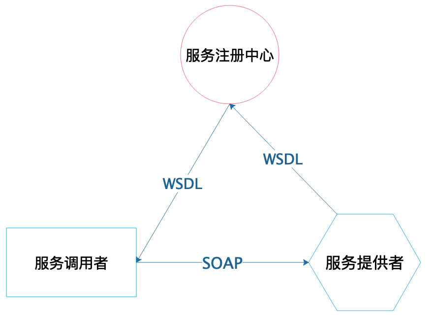
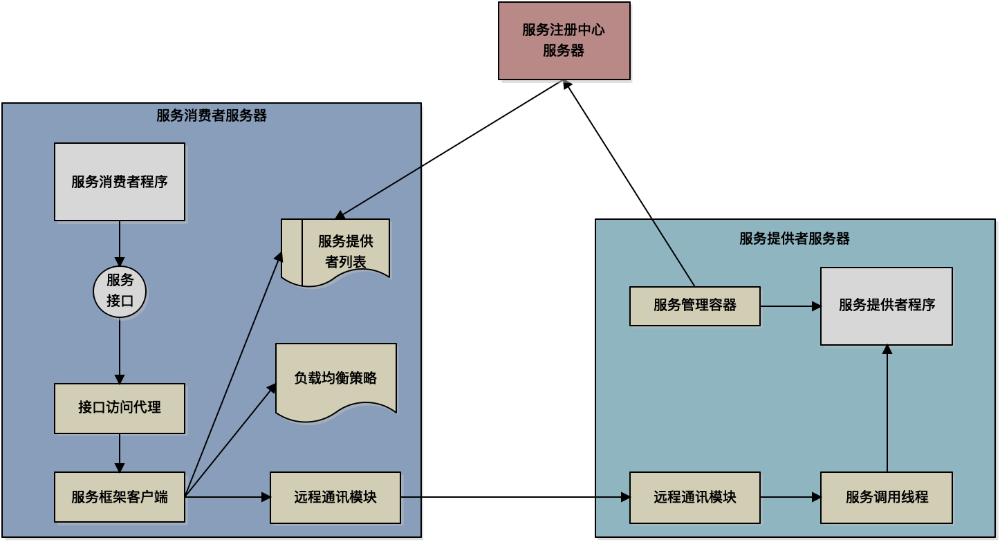

---
date: "2019-06-23"
---  
      
# 27 | 微服务架构：微服务究竟是灵丹还是毒药？
微服务架构是从单体架构演化而来的。所谓单体架构，指的就是整个互联网系统所有代码打包在一个程序中，部署在一个集群上，一个单体应用构成整个系统。

而微服务架构则是将这个大的应用里面的一些模块拆分出来，这些模块独立部署在一些相对较小的服务器集群上，而应用通过远程调用的方式依赖这些独立部署的模块，完成业务处理。这些被独立部署的模块就被称为微服务，而这样的应用架构也被称为微服务架构。

应该说，模块化、低耦合一直以来都是软件设计追求的目标，独立部署的微服务使模块之间的依赖关系更加清晰，也更加隔离，使系统易于开发、维护，代表了正确的技术方向。但是在实践中，有时候却会出现这样的情况：用了微服务，系统反而变得更加难以开发、维护。技术团队痛苦不堪，觉得是微服务的锅，主张放弃微服务，退回到单体架构。

那么，究竟该不该上微服务？微服务是灵丹还是毒药？

## 单体架构的困难和挑战

阿里巴巴大约是国内最早尝试微服务的企业之一。让我们先回顾一下这段历史，看看当年阿里巴巴为什么要上微服务架构？微服务架构能解决什么问题？用好微服务需要做哪些准备？

阿里巴巴开始尝试微服务架构大约是在08年，在此之前，一个网站就是一个大应用，一个用Java开发的war包就包含了整个应用。系统更新的时候，即使只是更新其中极小的一部分，也要重新打包整个war包，发布整个系统。

<!-- [[[read_end]]] -->

随着业务的不断发展，这样的单体巨无霸系统遇到了越来越多的困难。

### 编译、部署困难

一个应用系统一个war包，这个war包可能有几个G大。对于开发工程师来说，开发编译和部署都是非常困难的，当时我用自己的电脑编译这个war包，大约需要半个多小时。工程师在开发的过程中，即使只改了庞大系统中的一行代码，也必须重新打包完整的系统，才能做开发测试。这样的单体系统对于开发部署和测试都是非常困难的，有时候甚至一天都写不了几行代码。

### 代码分支管理困难

因为单体应用非常庞大，所以代码模块也是由多个团队共同维护的。但最后还是要编译成一个单体应用，统一发布。这就要求把各个团队的代码merge在一起，这个过程很容易发生代码冲突。而merge的时候又是应用要发布的时候，发布过程本来就复杂，再加上代码merge带来的问题，各种情况纠缠在一起，极易出错。所以，在单体应用时代每一次应用发布，都需要搞到深更半夜。

### 数据库连接耗尽

对于一个巨型的应用而言，因为有大量的用户进行访问，所以必须把应用部署到大规模的服务器集群上。然后每个应用都需要与数据库建立连接，大量的应用服务器连接到数据库，会对数据库的连接产生巨大的压力，某些情况下甚至会耗尽数据库的连接。

### 新增业务困难

因为所有的业务都耦合在一个单一的大系统里，随着时间的发展，这个系统会变得非常的复杂，想要维护这样一个系统是非常困难和复杂的。很多工程师入职公司半年，都还不能熟悉业务，于是熟悉系统的老员工们忙得要死，加班加点干活，不熟悉系统的新员工们一帮忙就出乱，跟着加班加点地干活。整个公司热火朝天地干活，但最后还是常常出故障，新的功能迟迟不能上线。

### 发布困难

因为单体系统一个war包就包含了所有的代码，新版本发布的时候，即使跟自己开发的代码一点关系没有，但就因为包含了自己的代码，以防万一，所有开发工程师都不得不跟着发布值班，结果真正更新代码功能的只有几个人，而整个部门都要跟着加班。有代码更新的同事汗流浃背进行代码冲突处理和修复发布bug，没有代码更新的同事陪着聊天、打瞌睡、打游戏。

这些单体架构带来的困难，很多工程师自身都是有切身体会的。所以，在开始进行微服务架构重构的时候，虽然也遇到了很多挑战和困难，但是大家为了自身的利益，还是团结一致，成功实施了微服务架构重构。

## 微服务框架原理

当时，阿里自己开发了一个微服务框架实施微服务架构重构，这个微服务框架就是后来很著名的Dubbo。Dubbo应该说是借鉴了此前更早的SOA架构方案，即面向服务的体系架构。

在面向服务的体系架构里面，服务提供者向注册中心注册自己的服务，而服务调用者到注册中心去发现服务，发现服务以后，根据服务注册中心提供的访问接口和访问路径对服务发起请求，由服务的提供者完成请求，返回结果给调用者。后来的各种微服务框架，其实都可以认为是SOA架构的一种实现。但是在早期的SOA架构实践中，WSDL、SOAP这些协议都比较重，服务的注册与发现描述协议很复杂，服务的调用效率也比较低。

Dubbo在借鉴SOA架构的基础上进行了优化，抛弃了SOA一些不必要的规范约束，使用二进制协议进行服务注册与调用，执行效率和使用的简洁性都得到了极大提升。

Dubbo架构和SOA架构一样，最核心的组件也是3个，分别是服务提供者、服务消费者和服务注册中心。

服务的提供者顾名思义就是微服务的具体提供者，通过微服务容器对外提供服务，而服务的消费者就是应用系统或是其他的微服务。

具体过程是服务的提供者程序在Dubbo的服务容器中启动，通过服务管理容器向服务注册中心进行注册，声明服务提供者提供的接口参数和规范，并且注册自己所在服务器的IP地址和端口。

服务的消费者如果想要调用某个服务，只需依赖服务提供者的接口进行编程即可。而服务接口通过Dubbo框架的代理访问机制，调用Dubbo的服务框架客户端，服务框架客户端会根据服务接口声明，去注册中心查找对应的服务提供者启动在哪些服务器上，并且将这个服务器列表返回给客户端。客户端根据某种负载均衡策略，选择某一个服务器，通过远程通讯模块发送具体的服务调用请求。

服务调用请求通过Dubbo底层自己的远程通讯模块，也就是RPC调用方式，将请求发送到服务的提供者服务器，服务提供者服务器收到请求以后，将该请求发送给服务提供者程序，完成服务的执行，并将服务执行处理结果通过远程调用通讯模块RPC返回给服务消费者客户端，服务消费者客户端将结果返回给服务调用程序，从而完成远程服务的调用，获得服务处理的结果。

## 微服务架构的落地实践

阿里当时进行微服务架构重构的目标比较明确，要解决的问题也是工程师们日常开发的痛点，大家热情参与其中，所以阿里的微服务重构过程还是比较成功的。

阿里微服务重构成功的另外一个重要因素是，即使在单体时代，war包内的模块关系也还是比较清晰的。所以在重构微服务的时候，只需要对这些模块进行较小的改动，进行微服务部署就可以了。

那么回到我们开头的问题，为什么有些企业会觉得用了微服务之后，反而问题更多了呢？

有些实施微服务的技术团队，既没有统一共识，让大家都热情参与；又没有做好模块划分，模块的职责边界不清，依赖关系混乱，很多单体架构下被隐藏的问题，到了微服务上反而变得更加严重，于是觉得是微服务这个技术有问题。

微服务不同于分布式缓存、分布式消息队列或者分布式数据库这些技术，这些技术相对说来是比较“纯粹”的技术，和业务的耦合关系不是非常大，使用这些技术的场景也比较明确。而微服务本身和业务强相关，如果业务关系没梳理好，模块设计不清晰，使用微服务架构很可能得不偿失，带来各种挫折。

很多技术团队在实施微服务的时候，把关注的重点放在了微服务技术框架上。事实上，微服务技术框架作为一个工具对于成功实施微服务是最不重要的，最重要的是使用微服务究竟能得到什么，也就是自己的需求是什么。

实施微服务的关注点应该遵循以下一个倒三角模型：

首先明确自己的需求：我们到底想用微服务达到什么样的目的？需求清晰了，再去考虑具体要实现的价值，再根据价值构建我们的设计原则，根据原则寻找最佳实践，最后根据实践去选择最合适的工具。

如果相反，先找到一个工具，然后用工具硬往上套需求，只会导致技术也没用好，业务也没做好，所有人都疲惫不堪，事情变得一团糟，最后反过来怪技术没用。

## 总结

微服务和业务的关系是非常紧密的，仅仅用好微服务技术框架是无法成功实施微服务的。成功实施微服务最重要的是做好业务的模块化设计，模块之间要低耦合，高聚合，模块之间的依赖关系要清晰简单。只有这样的模块化设计，才能够构建出良好的微服务架构。如果系统本身就是一团遭，强行将它们拆分在不同的微服务里，只会使系统变得更加混乱。

关于模块的设计，可参考[第19篇文章，](https://time.geekbang.org/column/article/185043)[组件设计原则](https://time.geekbang.org/column/article/185043)。

## 思考题

最后留一个问题吧。现在中台的概念比较火，中台和微服务的关系也比较密切，你理解的中台是什么样的，有什么样的价值，满足什么样的需求，和微服务的关系是什么呢？

欢迎你在评论区写下你的思考，也欢迎把这篇文章分享给你的朋友或者同事，一起交流进步一下。