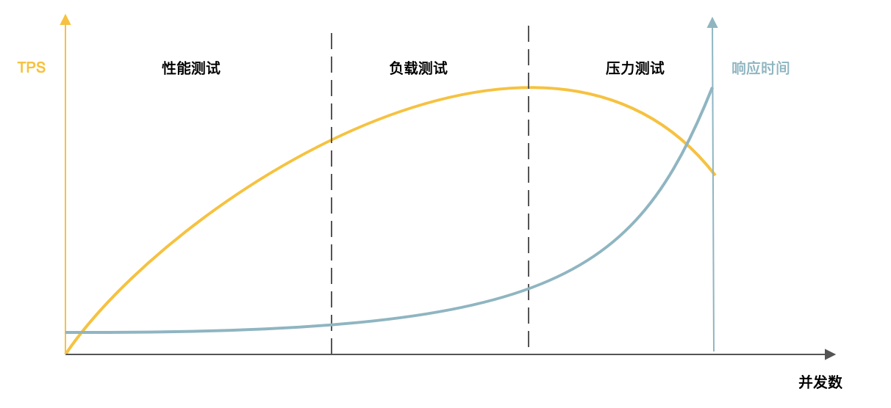
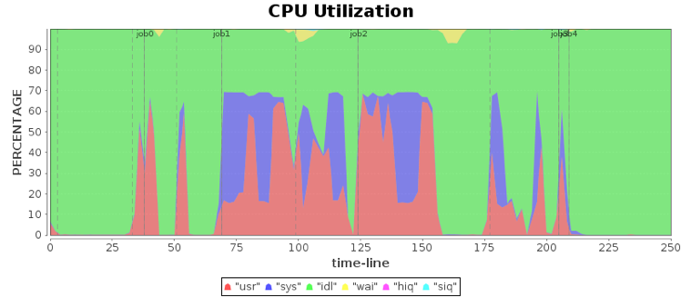
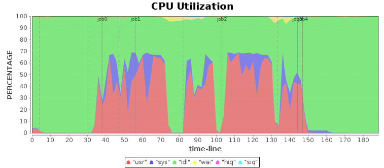

---
date: "2019-06-23"
---  
      
# 28 | 高性能架构：除了代码，你还可以在哪些地方优化性能？
系统性能是互联网应用最核心的非功能性架构目标，系统因为高并发访问引起的首要问题就是性能问题：高并发访问的情况下，系统因为资源不足，处理每个请求的时间都会变慢，看起来就是性能变差。

因此，性能优化是互联网架构师的核心职责之一，通常我们想到性能优化，首先想到的就是优化代码。事实上，一个系统是由很多方面组成的，所有这些方面都可以进行优化，就是我们接下来要讲的7层优化。

进行性能优化的一个首要前提是，我们必须知道系统当前的性能状况，然后才能进行性能优化。而了解系统性能状况必须通过性能测试，我们先看下性能测试。

## 性能指标

所谓性能测试，就是模拟用户请求，对系统施加高并发的访问压力，观察系统的性能指标。系统性能指标主要有响应时间、并发数、吞吐量和性能计数器。

所谓**响应时间**，是指从发出请求开始到收到最后响应数据所需要的时间。响应时间是系统最重要的性能指标，最直接地反映了系统的快慢。

**并发数**是指系统同时处理的请求数，这个数字反映了系统的负载压力情况。性能测试的时候，通常在性能压测工具中，用多线程模拟并发用户请求，每个线程模拟一个用户请求，这个线程数就是性能指标中的并发数。

**吞吐量**是指单位时间内系统处理请求的数量，体现的是系统的处理能力。我们一般用每秒HTTP请求数HPS、每秒事务数TPS、每秒查询数QPS这样的一些指标来衡量。

<!-- [[[read_end]]] -->

吞吐量、响应时间和并发数三者之间是有关联性的。并发数不变，响应时间足够快，那么单位时间的吞吐量就会相应的提高。比如说并发数是1，响应时间如果是100ms，那么TPS就可以是10。如果响应时间是500ms，但是TPS吞吐量就变成了2。

**性能计数器**，指的是服务器或者操作系统性能的一些指标数据，包括系统负载 System Load、对象和线程数、内存使用、CPU使用、磁盘和网络I/O使用等指标，这些指标是系统监控的重要参数，反映系统负载和处理能力的一些关键指标，通常这些指标和性能是强相关的。这些指标很高，成为瓶颈，通常也预示着性能可能会出现问题。在实践中运维和开发人员会对这些性能指标设置一些报警的阈值。当监控系统发现性能计数器超过阈值的时候，就会向运维和开发人员报警，以便及时发现、处理系统的性能问题。

## 性能测试

性能测试是使用性能测试工具，通过多线程模拟用户请求对系统施加高并发的访问压力，得到以上这些性能指标。事实上，性能测试随着性能测试工具逐渐增加请求线程数，系统的吞吐量和响应时间会呈现出不同的性能特性。具体说来，整个测试过程又可细分为性能测试、负载测试、压力测试三个阶段。

**性能测试**是指以系统设计初期规划的性能指标为预期目标，对系统不断地施加压力，验证系统在资源可接受的范围内是否达到了性能的预期目标。这个过程中，随着并发数的增加，吞入量也在增加，但是响应时间变化不大。系统正常情况下的并发访问压力应该都在这个范围内。

**负载测试**则是对系统不断地施加并发请求，增加系统的压力，直到系统的某项或多项指标达到安全临界值。这个过程中，随着并发数的增加，吞吐量只有小幅的增加，达到最大值后，吞吐量还会下降，而响应时间则会不断增加。

**压力测试**是指在超过安全负载的情况下，增加并发请求数，对系统继续施加压力，直到系统崩溃，或者不再处理任何请求，此时的并发数就是系统的最大压力承受能力。这个过程中，吞吐量迅速下降，响应时间迅速增加，到了系统崩溃点，吞吐量为0，响应时间无穷大。

性能压测工具不断增加并发请求线程数，持续对系统进行性能测试、负载测试、压力测试，得到对应的TPS和响应时间，将这些指标画在一个坐标系里，就得到系统的性能特性曲线。

除了测出性能指标，性能测试有时候还需要进行稳定性测试。**稳定性测试**是指持续地对被测试系统施加一定的并发访问压力，使系统运行较长一段时间，以此检测系统是否稳定。通常，线上系统的负载压力是不稳定的，有时候，为了更好地模拟线上访问压力，稳定性测试的并发访问压力也可以不断调整压测线程数，在不稳定的并发压力下，测试系统的稳定性。

## 性能优化

一个系统是由很多方面构成的，程序只是这个系统的一小部分，因此进行性能优化的时候，也需要从系统的角度出发，综合考虑优化方案。

### 用户体验优化

性能优化的最终目的是让用户有更好的性能体验，所以性能优化最直接的其实是优化用户体验。同样500毫秒的响应时间，如果收到全部响应数据后才开始显示给用户，相比收到部分数据就开始显示，对用户的体验就完全不一样。同样，在等待响应结果的时候，只显示一个空白的页面和显示一个进度条，用户感受到的性能也是完全不同的。

除了用户体验优化这种比较**主观的性能优化**，即使我们想要真正优化性能指标，进行**客观的性能优化**，我们也可以从系统的角度，全方位考虑系统的各个方面。

从系统的宏观层面逐渐往下看，可以在7个层面进行性能优化。

### 第一层：数据中心优化

首先是数据中心性能优化，我们开发的软件是部署在数据中心的，对于一个全球访问的互联网应用而言，如果只有一个数据中心，那么最远的用户访问这个数据中心，即使以光速进行网络通信，一次请求响应的网络通信时间也需要130多毫秒。这已经是一个人可以明显感受到的响应延迟了。

所以，现在大型的互联网应用基本都采用多数据中心方案，在全球各个主要区域都部署自己的数据中心，就近为区域用户提供服务，加快响应速度。

### 第二层：硬件优化

我在专栏文章[21篇](https://time.geekbang.org/column/article/187517)讲分布式架构时，就对比分析了垂直伸缩和水平伸缩两种架构方案。事实上，即便使用水平伸缩，在分布式集群服务器内部，依然可以使用垂直伸缩，优化服务器的硬件能力。有时候，硬件能力的提升，对系统性能的影响是非常巨大的。

我在做Spark性能优化时发现，网络通信是整个计算作业的一个重要瓶颈点。

我们看到，在使用1G网卡的情况下，某些计算阶段的网络通信开销时间需要50多秒。如果用软件优化的方法，进行数据压缩，一方面提升有限，另一方面还需要消耗大量CPU的资源，使CPU资源成为瓶颈。

后来通过硬件升级的办法进行优化，使用10G网卡替换1G网卡，网络通信时间消耗得到极大改善。

原来需要50多秒的通信时间，现在只需要10多秒就可以完成，整个作业计算时间也大大缩短。硬件优化效果明显。

### 第三层：操作系统优化

不同操作系统以及操作系统内的某些特性也会对软件性能有重要影响。还是Spark性能优化的例子，在分析作业运行期CPU消耗的数据时，我发现在分布式计算的某些服务器上，操作系统自身消耗的CPU占比特别高。

图中蓝色部分是系统占用CPU，红色部分是Spark程序占用CPU，某些时候系统占用CPU比Spark程序占用CPU还高。经过分析发现，在某些版本的Linux中，transparent huge page这个参数是默认打开的，导致系统占用CPU过高。关闭这个参数后，系统CPU占用下降，整个计算时间也大幅缩短了。

### 第四层：虚拟机优化

像Java这样的编程语言开发的系统是需要运行在JVM虚拟机里的，虚拟机的性能对系统的性能也有较大影响，特别是垃圾回收，可能会导致应用程序出现巨大的卡顿。关于JVM虚拟机优化的有关原理可以参考《[Java虚拟机原理：JVM为什么被称为机器（machine）？](https://time.geekbang.org/column/article/168945)》

### 第五层：基础组件优化

在虚拟机之下，应用程序之上，还需要依赖各种基础组件，比如Web容器，数据库连接池，MVC框架等等。这些基础组件的性能也会对系统性能有较大影响。

### 第六层：架构优化

我们这个模块就是讨论各种互联网技术架构，大部分技术架构方案也是用来提升系统性能的。主要有缓存、消息队列、集群。

**缓存**：通过从缓存读取数据，加快响应时间，减少后端计算压力，缓存主要是提升读的性能。

**消息队列**：通过将数据写入消息队列，异步进行计算处理，提升系统的响应时间和处理速度，消息队列主要是提升写的性能。

**集群**：将单一服务器进行伸缩，构建成一个集群完成同一种计算任务，从而提高系统在高并发压力时候的性能。各种服务器都可以构建集群，应用集群、缓存集群、数据库集群等等。

### 第七层：代码优化

通过各种编程技巧和设计模式提升代码的执行效率，也是我们最能控制的一个优化手段。具体技巧有：

使用合理的数据结构优化性能，可参考《[数据结构原理：Hash表的时间复杂度为什么是O\(1\)？](https://time.geekbang.org/column/article/167938)》。

编写性能更好的SQL语句以及使用更好的数据库访问方式，可参考《[数据库原理：PrepareStatement为什么性能好又安全？](https://time.geekbang.org/column/article/172000)》。

实现异步I/O与异步方法调用，避免不必要的阻塞，可参考《[反应式编程框架设计：如何使程序调用不阻塞等待、立即响应？](https://time.geekbang.org/column/article/184379)》

此外，还可以使用线程池、连接池等对象池化技术，复用资源，减少资源的创建。当然最重要的还是利用各种设计模式和设计原则，开发清晰、易维护的代码。因为一团糟的代码里面有什么性能问题谁也搞不清楚，也没办法优化。

## 小结

性能优化的一般步骤是：首先进行性能测试，根据测试结果进行性能分析，寻找性能的瓶颈点，然后针对瓶颈进行优化，优化完成后继续进行性能测试，观察性能是否有所改善，是否达到预期的性能目标，如果没有达到目标，继续分析新的瓶颈点，不断迭代优化。

性能优化的一个前提是需要进行性能测试，了解系统的性能指标，才能有目标地进行性能优化。另一个前提是，必须要了解系统的内部结构，能够分析得到引起性能问题的原因所在，并能够解决问题。

因此性能优化是对一个架构师技能和经验的全面挑战，是架构师的必备技能之一。

## 思考题

除了文中提到的这些性能优化手段，还有哪些优化手段？

欢迎你在评论区写下你的思考，也欢迎把这篇文章分享给你的朋友或者同事，一起交流。