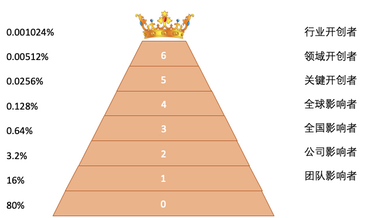

---
date: "2019-06-23"
---  
      
# 35 | 技术进阶之道：你和这个星球最顶级的程序员差几个等级？
这些年，我跟一些年轻的软件工程师朋友们交流，关于未来的职业发展，大家普遍都有憧憬和规划，要做架构师，要做技术总监，要做CTO。对于如何实现自己的职业规划，也都信心满满：努力工作，好好学习，不断提升自己。但现实总是复杂的，日复一日的工作生活总能让人一次又一次地陷入迷茫。其原因之一就是对职业发展轨迹和自我能力进步的一般规律缺乏认识，导致做事找不到方向或是操之过急。

## 软件技术的生态江湖与等级体系

软件编程这个领域看似平等、开放、自由，但这并不代表混乱、无序。这个领域并没有什么成文的行为准则，却自有一套运作体系，依靠这套体系，软件开发的技术和知识以极快的速度在全世界范围内传播、推广。如果你致力于成为软件架构师，那么你必须了解一下软件技术的生态江湖与等级体系，因为你的技术处境和你的技术发展之路就在其中。

全世界从事软件开发的技术人员大约有几千万，有序稳定的组织方式总是金字塔结构，在软件开发这个领域也不例外，我们按照每个人的影响力和技能水平，使用二八定律进行划分，得到一个如下的金字塔结构。

80\%的工程师处在这个金字塔最底层，全世界绝大多数的代码出自这一层的工程师之手，但是他们却没有任何技术决策能力和技术影响力。用什么编程语言，用什么数据库，用什么编程框架，日志规范与代码规范如何制定，统统不由他们决定。大多数情况下，一个10人团队，有8个是这样的人，他们在金字塔的第零层，在这个体系中，他们没有自己的称呼。

<!-- [[[read_end]]] -->

这一层之上，剩下的20\%技术人员中的80\%，也就是总数为16\%的工程师，他们被称为**团队影响者**。他们是项目架构师、技术经理、技术骨干，他们撑起了项目的技术核心，在项目范围内决定着各种技术方向，核心的代码由他们开发，出了重要的问题也要找他们去解决。这样的人，在一个10人团队中，大约有一两人。

团队影响者之上，是**公司影响者**，大约占总数的3.2\%，他们决定整个公司的技术方向，用Java还是用PHP？用MySQL还是SQLServer？微服务用Dubbo还是Spring Cloud？在一个有300名技术人员的公司，这样的人大约有10个。他们通常是公司的技术元老，在公司的技术团队中拥有较大知名度的技术牛人。

团队影响者和公司影响者又如何做出技术判断和决策呢？他们的技术从何而来？通常他们会关注国内最新的技术风向，参加各种技术峰会，阅读各种技术图书，通过这些信息获取知识并做出自己的技术判断和决策。而向他们传播这些最新技术动向的人，是**全国影响者**。这些人通常来自知名的IT互联网公司，当他们说，我们在淘宝、腾讯如何做开发的时候，全中国的开发者都静心倾听。

而这些全国影响者通常是通过关注国外的技术动向来获取信息，主要是一些美国的公司，比如Google、Facebook、微软这些公司的工程师。当他们讲，我们在Google是如何做开发的时候，全世界的开发者静心倾听，想要了解下一次的技术潮流在哪里。他们是**全球影响者**。

在这个技术影响力体系里面，越往高，背景越重要。你是谁不重要，你代表谁更重要，人们关注的不是你叫什么名字，而是你来自哪个公司，这也是很多人想要加入Google，阿里巴巴的原因。有趣的是，来自知名大厂的一些工程师常常忘记了这一点，觉得自己得到关注和掌声是来自自己的成就和能力，结果导致对自己的职业发展产生重大误判。

技术等级体系直到这里，关注的都是技术影响力，通过影响力决定使用何种技术进行软件开发。那我们常用的这些软件技术又从何而来？事实上，正是这些知名软件的开发者，推动了一次又一次软件编程的革命，领导了一次又一次技术进步，带领软件技术行业不断前进。

他们有的开发了一些关键性的技术产品，比如一些广为使用的JSON解析器、单元测试框架、分布式缓存系统，他们是一些**关键开创者**。

还有一些则开创了一个领域，比如Spring，构建了一个完整的Java web开发技术栈，这些软件的核心开发者是**领域创建者**。

而在这个金字塔的最顶层，则是那些开创了一个行业的**行业开创者**，Hadoop成就了大数据行业，Linux引领了操作系统行业，Linus、Doug Cutting这些人就是软件技术领域的王者。

基本上，你能超越你当前所在层次的80\%的人，你就可以进入更上一个层级。

## 技术进阶之捷径

那么如何完成技术层级的跃迁，成为更高一级的技术高手呢？你当然可以一级一级地从金字塔的最底层努力做起，在每一层都超越80\%的人进入更上一层的技术等级。

那么，有没有捷径呢？

其实还真有，而且被许多人尝试过了。那就是直接去做一个全国影响者，在工作之外，通过持续地维护一个技术博客，或者技术公众号，不断地发表一些高质量的原创技术文章，在某个技术领域打造自己的技术影响力。并通过在一些有影响力的技术峰会上做主题演讲，以及出版一些高质量并畅销的技术图书，持续扩大自己的影响力。

应该说，每一次大的技术浪潮，都会使一批默默无闻的技术人员快速获得全国性的技术影响力，在分布式技术、移动互联网、大数据、AI、区块链等领域，莫不如此。

因此，通过这种方式获得全国性的技术影响力，一方面要持续努力，不断学习、实践，持续获得知识，并把这些知识有效地传播出去。另一方面，还要有眼光，你在一个已经非常成熟的技术上耕耘，再努力也很难获得足够的关注；而在那些尚不成熟的技术上努力，你又如何知道将来这个技术会成功？这就需要有足够的技术敏感性，进行足够多的技术尝试，做出有战略眼光的技术决策。

所以，所谓的捷径只是路径上的捷径，要想在这条捷径上获得成功，需要付出更多的努力和聪明才智。

事实上，如果你足够努力并有足够的天分，你甚至可以超越影响者阶层，直接进入开创者阶层，比捷径更加捷径。

在计算机软件开发领域，美国是全球的领导者，软件领域的新技术基本都是美国人引领的，我们日常使用的各种软件基本上都是在美国开发的。大到各种编程语言，小到各种编程框架和工具，几乎都是在美国开发出来的。

如果说，最近几年这个现象有什么细微的变化，那就是中国开发者的身影越来越多，中国本土开发的软件，也越来越多被全球开发者接受，特别是在开源软件以及最新的技术领域上，中国人越来越多。

这主要得益于最近十几年中国开发者人数的急剧增加，以及中国开发者技术水平的快速提高。在上个世纪，中国人开发一款技术产品，被全球软件开发者使用，似乎是天方夜谭，而到了今天，这完全不是什么不可能的事情。

所以，如果你能直接开发一款在全球范围内被软件开发人员广泛接受的技术产品，并能吸引全球的开发者参与到你的产品开发中，那么你就成为某方面的开创者了。事实上，因为中国开发者人数的庞大，即使你只要在中国范围内获得广泛的接受，其实离距离全球范围内流行也已经不远了。

比捷径更捷径的路不是没有，只是更加艰难，不只需要你个人的努力，还要看历史的进程。

## 小结

所以，从根本上说，技术进阶根本没有捷径，所谓的捷径，其实是你经历了各种努力和挫折后，最后化蛹成蝶的惊鸿一瞥。

为了最后众人瞩目的成功，你依然需要经历金字塔每一层的考验。

在工作中，技术实力固然重要，但是技术实力要转化成公司需要的成果和价值，技术影响力非常重要，通过技术影响力引导团队、部门、公司按照你的技术价值观去构建产品架构和技术发展路径，凝聚公司的技术力量，让你自己和公司向着更高的技术等级前进。

关于如何构建自己的技术影响力，有两点建议：

1.  承担责任：重大的技术决策可能会带来重大的技术风险，要有勇气承担风险，并因此赢得他人的尊重。
2.  帮助他人：团队成员遇到技术问题的时候，即使不是自己的工作范围，也可以帮助他们去解决问题，一方面建立自己的技术影响力，另一方面，通过解决问题获得更快的技术成长和领悟。

当然，技术影响力的前提是真正的技术实力，没有实力的影响力就是空中楼阁，不堪一击。

## 思考题

最后，你不妨想一想，如何构建自己的技术影响力呢？你有什么想法或者心得吗？

欢迎你在评论区写下你的思考，也欢迎把这篇文章分享给你的朋友或者同事，一起交流一下。