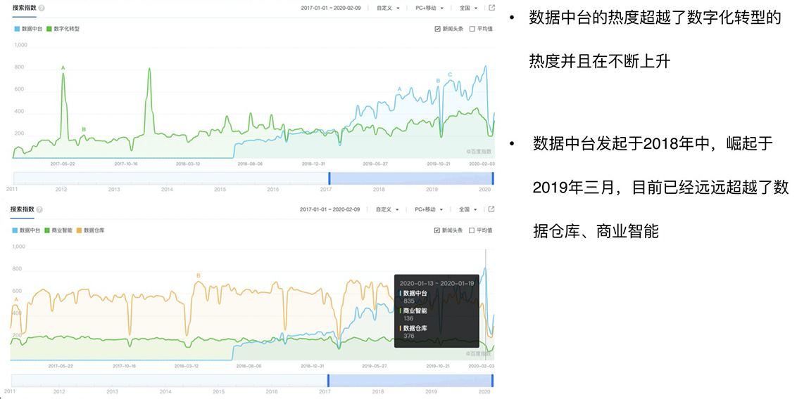
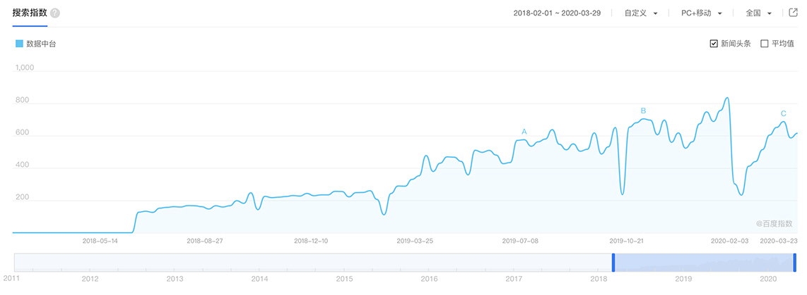
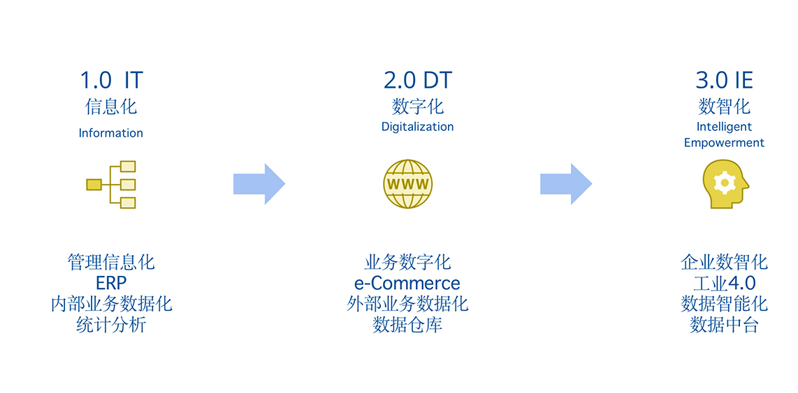

---
date: "2019-06-23"
---  
      
# 特别放送｜史凯：建设数据中台到底有什么用？
你好，我是史凯，是ThoughtWorks数据智能业务的负责人，你可以叫我凯哥。

我从1999年就开始做程序，在IT行业已经工作20个年头了。最开始，我是在IBM做Websphere 研发，后来历经埃森哲、EMC，一直从事的是企业数字化转型咨询，做过很多系统，比如企业的ERP、ESB系统、SOA架构以及很多领域的业务系统等等。

最近这五年，我专注在数据和人工智能领域，从数据仓库、商业智能、主数据管理到大数据平台的建设，经过很多项目的沉淀和总结，最后我和团队一起总结了精益数据创新的体系。可以说，这么多年我一直战斗在企业信息化的一线。

2019年，我被数据领域权威咨询机构DataIQ评为2019 数据赋能者100人之一，也是腾讯云最有价值专家TVP一员。

很荣幸给郭老师的数据中台课程写加餐文章，我想从我的角度和你聊聊企业为什么要建设数据中台，数据中台对于企业的价值到底是什么。今天的内容我不会在落地细节上进行拓展，主要是从概念和框架的角度，给你提供一个更全面的视角。因为我坚信，做好任何一件事情的前提就是弄清楚为什么。

## 数据中台火了，我们的诉求是什么？

我们先来看看百度搜索指数吧。

这张图告诉我们，数据中台的百度搜索指数最终超越了数字化转型和数据仓库。

<!-- [[[read_end]]] -->

嗯，数据中台确实是火了，很多企业已经在落地了，没启动的企业也在考虑中了。很明显，落地数据中台是能够满足企业的一些诉求的，具体是啥呢？

去年我发布了一个数据中台的行业调研，收到了400多份有效的问卷，大家对于数据中台的期望都写了一段话，对这些文字进行分析统计，我得出了这样的词云图。

然后，我对此进行了进一步的分析，发现了大家对于数据中台最多的期待是如下三点：

* 距离业务更近；
* 为企业提供直接的业务价值；
* 提供数据服务而不仅是报表。

为了让你更好地理解企业为什么要建设数据中台，数据中台的概念为什么会受市场和企业的追捧，下面我展开来说一下这几点。

过去企业的数据系统距离用户和业务比较远，这里的远主要包括三点。

第一，数据系统只是技术支撑而不能直接产生业务价值。做一个业务系统，比如，电商平台，可以直接带来收入。但是，传统的数据应用，比如数据仓库，是不能带来直接的价值的。

第二，当业务人员需要在报表里修改一些内容的时候，得到的响应慢，因为业务人员无法自己直接使用数据来产生洞察，需要去找数据团队。

第三，过去在数据方面的投资，大量花费在数据采集、处理和建模部分，而真正利用到业务领域的也不多。

换个角度来看，就是业务开发团队对数据的利用有很大的需求，主要体现在，希望数据中台能够解决企业数据开发的效率问题，协作问题和能力问题。

数据中台给了应用开发人员这样的希望，那就是他们不需要关注具体的取数逻辑，只需要关注客户需求，可以像搭乐高一样方便的组合各种数据中台的数据服务到自己的应用当中去，数据准确并且一致。

**所以，如果用一句话来说数据中台的价值，那就是改变原来企业利用数据的形式。**

过去，数据的利用形式主要是商业智能，说直接一点就是做报表，做报表的目的就是让管理者知道现在的业务在发生什么，为什么会发生这些事情，接下来可能会发生什么，这一切都是提供给我们的管理者去看的，帮助管理者去做出一个业务决策。

随着业务复杂度的提升，一个决策背后的因素是非常多的，一个现象需要多个维度的解读才能够体现业务全貌。于是，管理者需要的报表就越来越多，很多企业会有多个不同业务线的数据仓库，每个数据仓库里都有千张以上的报表，最后就陷入了报表的迷宫。

当我们回头来看这个过程，我们发现，**报表并不是我们所需要的，而数据本身也不是我们所需要的，我们所需要的是一个业务决策，一个业务行为。**

比如，当用户打开电商产品目录的时候，将他最有可能购买的产品展示在第一页，而原来的OLTP、OLAP分离的数据处理流程是做不到的，那么，在业务交易的过程中，也没有办法从历史数据和全域数据的分析结果中获得行动的指引。

总而言之，市场对于数据中台的期待，是提供直接驱动业务流程的数据服务，而不仅是需要经过人去转化和解读的数据可视化报表，原来商业智能时代已经过去，市场和用户期待的是数据智能的时代。

## 建设数据中台的根本目的是什么？

诉求在这里了，建设数据中台似乎能够提供解决方案。但是建设中台不是一蹴而就的事情，也不是一件容易的事，需要在技术上、组织架构上都做对应的调整才可以，落地过程也会面临种种挑战。那企业为啥还要兴师动众地来落地数据中台呢？

结合这些年我自己的经验，我认为这个问题的答案就是：**数据中台的愿景是打造数据驱动的智能企业。**

这个观点，我在一篇文章[《数据中台的使命、愿景、本质和六大核心能力》](https://mp.weixin.qq.com/s/O_taKcAoogelov1TBqy0-g)里剖析过。

今天呢，我想深入和你聊聊企业建设了数据中台，成为了数据驱动的智能企业，这对企业到底有什么收益呢？

我认为企业能够获得两个方面的收益：**优化现有业务和实现新业务的转型。**

### 优化现有业务

优化业务这一点很好理解，就是通过数据分析和人工智能技术的应用，优化原有的业务流程。我从以下5个方面和你深入进来看。

**第一，增加现有业务的收入。**

这是企业建设数据中台的一个直接诉求。比如，通过分析产品的价格、销量、用户数据来优化产品定价、优化产品组合、进行精准营销，从而能够促进产品的销售，增加现有产品的收入。

给你举一个典型的案例，是我们给一个能源类企业做的数据中台。建成后能够根据历史销量、市场份额、市场容量等数据进行建模，从而帮助企业的销售部门去优化销售任务的分配，最后提升销售额。

这样的一个看上去很小的项目，能给企业带来啥价值呢？这么说吧，过去，企业每年年初给全国的几十个销售定业绩并持续去跟踪，是一个很痛苦的事情，原因主要在于目标不好锚定，每个销售管理着一堆经销商，经销商的销量、退货都不拉通，所以无法客观地量化和追踪销售的业绩。

怎么办呢？过去这一切靠的都是销售总监的经验去拍数，更多靠的是谈判能力，是一个不确定性很高的工作。有了数据中台后，把行业数据、市场竞争数据、往年销售数据以及经销商的数据都拉通来看，一下子能够给到销售总监全貌，还可以做模拟，让销售业绩分配这个工作变成一个可量化、可预测的确定性工作。

**第二，促进生产效率。**

通过数据中台的建设，能够促进生产效率的提升。关于这一点，直接给你说个场景吧。

比如，某个大型电信服务商，通过对勘测、规划、设计工作的建模，实现数据自动化处理，减少人工干预和问题的出现，从而大幅提升工程师的设计效率和准确性，将工程设计的周期缩短一半以上。

分析下原因。电信服务商的投标是一个很复杂的工作，从客户发出需求到根据需求去勘测、做出规划、具体实施设计再到把实施设计转化成物料设计、工程设计、财务设计，最后再形成投标方案，这个过程过去至少需要一个月，需要众多不同业务部门和专业技能的协作，其中大部分工作都花在了不同数据的合并、拉通、对齐和映射上。

那么当这个企业建设了数据中台后，所有的数据能够自动处理，大家在同一个数据服务里获取、修改、加工同样的一套数据，并且每次做方案的过程都沉淀成新的服务，后面的项目可以复用，这样大大缩短了工期，有些标准化比较高的项目类型，可以从原来的一个月缩短到三天。

**第三，降低运营成本，提升运营的利润。**

这个是目前利用场景最多的，主要就是通过数据分析来优化业务流程、缩短运营周期，从而提升运营的利润。

比如，我之前做的一个项目，是给一家大型的钢铁厂进行配方的规划优化，通过对配方数据、市场价格、销量数据的综合分析建模，给到成本最优、产值最高的生产组合，从而能够降低运营成本，提升利润。

你可能对钢铁这个行业不太了解，钢铁行业里配矿决策是一个很复杂但是很重要的环节，不同的配矿方案，其成本和工艺都不一样，对利润的影响很大。

如何根据技术和商业的众多因素去选择最优的配方呢？过去都是根据经验来维护和计算配矿规则，效率低、周期长。有了数据中台后，将原材料的性能、化学工艺、产品质量等技术因素和价格、成分、运营成本及销售收入等商业因素的数据统一进行建模，统一计算后最终做出综合规划，这样做大大提升了利润、降低了运营成本。

如下图所示，这是一个典型的钢粉配方的和制造成本的表格，这里面每一项的变化都会带来成本的变化，而影响利润的除了制造成本外，还有销售价格，运营成本等，这样一来如何设计出最优化的配矿决策就是非常重要的因素。通过数据建模，机器学习的智能配矿模型能够全方位的规划最优的方案，从而达到特定的商业目标，比如缩短生产周期，或者是提升利润，优化库存等。

**第四，提升用户体验。**

提升用户体验的核心是企业要理解自己的用户，知道用户对自己产品、服务的认知，然后对应优化自己的产品和服务，这就需要建设用户数据平台，构建统一的用户视图，建立起用户画像。

这里我举个富国银行的例子，他们在数据转型中，利用数据中台分析用户的行为数据，来重构在线银行的网站，提升用户体验。富国银行在2016年的时候面临很大的业绩挑战，为了更好地了解用户，他们建立了企业级的数据中台，把全行的用户信息都打通，做成用户画像，打上各种标签，并根据这些用户画像和标签，重新设计了电子银行网站，让网站的服务和风格以用户为中心。

这是一个为期几年的数据转型之旅，富国银行也因为这个项目成功地成为了行业里的“零售之王”，更多细节可以看看这篇文章[《富国银行的数据转型之旅》](https://mp.weixin.qq.com/s/dg30hCV9mZ95NyNVVs3TmQ)。

**第五，提升资产利用率。**

这一点主要是指分析、优化高价值资产，提升资产的利用率。

我举一个我们做过的物流领域路径优化的案例。我们曾经给国内最大的物流企业之一做过路径优化的项目，帮助他们提升人员和车辆的使用率。过去，每天早上每个区域都有一个经验丰富的员工，统一规划前一天收到的派件和收件订单，把这些订单分配给对应的小组。

这个过程的目的就是最大化地利用车辆和快递员这两个核心资产。但是这个规划是很复杂的，因为不仅要考虑成本，还要考虑到每个件积压的时间不一样、紧急程度不一样、不同的地点路况对于车辆的要求也不一样等等，这些数据的采集、拉通、建模是很重要的基础工作而这一切都依赖与数据的打通。

建设数据中台，拉通了数据后，派单收单的路径更优化了，更好的分配给快递员，提升了车辆的使用率提升了20\%左右。你看，这样的场景就很典型，体现了数据中台所能支撑的智能规划业务的价值。

### 业务创新和转型

接下来，我们继续来看建设数据中台的第二个收益，实现业务创新和转型。这里我总结了四个主要的价值，这些价值乍一听好像都比较抽象，我会用具体的例子来分析。

**第一，数字化产品创新。**

这里有一个很生动的例子，我们有一个合作了十多年的海外房地产交易网站客户，主要是定期和他们做黑客马拉松。

有一次我们黑客马拉松的一个小组，通过数据分析发现了一个小模式，就是有一群用户，在一段时间内高频访问网站，但是不产生任何看房、卖房的行为。这是为什么呢？最后通过数据分析，发现这样的用户都有一个共同的特点，那就是她们大部分都是女性，而且基本上访问链接停留时间最长的，很多都是图片，而且是室内的图片。

基于这些数据，我们推测，这群人是来看装修的，于是，基于这个推测，这个小组孵化了一个新产品，专门提供装修服务，这个产品最后还成功了，成为了公司除房地产中介服务之外的新业务线。

这也是典型的通过数据洞察发现业务新价值，从而实现数字化产品创新的场景。

**第二，数字化资产销售。**

这一点说的就是将已经积累的数据，通过组合、包装、分析、脱敏，形成对于一部分用户有价值的数据资产，比如行业报告或者优质的内容，直接销售产生收入。

这个典型的场景就是搜索引擎，搜索引擎将用户的信息进行统计分析、脱敏处理后，变成一系列的知识和分析报告，然后以会员的方式，提供给有需要的用户。

我们都用过百度指数吧，这里面，用户可以定义和购买自己感兴趣的关键词，一年是198元，然后百度就会把所有搜索过这个关键词的记录统计出来，变成这个关键词的搜索指数。比如，数据中台的关键词就是我去年购买的，我就能实时追踪这个关键词在中文市场被搜索的热度。这就是数据化资产销售的价值模式。

**第三，业务平台化收益。**

有一句话在去年很流行，“未来的企业，要么自己做平台，要么被别人平台化”。平台经济成为了这几年数字化领域炙手可热的概念。总的来说，平台化就是你搭建一个平台，让需求方和供给方上来交易，最后你来收取服务费。

那么如何建立平台呢？拉通一个领域数据，形成数字化平台，再通过平台来运营一个特定的业务和客户群体，从而通过平台来产生收益。

典型的场景就是交易撮合平台，比如非常玄幻的比特币交易平台。你可能会说，这个和数据中台有什么关系？这个过程其实也是一个领域数据中台的建设过程，因为作为平台方，其实主要做的就是数据的生意，对接信息、对接交易双方。那么数据中台在企业内部，就相当于一个数据采集、加工、交易的平台，业务方既可能是数据服务的消费者，又可能是生产者，最终的产品是数据服务。

**第四，数字化生态业务。**

这一点是从更高的一个维度来看的，就是在平台化基础之上，通过打穿产业供应链，帮助企业建设自己的数字化生态，从而在生态中产生新的业务价值和收入。

一个典型的例子就是Google的应用商店。当有足够多的伙伴在这个平台上进行交易的时候，它就可以在这些海量的交易和行为数据中去发现特别多的规律，然后产生更多的产品创新，利用数据来牵引着这个生态朝自己设计的方向发展。

在这个生态里，有非常多的角色参与其中，开发者、自由开发者、广告商、应用购买者等，而Google掌握着所有方的数据，用户的浏览、下载、付费、交易，一切的数据都能够被分析、被利用，帮助Google Play的运营方去发现新的业务价值，创造收入。

## 总结

讲了这么多，我们来做个总结。今天我和你分享了建设数据中台到底有什么用，从我的经验出发，我总结了一个数据中台收益框架，这个框架包括两大维度、九个细分项。掌握这些内容有啥用呢？最核心的就是给我们建设数据中台这件事找到目标，你可以把这9项作为一个指导，先明确价值和方向，再找到应用场景，以此作为牵引来建设自己的数据中台。

最后，再分享一点我这些年做企业信息化的感受。

我想大部分企业是要经历一个转型的，朝着数智化方向演进。企业的转型，从最早的信息化走向数字化，下一个目标是数智化。

信息化解决的是企业内部的管理问题，让企业能够以一个有组织、有流程的方式高效地运转起来。

数字化解决的是企业与外部的连接问题，让企业能够直接触达客户，并且建立线上的业务。  
数智化解决的是让企业成为智能企业，业务更智慧的问题，这个过程的核心生产要素就是数据。

可以说，数智化转型能够给企业带来颠覆性的变革，但是如何去发现数据的价值，如何构建数据智能的能力，如何规模化赋能业务呢？

这时候企业需要一个抓手，利用这个抓手来对齐业务和技术，不断前进。数据中台就像是这个抓手，谁能够围绕以上的业务优化和转型两个方面的价值来建设数据中台，谁就能够在数智化转型中获得领先优势。

讲到这里，我都有点激动了，数据中台的这股浪潮，给我们提供了一个机会，但是这个机会也对我们提出了很多、很高的能力要求。我想把这个问题作为课后思考题留给你，请你想想，成为数智化企业，都需要哪些能力呢？我做了众多个国内外领先企业的转型研究，发现了一些规律和有意思的事情。

期待你的思考，也期待后面有机会和你继续探讨。