---
date: "2019-06-23"
---  
      
# 08 | 交付速度和质量问题解决了，老板说还得“省”
你好，我是郭忆。

在上一节课中，我们讨论了如何保障数据中台的数据质量，让数据做到“准”。我认为，除了“快”和“准”，数据中台还离不开一个“省”字。尤其是随着数据规模越来越大，成本越来越高，如果不能合理控制成本，还没等你挖掘出数据的应用价值，企业利润就已经被消耗完了。

所以，能否做到精细化的成本管理，关乎数据中台项目的成败。还是分享一个我见过的事儿。

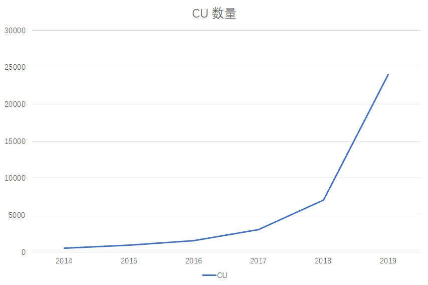

这张图展示了某电商平台的大数据资源消耗增长趋势，尤其值得你关注的是，到了2019年，全年的资源规模已经达到了25000CU，全年机器预算达到了3500W。对一个在创业的企业来说，这显然是一笔不小的开支。

终于有一天，数据团队的负责人李好看（化名）就被CEO叫到了办公室，CEO问了几个问题：

* 这3500W花在什么业务上？
* 你们做了哪些成本优化的举措，效果如何？

一系列的灵魂拷问，直接把李好看问懵了，他心想：团队的成本是按机器又不是数据应用核算的。在数据中台中，数据应用之间的底层数据是复用的，那具体每个数据产品或者报表花了多少钱，自己没有这样的数据啊，怎么可能知道。

可对CEO来说，这些问题很重要，因为资源总是有限的，他必须确保资源都用在战略目标的关键节点上。比如，对于电商团队，今年的核心KPI是提升单个注册会员在平台的消费额，那从老板角度来讲，他必须确保资源都投入与KPI相关业务中，例如基于数据对注册会员进行精准化营销，来提升会员在平台的消费额。

<!-- [[[read_end]]] -->

讲到这儿，你可以想一想，自己所在的团队是否发生过类似的事情？ 我相信，数据部门是企业的成本中心，如果要展现自己的价值，一方面是支撑好业务，获得业务的认可；另外一方面就是精简成本，为公司省钱。

所以，今天我们就把重点放在省钱上，聊一聊数据中台的精细化成本管理。

## 有哪些成本的陷阱？

在一开始建设数据中台时，你往往会关注新业务的接入，数据的整合，数据价值的挖掘上，忽略成本管控的问题，从而落入陷阱中，造成成本爆炸式的增长。所以，你有必要深入了解一下有哪些陷阱，从而尽量在日常开发中避免。

在这里，我总结了8种陷阱，其中：

* 1\~3是广泛存在，但是容易被忽略的，需要你格外注意；
* 4\~8涉及数据开发中一些技能，你在开发过程中注意一下就可以了。

除此之外，在学习这部分知识的过程中，我建议你“知其然，更要知其所以然”，这样才能发现问题的本质，从而深入掌握解决问题的方法。

**第一，数据上线容易下线难。**

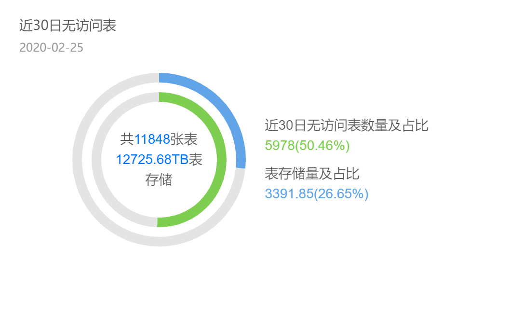

先来看一组统计数据，这是某数据中台项目，表相关的使用统计。从中你可以发现，有一半的表在30天内都没有访问，而这些表占用了26\%的存储空间。如果我们把这些表的产出任务单独拎出来，在高峰期需要消耗5000Core CPU的计算资源，换算成服务器需要125台（按照一台服务器可分配CPU 40Core计算），折合成本一年接近500W。

是不是觉得自己竟然有这么多没用的数据？我经常把数据比作手机中的图片，我们总是不断地拍照，生成图片，却懒得清理，最终手机里面的存储经常不够用。

对于无法及时清理数据，数据开发其实也有苦衷。他们并不知道一个表还有哪些任务在引用，还有哪些人在查询，自然不敢停止这个表的数据加工，那造成的后果就是数据上线容易，下线难。

**第二，低价值的数据应用消耗了大量的资源。**

我们的数据看上去每天都在被访问，但究竟产出了多少价值，投入和产出是否匹配呢？作为一个数据部门，我们要问一问自己。

我们曾经有一个宽表（拥有很多列的表，经常出现在数据中台下游的汇总层数据中），算上上游加工链路的任务，每天加工这张宽表要消耗6000块钱，一年要200W，可追查后我们发现，这张宽表实际每天只有一个人在使用，还是一个运营的实习生。显然，投入和产出极不匹配。

这其实间接说明，数据部门比较关注新的数据产品带给业务的价值，却忽略了已经存在的产品或者报表是否还存在价值，最终导致低价值的应用仍然在大量消耗资源。

**第三，烟囱式的开发模式。**

烟囱式的开发不仅会带来研发效率低的问题，同时因为数据重复加工，还会存在资源浪费的问题。我们来算一笔账，一张500T的表，加工这张表，计算任务需要高峰期消耗300Core，折合7台服务器（按照一台服务器可分配CPU 40Core计算），再加上存储盘的成本\(按照0.7 元/TB\*天计算\)，一年需要消耗40W。

而这张表每复用一次，就可以节省40W的成本。所以通过模型复用，还可以实现省钱的目的。

**第四，数据倾斜。**

数据倾斜会让任务性能变差，也会浪费大量的资源，那什么是数据倾斜呢？

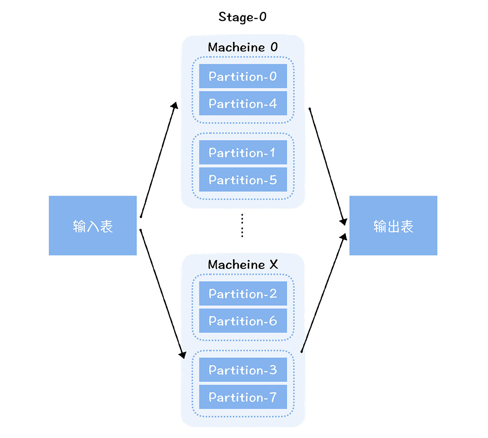

你肯定听说过木桶效应吧？一个木桶装多少水，主要取决于最短的那块板。对于一个分布式并行计算框架来说，这个效应同样存在。对于Spark计算引擎来说，它可以将海量的数据切分成不同的分片（Partition），分配到不同机器运行的任务中，进行并行计算，从而实现计算能力水平扩展。

但是整个任务的运行时长，其实取决于运行最长的那个任务。因为每个分片的数据量可能不同，每个任务需要的资源也不相同。由于不同的任务不能分配不同的资源，所以，总任务消耗资源=max\{单个任务消耗的资源\} \* 任务数量。这样一来，数据量小的任务会消耗更多的资源，就会造成资源的浪费。

我们还是举个电商场景的例子。

假设你需要按照商户粒度统计每个商户的交易金额，此时，我们需要对订单流水表按照商户进行group by计算。在平台上，每个商户的订单交易量实际差距很大，有的订单交易量很多，有的却比较少。

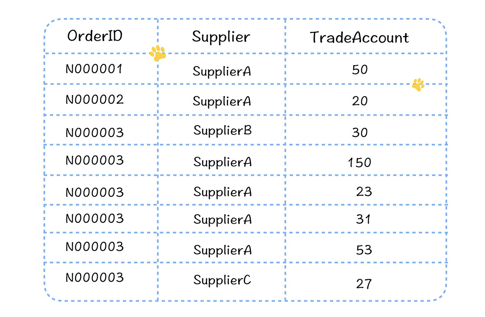

我们利用Spark SQL完成计算过程。

在上图中，任务A 读取了左边某个分片的数据，按照供应商进行聚合，然后输出给下一个Stage的B、C、D任务。

你可以看到，聚合后，B、C和D任务输入的数据量有很大的不同，B处理的数据量比C和D多，消耗的内存自然更多，假设单个Executor需要分配16G，而B、C、D不能设置不同的内存大小，所以C和D也都设置了16G。可实际上，按照C和D的数据量，只需要4G就够了。这就造成了C和D 任务资源分配的浪费。

**第五，数据未设置生命周期。**

在[06讲](https://time.geekbang.org/column/article/224516)中，我强调，一般原始数据和明细数据，会保留完整的历史数据。而在汇总层、集市层或者应用层，考虑到存储成本，数据建议按照生命周期来管理，通常保留几天的快照或者分区。如果存在大表没有设置生命周期，就会浪费存储资源。

**第六，调度周期不合理。**

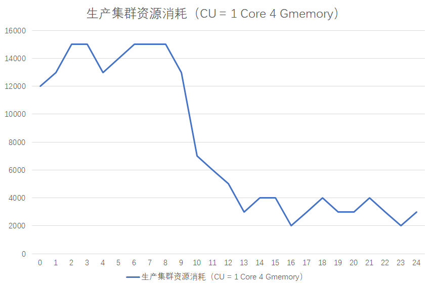

通过这张图你可以看到，大数据任务的资源消耗有很明显的高峰和低谷效应，一般晚上12点到第二天的9点是高峰期，9点到晚上12点，是低谷期。

虽然任务有明显的高峰低谷效应，但是服务器资源不是弹性的，所以就会出现服务器在低谷期比较空闲，在高峰期比较繁忙的情况，整个集群的资源配置取决于高峰期的任务消耗。所以，把一些不必要在高峰期内运行任务迁移到低谷期运行，也可以节省资源的消耗。

**第七，任务参数配置。**

任务参数配置的不合理，往往也会浪费资源。比如在Spark中，Executor 内存设置的过大；CPU设置的过多；还有Spark 没有开启动态资源分配策略，一些已经运行完Task的Executor 不能释放，持续占用资源，尤其是遇到数据倾斜的情况，资源浪费会更加明显。

**第八，数据未压缩。**

Hadoop 的HDFS 为了实现高可用，默认数据存储3副本，所以大数据的物理存储量消耗是比较大的。尤其是对于一些原始数据层和明细数据层的大表，动辄500多T，折合物理存储需要1.5P（三副本，所以实际物理存储500_3），大约需要16台物理服务器（一台服务器可分配存储按照12_8T计算），如果不启用压缩，存储资源成本会很高。

另外，在Hive或者Spark 计算过程中，中间结果也需要压缩，可以降低网络传输量，提高Shuffer \(在Hive或者Spark 计算过程中，数据在不同节点之间的传输过程\)性能。

你看，我为你列举了8个典型的成本陷阱，那你可能会问了，老师，我已经中招了，该怎么办呢？ 别急，接下来我们就看一看，如何进行精细化的成本管理。

## 如何实现精细化成本管理？

我认为，成本治理应该遵循全局盘点、发现问题、治理优化和效果评估四个步骤。

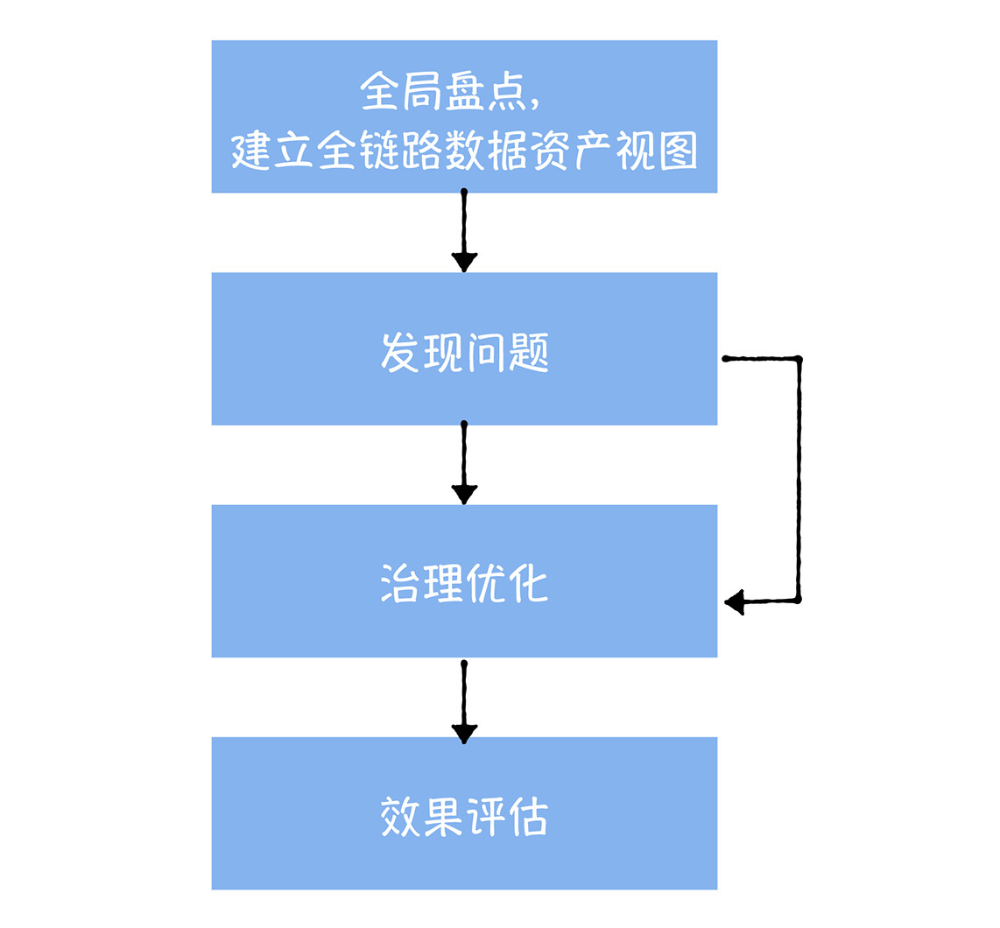

### 全局资产盘点

精细化成本管理的第一步，就是要对数据中台中，所有的数据进行一次全面盘点，基于元数据中心提供的数据血缘，建立全链路的数据资产视图。

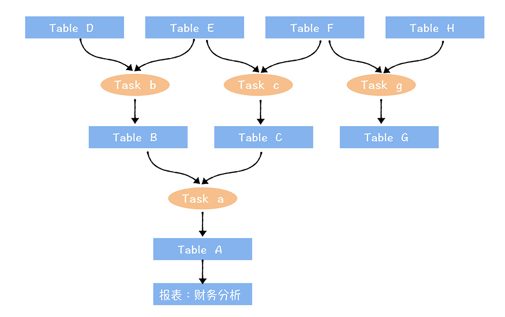

从这个图中你可以看到，全链路数据资产视图的下游末端关联到了数据应用（报表：财务分析），而上游的起点是刚进入数据中台的原始数据。数据之间通过任务进行连接。

接下来，我们要计算全链路数据资产视图中，末端数据的成本和价值（末端数据就是加工链路最下游的表，例如图中TableA，Table G）。

为什么一定要从末端开始呢？ 因为中间数据，在计算价值的时候，还要考虑下游表被使用的情况，比较难计算清楚，所以我们选择从末端数据开始。这与我们下线表的顺序也是一致的，如果数据的价值很低，成本很高，我们也是从末端数据开始下线的。

**那么数据成本该如何计算呢？**

我们要对上图中财务分析报表核算成本，这个报表上游链路中涉及到a，b，c，3个任务，A，B，C，D，E，F， 6张表，那么：

> 这张报表的成本=3个任务加工消耗的计算资源成本+6张表消耗的存储资源的成本。

另外，需要注意的是，如果一个表被多个下游应用复用，那这个表的存储资源成本以及产出任务消耗的成本，需要分摊给多个应用。

**那价值又该如何计算呢？**

我们来分析一下这张图。

如果末端数据是一张应用层的表，它对接的是一个数据报表，那衡量这个数据的价值，主要是看报表的使用范围和使用频率。在计算使用范围时，通常用周活来评估，同时还要考虑不同管理级别的人权重，对于老板，他一个人的权重可以相当于1000个普通员工。

之所以这样设计，是考虑到管理级别越高，做出的商业决策影响就越大，自然这个价值也就越大。使用频率一般使用单个用户每周查看报表的次数来衡量，次数越高，说明报表价值越大。

如果末端数据对接的不是一个数据报表，而是面向特定场景的数据应用（比如我之前提到过的供应链分析决策系统，它面向的人群主要是供应链部门）。衡量这类产品的价值，主要考虑目标人群的覆盖率和直接业务价值产出。什么是直接业务价值产出呢？，在供应链决策系统中，就是通过系统自动生成的采购订单占所有采购订单的比例。

除此之外，末端数据，可能还是一张集市层的表，它主要用于提供给分析师做探索式查询。这类表的价值主要看它被哪些分析师使用，使用频率如何。同样，在使用范围评估时，要对分析师按照级别进行加权。

### 发现问题

全局盘点，为我们发现问题提供了数据支撑，而你需要重点关注下面三类问题：

* 持续产生成本，但是已经没有使用的末端数据（“没有使用”一般指30天内没有访问）；
* 数据应用价值很低，成本却很高，这些数据应用上游链路上的所有相关数据；
* 高峰期高消耗的数据。

那么为什么你要关注这三类数据呢？

* 其实第一类就是没有使用，但一直在消耗成本的表，对应的就是我提到的陷阱1。
* 第二类其实就是低价值产出，高成本的数据应用，对应的是陷阱2。
* 第三类高成本的数据，对应的就是陷阱4～8。

陷阱3实际是在第6节模型设计中解决的。

### 治理优化

针对这三类问题，我们需要制订相应的策略。

对于第一类问题，应该对表进行下线。 数据下线要谨慎，你可以参考这张数据下线的执行过程图：

末端数据删除后，原先末端数据的上游数据会成为新的末端数据，同样还要按发现问题到治理优化进行重复，直到所有的末端数据都不满足下线策略为止。

对第二类问题，我们需要按照应用粒度评估应用是否还有存在的必要。对于报表，可以按照30天内没有访问的应用自动下线的策略，先对报表进行销毁，然后对报表上游的表进行下线，如果该表还被其他的应用引用，就不能下线。**下线步骤可以参考前面的下线步骤。**

第三类问题，主要是针对高消耗的数据，又具体分为产出数据的任务高消耗和数据存储高消耗。对于产出任务高消耗，首先要考虑是不是数据倾斜。具体怎么判断呢？其实你可以通过MR或者Spark日志中，Shuffer的数据量进行判断。如果有某一个Task 数据量非常大，其他的很少，就可以判定出现了数据倾斜。

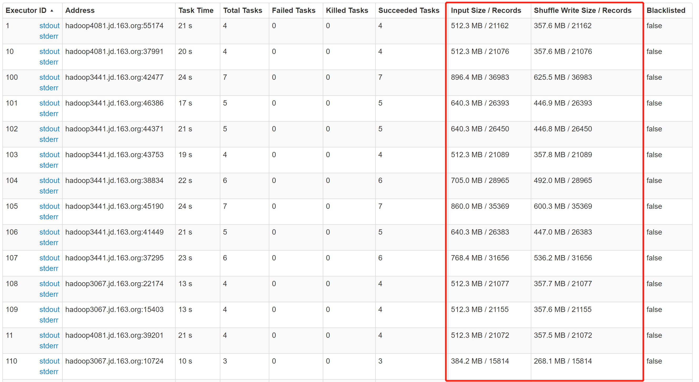

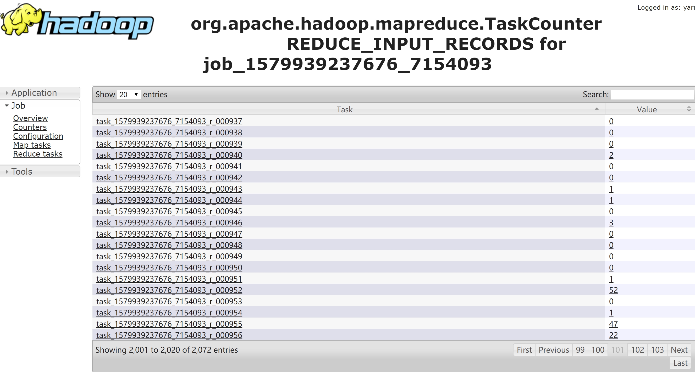

如果出现数据倾斜，该如何处理呢？

数据倾斜的处理方法有很多，不同的场景有一些适用的解决方案：比如在一些大表和小表关联时，Key 分布不均造成的数据倾斜，可以使用mapjoin的方式解决；另外还有一些比较通用的处理方式，例如把热点的Key 进行单独的处理，然后对剩下的Key进行处理，然后对结果进行并集。

因为它不是本文的重点，所以这里就不再详细展开，之前有一篇美团的文章，对数据倾斜有比较深入的分析，推荐给你做课下学习的[资料。](https://tech.meituan.com/2016/05/12/spark-tuning-pro.html)

除了数据倾斜，我们还应该检查任务的配置参数。例如对于Spark 执行引擎，Executor 个数是否开的过大，executor-cores和executor-memory是否开的过多，利用率比较低。一般来说，executors-memorty 设置为4G-8G为宜，executor-cores设置为2-4个为宜（这是我们实践过利用率最高的配置选项）。

另外，你还要考虑任务是否真的有必要在高峰期执行，可以根据集群的负载情况，尽量将任务迁移到非高峰期执行，我将这个步骤称为“削峰填谷”。

上面几点是产出任务高消耗的情况，那么对于存储消耗比较大的任务，你首先要考虑是否要压缩，尤其是对于原始数据层和明细数据层，建议压缩，压缩的方式有这样几种：

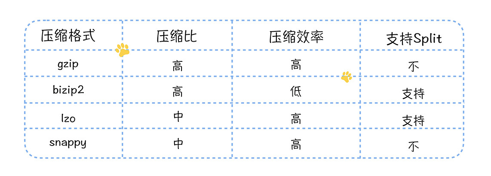

整体来看，对于小文件的压缩，不考虑split，gzip比较合适；对于大文件，推荐使用lzo，支持split，在保证压缩效率的前提下，有着相对稳定的压缩比。

除此之外，还需要考虑生命周期是否设置：

* 对于ODS原始数据层和DWD 明细数据层，比较适合用永久保留的策略；
* 对于一些商品、用户维表，可以考虑3年或者5年的保留策略。

整体上，底层表都是长期保留的。所以你的关注重点应该是汇总层以上的表（包括汇总层），一般可以根据数据的重要性，制订7天，1个月的保留策略。

### 治理效果评估

现在，通过我介绍的这几个方法，你已经能够节省大量的资源消耗，那如何量化我们的治理成果呢？

五个字：省了多少钱。不过，如果直接拿服务器的数量来衡量，其实并不能真实地反应治理效果，因为还要考虑业务增长的原因。业务不是停止不动的，所以你可以围绕任务和数据的成本考虑这样几点：

* 下线了多少任务和数据；
* 这些任务每日消耗了多少资源；
* 数据占用了多少存储空间。

拿这些资源来计算成本，这样就能够算出来省了多少钱。我还是拿本节课开始的例子来看，任务A 运行时长 3个小时，在运行过程中，共消耗5384503 cpu\*s，37007892 GB \*s, 假设我们1个CU （1 cpu， 4g memeory）一年是1300元成本，折合每天为3.5元（计算公式为1300/365）。

**这里需要特别强调，**不论是优化或者下线任务，我们只统计高峰时间段内，因为优化低峰时间，并不能实际节省资源。

高峰时间段为8个小时，那折合每秒的费用为0.00012153, 那该任务的费用为max\{5384503\*0.00012153, 37007892/4 \* 0.00012153\} = max\{654, 1124\} = 1124 。那下线这个任务后，就节省1124元，再加上表 A占用的存储空间大小乘以每GB的成本，就可以得出数据表A下线节省的费用。

## 成本治理中心

成本治理不是一劳永逸的工作，需要持之以恒，不断发现问题，然后治理优化，建立长久运行机制的前提是必须降低成本治理的门槛，接下来，看一下网易的一个成本治理的平台，EasyCost。  
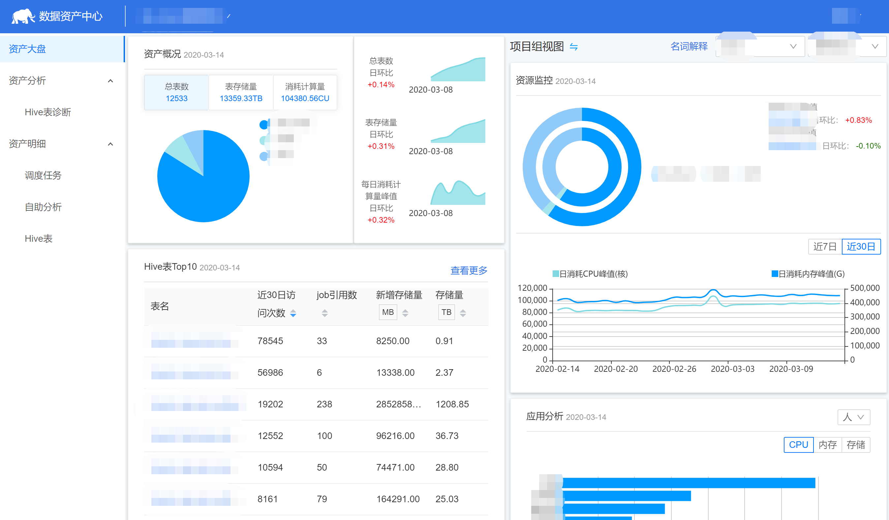

系统提供了数据诊断的功能，可以按照访问时间、访问频率、关联的应用，设置下线策略，支持一键灰度下线，大幅提高了管理的效率。

通过介绍EasyCost，我想告诉你的是，今天的内容，其实可以通过系统化的方式沉淀到产品中，然后通过产品提高管理的效率，从而实现治理机制的长久落地。

## 课堂总结

总的来说，通过数据中台，一方面你可以获得大数据作为资产中心带来的红利，另一方面，你也有可能陷入成本的深渊，为野蛮增长的大数据费用买单。

今天这节课，我从常见的8个成本陷阱入手，带你分析了可能造成成本浪费的原因，然后介绍了精细化成本管理的方法，在最后，我想再强调几个你可能忽略的点：

* 无用数据的下线应该从全链路数据资产视图的末端入手，然后抽丝剥茧，一层一层，向数据加工链路的上游推进。

* 应用层表的价值应该以数据应用的价值来衡量，对于低价值产出的应用，应该以应用为粒度进行下线。

* 对高消耗任务的优化只要关注集群高峰期的任务，项目的整体资源消耗只取决于高峰期的任务消耗，当然，如果你使用的是公有云的资源，可以高峰和低谷实施差异化的成本结算，那低谷期的也是要关注的。

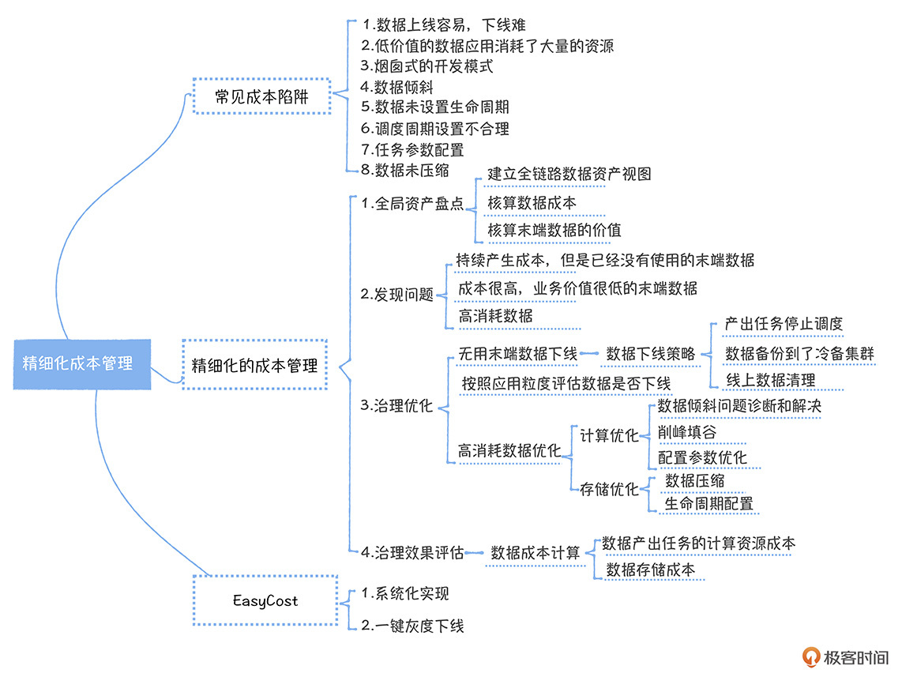

## 思考时间

在数据中台的集市层，会存在一些大的宽表，这些宽表可能存在几百个字段，上游可能有数十个表，如果要计算这个表的成本会非常高。在这个表中，字段的访问频率是不相同，有的字段频率很高，有的字段频率很低，如果要对这张宽表做优化，你觉得如何来做呢\?

最后感谢你的阅读，如果这节课让你有所收获，也欢迎你分享给更多的朋友。