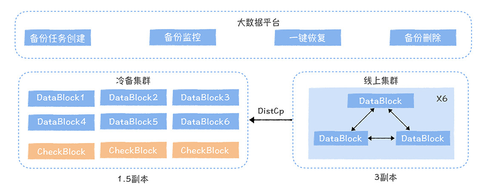
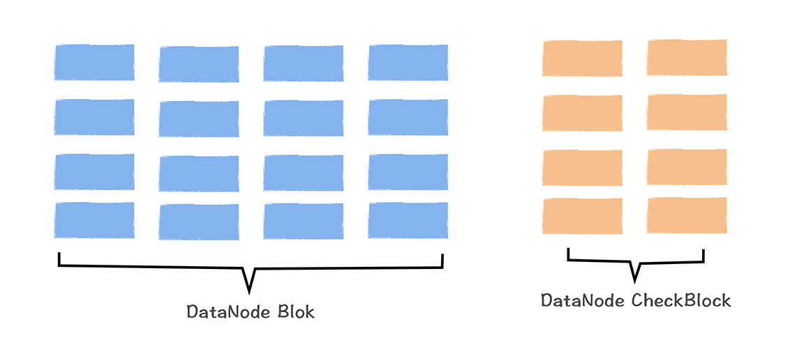
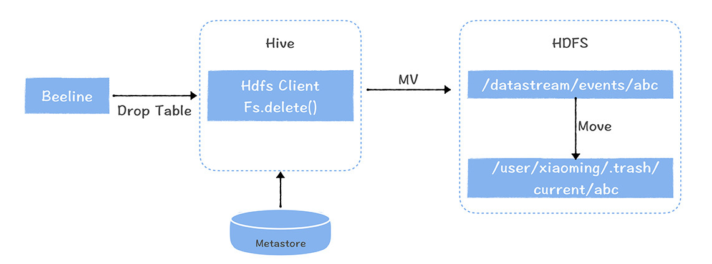
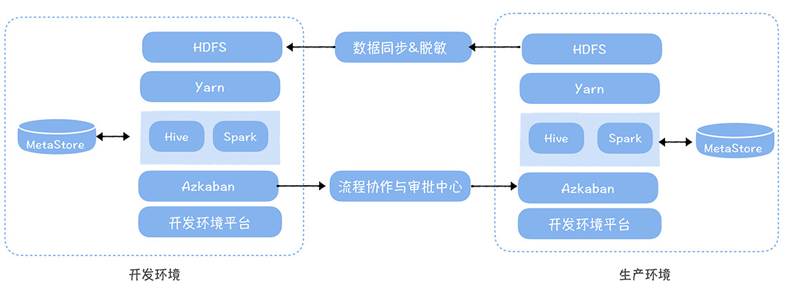
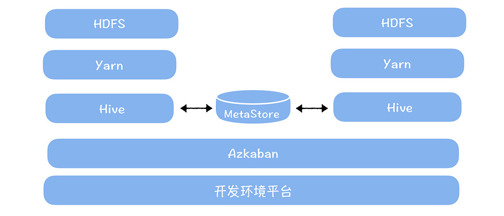
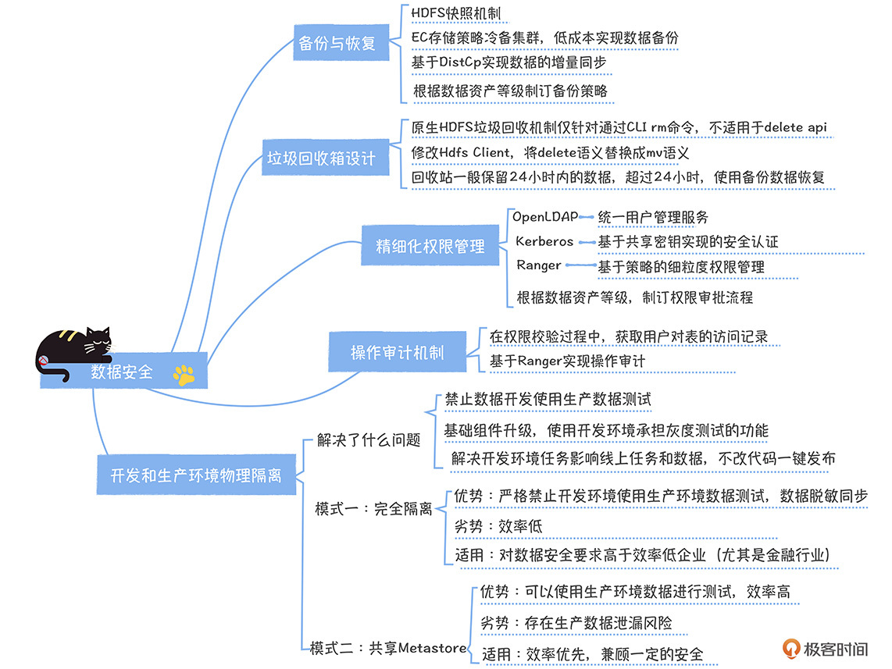

---
date: "2019-06-23"
---  
      
# 11 | 怎么一劳永逸地解决数据安全问题？
你好，我是郭忆。

在前面的课程中，我们了解了数据中台在数据建设效率、质量和成本方面的内容。而除了快、准和省以外，数据中台还必须是安全的。因为如果不安全，你很可能出现和“微盟删库跑路”同样的事情。所以，为了让你能重视数据中台的数据安全，我简单说一下这件事儿的情况。

2020年2月23日19点，国内最大的精准营销服务商微盟出现了大面积的系统故障，旗下300万商户的线上业务全部停止，商铺后台的所有数据被清零。始作俑者是一位运维人员，他在生产环境数据库进行了删库操作，而刚刚上市不久的微盟就因此遭受了巨大的损失，从2月23日宕机以来，市值已经蒸发了30亿港元。这件事儿堪称史上最贵的安全事件。

那么从微盟的教训中，我们能得到什么警醒呢？在数据中台中怎么防止出现类似的事件呢？ 我想这或许是你需要认真思考的内容。安全问题可大可小，不出事情，你可能根本不会重视，但是一旦出现事故，就是灾难性的。在网易，我们对数据中台的安全管理是非常严格的。

在刚开始构建网易数据中台的时候，我们就重点考虑了数据中台的安全保障，我把它归结为五大法宝。


接下来，我就带你深入分析一下，希望学完这部分内容之后，你可以回答这样三个问题：

* 如何解决数据误删除问题；
* 如何解决敏感数据泄露问题；
* 如何解决开发和生产物理隔离问题。

<!-- [[[read_end]]] -->

它们是你在数据中台建设中一定会面临的，学完之后，你一定可以找到解决这些问题的方法。

**机制一：数据备份与恢复**

对于绝大多数的企业，数据中台的数据都存储在HDFS中，即使是实时的数据（存储于Kafka），也会归档一份到HDFS，因为要保存历史数据进行回算或者补数据。**所以我们要解决的核心问题是HDFS 的数据备份。**

网易HDFS 数据的备份，是基于HDFS 快照 + DistCp + EC实现的。



我们分为线上集群和冷备集群两个集群，数据加工任务访问的是线上集群，存储采用的是HDFS默认的3副本。而冷备集群，主要考虑到存储成本的因素，采用的是EC 存储。



**为了让你了解EC存储的基本原理，我多说几句。**其实，Hadoop 在3.x就正式引入了EC 存储，它是一种基于纠删码实现的数据容错机制，通过将数据进行分块，然后基于一定的算法计算一些冗余的校验块，当其中一部分数据块丢失的时候，可以通过这些冗余的校验块和剩余的数据块，恢复出丢失的数据块。

这么说可能不太形象，我做个比喻。比如有三个数据块，分别存储的是1、2和3。我们非常担心其中一个数据块坏了，丢失内容。所以增加了一个块，这个块存储的内容是前面三个数据块之和。那么如果其中任意一个数据块坏了，我们可以根据现有的数据块计算出丢失的数据块内容。 比如1丢失了，我们可以根据6-3-2计算出1，当然这个只是最简单的EC 算法，只能容忍一个数据块丢失，实际的EC算法要再复杂一些 。

关于EC 具体的算法细节，不是本节课的重点，不过我在文末提供了一个链接，你可以课下研究一下。在这里我只想告诉你的是，EC 存储，在不降低可靠性的前提下（与HDFS 3副本可靠性相同），通过牺牲了一定的计算性能（因为计算校验块需要消耗额外的计算资源），将数据存储成本降低了一半，非常适合低频访问的冷数据的存储，而备份数据就是这种类型的数据。

**那线上集群的数据又是如何同步到冷备集群的呢？**

在回答这个问题前，你有必要先了解一下快照的基本原理，因为这样你才能理解后续的数据同步流程。

Hadoop 在2.x版本就已经支持了对某个文件或者目录创建快照，你可以在几秒内完成一个快照操作。在做快照前，你首先要对某个目录或者文件启用快照，此时对应目录下面会生成一个.snapshot的文件夹。


在上图中， 我们对/helloword目录启用快照，然后创建一个s1的备份。此时，在.snapshot下存在s1文件。然后我们删除/helloword/animal/lion 文件时，HDFS 会在animal 目录创建differ文件，并把diifer文件关联到s1备份，最后把lion文件移动到differ目录下。

通过这个案例，我们不难发现，HDFS 快照实际只记录了产生快照时刻之后的，所有的文件和目录的变化，非常适合每天只有少数文件被更新的数据中台，代价和成本也很低。

有了快照之后，我们就需要把快照拷贝到冷备集群中，这里选择的是Hadoop 自带的DistCp。为什么考虑DistCp 呢？因为它支持增量数据的同步。它有一个differ参数，可以对比两个快照，仅拷贝增量的数据。同时，DistCp是基于MapReduce 框架实现的数据同步工具，可以充分利用Hadoop分布式计算的能力，保证数据的拷贝性能。

我提供给你一张详细的图，透过这张图，你可以看到具体的数据从线上集群拷贝到冷备集群的流程。


首先，对于第一次开始数据备份的文件，我们会先创建一个快照，然后利用DistCp 拷贝全量的备份数据到冷备集群。然后后续的每一天，我们都会定时生成一个快照，并和前一天的快照基于distcp \--differ 参数进行对比，将有更新的部分再同步到冷备集群。同步完成以后，会删除前一天的快照，这样就完成了每日数据的增量同步。

这里需要特别注意的是，拷贝数据会对线上I/O 产生比较大的压力，所以尽量在任务运行的低峰期进行同步（比如白天12点到晚上24点之间的时间），同时DistCp的bandwidth参数可以限制同步的速率，你可以根据I/O 负载和数据同步速率，动态调整。比如说，I/O 利用率100\%，应该限制数据拷贝带宽，为10MB/s。

讲到这儿，你已经了解了数据中台中，文件目录的备份了，但是光这些还不够，我们还需要备份数据的产出任务，表相关的信息：

* 任务的备份，要保存任务代码、任务的依赖关系、任务的调度配置以及任务的告警、稽核监控等信息；
* 表的备份主要是备份表的创建语句。

在网易，我们提供了产品化的解决方案，数据开发可以在我们提供的数据管理平台上，选择一张表，创建备份，然后系统就会自动地完成任务、文件和表的备份。平台也提供了一键恢复的功能，系统会自动地帮数据开发创建任务和表，拷贝数据从冷备集群到线上集群。

那么你可能会有疑问：什么样的数据应该备份呢？ **在我看来，数据的备份策略应该和数据资产等级打通，对于核心数据资产，数据中台应该强制进行备份。**

那假如说，数据没有备份，但我们误删除了，还有没有其他的补救方法呢？ 你可以试一下接下来地的这个机制。

**机制二：垃圾回收箱设计**

HDFS 本身提供了垃圾回收站的功能，对于意外删除的文件，可以在指定时间内进行恢复，通过在Core-site.xml中添加如下配置就可以开启了，默认是关闭状态。

```
    <property>  
          <name>fs.trash.interval</name>  
          <value>1440</value>  
    </property>  
    

```

当HDFS 一旦开启垃圾回收功能后，用户通过命令行执行rm 文件操作的时候，HDFS 会将文件移到/user/\[用户名\]/.trash/current/ 目录下。这个目录下的文件会在fs.trash.interval 配置的时间过期后被系统自动删除。当你需要恢复文件的时候，只需要把/user/\[用户名\]/.trash/current/被删除文件移到要恢复的目录即可。

**听到这儿，你是不是感觉问题已经解决了呢？但是我想强调的是HDFS垃圾回收机制在实际应用过程中，存在重大的缺陷。**因为它只能支持通过命令行执行rm操作，对于在代码中通过HDFS API调用Delete接口时，会直接删除文件，垃圾回收机制并不生效。尤其是我们在Hive中执行drop table删除一个Hive内表，此时删除的数据文件并不会进入trash目录，会存在巨大的安全隐患。



那你要怎么解决呢？我建议你可以对HDFS的Client 进行修改，对Delete API通过配置项控制，改成跟rm相同的语义。也就是说，把文件移到trash目录。对于Hive 上的HDFS Client 进行了替换，这样可以确保用户通过drop table 删除表和数据时，数据文件能够正常进入HDFS trash目录。

**通过这种方式，你可以解决数据误删除的问题。**但HDFS 回收站不宜保留时间过长，因为回收站中的数据还是三副本配置，会占用过多的存储空间。所以我给出的一个配合解决方案是，回收站保留24小时内的数据。这样解决的是数据还没来得及被同步到冷备集群，误删除的情况。对于一天以上的数据恢复，建议采取基于冷备集群的数据备份来恢复。

好了，讲完如何解决数据的误删除之后，接下来我们来解决第二个问题，就是如何避免敏感数据的泄露，而这离不开精细化的权限管理。

**机制三：精细化的权限管理**

数据权限是数据中台实现数据复用的前提和必要条件。如果刚开始系统没有开启权限，后期接入权限，任务的改造成本会非常高的，几乎涉及到所有的任务。**所以权限这个问题，在数据中台构建之初，必须提前规划好。**

网易数据中台支撑技术体系是基于OpenLDAP + Kerberos + Ranger 实现的一体化用户、认证、权限管理体系。


试想一下，如果有几千台机器，却没有一个统一的用户管理服务，当我们想添加一个用户时，需要到几千台服务器上去创建初始化用户，这个管理和运维的效率有多低。而OpenLDAP就帮我们解决了这个问题。

OpenLDAP是一个轻量化的目录服务，数据以树型结构进行存储，能够提供高性能的查询服务，非常适合用户管理的场景。


在OpenLDAP中，我们可以创建用户（User）和组\(Group\)，对于每个用户，会有唯一的uid，对于每个组，通过Memberuid，我们可以添加一个用户到一个组中。

在网易大数据平台上注册一个用户，平台会自动生成一个OpenLDAP的用户，当该用户加入某个项目时，会将该项目对应的Group下增加一个Memberuid。假设在上图中，甄漂亮加入了da\_music项目，那么在da\_music 的Group下，会增加Memberuid:1002。同理，当甄美丽加入某个角色时，在对应角色的Group下，也会有甄美丽对应的Memberuid。

那Hadoop 又是怎么跟OpenLDAP集成的呢？

Hadoop 可以使用LdapGroupsMappings 同步LDAP创建的用户和用户组，这样当我们在LDAP中添加用户和组时，会自动同步到Hadoop集群内的所有机器上。

**通过这个方式，你就可以解决用户管理的问题了，而接下来要解决的就是认证的问题。**在非安全网络中，除了客户端要证明自己是谁，对于服务端而言，同样也需要证明我是我。为了实现双向的认证，我们在生产环境启用了安全等级最高的，基于共享密钥实现的Kerberos认证。

说起Kerberos认证的原理，我想举一个有趣的例子。

你肯定去过游乐场吧！ 为了进游乐场，首先你需要提供你的身份证，实名购买一张与你身份绑定的门票。在进入游乐场之后呢，每个游乐设施前，都有一个票据授权机器，你需要刷一下你的门票，授权机器会生成一个该游乐设施的票据，你拿着这个票据就可以玩这个游乐设施了。

当然，当你想玩另外一个游乐设施的时候，同样需要刷一下你们的门票，生成对应游乐设施的票据。而且你的门票是有有效期的，在有效期内，你可以尽情地玩游乐设施，一旦超过有效期，你需要重新购买你的门票。


Kerberos认证与上面这个故事类似，在上面的故事中，TGT（Ticket-granting ticket）可以看作是门票，Client首先使用自己的密钥文件Keytab和用户标识Principal去认证服务器（AS）购买TGT，认证服务器确认是合法的用户，Client会获得TGT，而这个TGT使用了TGS（Ticket-granting service）的Keytab加密，所以Client是没办法伪造的。

在访问每个Server前，Client需要去票据授权服务（TGS）刷一下TGT，获取每个服务的票据（ST），ST使用了Client要访问的Server的Keytab加密，里面包含了TGS 认证的用户信息，Client是无法伪造ST的。

最后基于每个服务的票据，以及客户端自己生成的加密客户认证信息（Autenticator）访问每个服务。每个Server都有归属于自己的Keytab，Server只有使用Server自己的Keytab才能解密票据（ST），这就避免了Client传给了错误的Server。

与此同时，解密后票据中包含TGS认证的客户信息，通过与Authenticator 中Client生成的客户信息进行对比，如果是一致的，就认为Client是认证通过的。

一般在Hadoop中，我们会使用Kinit 工具完成TGT的获取，TGT 一般保存24小时内。**我介绍Kerberos原理，其实是想让你知道，Kerberos对于Hadoop集群来说，是一个非常安全的认证实现机制，我推荐你使用Kerberos 实现Hadoop集群的安全认证。**

你可能会问，Kerberos 使用的是Principal标识用户的，它又是怎么和OpenLDAP中的用户打通的呢？ 其实我们访问HDFS，使用的是Principal，Hadoop可以通过配置hadoop.security.auth\_to\_local，将Principal映射为系统中的OpenLDAP的用户。用户注册时，平台会为每一个新注册的用户生成Principal以及相对应的Keytab文件。

认证完成之后呢，就要解决哪些客户可以访问哪些数据的问题了。我推荐你使用Ranger来解决权限管理的问题。

**为什么要选择Ranger呢？**因为Ranger 提供了细粒度的权限控制（Hive列级别），基于策略的访问控制机制，支持丰富的组件以及与Kerberos的良好集成。权限管理的本质，可以抽象成一个模型：“用户-资源-权限”。

数据就是资源，权限的本质是解决哪些人对哪些资源有权限。


在Ranger中，保存了很多策略，每一个资源都对应了一条策略，对于每个策略中，包含了很多组许可，每个一个许可标识哪个用户或者组拥有CRUD权限。

讲完了用户、认证和权限实现机制，那你可能会问，**权限的申请流程是什么样子的呢\?**

在数据中台中，每一张表都有对应的负责人，当我们在数据地图中找到我们想要的数据的时候，可以直接申请表的访问权限，然后就会发起一个权限申请的工单。表的负责人可以选择授权或者拒绝申请。申请通过后，就可以基于我们自己的Keytab访问该表了。

**另外，需要特别强调的是，**由于数据中台中会有一些涉及商业机密的核心数据，所以数据权限要根据数据资产等级，制订不同的授权策略，会涉及到不同的权限审批流程，对于一级机密文件，可能需要数据中台负责人来审批，对于一般的表，只需要表的负责人审批就可以了。

## 机制四：操作审计机制

进行到第三步，权限控制的时候，其实已经大幅降低了数据泄露的风险了，但是一旦真的出现了数据泄露，我们必须能够追查到到底谁泄露了数据，所以，数据中台必须具备审计的功能。


由于用户每次访问数据，都要对权限进行验证，所以在校验权限的同时，可以获取用户访问表的记录，Ranger支持审计的功能，用户的访问记录会由部署在各个服务（HDFS，HBase等等）上的插件推送到Audit Server上，然后存储在Solr中，Ranger提供了API接口查询表的访问记录。但是必须指出的是，Ranger开启Audit 后，会对服务内的插件性能产生影响。

除了敏感数据泄露的风险，我还看到一些企业想要对开发和生产环境进行物理隔离。为什么企业会有这个诉求呢？

首先，很多传统公司的数据开发都是外包人员，从企业的角度，不希望数据开发直接使用生产环境的数据进行测试，从安全角度，他们希望生产和测试从物理集群上完全隔离，数据脱敏以后，给开发环境进行数据测试。

其次，涉及一些基础设施层面的组件升级（比如HDFS、Yarn、Hive、Spark等），贸然直接在生产环境升级，往往会造成兼容性的事故，所以从安全性的角度，企业需要有灰度环境，而用开发环境承担灰度环境的职能，是一个不错的选择。

最后，虽然可以为生产和开发环境设置不同的库和队列，从而实现隔离，避免开发任务影响线上任务和数据，但会导致任务上线需要改动代码，所以最理想的，还是实现开发和生产环境两套集群，同一套代码，在开发环境对应的就是开发集群，提交上线后，就发布到生产集群。

这些就是企业希望开发和生产集群物理隔离的原因，那我们接下来看一看该如何满足。

## 机制五：开发和生产集群物理隔离

在面对这个需求时，我们遇到了两类完全不同的企业群体。

一部分来自传统企业，尤其是金融行业，他们对安全性的要求远大于对效率的诉求，严格禁止数据开发使用线上数据进行测试，他们希望有两套完全不同的环境，包括操作平台，任务在开发环境进行开发，配置任务依赖，设置稽核规则和报警，然后由运维人员进行审核后，一键发布到生产环境。当数据开发需要对数据进行测试时，可以同步生产环境的局部数据（部分分区），数据会进行脱敏。



上图是该模式下的部署架构。

通过这张图我们可以看到，开发和测试环境本身是两套完全独立的平台，因为每次数据测试，都需要同步生产环境的数据，所以这种模式下，数据开发的效率会有比较大的影响，但是优势在于对数据安全实现了最高级别的保护。

与这部分客户不同的是，很多企业需要同时兼顾安全和效率，他们没有办法接受同步生产环境数据，而是需要在开发环境能够直接使用线上的数据进行测试。



上图展示了该模式下的部署架构。

我们可以看到，大数据平台和任务调度系统（Azkaban）都是一套，然后Hive，Yarn和HDFS都是两套，两套集群通过Metastore 共享元数据。

这样做的一个好处在于，一个集群的Hive可以直接访问另外一个集群的数据。在同一个Metastore中，开发环境的数据在\_dev库中，生产环境的数据在\_online库中，用户在代码中不需要指定库，在任务执行时，根据运行环境，自动匹配库。例如在开发环境执行，Hive默认会使用\_dev库下的表，而在生产环境执行，Hive默认会使用\_online库下的表，从而实现了不需要改代码可以实现一键发布。

上面两种部署模式，你可以根据你所在的企业实际情况进行选择，对安全性要求高，推荐第一种方案，对于效率要求高，同时兼顾一定的安全性，就推荐第二种方案。

## 课堂总结

以上就是这节课的全部内容了，总的来说，我为你介绍了解决数据中台安全问题的五大制胜法宝，相信通过这些保障机制，你可以解决数据中台遇到的安全问题了。最后，我再强调几个重点：

* 数据备份要同时兼顾备份的性能和成本，推荐采用EC存储作为备份集群的存储策略；
* 数据权限要实现精细化管理，基于OpenLDAP+Kerberos+Ranger可以实现一体化用户、认证、权限管理；
* 开发和生产环境物理隔离，我提到了两种部署模式，需要综合权衡效率和安全进行选择。



## 思考时间

在课程的最后，我还是留一个思考题，来与你进行互动。

引入权限管理，势必会对数据研发效率产生影响，同时已有的任务必须重构，进行认证改造。你是如何思考安全和效率之间的优先关系的？ 欢迎在留言区与我互动。

最后，感谢你的阅读，如果这节课让你有所收获，也欢迎你将它分享给更多的朋友。

**HDFS EC 存储介绍：**  
<https://hadoop.apache.org/docs/current/hadoop-project-dist/hadoop-hdfs/HDFSErasureCoding.html>