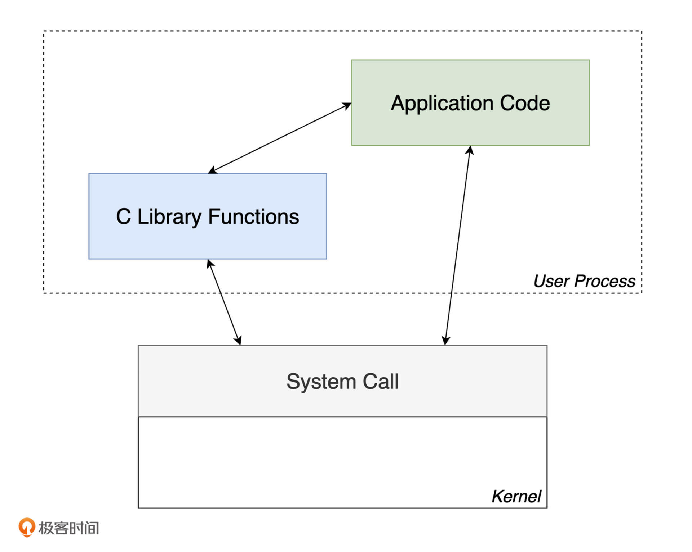

---
date: "2019-06-23"
---  
      
# 11｜标准库：深入理解标准 IO
你好，我是于航。

输入输出（后面简称 “IO”）是应用程序不可或缺的一种基本能力。为了保持设计上的精简，C 语言并没有在核心语言层面提供对 IO 相关接口的支持，相反，采用了标准库的方式来实现。通过引用名为 stdio.h 的标准库头文件，我们便可以快捷地为 C 程序添加读取用户键盘输入、输出内容到控制台，乃至读写文件等一系列常规的 IO 功能。

这一讲，我将为你深入介绍 C 语言中的标准 IO 模型，以及它背后的一些原理。

## 快速回顾 IO 接口的使用方法

首先，让我们通过下面这段代码来快速回顾，应该如何在 C 语言中使用这些由标准库提供的 IO 接口。对于这些接口用法的更具体说明，你可以参考[这个链接](https://en.cppreference.com/w/c/io)。

```
    #include <stdio.h>
    int main(void) {
      printf("Enter some characters:\n");
      FILE* fp = fopen("./temp.txt", "w+");
      if (fp) {
        char ch;
        while (scanf("%c", &ch)) {
          if (ch == 'z') break;
          putc(ch, fp);
        }
      } else {
        perror("File open failed.");
      }
      fclose(fp);
      return 0;
    }
    

```

这里，在 main 函数内部，我们通过多种不同的方式，让程序与进程预设的 IO 流以及我们自行打开的 IO 流产生了交互。

<!-- [[[read_end]]] -->

其中，代码第 3 行，通过 printf 函数，我们可以将指定的文本传送至标准输出流（stdout）中。紧接着，借助代码第 4 行的 fopen 函数，我们得以在当前目录下打开名为 “temp.txt” 的文件，并将其与一个特定的文件 IO 流相关联。而当文件打开失败时，通过代码第 12 行的 perror 函数，我们能够将特定的错误信息传送到标准错误流（stderr）。最后，在代码的第 7 行，scanf 函数的调用可以让我们从标准输入（stdin）流中，读取从外部环境输入的信息。

## IO 接口的不同级别

通常来说，IO 接口可以被分为不同层次。其中，C 语言提供的 IO 接口属于“标准 IO”的范畴。与其相对的，是名为“低级 IO”的另一套编程模型。顾名思义，**低级 IO 会使用与具体操作系统相关的一系列底层接口来提供相应的 IO 能力**，比如常用于 Unix 与类 Unix 操作系统上的 POSIX 接口标准。如果我们将上面的示例程序完全用该标准进行重写，将会得到如下所示的代码：

```
    #include <unistd.h>
    #include <fcntl.h>
    int main(void) {
      const char str[] = "Enter some characters:\n";
      write(STDOUT_FILENO, str, sizeof(str));
      const int fd = open("./temp.txt", O_RDWR | O_CREAT);
      if (fd > 0) {
        char ch;
        while (read(STDIN_FILENO, &ch, 1)) {
          if (ch == 'z') break;
          write(fd, &ch, sizeof(ch));    
        }
      } else {
        const char errMsg[] = "File open failed.";
        write(STDERR_FILENO, errMsg, sizeof(errMsg));
      }
      close(fd);
      return 0;
    }
    

```

可以看到，在使用低级 IO 接口进行编程时，我们需要处理与所进行 IO 操作有关的更多细节。比如，在调用 write 接口时，你必须要指定不同的文件描述符（File Descriptor），才能够区分所要进行的操作是“向屏幕上输出字符”，还是“向文件内写入数据”。相反，在高级 IO 的实现中，我们并不需要关注这些细节，接口的名称可以直接反映其具体用途。

两者之所以会在接口使用粒度上存在差异，是由于“低级 IO 与操作系统实现紧密相关”。对于 POSIX 标准来说，其所在系统会将绝大多数的 IO 相关资源，比如文档、目录、键盘、网络套接字，以及标准输入输出等，以“文件”的形式进行抽象，并使用相对统一的数据结构来表示。而在实际编码过程中，每一个可用的 IO 资源都会对应于一个唯一的整型文件描述符值。该值将被作为“单一可信源（The Single Source of Truth）”，供相关接口使用。

而标准 IO 在接口设计与使用方式上，却不会与某类特定的操作系统进行“绑定”。相反，它会提供更加统一和通用的接口，来屏蔽底层不同系统的不同实现细节，做到“一次编写，到处编译”。

除此之外，即使上述两段采用不同级别 IO 接口实现的 C 代码，在实际的可观测执行效果方面基本一致，但它们在程序运行时，资源的背后使用逻辑上却有着较大的差异。

## 带缓冲的标准 IO 模型

那么，这两种 IO 模型除了在接口使用方式上有不同外，还有哪些重要差异呢？简单来讲，**与低级 IO 相比，标准 IO 会为我们提供带缓冲的输入与输出操作**。事实上，标准 IO 接口在实现时，会直接使用所在平台提供的低级 IO 接口。而低级 IO 接口在每次调用时，都会通过系统调用来完成相应的 IO 操作。

关于系统调用的内容，这一讲的后面还会提到。并且，我也会在第 31 讲中再为你深入介绍。在这里你只需要知道，系统调用的过程涉及到进程在用户模式与内核模式之间的转换，其成本较高。为了提升 IO 操作的性能，同时保证开发者所指定的 IO 操作不会在程序运行时产生可观测的差异，标准 IO 接口在实现时通过添加缓冲区的方式，尽可能减少了低级 IO 接口的调用次数。

让我们再把目光移回到之前的两段示例代码上。不知道你在运行对应的两段程序时，是否有观察到它们之间的差异呢？实际上，使用低级 IO 接口实现的程序，会在用户每次输入新内容到标准输入流中时，同时更新文件 “temp.txt” 中的内容。而使用标准 IO 接口实现的程序，仅会在用户输入的内容达到一定数量或程序退出前，再更新文件中的内容。而在此之前，这些内容将会被存放到缓冲区中。

当然，C 标准中并未规定标准 IO 接口所使用的缓冲区在默认情况下的大小，对于其选择，将由具体标准库实现自行决定。

除此之外，标准 IO 还为我们提供了可以自由使用不同缓冲策略的能力。对于简单的场景，我们可以使用名为 fflush 的接口，来在任意时刻将临时存放在缓冲区中的数据立刻“冲刷”到对应的流中。而在相对复杂的场景中，我们甚至可以使用 setvbuf 等接口来精确地指定流的缓冲类型、所使用的缓冲区，以及可以使用的缓冲区大小。

比如，我们可以在上述标准 IO 实例对应 C 代码的第 4 行后面，插入以下两行代码：

```
    // ...
    char buf[1024];
    setvbuf(fp, buf, _IOFBF, 5);
    // ...
    

```

此时，再次编译并运行程序，其执行细节与之前相比会有什么不同？欢迎在评论区告诉我你的发现。

## 用于低级 IO 接口的操作系统调用

接下来，让我们再来看一看低级 IO 的相关实现细节。

在前面的内容中我曾提到过，低级 IO 接口在其内部会通过系统调用来完成相应的 IO 操作。那么，这个过程是怎样发生的呢？

实际上，你可以简单地将系统调用当作是由操作系统提供的一系列函数。只是相较于程序员在 C 源代码中自定义的“用户函数”来说，系统调用函数的使用方式有所不同。与调用用户函数所使用的 `call` 指令不同，在 x86-64 平台上，我们需要通过名为 `syscall` 的指令来执行一个系统调用函数。

操作系统会为每一个系统调用函数分配一个唯一的整型 ID，这个 ID 将会作为标识符，参与到系统调用函数的调用过程中。比如在 x86-64 平台上的 Linux 操作系统中，open 系统调用对应的 ID 值为 2，你会在接下来的例子中看到它的实际用法。

同用户函数类似的是，系统调用函数在被调用时，也需要通过相应的寄存器来实现参数传递的过程。而正如我在第 [05 讲](https://time.geekbang.org/column/article/468171) 中提到的那样，SysV 调用约定中规定，系统调用将会使用寄存器 rdi、rsi、rdx、r10、r8、r9 来进行实参的传递。当然，除此之外，rax 寄存器将专门用于存放系统调用对应的 ID，并接收系统调用完成后的返回值。

那么，让我们通过实际代码来看一看，如何在机器指令层面使用系统调用。在下面这段代码中，我们直接使用机器指令调用了 open 系统调用函数。

```
    #include <unistd.h>
    #include <fcntl.h>
    int main(void) {
      const char str[] = "Enter some characters:\n";
      write(STDOUT_FILENO, str, sizeof(str));
      const char* fileName = "./temp.txt";
      // Call to `open` starts:
      // const int fd = open("./temp.txt", O_RDWR | O_CREAT);
      volatile int fd;
      asm("mov $2, %%rax\n\t"
          "mov %0, %%rdi\n\t"
          "mov $66, %%rsi\n\t"  // 2 | 64 -> 66;
          "syscall\n\t"
          "mov %%rax, %1\n\t"
           : "=m" (fileName)
           : "m" (fd));
      // Call ended.
      if (fd > 0) {
        char ch;
        while (read(STDIN_FILENO, &ch, 1)) {
          if (ch == 'z') break;
          write(fd, &ch, sizeof(ch));
        }
      } else {
        const char errMsg[] = "File open failed.";
        write(STDERR_FILENO, errMsg, sizeof(errMsg));
      }
      close(fd);
      return 0;
    }
    

```

可以看到，在上述代码的第 10 行，我们以内联汇编的形式，在程序的执行流中插入了 5 条机器指令。其中，第 1 条指令，我们将系统调用 open 对应的整型 ID 值 2 放入到了寄存器 rax 中；第 2 条指令，我们将存放有目标文件名称的字节数组 fileName 的首地址放到了寄存器 rdi 中，该参数也对应着低级 IO 接口 open 的第一个参数。接下来的一条指令，我们将配置参数对应表达式 `O_RDWR | O_CREAT` 的计算结果值 66 放入到了寄存器 rsi 中。最后，通过指令 `syscall`，我们得以调用对应的系统调用函数。

而当系统调用执行完毕后，其对应的返回值将会被放置在寄存器 rax 中。因此，你可以看到：在代码的第 14 行，我们将该寄存器中的值传送到了变量 fd 在栈内存中的位置。至此，程序对系统调用 open 的使用过程便结束了，是不是非常简单？

其实，除了低级 IO 接口以外，C 标准库中还有很多其他的功能函数，它们的实际执行也都依赖于所在操作系统提供的系统调用接口。因此，我们可以得到 C 标准库、系统调用，以及应用程序三者之间的依赖关系，如下图所示：



这个关系看起来比较清晰，但隐藏在操作系统背后的系统调用函数实现细节，以及调用细节却非常复杂。与此相关的更多内容，我会在“C 程序运行原理篇”中再向你详细介绍。

## 危险的 gets 函数

最后，我们再来聊聊标准 IO 与代码安全的相关话题。

实际上，C 语言提供的标准 IO 接口并非都是完备的。自 C90 开始，一个名为 gets 的IO 函数被添加进标准库。该函数主要用于从标准输入流中读取一系列字符，并将它们存放到由函数实参指定的字符数组中。例如，你可以这样来使用这个函数：

```
    #include <stdio.h>
    void foo(void) {
      char buffer[16];
      gets(buffer);
    }
    int main(void) {
      foo();
      return 0; 
    }
    

```

可以看到，函数的使用方式十分简单。在上述代码的第 3 行，我们声明了一个 16 字节大小的字符数组。紧接着，该数组作为实参被传递给了调用的 gets 函数。而此时，所有来自用户的输入都将被存放到这个名为 buffer 数组中。一切看似美好，但问题也随之而来。

实际上，gets 函数在其内部实现中，并没有对用户的输入内容进行边界检查（Bound Check）。因此，当用户实际输入的字符数量超过数组 buffer 所能承载的最大容量时，超出的内容将会直接覆盖掉栈帧中位于高地址处的其他数据。而当别有用心的攻击者精心设计输入内容时，甚至可以在某些情况下直接“篡改”当前函数栈帧的返回地址，并将其指向另外的，事先准备好的攻击代码。

正因如此，gets 函数已经在 C99 标准中被弃用，并在 C11 及以后的标准中移除。不仅如此，如今的主流编译器在遇到使用了 gets 函数的代码时，也会给予相应的安全性提示。另外，DEP、ASLR、Canary 等技术也在一定程度上降低了此类安全事故发生的风险。**但无论如何，请不要在代码中使用 gets 函数**。

## 总结

好了，讲到这里，今天的内容也就基本结束了。最后我来给你总结一下。

今天我主要介绍了 C 标准库中与标准 IO 相关的内容，包括 IO 接口的不同级别，它们之间的区别，以及背后的实现方式。

根据对操作系统依赖关系的强弱，IO 接口可以被分为“低级 IO”与“标准 IO”两种不同的层级。其中，低级 IO 的使用依赖于具体的操作系统，而标准 IO 则抽象出了通用的 IO 接口，因此更具可移植性。

标准 IO 一般会使用所在平台的低级 IO 接口来实现。而低级 IO 则通过调用操作系统内核提供的系统调用函数，来完成相应的 IO 操作。在 x86-64 平台上，系统调用通过 `syscall` 指令来执行。而在基于该平台的 Unix 与类 Unix 系统上，系统调用函数的执行会使用寄存器 rdi、rsi、rdx、r10、r8、r9 来进行参数的传递，rax 寄存器则用于传递系统调用 ID，以及接收系统调用的返回值。

最后，由于设计实现原因，标准库中的 gets 函数具有较大的安全风险，因此要避免在程序中使用。

## 思考题

最后，我们一起来做个思考题。

ungetc 函数有什么作用呢？对同一个流，它最多可以被连续调用多少次呢？欢迎在评论区留下你的答案。

今天的课程到这里就结束了，希望可以帮助到你，也希望你在下方的留言区和我一起讨论。同时，欢迎你把这节课分享给你的朋友或同事，我们一起交流。