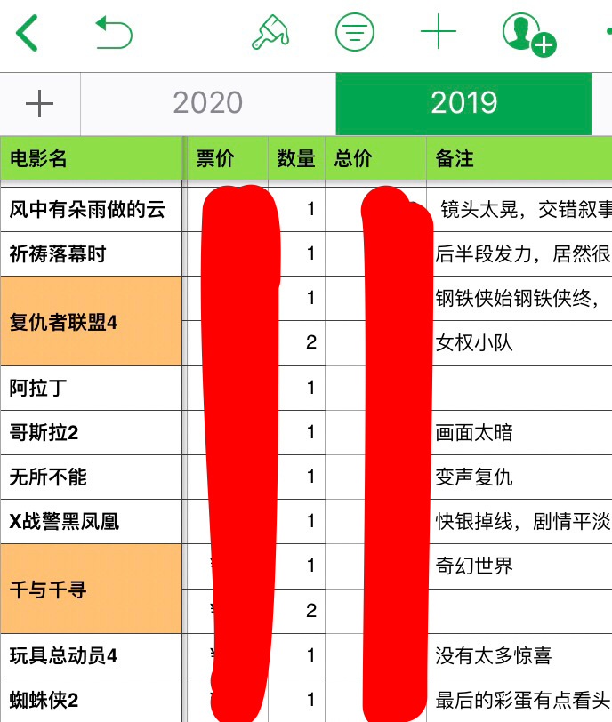
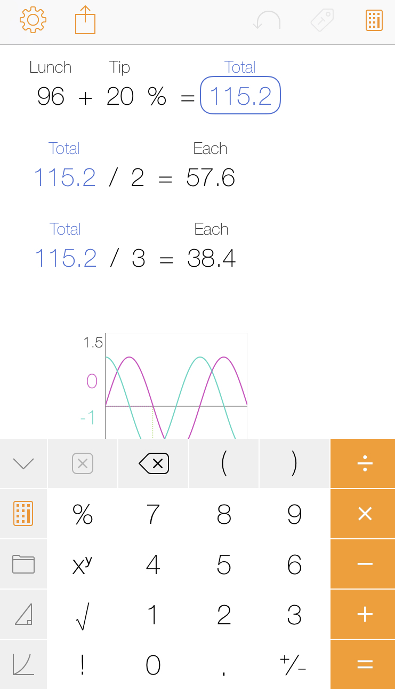
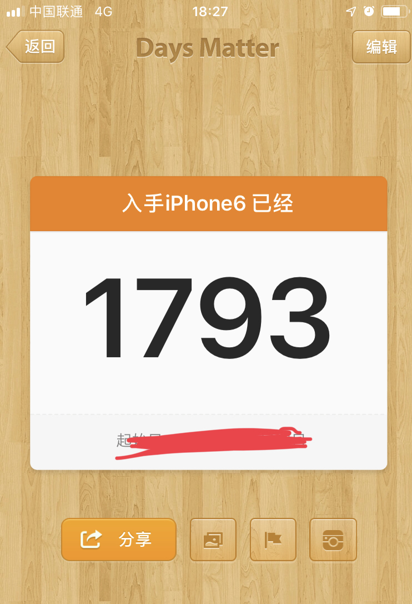
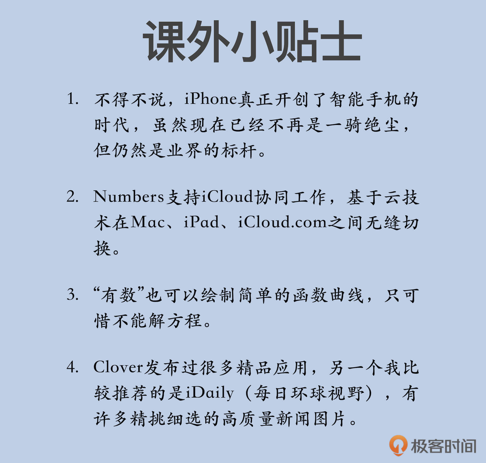

---
date: "2019-06-23"
---  
      
# 轻松话题（三） | 提高生活质量的App
你好，我是Chrono。

今天这期“轻松话题”，我想换个领域，跟你聊聊手机，谈谈怎么才能利用好手里的这块小屏幕。

我来推荐几个不是那么常见但却非常有意思的App，用好它们的话，肯定可以解决你生活中的一些不大不小的麻烦，提升你的生活质量。

需要注意的是，下面我要说的都是iPhone上的应用，不过Android上应该也有相同或者相似的产品，请善用各大应用商店的搜索功能。

## Numbers

好，第一个要推荐的是苹果的独家App，iWork三件套之一：Numbers。

iWork是苹果自家的办公应用套件，对应的是微软的Office，名气虽然没有Office那么大，用户也不是很广泛，但秉承了苹果一贯的精致特性，做得很用心、很有“范儿”。

Numbers相当于Office里的Excel，是一个电子表格应用。

看到“电子表格”，你可能对它会“嗤之以鼻”：“这有什么了不起的，Excel天下无敌，而且很多笔记应用也有表格功能，难道仅仅是因为它出身于苹果‘豪门’吗？”

还真是这样，虽然电子表格产品都“大同小异”，但差就差在这“小异”的地方。

Numbers没有选择与Excel正面竞争，而是做出了差异化：去除了Excel浓厚的“办公味道”，添加了许多“生活气息”。

<!-- [[[read_end]]] -->

它最大的一个特点是：表格是有限的，而不是无限的。

所以，在使用Numbers时，就像是在使用现实中的A4纸，在单个页面上可以画出好几个独立的小表格，再加上批注、描绘、饼图什么的，还可以用各种字体、色彩装饰一下，打扮出一个漂漂亮亮、生动活泼的画幅，就像是一份“手抄报”。

当然，Numbers处理大表格也毫无问题。而且，它还会自动固定标题栏和侧边栏，滑动查阅时关键的抬头信息始终可见，非常适合手机浏览。

另外，Numbers也对触摸操作做了很好的优化。选择单元格，可以直接插入当前时间、调整格式，还有多种特制键盘，快捷输入数字、日期，比标准键盘省事得多。

总之，在手机上使用Numbers，会获得与在电脑上使用Excel时完全不同的体验。

那么，Numbers该怎么用才能方便生活呢？该用来记录什么呢？

其实什么都可以，只要存在“条目化”“拉清单”的可能，都可以放进Numbers里，比如银行卡、课程表、减肥记录、书刊杂志、家具衣物、水电开支、工资奖金、差旅报销、旅游美食、股票投资……太多了，生活里的一切一切，只要你想得到，都可以放在Numbers里保存起来。

比如说，你可以做一个财务表，把工资按月份记录下来，把偶尔的补助、报销、奖金等其他收入，并列放在旁边的表格里，然后转换出折线图，这样就可以看出自己的工资增长幅度、年度收入了。再进一步的话，可以把前几年的数据也导进表格，还可以算出来新个税带来了多少实质性的好处。

给你分享一个我自己的实际例子：用Numbers保存看电影的记录。下面这张截图展示的就是我去年看的一部分电影，里面记下了电影名、观影时间/地点、票价，等等，还有简单的观后感。

有了这些数据之后，我就可以很容易地做一些分析，给好看的电影打个分，标注下哪些值得再看，还可以算算这一年下来，看了多少部电影、总共花了多少钱、均价是多少……也算是给自己做个总结，让时间留下一些值得怀念的记忆。

## 有数

接下来要说的这个“有数”应用是一个计算器，听起来好像比电子表格还要“平凡”一些。

计算器应该是一个“大路货”的应用了，很常见，一般手机也都自带，但是，这些计算器应用大多千篇一律，数字键盘再加上一些函数功能，非常简陋。

而“有数”则突破了传统计算器的设计思路，其理念与Numbers有些类似，把整个屏幕当作一张“草稿纸”，可以在上面任意书写算式，就像是我们上学时在纸面上列式演算一样，我把这称为“更高层次的拟物化”。

这样有什么好处呢？

好处就在于你不仅能够得到结果，还能直观地看到计算的全过程，随时“复盘”校验。而且，计算过程也可以反复重用，输入的数字可以任意修改或者引用到其他算式，整个算式也可以拷贝粘贴。

它的另一个“亮点”，是可以对计算过程加上文字注释说明，让数字不再枯燥，而是有了具体的含义，形成一份“算术文稿”。

比如说，家里想做个简单的装修，需要买瓷砖、地板、涂料，还有各种人工费。那么，你就可以在“有数”里把这些逐个列出来，单价乘上个数，最后再加起来。只要不到1分钟，总价、细则就可以清清楚楚、一目了然。如果价格、数量有变动，还可以立即修改，生成新的报价。

虽然Numbers也可以做同样的事情，但对于简单的算术来说，有点“小题大做”，在需要快速得出计算结果的时候，还是“有数”更加实用。

这里要提醒你一下，“有数”不是免费的，在App Store里卖12元，但我觉得它绝对值得这个价钱。这是我最喜爱的计算器，相信你接触它后，也会有同感。

## 倒数日

第三个要说的应用是“倒数日”（Days Matter），它应该是一个非常“老牌”的应用了，有着七八年的历史，由著名的Clover team出品。

其实，“倒数日”这个名字有点不太精确，它不仅能够“倒数”日期，也能够“正数”日期，怎么使用完全取决于你自己。

“倒数”的功能很简单，就是设定一个将来的日期，然后来个“倒计时”等待，比如到发工资还有多少天、到情人节还有多少天、到新年还有多少天。

你还可以基于这个设计一些更“高级”的玩法，制订一些人生的“里程碑”，比如说买辆自用车、入职BAT、年薪30万、创立自己的公司，等等。

有了这些“小目标”，你就可以每天打开应用，用“倒计时”来提醒、鞭策自己，看看是不是随着努力正在一步步地接近这些理想。

“正数”的功能也很简单，就是记录已经发生过的各种“事件纪念日”，方便随时回忆那些美好的瞬间，这也正符合了它的Slogan：“从现在起，不再忘记重要的事情。”

这方面我觉得值得记录的就更多了，比如生日、相识纪念、结婚纪念、拿驾照、买Mac、换新房……

还是拿我自己来举个例子。下面的这张截图，记的是我当年买iPhone6的日子，这么一看，这部手机已经用了差不多5年了。如果没有“倒数日”这个应用，真的很难回想起来它是什么时候走进我生活里的，又“忠诚”地跟了我多久。

除了“倒数”和“正数”，这个应用里面另一个很有意思的功能是“历史上的今天”，每天看一下历史上曾经都发生过哪些大事要事，也是挺好玩的，可以在不知不觉间增长一些历史知识。

## 小结

好了，今天就闲聊到这里吧，我简单小结一下今天的内容。

1.  现在的手机功能很强大，如果只用它来上网、看视频、玩游戏，就有点浪费了。
2.  “Numbers”是一个电子表格应用，可以用来盘点生活中的各种事务。
3.  “有数”是一个创新的计算器应用，可以实现“草稿纸”式演算。
4.  “倒数日”是一个纪念日应用，可以用来记录人生中的各种重要时刻。

最后，我想说，这几个应用各自都有一些新颖的设计，所以才在众多竞品中脱颖而出。

我认为，它们的共同点就是不盲目“随大流”，真正关心用户的需求。很多应用都是在已有功能的基础上做些修修补补，同质化现象非常严重。但是，这些应用却善于从平凡的生活中挖掘更有价值的功能，甚至是大多数人都没有想到的功能，可以满足用户的多层次需求。无论是产品创意，还是微小的功能，都真正做到了“以人为本”。而**始终致力于更好地服务用户的产品，必定不会差**。

那么，这是否也给了你有些在写代码、做产品等方面上的启迪呢？

欢迎你在留言区分享你喜欢的App，以及你从优秀的应用中得到的启发。

