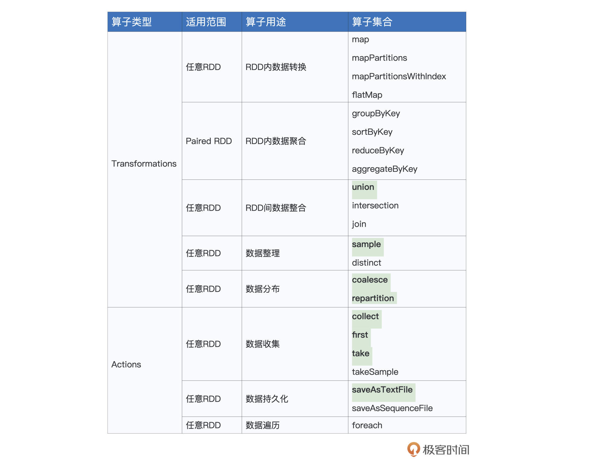
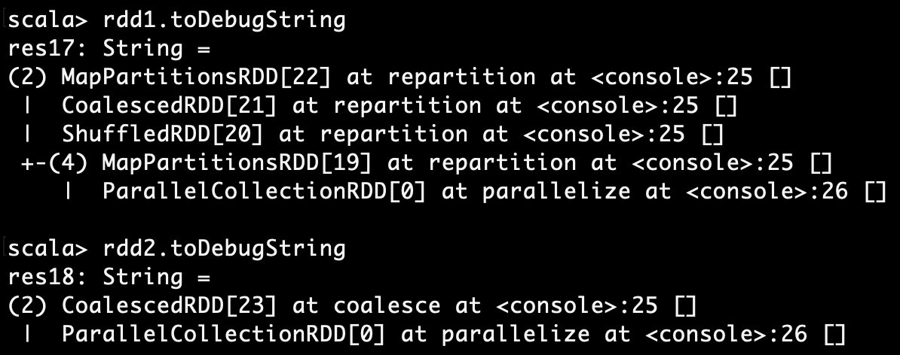
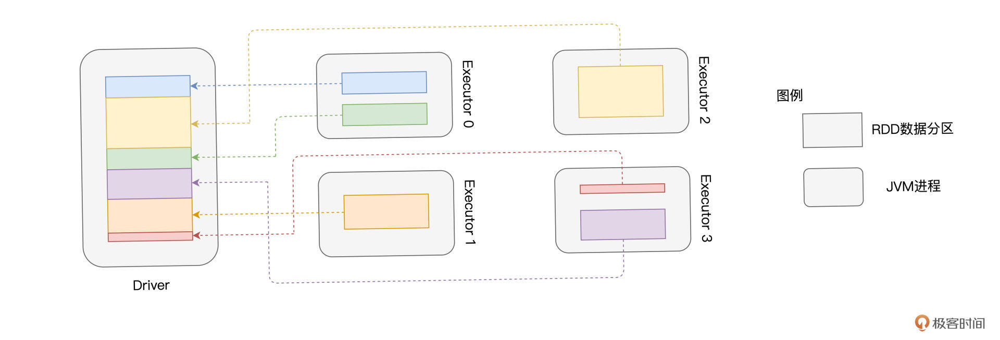
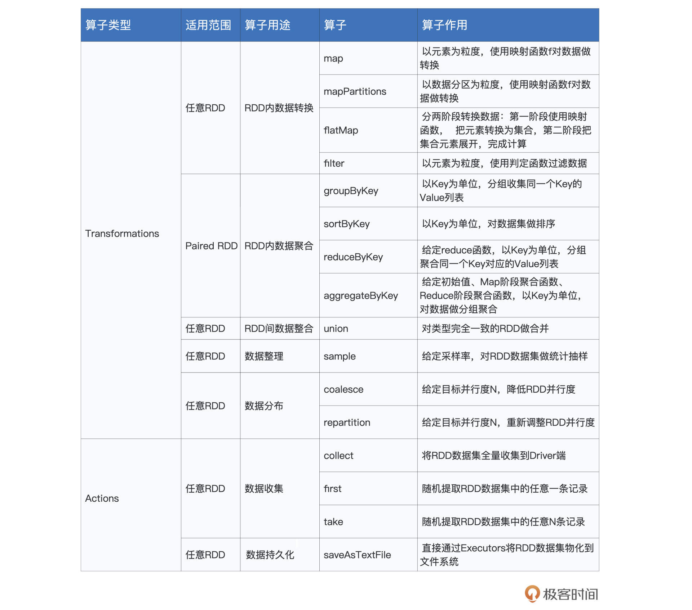

---
date: "2019-06-23"
---  
      
# 09 | RDD常用算子（三）：数据的准备、重分布与持久化
你好，我是吴磊。

在RDD常用算子的前两讲中，我们分别介绍了用于RDD内部转换与聚合的诸多算子，今天这一讲，我们继续来介绍表格中剩余部分的算子。

按照惯例，表格中的算子我们不会全都介绍，而是只挑选其中最常用、最具代表性的进行讲解。今天要讲的算子，我用加粗字体进行了高亮显示，你不妨先扫一眼，做到心中有数。



你可能会觉得，这些高亮显示的算子乍一看也没什么关联啊？但如果我们从数据生命周期的角度入手，给它们归归类，很容易就会发现这些算子分别隶属于生命周期的某个阶段。


结合上图，我们分别来看看每个算子所在的生命周期和它们实现的功能。

首先，在数据准备阶段，union与sample用于对不同来源的数据进行合并与拆分。

我们从左往右接着看，接下来是数据预处理环节。较为均衡的数据分布，对后面数据处理阶段提升CPU利用率更有帮助，可以整体提升执行效率。那这种均衡要怎么实现呢？没错，这时就要coalesce与repartition登场了，它们的作用就是重新调整RDD数据分布。

在数据处理完毕、计算完成之后，我们自然要对计算结果进行收集。Spark提供了两类结果收集算子，一类是像take、first、collect这样，把结果直接收集到Driver端；另一类则是直接将计算结果持久化到（分布式）文件系统，比如咱们这一讲会提到的saveAsTextFile。

<!-- [[[read_end]]] -->

好啦，清楚了我们今天要讲哪些算子，以及它们大致的定位与功用之后，接下来，我们就正式来讲讲这些算子的具体用法。

## 数据准备

首先，我们先来说说数据准备阶段的union和sample。

### union

在我们日常的开发中，union非常常见，它常常用于把两个类型一致、但来源不同的RDD进行合并，从而构成一个统一的、更大的分布式数据集。例如，在某个数据分析场景中，一份数据源来自远端数据库，而另一份数据源来自本地文件系统，要将两份数据进行合并，我们就需要用到union这个操作。

具体怎么使用呢？我来举个例子。给定两个RDD：rdd1和rdd2，调用rdd1.union\(rdd2\)或是rdd1 union rdd2，其结果都是两个RDD的并集，具体代码如下：

```
    // T：数据类型
    val rdd1: RDD[T] = _
    val rdd2: RDD[T] = _
    val rdd = rdd1.union(rdd2)
    // 或者rdd1 union rdd2
    

```

需要特别强调的是，union操作能够成立的前提，就是**参与合并的两个RDD的类型必须完全一致**。也就是说，RDD\[String\]只能与RDD\[String\]合并到一起，却无法与除RDD\[String\]以外的任何RDD类型（如RDD\[Int\]、甚至是RDD\[UserDefinedClass\]）做合并。

对于多个类型一致的RDD，我们可以通过连续调用union把所有数据集合并在一起。例如，给定类型一致的3个RDD：rdd1、rdd2和rdd3，我们可以使用如下代码把它们合并在一起。

```
    // T：数据类型
    val rdd1: RDD[T] = _
    val rdd2: RDD[T] = _
    val rdd3: RDD[T] = _
     
    val rdd = (rdd1.union(rdd2)).union(rdd3)
    // 或者 val rdd = rdd1 union rdd2 union rdd3
    

```

不难发现，union的典型使用场景，是把多份“小数据”，合并为一份“大数据”，从而充分利用Spark分布式引擎的并行计算优势。

与之相反，在一般的数据探索场景中，我们往往只需要对一份数据的子集有基本的了解即可。例如，对于一份体量在TB级别的数据集，我们只想随机提取其部分数据，然后计算这部分子集的统计值（均值、方差等）。

那么，面对这类把“大数据”变成 “小数据”的计算需求，Spark又如何进行支持呢？这就要说到RDD的sample算子了。

### sample

RDD的sample算子用于对RDD做随机采样，从而把一个较大的数据集变为一份“小数据”。相较其他算子，sample的参数比较多，分别是withReplacement、fraction和seed。因此，要在RDD之上完成数据采样，你需要使用如下的方式来调用sample算子：sample\(withReplacement, fraction, seed\)。

其中，withReplacement的类型是Boolean，它的含义是“采样是否有放回”，如果这个参数的值是true，那么采样结果中可能会包含重复的数据记录，相反，如果该值为false，那么采样结果不存在重复记录。

fraction参数最好理解，它的类型是Double，值域为0到1，其含义是采样比例，也就是结果集与原数据集的尺寸比例。seed参数是可选的，它的类型是Long，也就是长整型，用于控制每次采样的结果是否一致。光说不练假把式，我们还是结合一些示例，这样才能更好地理解sample算子的用法。

```
    // 生成0到99的整型数组
    val arr = (0 until 100).toArray
    // 使用parallelize生成RDD
    val rdd = sc.parallelize(arr)
     
    // 不带seed，每次采样结果都不同
    rdd.sample(false, 0.1).collect
    // 结果集：Array(11, 13, 14, 39, 43, 63, 73, 78, 83, 88, 89, 90)
    rdd.sample(false, 0.1).collect
    // 结果集：Array(6, 9, 10, 11, 17, 36, 44, 53, 73, 74, 79, 97, 99)
     
    // 带seed，每次采样结果都一样
    rdd.sample(false, 0.1, 123).collect
    // 结果集：Array(3, 11, 26, 59, 82, 89, 96, 99)
    rdd.sample(false, 0.1, 123).collect
    // 结果集：Array(3, 11, 26, 59, 82, 89, 96, 99)
     
    // 有放回采样，采样结果可能包含重复值
    rdd.sample(true, 0.1, 456).collect
    // 结果集：Array(7, 11, 11, 23, 26, 26, 33, 41, 57, 74, 96)
    rdd.sample(true, 0.1, 456).collect
    // 结果集：Array(7, 11, 11, 23, 26, 26, 33, 41, 57, 74, 96)
    

```

我们的实验分为3组，前两组用来对比添加seed参数与否的差异，最后一组用于说明withReplacement参数的作用。

不难发现，在不带seed参数的情况下，每次调用sample之后的返回结果都不一样。而当我们使用同样的seed调用算子时，不论我们调用sample多少次，每次的返回结果都是一致的。另外，仔细观察第3组实验，你会发现结果集中有重复的数据记录，这是因为withReplacement被置为true，采样的过程是“有放回的”。

好啦，到目前为止，数据准备阶段常用的两个算子我们就讲完了。有了union和sample，你就可以随意地调整分布式数据集的尺寸，真正做到收放自如。

## 数据预处理

接下来，在数据预处理阶段，我们再来说说负责数据重分布的两个算子：repartition和coalesce。

在了解这两个算子之前，你需要先理解并行度这个概念。所谓并行度，它实际上就是RDD的数据分区数量。还记得吗？RDD的partitions属性，记录正是RDD的所有数据分区。因此，RDD的并行度与其partitions属性相一致。

开发者可以使用repartition算子随意调整（提升或降低）RDD的并行度，而coalesce算子则只能用于降低RDD并行度。显然，在数据分布的调整方面，repartition灵活度更高、应用场景更多，我们先对它进行介绍，之后再去看看coalesce有什么用武之地。

### repartition

一旦给定了RDD，我们就可以通过调用repartition\(n\)来随意调整RDD并行度。其中参数n的类型是Int，也就是整型，因此，我们可以把任意整数传递给repartition。按照惯例，咱们还是结合示例熟悉一下repartition的用法。

```
    // 生成0到99的整型数组
    val arr = (0 until 100).toArray
    // 使用parallelize生成RDD
    val rdd = sc.parallelize(arr)
     
    rdd.partitions.length
    // 4
     
    val rdd1 = rdd.repartition(2)
    rdd1.partitions.length
    // 2
     
    val rdd2 = rdd.repartition(8)
    rdd2.partitions.length
    // 8
    

```

首先，我们通过数组创建用于实验的RDD，从这段代码里可以看到，该RDD的默认并行度是4。在我们分别用2和8来调整RDD的并行度之后，通过计算RDD partitions属性的长度，我们发现新RDD的并行度分别被相应地调整为2和8。

看到这里，你可能还有疑问：“我们为什么需要调整RDD的并行度呢？2和8看上去也没什么实质性的区别呀”。

在RDD那一讲（[第2讲](https://time.geekbang.org/column/article/417164)），我们介绍过，每个RDD的数据分区，都对应着一个分布式Task，而每个Task都需要一个CPU线程去执行。

因此，RDD的并行度，很大程度上决定了分布式系统中CPU的使用效率，进而还会影响分布式系统并行计算的执行效率。并行度过高或是过低，都会降低CPU利用率，从而白白浪费掉宝贵的分布式计算资源，因此，合理有效地设置RDD并行度，至关重要。

这时你可能会追问：“既然如此，那么我该如何合理地设置RDD的并行度呢？”坦白地说，这个问题并没有固定的答案，它取决于系统可用资源、分布式数据集大小，甚至还与执行内存有关。

不过，结合经验来说，**把并行度设置为可用CPU的2到3倍，往往是个不错的开始**。例如，可分配给Spark作业的Executors个数为N，每个Executors配置的CPU个数为C，那么推荐设置的并行度坐落在N_C_2到N_C_3这个范围之间。

尽管repartition非常灵活，你可以用它随意地调整RDD并行度，但是你也需要注意，这个算子有个致命的弊端，那就是它会引入Shuffle。

我们知道（[第6讲](https://time.geekbang.org/column/article/420399)详细讲过），由于Shuffle在计算的过程中，会消耗所有类型的硬件资源，尤其是其中的磁盘I/O与网络I/O，因此Shuffle往往是作业执行效率的瓶颈。正是出于这个原因，在做应用开发的时候，我们应当极力避免Shuffle的引入。

但你可能会说：“如果数据重分布是刚需，而repartition又必定会引入Shuffle，我该怎么办呢？”如果你想增加并行度，那我们还真的只能仰仗repartition，Shuffle的问题自然也就无法避免。但假设你的需求是降低并行度，这个时候，我们就可以把目光投向repartition的孪生兄弟：coalesce。

### coalesce

在用法上，coalesce与repartition一样，它也是通过指定一个Int类型的形参，完成对RDD并行度的调整，即coalesce \(n\)。那两者的用法到底有什么差别呢？我们不妨结合刚刚的代码示例，来对比coalesce与repartition。

```
    // 生成0到99的整型数组
    val arr = (0 until 100).toArray
    // 使用parallelize生成RDD
    val rdd = sc.parallelize(arr)
     
    rdd.partitions.length
    // 4
     
    val rdd1 = rdd.repartition(2)
    rdd1.partitions.length
    // 2
     
    val rdd2 = rdd.coalesce(2)
    rdd2.partitions.length
    // 2
    

```

可以看到，在用法上，coalesce与repartition可以互换，二者的效果是完全一致的。不过，如果我们去观察二者的DAG，会发现同样的计算逻辑，却有着迥然不同的执行计划。



在RDD之上调用toDebugString，Spark可以帮我们打印出当前RDD的DAG。尽管图中的打印文本看上去有些凌乱，但你只要抓住其中的一个关键要点就可以了。

这个关键要点就是，在toDebugString的输出文本中，每一个带数字的小括号，比如rdd1当中的“\(2\)”和“\(4\)”，都代表着一个执行阶段，也就是DAG中的Stage。而且，不同的Stage之间，会通过制表符（Tab）缩进进行区分，比如图中的“\(4\)”显然要比“\(2\)”缩进了一段距离。

对于toDebugString的解读，你只需要掌握到这里就足够了。学习过调度系统之后，我们已经知道，在同一个DAG内，不同Stages之间的边界是Shuffle。因此，观察上面的打印文本，我们能够清楚地看到，repartition会引入Shuffle，而coalesce不会。

那么问题来了，同样是重分布的操作，为什么repartition会引入Shuffle，而coalesce不会呢？原因在于，二者的工作原理有着本质的不同。

给定RDD，如果用repartition来调整其并行度，不论增加还是降低，对于RDD中的每一条数据记录，repartition对它们的影响都是无差别的数据分发。

具体来说，给定任意一条数据记录，repartition的计算过程都是先哈希、再取模，得到的结果便是该条数据的目标分区索引。对于绝大多数的数据记录，目标分区往往坐落在另一个Executor、甚至是另一个节点之上，因此Shuffle自然也就不可避免。

coalesce则不然，在降低并行度的计算中，它采取的思路是把同一个Executor内的不同数据分区进行合并，如此一来，数据并不需要跨Executors、跨节点进行分发，因而自然不会引入Shuffle。

这里我还特意准备了一张示意图，更直观地为你展示repartition与coalesce的计算过程，图片文字双管齐下，相信你一定能够更加深入地理解repartition与coalesce之间的区别与联系。


好啦，到此为止，在数据预处理阶段，用于对RDD做重分布的两个算子我们就讲完了。掌握了repartition和coalesce这两个算子，结合数据集大小与集群可用资源，你就可以随意地对RDD的并行度进行调整，进而提升CPU利用率与作业的执行性能。

## 结果收集

预处理完成之后，数据生命周期的下一个阶段是数据处理，在这个环节，你可以使用RDD常用算子（二）[那一讲](https://time.geekbang.org/column/article/421566)介绍的各类算子，去对数据进行各式各样的处理，比如数据转换、数据过滤、数据聚合，等等。完成处理之后，我们自然要收集计算结果。

在结果收集方面，Spark也为我们准备了丰富的算子。按照收集路径区分，这些算子主要分为两类：第一类是把计算结果从各个Executors收集到Driver端，第二个类是把计算结果通过Executors直接持久化到文件系统。在大数据处理领域，文件系统往往指的是像HDFS或是S3这样的分布式文件系统。

### first、take和collect

我们今天要介绍的第一类算子有first、take和collect，它们的用法非常简单，按照老规矩，我们还是使用代码示例进行讲解。这里我们结合第1讲的Word Count，分别使用first、take和collect这三个算子对不同阶段的RDD进行数据探索。

```
    import org.apache.spark.rdd.RDD
    val rootPath: String = _
    val file: String = s"${rootPath}/wikiOfSpark.txt"
    // 读取文件内容
    val lineRDD: RDD[String] = spark.sparkContext.textFile(file)
     
    lineRDD.first
    // res1: String = Apache Spark
     
    // 以行为单位做分词
    val wordRDD: RDD[String] = lineRDD.flatMap(line => line.split(" "))
    val cleanWordRDD: RDD[String] = wordRDD.filter(word => !word.equals(""))
     
    cleanWordRDD.take(3)
    // res2: Array[String] = Array(Apache, Spark, From)
    // 把RDD元素转换为（Key，Value）的形式
    val kvRDD: RDD[(String, Int)] = cleanWordRDD.map(word => (word, 1))
    // 按照单词做分组计数
    val wordCounts: RDD[(String, Int)] = kvRDD.reduceByKey((x, y) => x + y)
     
    wordCounts.collect
    // res3: Array[(String, Int)] = Array((Because,1), (Open,1), (impl...
    

```

其中，first用于收集RDD数据集中的任意一条数据记录，而take\(n: Int\)则用于收集多条记录，记录的数量由Int类型的参数n来指定。

不难发现，first与take的主要作用，在于数据探索。对于RDD的每一步转换，比如Word Count中从文本行到单词、从单词到KV转换，我们都可以用first或是take来获取几条计算结果，从而确保转换逻辑与预期一致。

相比之下，collect拿到的不是部分结果，而是全量数据，也就是把RDD的计算结果全量地收集到Driver端。在上面Word Count的例子中，我们可以看到，由于全量结果较大，屏幕打印只好做截断处理。

为了让你更深入地理解collect算子的工作原理，我把它的计算过程画在了后面的示意图中。



结合示意图，不难发现，collect算子有两处性能隐患，**一个是拉取数据过程中引入的网络开销，另一个Driver的OOM（内存溢出，Out of Memory）**。

网络开销很好理解，既然数据的拉取和搬运是跨进程、跨节点的，那么和Shuffle类似，这个过程必然会引入网络开销。

再者，通常来说，Driver端的预设内存往往在GB量级，而RDD的体量一般都在数十GB、甚至上百GB，因此，OOM的隐患不言而喻。collect算子尝试把RDD全量结果拉取到Driver，当结果集尺寸超过Driver预设的内存大小时，Spark自然会报OOM的异常（Exception）。

正是出于这些原因，我们在使用collect算子之前，务必要慎重。不过，你可能会问：“如果业务逻辑就是需要收集全量结果，而collect算子又不好用，那我该怎么办呢？”别着急，我们接着往下看。

### saveAsTextFile

对于全量的结果集，我们还可以使用第二类算子把它们直接持久化到磁盘。在这类算子中，最具代表性的非saveAsTextFile莫属，它的用法非常简单，给定RDD，我们直接调用saveAsTextFile\(path: String\)即可。其中path代表的是目标文件系统目录，它可以是本地文件系统，也可以是HDFS、Amazon S3等分布式文件系统。

为了让你加深对于第二类算子的理解，我把它们的工作原理也整理到了下面的示意图中。可以看到，以saveAsTextFile为代表的算子，直接通过Executors将RDD数据分区物化到文件系统，这个过程并不涉及与Driver端的任何交互。


由于数据的持久化与Driver无关，因此这类算子天然地避开了collect算子带来的两个性能隐患。

好啦，到此为止，用于结果收集的算子我们就介绍完了，掌握了first、take、collect和saveAsTextFile等算子之后，你可以先用first、take等算子验证计算逻辑的正确性，然后再使用saveAsTextFile算子把全量结果持久化到磁盘，以备之后使用。

## 重点回顾

今天这一讲，我们介绍并讲解了很多RDD算子，这些算子可以分别归类到数据生命周期的不同阶段，算子与阶段的对应关系如下图所示。


在数据准备阶段，你可以使用union和sample来扩张或是缩小分布式数据集，需要特别注意的是，**参与union的多个RDD在类型上必须保持一致**。

在数据预处理阶段，你可以利用repartition和coalesce来调整RDD的并行度。RDD并行度对于CPU利用率至关重要，它在很大程度上决定着并行计算的执行效率。一般来说，给定Executors个数N，以及CPU/Executor配置个数C，那么我会**推荐你把RDD的并行度设置在N_C_2到N_C_3之间**。

最后，在结果收集阶段，你可以使用first、take、collect等算子来探索数据，这些算子可以用来验证计算过程中的转换逻辑是否与预期一致。当你确认计算逻辑准确无误之后，就可以使用saveAsTextFile等算子将全量结果集持久化到（分布式）文件系统。

到今天为止，我们用三讲的篇幅，学习了RDD开发API中的大部分算子。灵活地运用这些算子，你就能轻松应对日常开发中大部分的业务需求。为了方便你随时回顾、查阅，我把我们一起学过的这些算子整理到了后面的表格中，希望对你有所帮助。



## 每课一练

1.给定3个RDD，除了使用rdd1 union rdd2 union rdd3把它们合并在一起之外，你认为还有其他更加优雅的写法吗？（提示：reduce）

2.相比repartition，coalesce有哪些可能的潜在隐患？（提示：数据分布）

欢迎你在留言区跟我交流互动，也推荐你把这一讲分享给更多的同事、朋友，帮他理清RDD的常用算子。