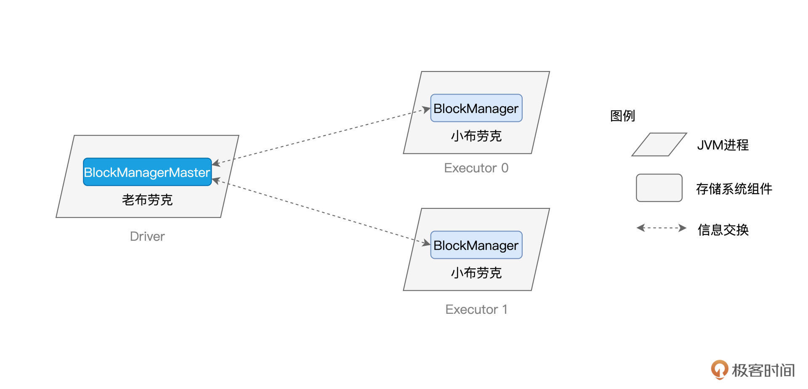
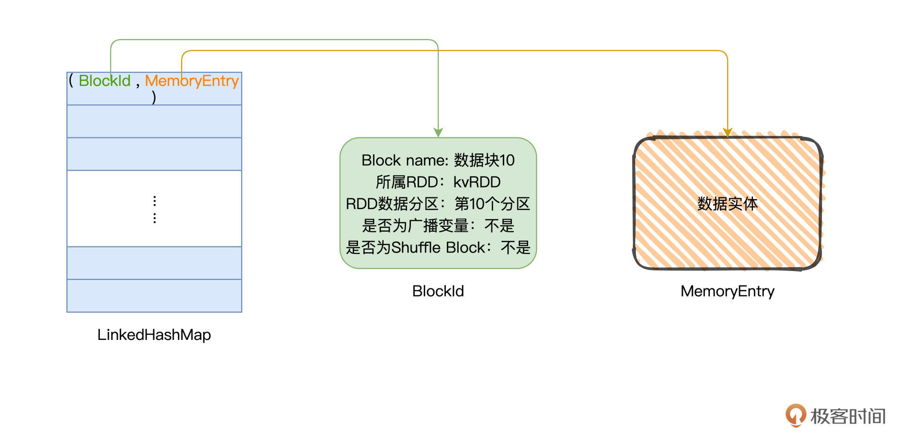
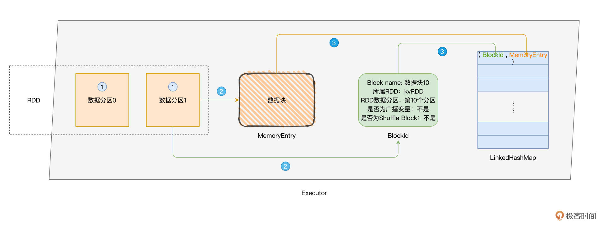
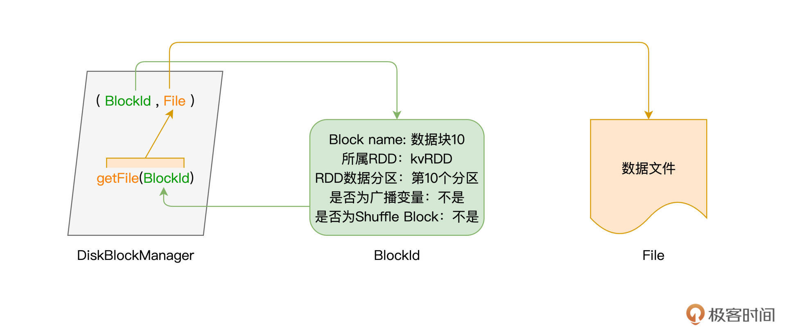

---
date: "2019-06-23"
---  
      
# 11 | 存储系统：数据到底都存哪儿了？
你好，我是吴磊。

感谢你在国庆假期仍然坚持学习，今天这一讲，我们来学习存储系统，与调度系统一样，它也是Spark重要的基础设施之一。不过，你可能会好奇：“掌握Spark应用开发，需要去了解这么底层的知识吗？”坦白地说，还真需要，为什么这么说呢？

我们前面学了Shuffle管理、RDD Cache和广播变量，这些功能与特性，对Spark作业的执行性能有着至关重要的影响。而想要实现这些功能，底层的支撑系统正是Spark存储系统。

学习和熟悉存储系统，不单单是为了完善我们的知识体系，它还能直接帮你更好地利用RDD Cache和广播变量这些特性。在未来，这些知识也能为你做Shuffle的调优奠定良好的基础。

既然存储系统这么重要，那要怎样高效快速地掌握它呢？本着学以致用的原则，我们需要先了解系统的服务对象，说白了就是存储系统是用来存什么东西的。

## 服务对象

笼统地说，**Spark存储系统负责维护所有暂存在内存与磁盘中的数据，这些数据包括Shuffle中间文件、RDD Cache以及广播变量**。

对于上述三类数据，我们并不陌生。我们先回顾一下什么是Shuffle中间文件，在Shuffle的计算过程中，Map Task在Shuffle Write阶段生产data与index文件。接下来，根据index文件提供的分区索引，Shuffle Read阶段的Reduce Task从不同节点拉取属于自己的分区数据。而Shuffle中间文件，指的正是两个阶段为了完成数据交换所仰仗的data与index文件。

<!-- [[[read_end]]] -->

RDD Cache指的是分布式数据集在内存或是磁盘中的物化，它往往有利于提升计算效率。广播变量[上一讲](https://time.geekbang.org/column/article/423878)我们刚刚介绍过，它的优势在于以Executors为粒度分发共享变量，从而大幅削减数据分发引入的网络与存储开销。

我们刚才对这三类数据做了简单回顾，如果你觉得哪里不是特别清楚的话，不妨翻回前面几讲再看一看，我们在第7、8、10这3讲分别对它们做了详细讲解。好啦，了解了存储系统服务的主要对象以后，接下来，我们来细数Spark存储系统都有哪些重要组件，看看它们之间又是如何协作的。

## 存储系统的构成

理论的学习总是枯燥而又乏味，为了让你更加轻松地掌握存储系统的核心组件，咱们不妨还是用斯巴克国际建筑集团的类比，来讲解Spark存储系统。

相比调度系统复杂的人事关系（戴格、塔斯克、拜肯德），存储系统的人员构成要简单得多。在内存管理[那一讲](https://time.geekbang.org/column/article/422400)，我们把节点内存看作是施工工地，而把节点磁盘看作是临时仓库，那么显然，管理数据存储的组件，就可以看成是仓库管理员，简称库管。

### 布劳克家族

在斯巴克建筑集团，库管这个关键角色，一直以来都是由布劳克家族把持着。

布劳克家族在斯巴克集团的地位举足轻重，老布劳克（BlockManagerMaster）坐镇集团总公司（Driver），而他的子嗣们、小布劳克（BlockManager）则驻守在各个分公司（Executors）。

对集团公司建材与仓库的整体情况，老布劳克了如指掌，当然，这一切要归功于他众多的子嗣们。各家分公司的小布劳克，争先恐后地向老爸汇报分公司的建材状态与仓库状况。关于他们的父子关系，我整理到了下面的示意图中。



**从上图我们能够看得出来，小布劳克与老布劳克之间的信息交换是双向的**。不难发现，布劳克家族的家风是典型的“家长制”和“一言堂”。如果小布劳克需要获取其他分公司的状态，他必须要通过老布劳克才能拿到这些信息。

在前面的几讲中，我们把建材比作是分布式数据集，那么，BlockManagerMaster与BlockManager之间交换的信息，实际上就是Executors之上数据的状态。说到这里，你可能会问：“既然BlockManagerMaster的信息都来自于BlockManager，那么BlockManager又是从哪里获取到这些信息的呢？”要回答这个问题，我们还要从BlockManager的职责说起。

我们开头说过，存储系统的服务对象有3个：分别是Shuffle中间文件、RDD Cache以及广播变量，而BlockManager的职责，正是在Executors中管理这3类数据的存储、读写与收发。就存储介质来说，这3类数据所消耗的硬件资源各不相同。

具体来说，Shuffle中间文件消耗的是节点磁盘，而广播变量主要占用节点的内存空间，RDD Cache则是“脚踏两条船”，既可以消耗内存，也可以消耗磁盘。


不管是在内存、还是在磁盘，这些数据都是以数据块（Blocks）为粒度进行存取与访问的。**数据块的概念与RDD数据分区（Partitions）是一致的**，在RDD的上下文中，说到数据划分的粒度，我们往往把一份数据称作“数据分区”。而在存储系统的上下文中，对于细分的一份数据，我们称之为数据块。

有了数据块的概念，我们就可以进一步细化BlockManager的职责。**BlockManager的核心职责，在于管理数据块的元数据（Meta data），这些元数据记录并维护数据块的地址、位置、尺寸以及状态**。为了让你直观地感受一下元数据，我把它的样例放到了下面的示意图里，你可以看一看。


只有借助元数据，BlockManager才有可能高效地完成数据的存与取、收与发。这就回答了前面我提出的问题，BlockManager与数据状态有关的所有信息，全部来自于元数据的管理。那么接下来的问题是，结合这些元数据，BlockManager如何完成数据的存取呢？

不管是工地上，还是仓库里，这些场所都是尘土飞扬、人来人往，像存取建材这种事情，养尊处优的小布劳克自然不会亲力亲为。于是，他招募了两个帮手，来帮他打理这些脏活累活。

这两个帮手也都不是外人，一个是大表姐迈美瑞（MemoryStore），另一个是大表哥迪斯克（DiskStore）。顾名思义，**MemoryStore负责内存中的数据存取，而相应地，DiskStore则负责磁盘中的数据访问**。

好啦，到此为止，存储系统的重要角色已经悉数登场，我把他们整理到了下面的表格中。接下来，我们以RDD Cache和Shuffle中间文件的存取为例，分别说一说迈美瑞和迪斯克是如何帮助小布劳克来打理数据的。


### MemoryStore：内存数据访问

大表姐迈美瑞秀外慧中，做起事情来井井有条。为了不辜负小布劳克的托付，迈美瑞随身携带着一本小册子，这本小册子密密麻麻，记满了关于数据块的详细信息。这个小册子，是一种特别的数据结构：LinkedHashMap\[BlockId, MemoryEntry\]。顾名思义，LinkedHashMap是一种Map，其中键值对的Key是BlockId，Value是MemoryEntry。



BlockId用于标记Block的身份，需要注意的是，BlockId不是一个仅仅记录Id的字符串，而是一种记录Block元信息的数据结构。BlockId这个数据结构记录的信息非常丰富，包括Block名字、所属RDD、Block对应的RDD数据分区、是否为广播变量、是否为Shuffle Block，等等。

MemoryEntry是对象，它用于承载数据实体，数据实体可以是某个RDD的数据分区，也可以是广播变量。存储在LinkedHashMap当中的MemoryEntry，相当于是通往数据实体的地址。

不难发现，BlockId和MemoryEntry一起，就像是居民户口簿一样，完整地记录了存取某个数据块所需的所有元信息，相当于“居民姓名”、“所属派出所”、“家庭住址”等信息。**基于这些元信息，我们就可以像“查户口”一样，有的放矢、精准定向地对数据块进行存取访问**。

```
    val rdd: RDD[_] = _
    rdd.cache
    rdd.count
    

```

以RDD Cache为例，当我们使用上述代码创建RDD缓存的时候，Spark会在后台帮我们做如下3件事情，这个过程我把它整理到了下面的示意图中，你可以看一看。

1.  以数据分区为粒度，计算RDD执行结果，生成对应的数据块；
2.  将数据块封装到MemoryEntry，同时创建数据块元数据BlockId；
3.  将（BlockId，MemoryEntry）键值对添加到“小册子”LinkedHashMap。



随着RDD Cache过程的推进，LinkedHashMap当中的元素会越积越多，当迈美瑞的小册子完成记录的时候，Spark就可以通过册子上的“户口簿”来访问每一个数据块，从而实现对RDD Cache的读取与访问。

### DiskStore：磁盘数据访问

说完大表姐，接下来，我们再来说说大表哥迪斯克。迪斯克的主要职责，是通过维护数据块与磁盘文件的对应关系，实现磁盘数据的存取访问。相比大表姐的一丝不苟、亲力亲为，迪斯克要“鸡贼”得多，他跟布劳克一样，都是甩手掌柜。

看到大表姐没日没夜地盯着自己的“小册子”，迪斯克可不想无脑地给布劳克卖命，于是他招募了一个帮手：DiskBlockManager，来帮他维护元数据。

有了DiskBlockManager这个帮手给他打理各种杂事，迪斯克这个家伙就可以哼着小曲、喝着咖啡，坐在仓库门口接待来来往往的施工工人就好了。这些工人有的存货，有的取货，但不论是干什么的，迪斯克会统一把他们打发到DiskBlockManager那里去，让DiskBlockManager告诉他们货物都存在哪些货架的第几层。



帮手DiskBlockManager是类对象，它的getFile方法以BlockId为参数，返回磁盘文件。换句话说，给定数据块，要想知道它存在了哪个磁盘文件，需要调用getFile方法得到答案。**有了数据块与文件之间的映射关系，我们就可以轻松地完成磁盘中的数据访问**。

以Shuffle为例，在Shuffle Write阶段，每个Task都会生成一份中间文件，每一份中间文件都包括带有data后缀的数据文件，以及带着index后缀的索引文件。那么对于每一份文件来说，我们都可以通过DiskBlockManager的getFile方法，来获取到对应的磁盘文件，如下图所示。


可以看到，获取data文件与获取index文件的流程是完全一致的，他们都是使用BlockId来调用getFile方法，从而完成数据访问。

## 重点回顾

今天这一讲，我们重点讲解了Spark存储系统。关于存储系统，你首先需要知道是，RDD Cache、Shuffle中间文件与广播变量这三类数据，是存储系统最主要的服务对象。

接着，我们介绍了存储系统的核心组件，它们是坐落在Driver端的BlockManagerMaster，以及“驻守”在Executors的BlockManager、MemoryStore和DiskStore。BlockManagerMaster与众多BlockManager之间通过心跳来完成信息交换，这些信息包括数据块的地址、位置、大小和状态，等等。

在Executors中，BlockManager通过MemoryStore来完成内存的数据存取。MemoryStore通过一种特殊的数据结构：LinkedHashMap来完成BlockId到MemoryEntry的映射。其中，BlockId记录着数据块的元数据，而MemoryEntry则用于封装数据实体。

与此同时，BlockManager通过DiskStore来实现磁盘数据的存取与访问。DiskStore并不直接维护元数据列表，而是通过DiskBlockManager这个对象，来完成从数据库到磁盘文件的映射，进而完成数据访问。


## 每课一练

LinkedHashMap是一种很特殊的数据结构，在今天这一讲，我们仅介绍了它在Map方面的功用。你可以试着自己梳理一下LinkedHashMap这种数据结构的特点与特性。

期待在留言区看到你的思考。如果这一讲对你有帮助，也推荐你转发给更多的同事、朋友。我们下一讲见！