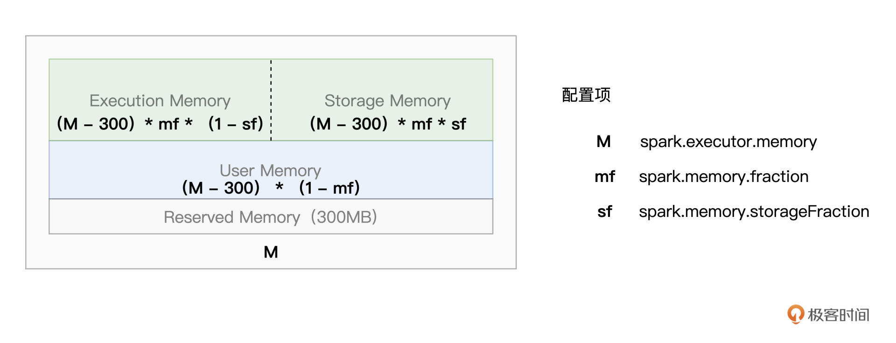
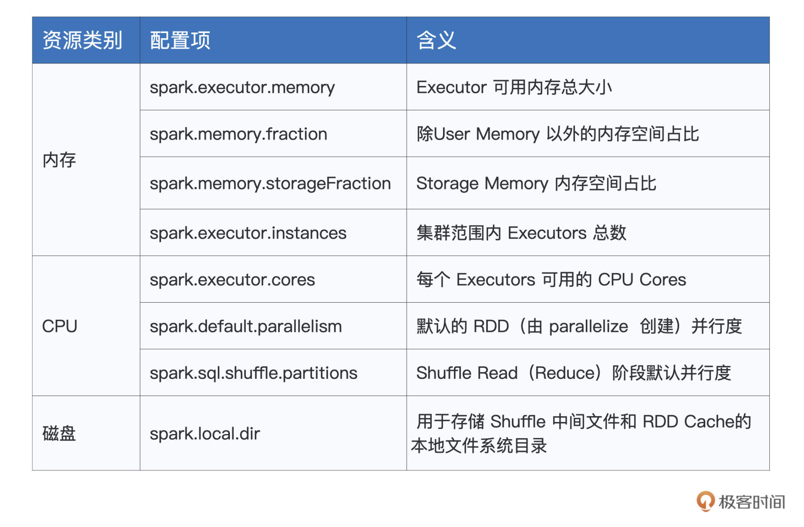

---
date: "2019-06-23"
---  
      
# 12 | 基础配置详解：哪些参数会影响应用程序稳定性？
你好，我是吴磊。

国庆假期即将结束，我们的基础模块也即将收尾。到目前为止，我们一起学习了RDD编程模型、Spark分布式部署、Spark工作原理，以及RDD常用算子。恭喜你，到这里，可以说你已经完全跨入了Spark分布式应用开发的大门。有了现在的知识储备，对于大多数的业务需求，我相信你都能很快地实现。

不过，快速用代码实现各式各样的业务需求，这还只是第一步。我们不光要让代码跑起来，还需要让代码跑得又快又稳。

要想做到这些，我们还需要配置项来帮忙。如果把Spark看作是一部F1赛车的话，那么配置项就是赛车车身的各项配置参数，如发动机缸数、最大转矩、车身轴距、悬挂方式、整车装备质量，等等。只有合理地配置车身参数，才能让车子本身的稳定性和性能得到保障，为选手的出色发挥奠定基础。

今天这一讲，我们就来说一说Spark都有哪些配置项，以及这些配置项的含义与作用。

## 配置项

打开Spark官网的[Configuration页面](http://spark.apache.org/docs/latest/configuration.html)，在这里你能找到全部的Spark配置项。

不过，让人沮丧的是，配置项数目过于庞大，种类繁多，有的需要设置true/false，有的则需要我们给出明确的数值，让人看上去眼花缭乱、无所适从。


那么问题来了，面对这么多的配置项，我们应该从哪里入手呢？别着急，既然我们的目的是让车子“跑得稳”、“跑得快”，那咱们不妨从这两个角度出发，来整理那些我们必须要掌握的配置项。

<!-- [[[read_end]]] -->

在这一讲，咱们先来梳理那些**能让Spark跑得稳的配置项**，而在后续介绍Spark SQL的时候，我们再去关注那些与“跑得快”有关的部分。

关于跑得稳这件事，你可能会有这样的疑问：“一般的车子，出厂就能开，并不需要特别调整什么车辆参数。同理，大部分Spark配置项都有默认值，开发者使用出厂设置、省去调参的麻烦，它不香吗？” 遗憾的是，对于大多数的应用场景来说，在默认的参数设置下，Spark还真就跑不起来。

以spark.executor.memory这个配置项为例，它用于指定Executor memory，也就是Executor可用内存上限。这个参数的默认值是1GB，显然，对于动辄上百GB、甚至上TB量级的工业级数据来说，这样的设置太低了，分布式任务很容易因为OOM（内存溢出，Out of memory）而中断。

你看，为了能让Spark跑得稳，咱们还是得花些心思。对于刚才说的情况，如果你以为直接把内存参数设置到上百GB，就可以一劳永逸，那未免有些草率。单纯从资源供给的角度去调整配置项参数，是一种“简单粗暴”的做法，并不可取。**实际上，应用程序运行得稳定与否，取决于硬件资源供给与计算需要是否匹配**。

这就好比是赛车组装，要得到一辆高性能的车子，我们并不需要每一个部件都达到“顶配”的要求，而是要让组装配件之间相互契合、匹配，才能让车子达到预期的马力输出。

因此，咱们不妨从硬件资源的角度切入，去探索开发者必须要关注的配置项都有哪些。既然上面我们用内存举例，而且关于内存的配置项，我们在内存管理那一讲简单提过，你可能还有一些印象，那么接下来，我们就从内存入手，说一说和它有关的配置项。

### 内存

说起内存，咱们不妨先来回顾一下Spark的内存划分。对于给定的Executor Memory，Spark将JVM Heap划分为4个区域，分别是Reserved Memory、User Memory、Execution Memory和Storage Memory，如下图所示。

不同内存区域的含义和它们的计算公式，我们在[第8讲](https://time.geekbang.org/column/article/422400)做过详细讲解，如果你印象不深了可以回顾一下，这里我们重点分析一下这些内存配置项数值的设置思路。



结合图解，其中Reserved Memory大小固定为300MB，其他3个区域的空间大小，则有3个配置项来划定，它们分别是spark.executor.memory、spark.memory.fraction、spark.memory.storageFraction。

为了后续叙述方便，我们分别把它们简称为M、mf和sf，其中大写的M是绝对值，而小写的mf和sf都是比例值，这一点需要你注意。

其中，M用于指定划分给Executor进程的JVM Heap大小，也即是Executor Memory。Executor Memory由Execution Memory、Storage Memory和User Memory“这三家”瓜分。

（M – 300）\* mf划分给Execution Memory和Storage Memory，而User Memory空间大小由（M – 300）\*（1 \- mf）这个公式划定，它用于存储用户自定义的数据结构，比如，RDD算子中包含的各类实例化对象或是集合类型（如数组、列表等），都属于这个范畴。

因此，如果你的分布式应用，并不需要那么多自定义对象或集合数据，你应该把mf的值设置得越接近1越好，这样User Memory无限趋近于0，大面积的可用内存就可以都留给Execution Memory和Storage Memory了。

我们知道，在1.6版本之后，**Spark推出了统一的动态内存管理模式**，在对方资源未被用尽的时候，Execution Memory与Storage Memory之间可以互相进行抢占。不过，即便如此，我们仍然需要sf这个配置项来划定它们之间的那条虚线，从而明确告知Spark我们开发者更倾向于“偏袒”哪一方。

那么对于sf的设置，开发者该如何进行取舍呢？答案是看数据的复用频次。这是什么意思呢？我们分场景举例来说。

对于ETL（Extract、Transform、Load）类型的作业来说，数据往往都是按照既定的业务逻辑依序处理，其中绝大多数的数据形态只需访问一遍，很少有重复引用的情况。

因此，在ETL作业中，RDD Cache并不能起到提升执行性能的作用，那么自然我们也就没必要使用缓存了。在这种情况下，我们就应当把sf的值设置得低一些，压缩Storage Memory可用空间，从而尽量把内存空间留给Execution Memory。

相反，如果你的应用场景是机器学习、或是图计算，这些计算任务往往需要反复消耗、迭代同一份数据，处理方式就不一样了。在这种情况下，咱们要充分利用RDD Cache提供的性能优势，自然就要把sf这个参数设置得稍大一些，从而让Storage Memory有足够的内存空间，来容纳需要频繁访问的分布式数据集。

好啦，到此为止，对于内存的3个配置项，我们分别解读了它们的含义，以及设置的一般性原则。你需要根据你的应用场景，合理设置这些配置项，这样程序运行才会高速、稳定。学会了这些，内存配置项这一关，你基本上已经拿到80分了。而剩下的20分，需要你从日常开发的反复实践中去获取，期待你总结归纳出更多的配置经验。

在硬件资源方面，内存的服务对象是CPU。内存的有效配置，一方面是为了更好地容纳数据，另一方面，更重要的就是提升CPU的利用率。那说完内存，接下来，我们再来看看CPU。

### CPU

与CPU直接相关的配置项，我们只需关注两个参数，它们分别是spark.executor.instances和spark.executor.cores。其中前者指定了集群内Executors的个数，而后者则明确了每个Executors可用的CPU Cores（CPU核数）。

我们知道，一个CPU Core在同一时间只能处理一个分布式任务，因此，**spark.executor.instances与spark.executor.cores的乘积实际上决定了集群的并发计算能力，这个乘积，我们把它定义为“并发度”（Degree of concurrency）**。

说到并发度，我们就不得不说另外一个概念：并行度（Degree of parallism）。相比并发度，并行度是一个高度相关、但又完全不同的概念。并行度用于定义分布式数据集划分的份数与粒度，它直接决定了分布式任务的计算负载。并行度越高，数据的粒度越细，数据分片越多，数据越分散。

这也就解释了，并行度为什么总是跟分区数量、分片数量、Partitions 这些属性相一致。举个例子，第9讲我们就说过，并行度对应着RDD的数据分区数量。

与并行度相关的配置项也有两个，分别是spark.default.parallelism和spark.sql.shuffle.partitions。其中前者定义了由SparkContext.parallelize API所生成RDD的默认并行度，而后者则用于划定Shuffle过程中Shuffle Read阶段（Reduce阶段）的默认并行度。

对比下来，并发度的出发点是计算能力，它与执行内存一起，共同构成了计算资源的供给水平，而并行度的出发点是数据，它决定着每个任务的计算负载，对应着计算资源的需求水平。一个是供给，一个是需求，供需的平衡与否，直接影响着程序运行的稳定性。

### CPU、内存与数据的平衡

由此可见，所谓供需的平衡，实际上就是指CPU、内存与数据之间的平衡。那么问题来了，有没有什么量化的办法，来让三者之间达到供需之间平衡的状态呢？其实，只需要一个简单的公式，我们就可以轻松地做到这一点。

为了叙述方便，我们把由配置项spark.executor.cores指定的CPU Cores记为c，把Execution Memory内存大小记为m，还记得吗？m的尺寸由公式（M \- 300）\* mf \*（1 \- sf）给出。不难发现，c和m，一同量化了一个Executor的可用计算资源。

量化完资源供给，我们接着再来说数据。对于一个待计算的分布式数据集，我们把它的存储尺寸记为D，而把其并行度记录为P。给定D和P，不难推出，D/P就是分布式数据集的划分粒度，也就是每个数据分片的存储大小。

学习过调度系统，我们知道，在Spark分布式计算的过程中，一个数据分片对应着一个Task（分布式任务），而一个Task又对应着一个CPU Core。因此，把数据看作是计算的需求方，要想达到CPU、内存与数据这三者之间的平衡，我们必须要保证每个Task都有足够的内存，来让CPU处理对应的数据分片。

为此，我们要让数据分片大小与Task可用内存之间保持在同一量级，具体来说，我们可以使用下面的公式来进行量化。

```
    D/P ~ m/c
    

```

其中，波浪线的含义，是其左侧与右侧的表达式在同一量级。左侧的表达式D/P为数据分片大小，右侧的m/c为每个Task分到的可用内存。以这个公式为指导，结合分布式数据集的存储大小，我们就可以有的放矢、有迹可循地对上述的3类配置项进行设置或调整，也就是与CPU、内存和并行度有关的那几个配置项。

### 磁盘

说完了CPU和内存，接下来，我们再来说说磁盘。与前两者相比，磁盘的配置项相对要简单得多，值得我们关注的，仅有spark.local.dir这一个配置项，为了叙述方便，后续我们把它简称为ld。这个配置项的值可以是任意的本地文件系统目录，它的默认值是/tmp目录。

ld参数对应的目录用于存储各种各样的临时数据，如Shuffle中间文件、RDD Cache（存储级别包含“disk”），等等。这些临时数据，对程序能否稳定运行，有着至关重要的作用。

例如，Shuffle中间文件是Reduce阶段任务执行的基础和前提，如果中间文件丢失，Spark在Reduce阶段就会抛出“Shuffle data not found”异常，从而中断应用程序的运行。

既然这些临时数据不可或缺，我们就不能盲从默认选项了，而是有必要先考察下/tmp目录的情况。遗憾的是，ld参数默认的/tmp目录一来存储空间有限，二来该目录本身的稳定性也值得担忧。因此，在工业级应用中，我们通常都不能接受使用/tmp目录来设置ld配置项。

了解了ld这个配置项的作用之后，我们自然就能想到，应该把它设置到一个存储空间充沛、甚至性能更有保障的文件系统，比如空间足够大的SSD（Solid State Disk）文件系统目录。

好啦，到此为止，我们分别介绍了与CPU、内存、磁盘有关的配置项，以及它们的含义、作用与设置技巧。说到这里，你可能有些按捺不住：“这些配置项的重要性我已经get到了，那我应该在哪里设置它们呢？”接下来，我们继续来说说，开发者都可以通过哪些途径来设置配置项。

## 配置项的设置途径

为了满足不同的应用场景，Spark为开发者提供了3种配置项设置方式，分别是配置文件、命令行参数和SparkConf对象，这些方式都以（Key，Value）键值对的形式记录并设置配置项。

配置文件指的是spark-defaults.conf，这个文件存储在Spark安装目录下面的conf子目录。该文件中的参数设置适用于集群范围内所有的应用程序，因此它的生效范围是全局性的。对于任意一个应用程序来说，如果开发者没有通过其他方式设置配置项，那么应用将默认采用spark-defaults.conf中的参数值作为基础设置。

在spark-defaults.conf中设置配置项，你只需要用空格把配置项的名字和它的设置值分隔开即可。比如，以spark.executor.cores、spark.executor.memory和spark.local.dir这3个配置项为例，我们可以使用下面的方式对它们的值进行设置。

```
    spark.executor.cores 2
    spark.executor.memory 4g
    spark.local.dir /ssd_fs/large_dir
    

```

不过，在日常的开发工作中，不同应用对于资源的诉求是不一样的：有些需要更多的CPU Cores，有些则需要更高的并行度，凡此种种、不一而足，可谓是众口难调，这个时候，我们只依赖spark-defaults.conf来进行全局设置就不灵了。

为此，Spark为开发者提供了两种应用级别的设置方式，也即命令行参数和SparkConf对象，它们的生效范围仅限于应用本身，我们分别看看这两种方式具体怎么用。

先说命令行参数，它指的是在运行了spark-shell或是spark-submit命令之后，通过–conf关键字来设置配置项。我们知道，spark-shell用于启动交互式的分布式运行环境，而spark-submit则用于向Spark计算集群提交分布式作业。

还是以刚刚的3个配置项为例，以命令行参数的方式进行设置的话，你需要在提交spark-shell或是spark-submit命令的时候，以–conf Key=Value的形式对参数进行赋值。

```
    spark-shell --master local[*] --conf spark.executor.cores=2 --conf spark.executor.memory=4g --conf spark.local.dir=/ssd_fs/large_dir
    

```

不难发现，尽管这种方式能让开发者在应用级别灵活地设置配置项，但它的书写方式过于繁琐，每个配置项都需要以–conf作前缀。不仅如此，命令行参数的设置方式不利于代码管理，随着时间的推移，参数值的设置很可能会随着数据量或是集群容量的变化而变化，但是这个变化的过程却很难被记录并维护下来，而这无疑会增加开发者与运维同学的运维成本。

相比之下，不论是隔离性还是可维护性，SparkConf对象的设置方式都更胜一筹。在代码开发的过程中，我们可以通过定义SparkConf对象，并调用其set方法来对配置项进行设置。老规矩，还是用刚刚的CPU、内存和磁盘3个配置项来举例。

```
    import org.apache.spark.SparkConf
    val conf = new SparkConf()
    conf.set("spark.executor.cores", "2")
    conf.set("spark.executor.memory", "4g")
    conf.set("spark.local.dir", "/ssd_fs/large_dir")   
    

```

好啦，到此为止，我们一起梳理了CPU、内存、磁盘的相关配置项，并重点强调了CPU、内存与数据之间的供需平衡。掌握了这些设置方法与要点之后，你不妨自己动手去试试这些配置项，可以拿之前的Word Count小例子练练手，巩固一下今天所学的内容。

## 重点回顾

今天这一讲，我们分别从CPU、内存和磁盘三个方面，讲解了影响应用程序稳定性的几个重要参数。你需要掌握它们的含义、作用还有适用场景，为了方便你记忆，我把它们整理到后面的表格里，你可以随时拿来参考。



熟悉了这些关键配置项之后，你还需要了解它们的设置方式。Spark提供了3种配置项设置途径，分别是spark-defaults.conf配置文件、命令行参数和SparkConf对象。其中第一种方式用于全局设置，而后两者的适用范围是应用本身。

对于这3种方式，**Spark会按照“SparkConf对象 \-> 命令行参数 \-> 配置文件”的顺序，依次读取配置项的参数值**。对于重复设置的配置项，Spark以前面的参数取值为准。

## 每课一练

请你粗略地过一遍Spark官网中的 [Configuration页面](http://spark.apache.org/docs/latest/configuration.html)，说一说，其中哪些配置项适合在spark-defaults.conf中进行设置，而哪些配置项使用SparkConf对象的方式来设置比较好？

欢迎你在留言区跟我交流。如果这一讲对你有帮助的话，也推荐你把这节课分享给有需要的的同事、朋友，我们下一讲见。