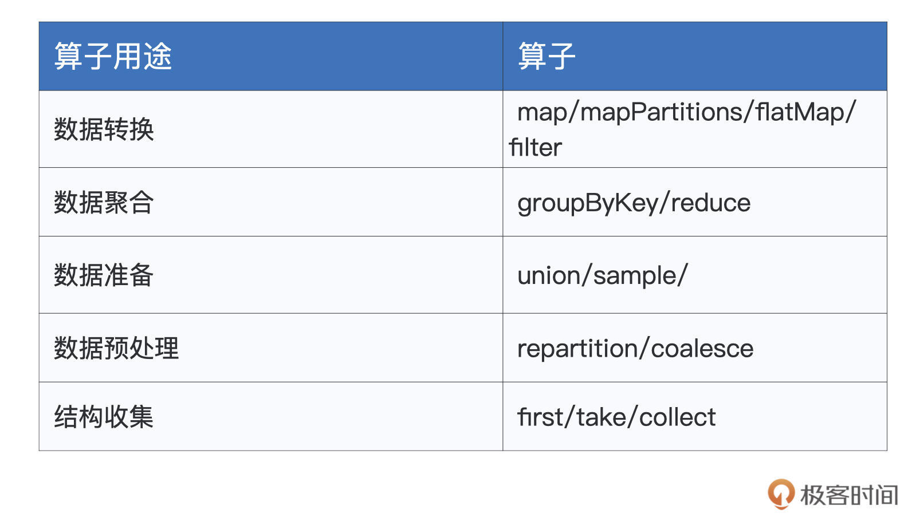
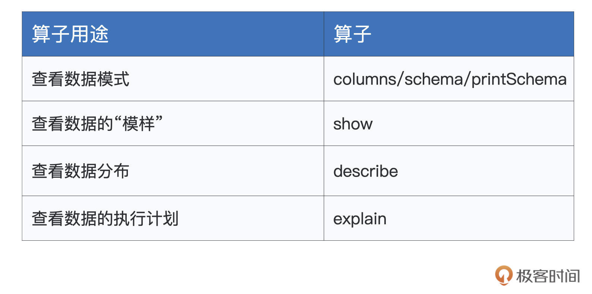
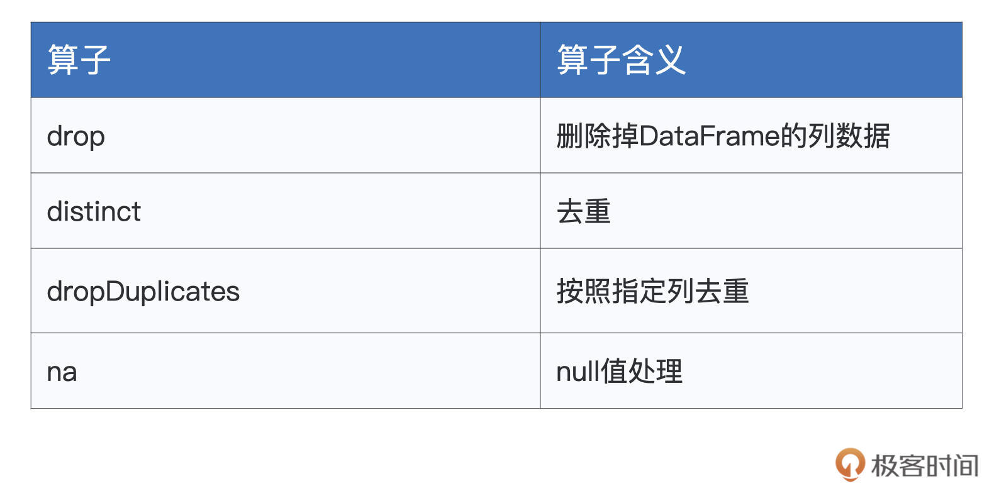
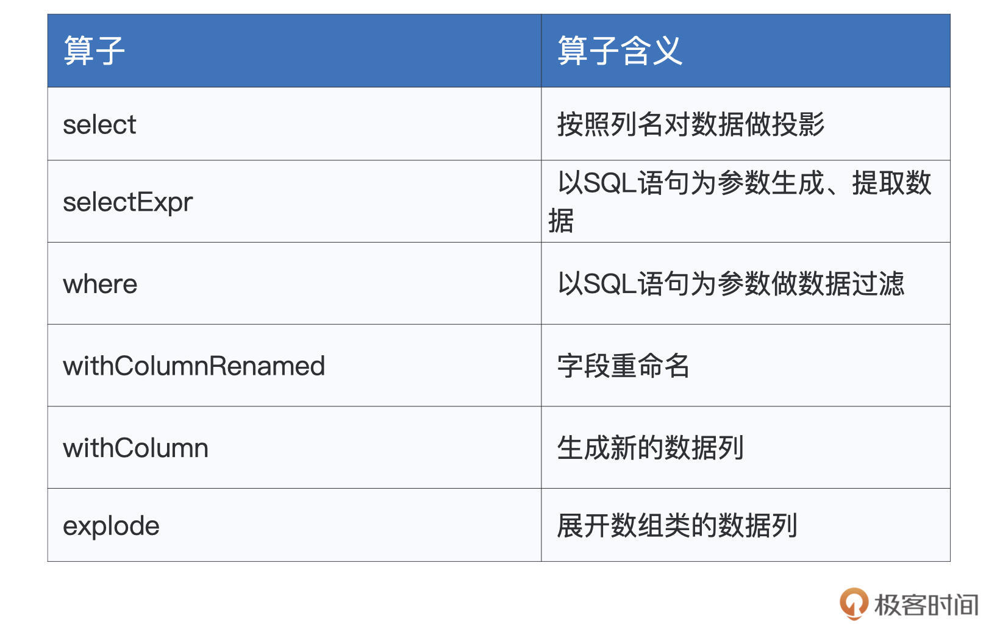
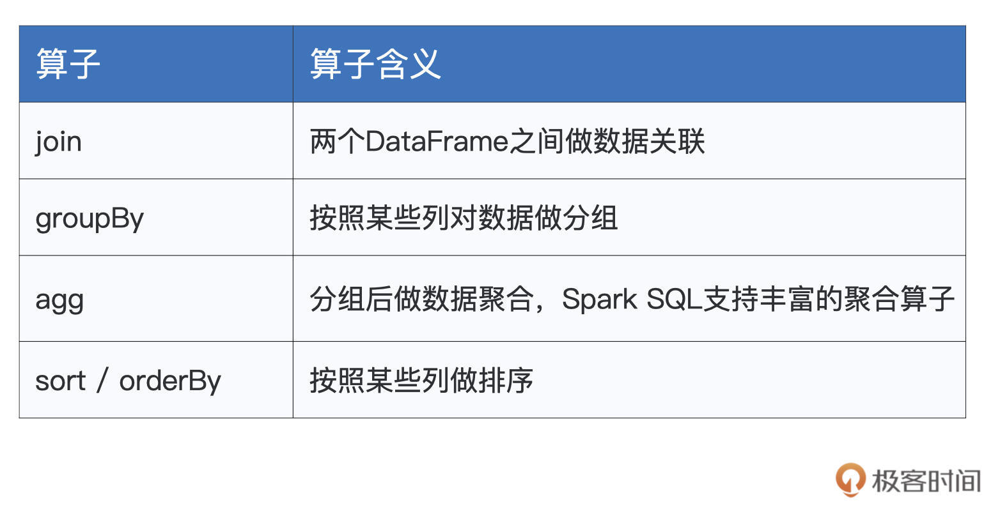
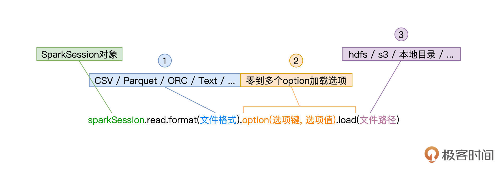
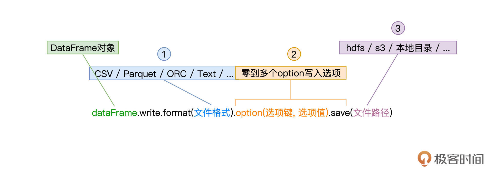
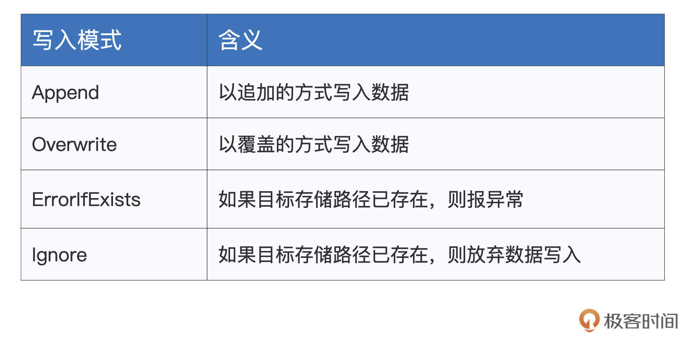

---
date: "2019-06-23"
---  
      
# 16 | 数据转换：如何在DataFrame之上做数据处理？
你好，我是吴磊。

在上一讲，我们学习了创建DataFrame的各种途径与方法，那么，有了DataFrame之后，我们该如何在DataFrame之上做数据探索、数据分析，以及各式各样的数据转换呢？在数据处理完毕之后，我们又该如何做数据展示与数据持久化呢？今天这一讲，我们就来解答这些疑问。

为了给开发者提供足够的灵活性，对于DataFrame之上的数据处理，Spark SQL支持两类开发入口：一个是大家所熟知的结构化查询语言：SQL，另一类是DataFrame开发算子。就开发效率与执行效率来说，二者并无优劣之分，选择哪种开发入口，完全取决于开发者的个人偏好与开发习惯。

与RDD类似，DataFrame支持种类繁多的开发算子，但相比SQL语言，DataFrame算子的学习成本相对要高一些。因此，本着先易后难的思路，咱们先来说说DataFrame中SQL语句的用法，然后再去理解DataFrame开发算子。

## SQL语句

对于任意的DataFrame，我们都可以使用createTempView或是createGlobalTempView在Spark SQL中创建临时数据表。

两者的区别在于，createTempView创建的临时表，其生命周期仅限于SparkSession内部，而createGlobalTempView创建的临时表，可以在同一个应用程序中跨SparkSession提供访问。有了临时表之后，我们就可以使用SQL语句灵活地倒腾表数据。

<!-- [[[read_end]]] -->

通过后面这段代码，我为你演示了如何使用createTempView创建临时表。我们首先用toDF创建了一个包含名字和年龄的DataFrame，然后调用createTempView方法创建了临时表。

```
    import org.apache.spark.sql.DataFrame
    import spark.implicits._
     
    val seq = Seq(("Alice", 18), ("Bob", 14))
    val df = seq.toDF("name", "age")
     
    df.createTempView("t1")
    val query: String = "select * from t1"
    // spark为SparkSession实例对象
    val result: DataFrame = spark.sql(query)
     
    result.show
     
    /** 结果打印
    +-----+---+
    | n ame| age|
    +-----+---+
    | Alice| 18|
    | Bob| 14|
    +-----+---+
    */
    

```

以上表为例，我们先是使用spark.implicits.\_隐式方法通过toDF来创建DataFrame，然后在其上调用createTempView来创建临时表“t1”。接下来，给定SQL查询语句“query”，我们可以通过调用SparkSession提供的sql API来提请执行查询语句，得到的查询结果被封装为新的DataFrame。

值得一提的是，与RDD的开发模式一样，**DataFrame之间的转换也属于延迟计算，当且仅当出现Action类算子时，如上表中的show，所有之前的转换过程才会交付执行**。

Spark SQL采用[ANTLR](https://www.antlr.org/)语法解析器，来解析并处理SQL语句。我们知道，ANTLR是一款强大的、跨语言的语法解析器，因为它全面支持SQL语法，所以广泛应用于Oracle、Presto、Hive、ElasticSearch等分布式数据仓库和计算引擎。因此，像Hive或是Presto中的SQL查询语句，都可以平滑地迁移到Spark SQL。

不仅如此，Spark SQL还提供大量Built-in Functions（内置函数），用于辅助数据处理，如array\_distinct、collect\_list，等等。你可以浏览官网的[Built-in Functions页面](https://spark.apache.org/docs/3.0.1/api/sql/index.html)查找完整的函数列表。结合SQL语句以及这些灵活的内置函数，你就能游刃有余地应对数据探索、数据分析这些典型的数据应用场景。

SQL语句相对比较简单，学习路径短、成本低，你只要搞清楚如何把DataFrame转化为数据表，剩下的事就水到渠成了。接下来，我们把主要精力放在DataFrame支持的各类算子上，这些算子提供的功能，往往能大幅提升开发效率，让我们事半功倍。

## DataFrame算子

不得不说，DataFrame支持的算子丰富而又全面，这主要源于DataFrame特有的“双面”属性。一方面，DataFrame来自RDD，与RDD具有同源性，因此RDD支持的大部分算子，DataFrame都支持。另一方面，DataFrame携带Schema，是结构化数据，因此它必定要提供一套与结构化查询同源的计算算子。

正是由于这样“双面”的特性，我们从下图可以看到，DataFrame所支持的算子，用“琳琅满目”来形容都不为过。


人类的大脑偏好结构化的知识，为了方便你记忆与理解，我把DataFrame上述两个方面的算子，进一步划分为6大类，**它们分别是RDD同源类算子、探索类算子、清洗类算子、转换类算子、分析类算子和持久化算子**。

你可能会困扰：“天呐！这么多算子要学，这不是逼我从入门到放弃吗？”别着急，上面这张图，你可以把它当作是“DataFrame算子脑图”，或是一本字典。在日常的开发中，思路枯竭的时候，你不妨把它翻出来，看看哪些算子能够帮你实现业务逻辑。

今天这一讲，我们也会根据这张“脑图”，重点讲解其中最常用、最关键的部分。

### 同源类算子

我们从DataFrame中的RDD同源类算子说起，这些算子在RDD算子那三讲做过详细的介绍，如果你对有哪个算子的作用或含义记不清了，不妨回看之前的三讲。我按照之前的分类，把这些算子整理成了一张表格。



### 探索类算子

接下来就是DataFrame的探索类算子。所谓探索，指的是数据探索，这类算子的作用，在于帮助开发者初步了解并认识数据，比如数据的模式（Schema）、数据的分布、数据的“模样”，等等，为后续的应用开发奠定基础。

对于常用的探索类算子，我把它们整理到了下面的表格中，你不妨先看一看，建立“第一印象”。



我们来依次“避轻就重”地说一说这些算子。首先，columns/schema/printSchema这3个算子类似，都可以帮我们获取DataFrame的数据列和Schema。尤其是printSchema，它以纯文本的方式将Data Schema打印到屏幕上，如下所示。

```
    import org.apache.spark.sql.DataFrame
    import spark.implicits._
     
    val employees = Seq((1, "John", 26, "Male"), (2, "Lily", 28, "Female"), (3, "Raymond", 30, "Male"))
    val employeesDF: DataFrame = employees.toDF("id", "name", "age", "gender")
     
    employeesDF.printSchema
     
    /** 结果打印
    root
    |-- id: integer (nullable = false)
    |-- name: string (nullable = true)
    |-- age: integer (nullable = false)
    |-- gender: string (nullable = true)
    */
    

```

了解数据模式之后，我们往往想知道数据具体长什么样子，对于这个诉求，show算子可以帮忙达成。在默认情况下，show会随机打印出DataFrame的20条数据记录。

```
    employeesDF.show
     
    /** 结果打印
    +---+-------+---+------+
    | id| name|age|gender|
    +---+-------+---+------+
    | 1| John| 26| Male|
    | 2| Lily| 28|Female|
    | 3|Raymond| 30| Male|
    +---+-------+---+------+
    */
    

```

看清了数据的“本来面目”之后，你还可以进一步利用describe去查看数值列的统计分布。比如，通过调用employeesDF.describe\(“age”\)，你可以查看age列的极值、平均值、方差等统计数值。

初步掌握了数据的基本情况之后，如果你对当前DataFrame的执行计划感兴趣，可以通过调用explain算子来获得Spark SQL给出的执行计划。explain对于执行效率的调优来说，有着至关重要的作用，后续课程中我们还会结合具体的实例，来深入讲解explain的用法和释义，在这里，你仅需知道explain是用来查看执行计划的就好。

### 清洗类算子

完成数据探索以后，我们正式进入数据应用的开发阶段。在数据处理前期，我们往往需要对数据进行适当地“清洗”，“洗掉”那些不符合业务逻辑的“脏数据”。DataFrame提供了如下算子，来帮我们完成这些脏活儿、累活儿。



首先，drop算子允许开发者直接把指定列从DataFrame中予以清除。举个例子，对于上述的employeesDF，假设我们想把性别列清除，那么直接调用 employeesDF.drop\(“gender”\) 即可。如果要同时清除多列，只需要在drop算子中用逗号把多个列名隔开即可。

第二个是distinct，它用来为DataFrame中的数据做去重。还是以employeesDF为例，当有多条数据记录的所有字段值都相同时，使用distinct可以仅保留其中的一条数据记录。

接下来是dropDuplicates，它的作用也是去重。不过，与distinct不同的是，dropDuplicates可以指定数据列，因此在灵活性上更胜一筹。还是拿employeesDF来举例，这个DataFrame原本有3条数据记录，如果我们按照性别列去重，最后只会留下两条记录。其中，一条记录的gender列是“Male”，另一条的gender列为“Female”，如下所示。

```
    employeesDF.show
     
    /** 结果打印
    +---+-------+---+------+
    | id| name|age|gender|
    +---+-------+---+------+
    | 1| John| 26| Male|
    | 2| Lily| 28|Female|
    | 3|Raymond| 30| Male|
    +---+-------+---+------+
    */
     
    employeesDF.dropDuplicates("gender").show
     
    /** 结果打印
    +---+----+---+------+
    | id|name|age|gender|
    +---+----+---+------+
    | 2|Lily| 28|Female|
    | 1|John| 26| Male|
    +---+----+---+------+
    */
    

```

表格中的最后一个算子是na，它的作用是选取DataFrame中的null数据，na往往要结合drop或是fill来使用。例如，employeesDF.na.drop用于删除DataFrame中带null值的数据记录，而employeesDF.na.fill\(0\) 则将DataFrame中所有的null值都自动填充为整数零。这两种用例在数据清洗的场景中都非常常见，因此，你需要牢牢掌握na.drop与na.fill的用法。

数据清洗过后，我们就得到了一份“整洁而又干净”的数据，接下来，可以放心大胆地去做各式各样的数据转换，从而实现业务逻辑需求。

### 转换类算子

转换类算子的主要用于数据的生成、提取与转换。转换类的算子的数量并不多，但使用方式非常灵活，开发者可以变着花样地变换数据。



首先，select算子让我们可以按照列名对DataFrame做投影，比如说，如果我们只关心年龄与性别这两个字段的话，就可以使用下面的语句来实现。

```
    employeesDF.select("name", "gender").show
     
    /** 结果打印
    +-------+------+
    | name|gender|
    +-------+------+
    | John| Male|
    | Lily|Female|
    |Raymond| Male|
    +-------+------+
    */
    

```

不过，虽然用起来比较简单，但select算子在功能方面不够灵活。在灵活性这方面，selectExpr做得更好。比如说，基于id和姓名，我们想把它们拼接起来生成一列新的数据。像这种需求，正是selectExpr算子的用武之地。

```
    employeesDF.selectExpr("id", "name", "concat(id, '_', name) as id_name").show
     
    /** 结果打印
    +---+-------+---------+
    | id| name| id_name|
    +---+-------+---------+
    | 1| John| 1_John|
    | 2| Lily| 2_Lily|
    | 3|Raymond|3_Raymond|
    +---+-------+---------+
    */
    

```

这里，我们使用concat这个函数，把id列和name列拼接在一起，生成新的id\_name数据列。

接下来的where和withColumnRenamed这两个算子比较简单，where使用SQL语句对DataFrame做数据过滤，而withColumnRenamed的作用是字段重命名。

比如，想要过滤出所有性别为男的员工，我们就可以用employeesDF.where\(“gender = ‘Male’”\)来实现。如果打算把employeesDF当中的“gender”重命名为“sex”，就可以用withColumnRenamed来帮忙：employeesDF.withColumnRenamed\(“gender”, “sex”\)。

紧接着的是withColumn，虽然名字看上去和withColumnRenamed很像，但二者在功能上有着天壤之别。

withColumnRenamed是重命名现有的数据列，而withColumn则用于生成新的数据列，这一点上，withColumn倒是和selectExpr有着异曲同工之妙。withColumn也可以充分利用Spark SQL提供的Built-in Functions来灵活地生成数据。

比如，基于年龄列，我们想生成一列脱敏数据，隐去真实年龄，你就可以这样操作。

```
    employeesDF.withColumn("crypto", hash($"age")).show
     
    /** 结果打印
    +---+-------+---+------+-----------+
    | id| name|age|gender| crypto|
    +---+-------+---+------+-----------+
    | 1| John| 26| Male|-1223696181|
    | 2| Lily| 28|Female|-1721654386|
    | 3|Raymond| 30| Male| 1796998381|
    +---+-------+---+------+-----------+
    */
    

```

可以看到，我们使用内置函数hash，生成一列名为“crypto”的新数据，数据值是对应年龄的哈希值。有了新的数据列之后，我们就可以调用刚刚讲的drop，把原始的age字段丢弃掉。

表格中的最后一个算子是explode，这个算子很有意思，它的作用是展开数组类型的数据列，数组当中的每一个元素，都会生成一行新的数据记录。为了更好地演示explode的用法与效果，我们把employeesDF数据集做个简单的调整，给它加上一个interests兴趣字段。

```
    val seq = Seq( (1, "John", 26, "Male", Seq("Sports", "News")),
    (2, "Lily", 28, "Female", Seq("Shopping", "Reading")),
    (3, "Raymond", 30, "Male", Seq("Sports", "Reading"))
    )
     
    val employeesDF: DataFrame = seq.toDF("id", "name", "age", "gender", "interests")
    employeesDF.show
     
    /** 结果打印
    +---+-------+---+------+-------------------+
    | id| name|age|gender| interests|
    +---+-------+---+------+-------------------+
    | 1| John| 26| Male| [Sports, News]|
    | 2| Lily| 28|Female|[Shopping, Reading]|
    | 3|Raymond| 30| Male| [Sports, Reading]|
    +---+-------+---+------+-------------------+
    */
     
    employeesDF.withColumn("interest", explode($"interests")).show
     
    /** 结果打印
    +---+-------+---+------+-------------------+--------+
    | id| name|age|gender| interests|interest|
    +---+-------+---+------+-------------------+--------+
    | 1| John| 26| Male| [Sports, News]| Sports|
    | 1| John| 26| Male| [Sports, News]| News|
    | 2| Lily| 28|Female|[Shopping, Reading]|Shopping|
    | 2| Lily| 28|Female|[Shopping, Reading]| Reading|
    | 3|Raymond| 30| Male| [Sports, Reading]| Sports|
    | 3|Raymond| 30| Male| [Sports, Reading]| Reading|
    +---+-------+---+------+-------------------+--------+
    */
    

```

可以看到，我们多加了一个兴趣列，列数据的类型是数组，每个员工都有零到多个兴趣。

如果我们想把数组元素展开，让每个兴趣都可以独占一条数据记录。这个时候就可以使用explode，再结合withColumn，生成一列新的interest数据。这列数据的类型是单个元素的String，而不再是数组。有了新的interest数据列之后，我们可以再次利用drop算子，把原本的interests列抛弃掉。

数据转换完毕之后，我们就可以通过数据的关联、分组、聚合、排序，去做数据分析，从不同的视角出发去洞察数据。这个时候，我们还要依赖Spark SQL提供的多个分析类算子。

### 分析类算子

毫不夸张地说，前面的探索、清洗、转换，都是在为数据分析做准备。**在大多数的数据应用中，数据分析往往是最为关键的那环，甚至是应用本身的核心目的**。因此，熟练掌握分析类算子，有利于我们提升开发效率。

Spark SQL的分析类算子看上去并不多，但灵活组合使用，就会有“千变万化”的效果，让我们一起看看。



为了演示上述算子的用法，我们先来准备两张数据表：employees和salaries，也即员工信息表和薪水表。我们的想法是，通过对两张表做数据关联，来分析员工薪水的分布情况。

```
    import spark.implicits._
    import org.apache.spark.sql.DataFrame
     
    // 创建员工信息表
    val seq = Seq((1, "Mike", 28, "Male"), (2, "Lily", 30, "Female"), (3, "Raymond", 26, "Male"))
    val employees: DataFrame = seq.toDF("id", "name", "age", "gender")
     
    // 创建薪水表
    val seq2 = Seq((1, 26000), (2, 30000), (4, 25000), (3, 20000))
    val salaries:DataFrame = seq2.toDF("id", "salary")
     
    employees.show
     
    /** 结果打印
    +---+-------+---+------+
    | id| name|age|gender|
    +---+-------+---+------+
    | 1| Mike| 28| Male|
    | 2| Lily| 30|Female|
    | 3|Raymond| 26| Male|
    +---+-------+---+------+
    */
     
    salaries.show
     
    /** 结果打印
    +---+------+
    | id|salary|
    +---+------+
    | 1| 26000|
    | 2| 30000|
    | 4| 25000|
    | 3| 20000|
    +---+------+
    */
    

```

那么首先，我们先用join算子把两张表关联起来，关联键（Join Keys）我们使用两张表共有的id列，而关联形式（Join Type）自然是内关联（Inner Join）。

```
    val jointDF: DataFrame = salaries.join(employees, Seq("id"), "inner")
     
    jointDF.show
     
    /** 结果打印
    +---+------+-------+---+------+
    | id|salary| name|age|gender|
    +---+------+-------+---+------+
    | 1| 26000| Mike| 28| Male|
    | 2| 30000| Lily| 30|Female|
    | 3| 20000|Raymond| 26| Male|
    +---+------+-------+---+------+
    */
    

```

可以看到，我们在salaries之上调用join算子，join算子的参数有3类。第一类是待关联的数据表，在我们的例子中就是员工表employees。第二类是关联键，也就是两张表之间依据哪些字段做关联，我们这里是id列。第三类是关联形式，我们知道，关联形式有inner、left、right、anti、semi等等，这些关联形式我们下一讲再展开，这里你只需要知道Spark SQL支持这些种类丰富的关联形式即可。

数据完成关联之后，我们实际得到的仅仅是最细粒度的事实数据，也就是每个员工每个月领多少薪水。这样的事实数据本身并没有多少价值，我们往往需要从不同的维度出发，对数据做分组、聚合，才能获得更深入、更有价值的数据洞察。

比方说，我们想以性别为维度，统计不同性别下的总薪水和平均薪水，借此分析薪水与性别之间可能存在的关联关系。

```
    val aggResult = fullInfo.groupBy("gender").agg(sum("salary").as("sum_salary"), avg("salary").as("avg_salary"))
     
    aggResult.show
     
    /** 数据打印
    +------+----------+----------+
    |gender|sum_salary|avg_salary|
    +------+----------+----------+
    |Female| 30000| 30000.0|
    | Male| 46000| 23000.0|
    +------+----------+----------+
    */
    

```

这里，我们先是使用groupBy算子按照“gender”列做分组，然后使用agg算子做聚合运算。在agg算子中，我们分别使用sum和avg聚合函数来计算薪水的总数和平均值。Spark SQL对于聚合函数的支持，我们同样可以通过[Built-in Functions页面](https://spark.apache.org/docs/3.0.1/api/sql/)来进行检索。结合Built-in Functions提供的聚合函数，我们就可以灵活地对数据做统计分析。

得到统计结果之后，为了方便查看，我们还可以使用sort或是orderBy算子对结果集进行排序，二者在用法与效果上是完全一致的，如下表所示。

```
    aggResult.sort(desc("sum_salary"), asc("gender")).show
     
    /** 结果打印
    +------+----------+----------+
    |gender|sum_salary|avg_salary|
    +------+----------+----------+
    | Male| 46000| 23000.0|
    |Female| 30000| 30000.0|
    +------+----------+----------+
    */
     
    aggResult.orderBy(desc("sum_salary"), asc("gender")).show
     
    /** 结果打印
    +------+----------+----------+
    |gender|sum_salary|avg_salary|
    +------+----------+----------+
    | Male| 46000| 23000.0|
    |Female| 30000| 30000.0|
    +------+----------+----------+
    */
    

```

可以看到，sort / orderBy支持按照多列进行排序，且可以通过desc和asc来指定排序方向。其中desc表示降序排序，相应地，asc表示升序排序。

好啦，到此为止，我们沿着数据的生命周期，分别梳理了生命周期不同阶段的Spark SQL算子，它们分别是探索类算子、清洗类算子、转换类算子和分析类算子。


所谓行百里者半九十，纵观整个生命周期，我们还剩下数据持久化这一个环节。对于最后的这个持久化环节，Spark SQL提供了write API，与上一讲介绍的read API相对应，write API允许开发者把数据灵活地物化为不同的文件格式。

### 持久化类算子

没有对比就没有鉴别，在学习write API之前，我们不妨先来回顾一下上一讲介绍的read API。



如上图所示，read API有3个关键点，一是由format指定的文件格式，二是由零到多个option组成的加载选项，最后一个是由load标记的源文件路径。

与之相对，write API也有3个关键环节，分别是同样由format定义的文件格式，零到多个由option构成的“写入选项”，以及由save指定的存储路径，如下图所示。



这里的format和save，与read API中的format和load是一一对应的，分别用于指定文件格式与存储路径。实际上，option选项也是类似的，除了mode以外，write API中的选项键与read API中的选项键也是相一致的，如seq用于指定CSV文件分隔符、dbtable用于指定数据表名、等等，你可以通过回顾[上一讲](https://time.geekbang.org/column/article/426101)来获取更多的option选项。

在read API中，mode选项键用于指定读取模式，如permissive, dropMalformed, failFast。但在write API中，mode用于指定“写入模式”，分别有Append、Overwrite、ErrorIfExists、Ignore这4种模式，它们的含义与描述如下表所示。



有了write API，我们就可以灵活地把DataFrame持久化到不同的存储系统中，为数据的生命周期画上一个圆满的句号。

## 重点回顾

今天这一讲，我们主要围绕数据的生命周期，学习了Spark SQL在不同数据阶段支持的处理算子，如下图所示。


图中涉及的算子很多，尽管大部分我们都举例讲过了，但要在短时间之内一下子掌握这么多内容，确实强人所难。不过，你不用担心，今天这一讲，最主要的目的，还是想让你对Spark SQL支持的算子有一个整体的把握。

至于每个算子具体是用来做什么的，在日后的开发工作中，你可以反复地翻看这一讲，结合实践慢慢地加深印象，这样学习更高效。我也强烈建议你空闲时把官网的[Built-in Functions列表](https://spark.apache.org/docs/3.0.1/api/sql/index.html)过一遍，对这些内置函数的功能做到心中有数，实现业务逻辑时才会手到擒来。

除了DataFrame本身支持的算子之外，在功能上，SQL完全可以实现同样的数据分析。给定DataFrame，你只需通过createTempView或是createGlobalTempView来创建临时表，然后就可以通过写SQL语句去进行数据的探索、倾斜、转换与分析。

最后，需要指出的是，DataFrame算子与SQL查询语句之间，并没有优劣之分，他们可以实现同样的数据应用，而且在执行性能方面也是一致的。因此，你可以结合你的开发习惯与偏好，自由地在两者之间进行取舍。

## 每课一练

在转换类算子中，我们举例介绍了explode这个算子，它的作用是按照以数组为元素的数据列，把一条数据展开（爆炸）成多条数据。结合这个算子的作用，你能否分析一下，explode操作是否会引入Shuffle计算呢？

欢迎你在留言区跟我交流互动，也推荐你把这一讲分享给有需要的朋友。