---
date: "2019-06-23"
---  
      
# 22｜Spark UI（下）：如何高效地定位性能问题？
你好，我是吴磊。

在上一讲，我们一起梳理了Spark UI的一级入口。其中Executors、Environment、Storage是详情页，开发者可以通过这3个页面，迅速地了解集群整体的计算负载、运行环境，以及数据集缓存的详细情况。不过SQL、Jobs、Stages，更多地是一种罗列式的展示，想要了解其中的细节，还需要进入到二级入口。

沿用之前的比喻，身为“大夫”的开发者想要结合经验，迅速定位“病灶”，离不开各式各样的指标项。而今天要讲的二级入口，相比一级入口，内容更加丰富、详尽。要想成为一名“临床经验丰富”的老医生，咱们先要做到熟练解读这些度量指标。

所谓二级入口，它指的是，**通过一次超链接跳转才能访问到的页面**。对于SQL、Jobs和Stages这3类入口来说，二级入口往往已经提供了足够的信息，基本覆盖了“体检报告”的全部内容。因此，尽管Spark UI也提供了少量的三级入口（需要两跳才能到达的页面），但是这些隐藏在“犄角旮旯”的三级入口，往往并不需要开发者去特别关注。

接下来，我们就沿着SQL \-> Jobs \-> Stages的顺序，依次地去访问它们的二级入口，从而针对全局DAG、作业以及执行阶段，获得更加深入的探索与洞察。

<!-- [[[read_end]]] -->

#### SQL详情页

在SQL Tab一级入口，我们看到有3个条目，分别是count（统计申请编号）、count（统计中签编号）和save。前两者的计算过程，都是读取数据源、缓存数据并触发缓存的物化，相对比较简单，因此，我们把目光放在**save**这个条目上。

点击图中的“save at:27”，即可进入到该作业的执行计划页面，如下图所示。

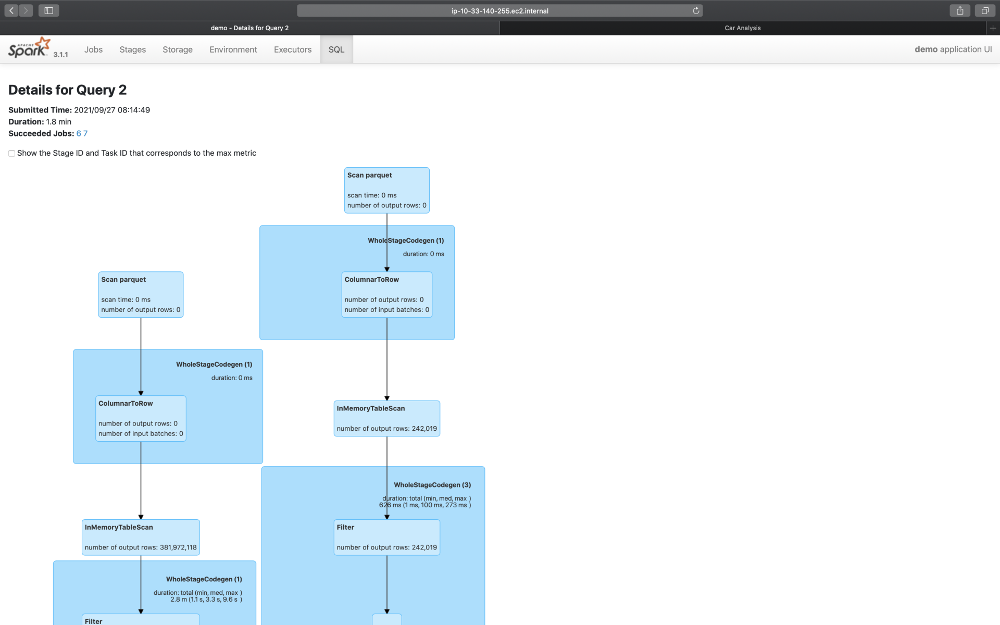

为了聚焦重点，这里我们仅截取了部分的执行计划，想要获取完整的执行计划，你可以通过访问[这里](<https://github.com/wulei-bj-cn/learn-spark/blob/main/chapter22/demo \- Details for Query 2.webarchive>)来获得。为了方便你阅读，这里我手绘出了执行计划的示意图，供你参考，如下图所示。

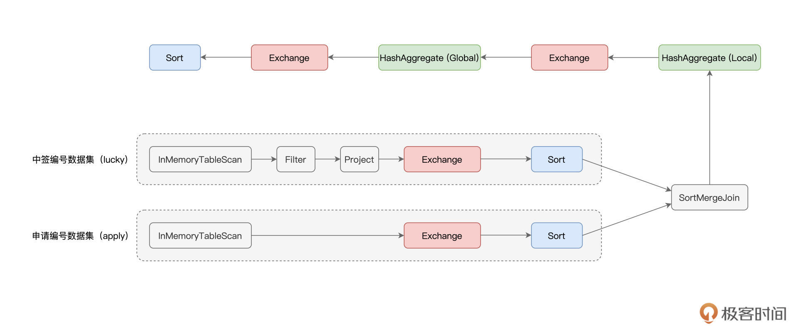

可以看到，“倍率与中签率分析”应用的计算过程，非常具有代表性，它涵盖了数据分析场景中大部分的操作，也即**过滤、投影、关联、分组聚合和排序**。图中红色的部分为Exchange，代表的是Shuffle操作，蓝色的部分为Sort，也就是排序，而绿色的部分是Aggregate，表示的是（局部与全局的）数据聚合。

无疑，这三部分是硬件资源的主要消费者，同时，对于这3类操作，Spark UI更是提供了详细的Metrics来刻画相应的硬件资源消耗。接下来，咱们就重点研究一下这3类操作的度量指标。

**Exchange**

下图中并列的两个Exchange，对应的是示意图中SortMergeJoin之前的两个Exchange。它们的作用是对申请编码数据与中签编码数据做Shuffle，为数据关联做准备。

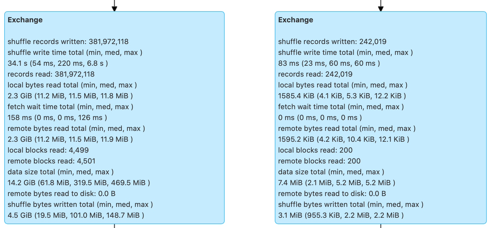

可以看到，对于每一个Exchange，Spark UI都提供了丰富的Metrics来刻画Shuffle的计算过程。从Shuffle Write到Shuffle Read，从数据量到处理时间，应有尽有。为了方便说明，对于Metrics的解释与释义，我以表格的方式进行了整理，供你随时查阅。

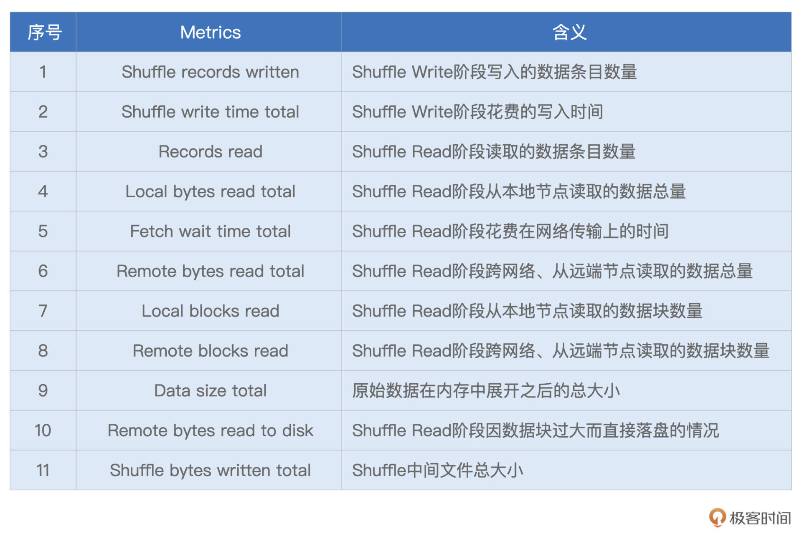

结合这份Shuffle的“体检报告”，我们就能以量化的方式，去掌握Shuffle过程的计算细节，从而为调优提供更多的洞察与思路。

为了让你获得直观感受，我还是举个例子说明。比方说，我们观察到过滤之后的中签编号数据大小不足10MB（7.4MB），这时我们首先会想到，对于这样的大表Join小表，Spark SQL选择了SortMergeJoin策略是不合理的。

基于这样的判断，我们完全可以让Spark SQL选择BroadcastHashJoin策略来提供更好的执行性能。至于调优的具体方法，想必不用我多说，你也早已心领神会：**要么用强制广播，要么利用Spark 3.x版本提供的AQE特性**。

你不妨结合本讲开头的代码，去完成SortMergeJoin到BroadcastHashJoin策略转换的调优，期待你在留言区分享你的调优结果。

**Sort**

接下来，我们再来说说Sort。相比Exchange，Sort的度量指标没那么多，不过，他们足以让我们一窥Sort在运行时，对于内存的消耗，如下图所示。

按照惯例，我们还是先把这些Metrics整理到表格中，方便后期查看。

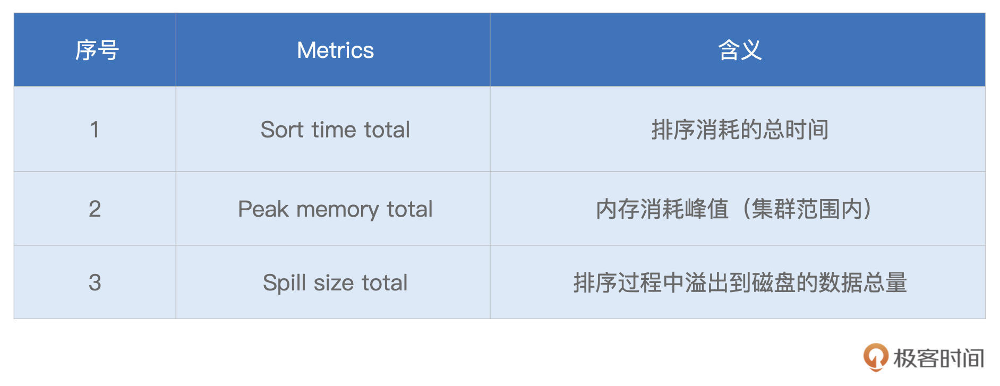

可以看到，“Peak memory total”和“Spill size total”这两个数值，足以指导我们更有针对性地去设置spark.executor.memory、spark.memory.fraction、spark.memory.storageFraction，从而使得Execution Memory区域得到充分的保障。

以上图为例，结合18.8GB的峰值消耗，以及12.5GB的磁盘溢出这两条信息，我们可以判断出，当前3GB的Executor Memory是远远不够的。那么我们自然要去调整上面的3个参数，来加速Sort的执行性能。

**Aggregate**

与Sort类似，衡量Aggregate的度量指标，主要记录的也是操作的内存消耗，如图所示。

可以看到，对于Aggregate操作，Spark UI也记录着磁盘溢出与峰值消耗，即Spill size和Peak memory total。这两个数值也为内存的调整提供了依据，以上图为例，零溢出与3.2GB的峰值消耗，证明当前3GB的Executor Memory设置，对于Aggregate计算来说是绰绰有余的。

到此为止，我们分别介绍了Exchange、Sort和Aggregate的度量指标，并结合“倍率与中签率分析”的例子，进行了简单的调优分析。

纵观“倍率与中签率分析”完整的DAG，我们会发现它包含了若干个Exchange、Sort、Aggregate以及Filter和Project。**结合上述的各类Metrics，对于执行计划的观察与洞见，我们需要以统筹的方式，由点到线、由局部到全局地去进行**。

#### Jobs详情页

接下来，我们再来说说Jobs详情页。Jobs详情页非常的简单、直观，它罗列了隶属于当前Job的所有Stages。要想访问每一个Stage的执行细节，我们还需要通过“Description”的超链接做跳转。

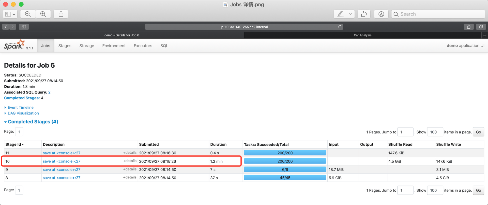

#### Stages详情页

实际上，要访问Stage详情，我们还有另外一种选择，那就是直接从Stages一级入口进入，然后完成跳转。因此，Stage详情页也归类到二级入口。接下来，我们以Id为10的Stage为例，去看一看详情页都记录着哪些关键信息。

在所有二级入口中，Stage详情页的信息量可以说是最大的。点进Stage详情页，可以看到它主要包含3大类信息，分别是Stage DAG、Event Timeline与Task Metrics。

其中，Task Metrics又分为“Summary”与“Entry details”两部分，提供不同粒度的信息汇总。而Task Metrics中记录的指标类别，还可以通过“Show Additional Metrics”选项进行扩展。

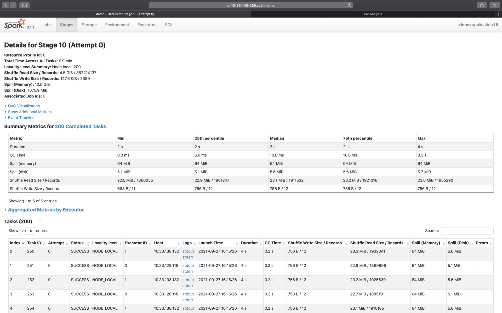

**Stage DAG**

接下来，我们沿着“Stage DAG \-> Event Timeline \-> Task Metrics”的顺序，依次讲讲这些页面所包含的内容。

首先，我们先来看最简单的Stage DAG。点开蓝色的“DAG Visualization”按钮，我们就能获取到当前Stage的DAG，如下图所示。

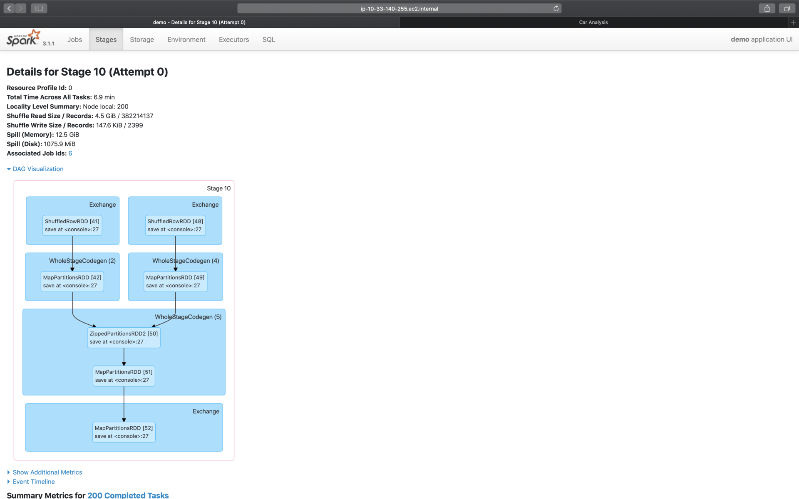

之所以说Stage DAG简单，是因为咱们在SQL二级入口，已经对DAG做过详细的说明。而Stage DAG仅仅是SQL页面完整DAG的一个子集，毕竟，SQL页面的DAG，针对的是作业（Job）。因此，只要掌握了作业的DAG，自然也就掌握了每一个Stage的DAG。

**Event Timeline**

与“DAG Visualization”并列，在“Summary Metrics”之上，有一个“Event Timeline”按钮，点开它，我们可以得到如下图所示的可视化信息。

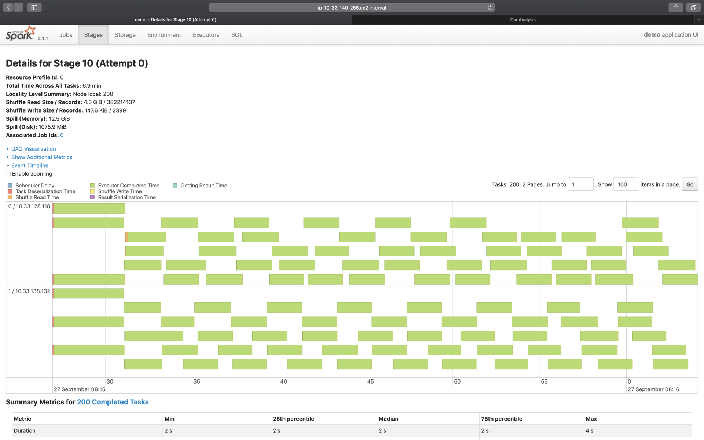

Event Timeline，记录着分布式任务调度与执行的过程中，不同计算环节主要的时间花销。图中的每一个条带，都代表着一个分布式任务，条带由不同的颜色构成。其中不同颜色的矩形，代表不同环节的计算时间。

为了方便叙述，我还是用表格形式帮你梳理了这些环节的含义与作用，你可以保存以后随时查看。

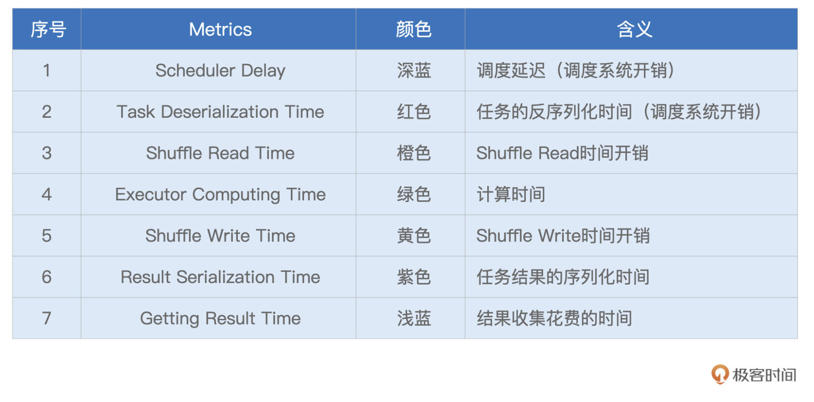

理想情况下，条带的大部分应该都是绿色的（如图中所示），也就是任务的时间消耗，大部分都是执行时间。不过，实际情况并不总是如此，比如，有些时候，蓝色的部分占比较多，或是橙色的部分占比较大。

在这些情况下，我们就可以结合Event Timeline，来判断作业是否存在调度开销过大、或是Shuffle负载过重的问题，从而有针对性地对不同环节做调优。

比方说，如果条带中深蓝的部分（Scheduler Delay）很多，那就说明任务的调度开销很重。这个时候，我们就需要参考公式：D / P \~ M / C，来相应地调整CPU、内存与并行度，从而减低任务的调度开销。其中，D是数据集尺寸，P为并行度，M是Executor内存，而C是Executor的CPU核数。波浪线\~表示的是，等式两边的数值，要在同一量级。

再比如，如果条带中黄色（Shuffle Write Time）与橙色（Shuffle Read Time）的面积较大，就说明任务的Shuffle负载很重，这个时候，我们就需要考虑，有没有可能通过利用Broadcast Join来消除Shuffle，从而缓解任务的Shuffle负担。

**Task Metrics**

说完Stage DAG与Event Timeline，最后，我们再来说一说Stage详情页的重头戏：Task Metrics。

之所以说它是重头戏，在于Task Metrics以不同的粒度，提供了详尽的量化指标。其中，“Tasks”以Task为粒度，记录着每一个分布式任务的执行细节，而“Summary Metrics”则是对于所有Tasks执行细节的统计汇总。我们先来看看粗粒度的“Summary Metrics”，然后再去展开细粒度的“Tasks”。

**Summary Metrics**

首先，我们点开“Show Additional Metrics”按钮，勾选“Select All”，让所有的度量指标都生效，如下图所示。这么做的目的，在于获取最详尽的Task执行信息。

可以看到，“Select All”生效之后，Spark UI打印出了所有的执行细节。老规矩，为了方便叙述，我还是把这些Metrics整理到表格中，方便你随时查阅。其中，Task Deserialization Time、Result Serialization Time、Getting Result Time、Scheduler Delay与刚刚表格中的含义相同，不再赘述，这里我们仅整理新出现的Task Metrics。

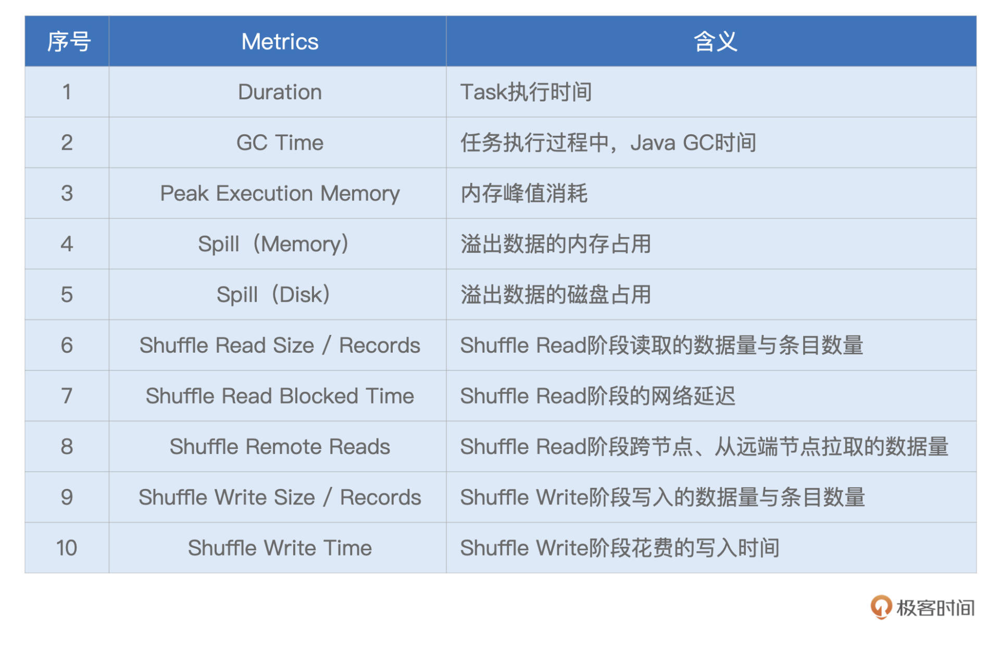

对于这些详尽的Task Metrics，难能可贵地，Spark UI以最大最小（max、min）以及分位点（25\%分位、50\%分位、75\%分位）的方式，提供了不同Metrics的统计分布。这一点非常重要，原因在于，**这些Metrics的统计分布，可以让我们非常清晰地量化任务的负载分布**。

换句话说，根据不同Metrics的统计分布信息，我们就可以轻而易举地判定，当前作业的不同任务之间，是相对均衡，还是存在严重的倾斜。如果判定计算负载存在倾斜，那么我们就要利用AQE的自动倾斜处理，去消除任务之间的不均衡，从而改善作业性能。

在上面的表格中，有一半的Metrics是与Shuffle直接相关的，比如Shuffle Read Size / Records，Shuffle Remote Reads，等等。

这些Metrics我们在介绍SQL详情的时候，已经详细说过了。另外，Duration、GC Time、以及Peak Execution Memory，这些Metrics的含义，要么已经讲过，要么过于简单、无需解释。因此，对于这3个指标，咱们也不再多着笔墨。

这里特别值得你关注的，是**Spill（Memory）和Spill（Disk）这两个指标**。Spill，也即溢出数据，它指的是因内存数据结构（PartitionedPairBuffer、AppendOnlyMap，等等）空间受限，而腾挪出去的数据。Spill（Memory）表示的是，这部分数据在内存中的存储大小，而Spill（Disk）表示的是，这些数据在磁盘中的大小。

因此，用Spill（Memory）除以Spill（Disk），就可以得到“数据膨胀系数”的近似值，我们把它记为**Explosion ratio**。有了Explosion ratio，对于一份存储在磁盘中的数据，我们就可以估算它在内存中的存储大小，从而准确地把握数据的内存消耗。

**Tasks**

介绍完粗粒度的Summary Metrics，接下来，我们再来说说细粒度的“Tasks”。实际上，Tasks的不少指标，与Summary是高度重合的，如下图所示。同理，这些重合的Metrics，咱们不再赘述，你可以参考Summary的部分，来理解这些Metrics。唯一的区别，就是这些指标是针对每一个Task进行度量的。

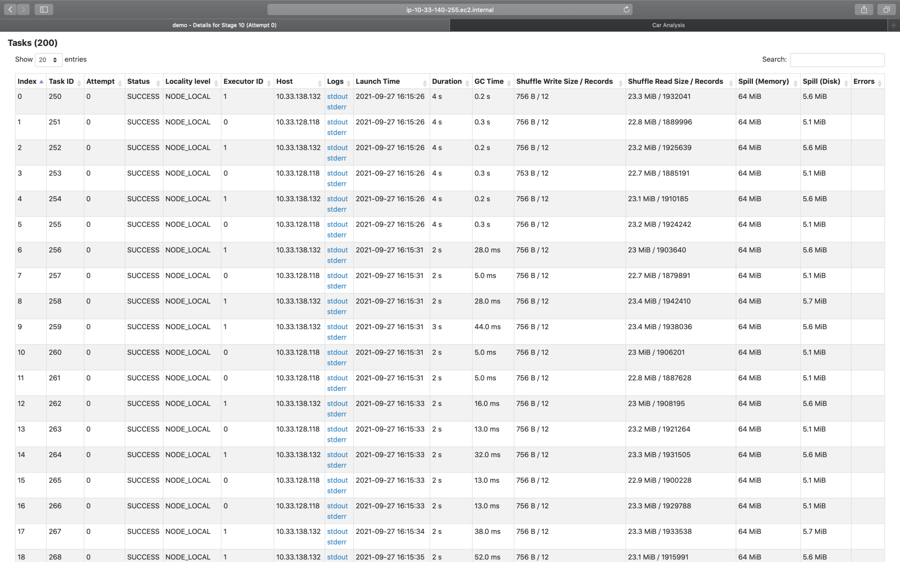

按照惯例，咱们还是把Tasks中那些新出现的指标，整理到表格中，以备后续查看。

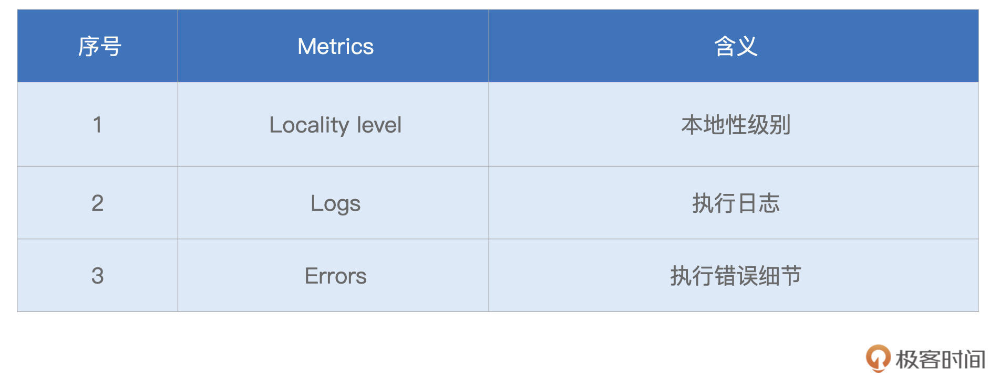

可以看到，新指标并不多，这里最值得关注的，是**Locality level**，也就是本地性级别。在调度系统中，我们讲过，每个Task都有自己的本地性倾向。结合本地性倾向，调度系统会把Tasks调度到合适的Executors或是计算节点，尽可能保证“**数据不动、代码动**”。

Logs与Errors属于Spark UI的三级入口，它们是Tasks的执行日志，详细记录了Tasks在执行过程中的运行时状态。一般来说，我们不需要深入到三级入口去进行Debug。Errors列提供的报错信息，往往足以让我们迅速地定位问题所在。

## 重点回顾

好啦，今天的课程，到这里就讲完啦。今天这一讲，我们分别学习了二级入口的SQL、Jobs与Stages。每个二级入口的内容都很丰富，提前知道它们所涵盖的信息，对我们寻找、启发与探索性能调优的思路非常有帮助。

到此为止，关于Spark UI的全部内容就讲完啦。Spark UI涉及的Metrics纷繁而又复杂，一次性记住确实有难度，所以通过这一讲，你只要清楚各级入口怎么找到，知道各个指标能给我们提供什么信息就好了。当然，仅仅跟着我去用“肉眼”学习一遍只是第一步，之后还需要你结合日常的开发，去多多摸索与体会，加油！

最后的最后，还是想提醒你，由于我们的应用是通过spark-shell提交的，因此节点8080端口的Spark UI会一直展示应用的“体检报告”。在我们退出spark-shell之后，节点8080端口的内存也随即消失（404 Page not found）。

要想再次查看应用的“体检报告”，需要移步至节点的18080端口，这里是Spark History Server的领地，它收集了所有（已执行完毕）应用的“体检报告”，并同样使用Spark UI的形式进行展示，切记切记。

## 每课一练

今天的思考题，需要你发散思维。学习过Spark UI之后，请你说一说，都可以通过哪些途径，来定位数据倾斜问题？

欢迎你把Spark UI使用的心得体会，分享到课后的评论区，我们一起讨论，共同进步！也推荐你把这一讲分享更多同事、朋友。