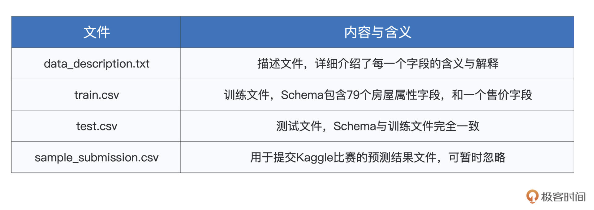
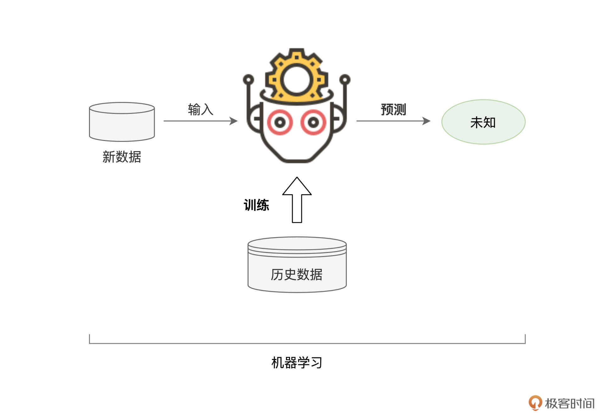
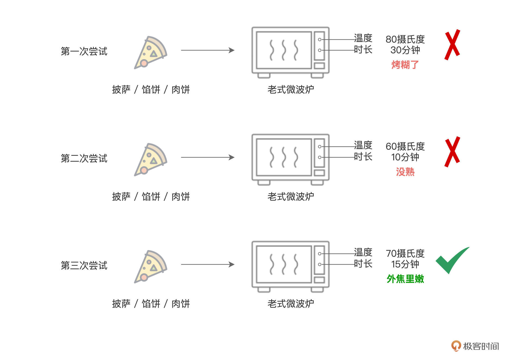
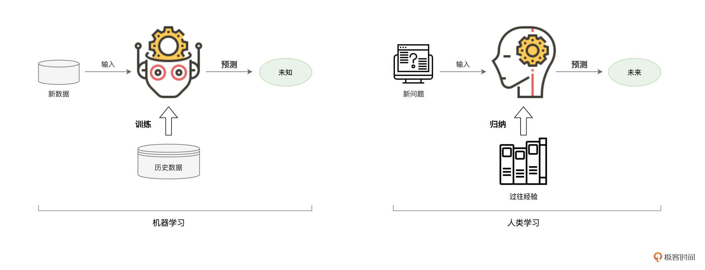

---
date: "2019-06-23"
---  
      
# 23 | Spark MLlib：从“房价预测”开始
你好，我是吴磊。

从今天这一讲开始，我们进入课程的第三个模块：Spark MLlib机器学习。在数据科学、机器学习与人工智能火热的当下，积累一些机器学习的知识储备，有利于我们拓展视野，甚至为职业发展提供新的支点。

在这个模块中，我们首先从一个“房价预测”的小项目入手，来初步了解机器学习以及Spark MLlib的基本用法。接下来，我们会着重讲解机器学习的两个关键环节：特征工程与模型调优，在深入学习Spark MLlib的同时，进一步优化“房价预测”的模型效果，从而让房价的预测越来越准。

熟悉了关键环节之后，我们再去探讨，在Spark MLlib的框架之下，高效构建机器学习流水线的一般方法。好啦，话不多说，让我们先来一起看看“房价预测”这个小项目吧。

为兼顾项目的权威性与代表性，这里我选择了Kaggle（数据科学竞赛平台）的“[House Prices \- Advanced Regression Techniques](https://www.kaggle.com/c/house-prices-advanced-regression-techniques/overview)”竞赛项目。这个项目的要求是，给定房屋的79个属性特征以及历史房价，训练房价预测模型，并在测试集上验证模型的预测效果。

## 数据准备

虽然项目的要求相当清晰明了，不过你可能会说：“我没有机器学习背景，上面提到这些什么特征啊、模型啊，还有测试集、效果验证，我都没有概念，那接下来的课程，要怎么学呢？”别担心，随着课程的推进，我会逐渐把这些概念给你讲清楚。

<!-- [[[read_end]]] -->

接下来，我们先直观了解一下项目中的房屋数据。

房屋数据记录着美国爱荷华州2006年到2010年的房屋交易数据，其中包含着79个房屋属性以及当时的成交价格，你可以通过[竞赛项目的data页面](https://www.kaggle.com/c/house-prices-advanced-regression-techniques/data)进行下载。

数据下载、解压之后，我们会得到4个文件，分别是data\_description.txt、train.csv、test.csv和sample\_submission.csv。这4个文件的体量很小，总大小不超过5MB，它们的内容与含义如下表所示。



其中，train.csv与test.csv的Schema完全一致，都包含79个房屋属性字段以及一个交易价格字段，描述文件则详细地记录着79个字段的含义与取值范围。二者的唯一区别在于用途，**train.csv用于训练模型，而test.csv用于验证模型效果**。  
sample\_submission.csv文件则用于提交比赛结果，由于咱们暂时不打算参赛，因此这个文件可以暂时忽略。

说到这里，我们又提到了与机器学习有关的一些术语，如“训练数据”、“测试数据”、“模型效果”，等等。为了照顾缺少机器学习背景的同学，接下来，我们对机器做一个简单的介绍。

## 机器学习简介

不过，在去正式介绍机器学习之前，我们不妨先来想一想人类学习的过程，然后再来看看，在学习这方面，机器与人类有哪些相似之处。

每个人在成长的过程中，或是通过书本，或是结合过往的经历，都在不断地吸取经验教训，从而总结出为人处世、待人接物的一般原则，然后再将这些原则应用到余下的人生中去。人类学习与成长的过程，大抵如此。


实际上，机器学习的过程也是类似的。基于历史数据，机器会根据一定的算法，尝试从历史数据中挖掘并捕捉出一般规律。然后，再把找到的规律应用到新产生的数据中，从而实现在新数据上的预测与判断。



好啦，对于机器学习有了基本的认知之后，接下来， 我们就给它下一个正式的定义，从而以更加严谨的方式，来认识机器学习。

所谓机器学习（Machine Learning），它指的是这样一种计算过程：对于给定的训练数据（Training samples），选择一种先验的数据分布模型（Models），然后借助优化算法（Learning Algorithms）自动地持续调整模型参数（Model Weights / Parameters），从而让模型不断逼近训练数据的原始分布。

这个持续调整模型参数的过程称为“模型训练”（Model Training）。模型的训练依赖于优化算法，基于过往的计算误差（Loss），优化算法以不断迭代的方式，自动地对模型参数进行调整。由于模型训练是一个持续不断的过程，那么自然就需要一个收敛条件（Convergence Conditions），来终结模型的训练过程。一旦收敛条件触发，即宣告模型训练完毕。

模型训练完成之后，我们往往会用一份新的数据集（Testing samples），去测试模型的预测能力，从而验证模型的训练效果，这个过程，我们把它叫作“模型测试”（Model Testing）。

说到这里，你的大脑可能快被各种各样的机器学习术语挤爆了，不要紧，我们结合房价预测的例子，来更好地理解这些概念。

回顾房价预测项目的4个数据文件，其中的train.csv就是我们说的训练数据（Training samples），它用于训练机器学习模型。相应地，test.csv是测试数据（Testing samples），它用于验证我们模型的训练效果。

更严谨地说，**测试数据用于考察模型的泛化能力（Generalization）**，也就是说，对于一份模型从来没有“看见过”的数据，我们需要知道，模型的预测能力与它在训练数据上的表现是否一致。

train.csv和test.csv这两个文件的Schema完全一致，都包含81个字段，除了其中的79个房屋属性与1个交易价格外，还包含一个ID字段。在房价预测这个项目中，我们的任务是事先选定一个数据分布模型（Models），然后在训练数据上对它进行训练（Model Training），模型参数收敛之后，再用训练好的模型，去测试集上查看它的训练效果。

## 房价预测

理论总是没有实战来的更直接，接下来，我们就来借助Spark MLlib机器学习框架，去完成“房价预测”这个机器学习项目的实现。与此同时，随着项目的推进，我们再结合具体实现来深入理解刚刚提到的基本概念与常用术语。

### 模型选型

那么都有哪些模型可供我们选择呢？对于房价预测的项目，我们又该选择其中哪一个呢？像这种如何挑选合适模型的问题，我们统一把它称作“模型选型”。

在机器学习领域，模型的种类非常多，不仅如此，模型的分类方法也各有不同。按照拟合能力来分类，有线性模型与非线性模型之分；按照预测标的来划分，有回归、分类、聚类、挖掘之分；按照模型复杂度来区分，模型可以分为经典算法与深度学习；按照模型结构来说，又可以分为广义线性模型、树模型、神经网络，等等。如此种种，不一而足。

不过，咱们学习的重点是入门机器学习、入门Spark MLlib，因此，关于机器学习的模型与算法部分，我们留到第24讲再去展开。在这里，你只要知道有“模型选型”这回事就可以了。

在“房价预测”这个项目中，我们的预测标的（Label）是房价，而房价是连续的数值型字段，因此我们需要回归模型（Regression Model）来拟合数据。再者，在所有的模型中，线性模型是最简单的，因此，本着由浅入深的原则，在第一版的实现中，咱们不妨选定线性回归模型（Linear Regression），来拟合房价与房屋属性之间的线性关系。

### 数据探索

要想准确地预测房价，我们得先确定，在与房屋相关的属性中，哪些因素对于房价的影响最大。在模型训练的过程中，我们需要选择那些影响较大的因素，而剔除那些影响较小的干扰项。

结合这里用到的例子，对房价来说，房屋的建筑面积一定是一个很重要的因素。相反，街道的路面类型（水泥路面、沥青路面还是方砖路面），对房价的影响就没那么重要了。

在机器学习领域中，与预测标的相关的属性，统称为“数据特征”（Features），而选择有效特征的过程，我们称之为“特征选择”（Features Selection）。在做特性选择之前，我们自然免不了先对数据做一番初步的探索，才有可能得出结论。

具体的探索过程是这样的。首先，我们使用SparkSession的read API，从train.csv文件创建DataFrame，然后调用show与printSchema函数，来观察数据的样本构成与Schema。

由于数据字段较多，不方便把打印出的数据样本和Schema堆放在文稿中，因此这一步的探索我把它留给你试验，你不妨把下面的代码敲入到spark-shell，观察一下数据到底“长什么模样”。

```
    import org.apache.spark.sql.DataFrame
     
    val rootPath: String = _
    val filePath: String = s"${rootPath}/train.csv"
     
    // 从CSV文件创建DataFrame
    val trainDF: DataFrame = spark.read.format("csv").option("header", true).load(filePath)
     
    trainDF.show
    trainDF.printSchema
    

```

通过观察数据，我们会发现房屋的属性非常丰富，包括诸如房屋建筑面积、居室数量、街道路面情况、房屋类型（公寓还是别墅）、基础设施（水、电、燃气）、生活周边（超市、医院、学校）、地基类型（砖混还是钢混）、地下室面积、地上面积、厨房类型（开放还是封闭）、车库面积与位置、最近一次交易时间，等等。

### 数据提取

按道理来说，要遴选那些对房价影响较大的特征，我们需要计算每一个特征与房价之间的相关性。不过，**在第一版的实现中，咱们重点关注Spark MLlib的基本用法，暂时不看重模型效果**。

所以，咱们不妨一切从简，只选取那些数值型特征（这类特征简单直接，适合上手），如建筑面积、地上面积、地下室面积和车库面积，即"LotArea"，“GrLivArea”，“TotalBsmtSF"和"GarageArea”，如下表所示。严谨的特征选择，我们留到下一讲的特征工程再去展开。

```
    import org.apache.spark.sql.types.IntegerType
     
    // 提取用于训练的特征字段与预测标的（房价SalePrice）
    val selectedFields: DataFrame = trainDF.select("LotArea", "GrLivArea", "TotalBsmtSF", "GarageArea", "SalePrice")
     
    // 将所有字段都转换为整型Int
    val typedFields = selectedFields
    .withColumn("LotAreaInt",col("LotArea").cast(IntegerType)).drop("LotArea")
    .withColumn("GrLivAreaInt",col("GrLivArea").cast(IntegerType)).drop("GrLivArea")
    .withColumn("TotalBsmtSFInt",col("TotalBsmtSF").cast(IntegerType)).drop("TotalBsmtSF")
    .withColumn("GarageAreaInt",col("GarageArea").cast(IntegerType)).drop("GarageArea")
    .withColumn("SalePriceInt",col("SalePrice").cast(IntegerType)).drop("SalePrice")
     
    typedFields.printSchema
     
    /** 结果打印
    root
     |-- LotAreaInt: integer (nullable = true)
     |-- GrLivAreaInt: integer (nullable = true)
     |-- TotalBsmtSFInt: integer (nullable = true)
     |-- GarageAreaInt: integer (nullable = true)
     |-- SalePriceInt: integer (nullable = true)
    */
    

```

从CSV创建DataFrame，所有字段的类型默认都是String，而模型在训练的过程中，只能消费数值型数据。因此，我们这里还要做一下类型转换，把所有字段都转换为整型。

### 准备训练样本

好啦，数据准备就绪，接下来，我们就可以借助Spark MLlib框架，开启机器学习的开发之旅。首先，第一步，我们把准备用于训练的多个特征字段，捏合成一个特征向量（Feature Vectors），如下所示。

```
    import org.apache.spark.ml.feature.VectorAssembler
     
    // 待捏合的特征字段集合
    val features: Array[String] = Array("LotAreaInt", "GrLivAreaInt", "TotalBsmtSFInt", "GarageAreaInt")
     
    // 准备“捏合器”，指定输入特征字段集合，与捏合后的特征向量字段名
    val assembler = new VectorAssembler().setInputCols(features).setOutputCol("features")
     
    // 调用捏合器的transform函数，完成特征向量的捏合
    val featuresAdded: DataFrame = assembler.transform(typedFields)
    .drop("LotAreaInt")
    .drop("GrLivAreaInt")
    .drop("TotalBsmtSFInt")
    .drop("GarageAreaInt")
     
    featuresAdded.printSchema
     
    /** 结果打印
    root
     |-- SalePriceInt: integer (nullable = true)
     |-- features: vector (nullable = true) // 注意，features的字段类型是Vector
    */
    

```

捏合完特征向量之后，我们就有了用于模型训练的训练样本（Training Samples），它包含两类数据，一类正是特征向量features，另一类是预测标的SalePriceInt。

接下来，我们把训练样本成比例地分成两份，一份用于模型训练，剩下的部分用于初步验证模型效果。

```
    val Array(trainSet, testSet) = featuresAdded.randomSplit(Array(0.7, 0.3))
    

```

将训练样本拆分为训练集和验证集

### 模型训练

训练样本准备就绪，接下来，我们就可以借助Spark MLlib来构建线性回归模型了。实际上，使用Spark MLlib构建并训练模型，非常简单直接，只需3个步骤即可搞定。

第一步是导入相关的模型库，在Spark MLlib中，线性回归模型由LinearRegression类实现。第二步是创建模型实例，并指定模型训练所需的必要信息。第三步是调用模型的fit函数，同时提供训练数据集，开始训练。

```
    import org.apache.spark.ml.regression.LinearRegression
     
    // 构建线性回归模型，指定特征向量、预测标的与迭代次数
    val lr = new LinearRegression()
    .setLabelCol("SalePriceInt")
    .setFeaturesCol("features")
    .setMaxIter(10)
     
    // 使用训练集trainSet训练线性回归模型
    val lrModel = lr.fit(trainSet)
    

```

可以看到，在第二步，我们先是创建LinearRegression实例，然后通过setLabelCol函数和setFeaturesCol函数，来分别指定预测标的字段与特征向量字段，也即“SalePriceInt”和“features”。紧接着，我们调用setMaxIter函数来指定模型训练的迭代次数。

这里，我有必要给你解释一下迭代次数这个概念。在前面介绍机器学习时，我们提到，模型训练是一个持续不断的过程，训练过程会反复扫描同一份数据，从而以迭代的方式，一次又一次地更新模型中的参数（Parameters，也叫作权重，Weights），直到模型的预测效果达到一定的标准，才能结束训练。

关于这个标准的制定，来自于两个方面。一方面是对于**预测误差**的要求，当模型的预测误差小于预先设定的阈值时，模型迭代即可收敛、结束训练。另一个方面就是对于**迭代次数**的要求，也就是说，不论预测误差是多少，只要达到了预先设定的迭代次数，模型训练即宣告结束。

说到这里，你可能会眉头紧锁：“又出现了些新概念，模型迭代、模型参数，模型的训练到底是一个什么样的过程呢？”为了让你更好地理解模型训练，我来给你举个生活化的例子。

实际上，机器学习中的模型训练，与我们生活中使用微波炉的过程别无二致。假设我们手头上有一款老式的微波炉，微波炉上只有两个旋钮，一个控制温度，另一个控制加热时长。

现在，我们需要烘烤一块馅饼，来当晚饭充饥。晚饭只有一块馅饼，听上去确实是惨了些，不过咱们对于口感的要求还是蛮高的，我们想要得到一块外面焦脆、里面柔嫩的馅饼。



如上图所示，对于烹饪经验为0的我们来说，想要得到一张烘烤完美的馅饼，只能一次次地准备馅饼胚子、一次次把它们送进微波炉，然后不断尝试不同的温度与时长组合，直到烘焙出外焦里嫩的美味馅饼，才会得到最佳的温度与时长组合。

在确定了成功的温度与时长组合之后，当我们需要再次烘烤其他类似食物（比如肉饼、披萨）的时候，就可以把它们送进微波炉，然后直接按下开启键就可以了。

模型训练也是类似的，我们一次次地把训练数据，“喂给”模型算法，一次次地调整模型参数，直到把预测误差降低到一定的范围、或是模型迭代达到一定的次数，即宣告训练结束。当有新的数据需要预测时，我们就把它喂给训练好的模型，模型就能生成预测结果。

不过，与我们不停地手动调节“温度”与“时长”旋钮不同，模型权重的调整，依赖的往往是一种叫作“**梯度下降**”（Gradient Descend）的优化算法。在模型的每一次迭代中，梯度下降算法会自动地调整模型权重，而不需要人为的干预。这个优化算法咱们留到第24讲模型训练那里再展开。

不难发现，在上面馅饼烘焙这个生活化的例子中，相比模型训练，馅饼胚子实际上就是训练数据，微波炉就是模型算法，温度与时长就是模型参数，预测误差就是实际口感与期望口感之间的差距，而尝试的烘焙次数就是迭代次数。关于馅饼烘焙与模型训练的对比，我把它整理到了下图中，你可以看看。


熟悉了与模型训练相关的基本概念之后，我们再来回顾一下刚刚的线性回归训练代码。除了表中的3个setXXX函数以外，关于模型定义的更多选项，你可以参考[官网中的开发API](http://spark.apache.org/docs/latest/api/scala/org/apache/spark/ml/regression/LinearRegression.html)来获取完整内容。模型定义好之后，我们就可以通过调用fit函数，来完成模型的训练过程。

```
     import org.apache.spark.ml.regression.LinearRegression
     
    // 构建线性回归模型，指定特征向量、预测标的与迭代次数
    val lr = new LinearRegression()
    .setLabelCol("SalePriceInt")
    .setFeaturesCol("features")
    .setMaxIter(10)
     
    // 使用训练集trainSet训练线性回归模型
    val lrModel = lr.fit(trainSet)
    

```

### 模型效果评估

模型训练好之后，我们需要对模型的效果进行验证、评估，才能判定模型的“好”、“坏”。这就好比，馅饼烤熟之后，我们得亲自尝一尝，才能知道它的味道跟我们期待的口感是否一致。

首先，我们先来看看，模型在训练集上的表现怎么样。在线性回归模型的评估中，我们有很多的指标，用来量化模型的预测误差。其中最具代表性的要数RMSE（Root Mean Squared Error），也就是均方根误差。我们可以通过在模型上调用summary函数，来获取模型在训练集上的评估指标，如下所示。

```
    val trainingSummary = lrModel.summary
    println(s"RMSE: ${trainingSummary.rootMeanSquaredError}")
     
    /** 结果打印
    RMSE: 45798.86
    */
    

```

在训练集的数据分布中，房价的值域在（34900，755000）之间，因此，45798.86的预测误差还是相当大的。这说明我们得到的模型，甚至没有很好地拟合训练数据。换句话说，训练得到的模型，处在一个“欠拟合”的状态。

这其实很好理解，一方面，咱们的模型过于简单，线性回归的拟合能力本身就非常有限。

再者，在数据方面，我们目前仅仅使用了4个字段（LotAreaInt，GrLivAreaInt，TotalBsmtSFInt，GarageAreaInt）。房价影响因素众多，仅用4个房屋属性，是很难准确地预测房价的。所以在后面的几讲中，我们还会继续深入研究特征工程与模型选型对于模型拟合能力的影响。

面对这种欠拟合的情况，我们自然还需要进一步调试、优化这个模型。在后续的几讲中，我们会分别从特征工程与模型调优这两个角度出发，去逐步完善我们的“房价预测”模型，拭目以待吧！

## 重点回顾

今天的内容比较多，我们一起来做个总结。今天这一讲，我们主要围绕着“房价预测”这个小项目，分别介绍了机器学习的基本概念，以及如何借助Spark MLlib框架，完成机器学习开发。



首先，你需要掌握机器学习是怎样的一个计算过程。所谓机器学习（Machine Learning），它指的是这样一种计算过程。对于给定的训练数据（Training samples），选择一种先验的数据分布模型（Models），然后借助优化算法（Learning Algorithms）自动地持续调整模型参数（Model Weights / Parameters），从而让模型不断逼近训练数据的原始分布。

然后，在Spark MLlib子框架下，你需要掌握机器学习开发的基本流程和关键步骤，我把这些步骤整理到了如下的表格中，方便你随时回顾。


今天这一讲，我们采用了“机器学习基础知识”与“Spark MLlib开发流程”相交叉的方式，来同时讲解机器学习本身与Spark MLlib子框架。对于机器学习背景较为薄弱的同学来说，学习今天的内容可能有些挑战。

不过，你不用担心，对于本讲中挖下的“坑”，我们在后续的几讲中，都会陆续补上，力争让你系统掌握机器学习的开发方法与常规套路。

## 每日一练

请按照这一讲的行文顺序，整理从加载数据到模型训练、模型评估的所有代码。然后，请你从Kaggle（数据科学竞赛平台）的“[House Prices \- Advanced Regression Techniques](https://www.kaggle.com/c/house-prices-advanced-regression-techniques/overview)”竞赛项目下载训练数据，完成从数据加载到模型训练的整个过程。

欢迎你在留言区跟我交流互动，也推荐你把这一讲分享给更多同事、朋友，一起动手试试从数据加载到模型训练的整个过程。