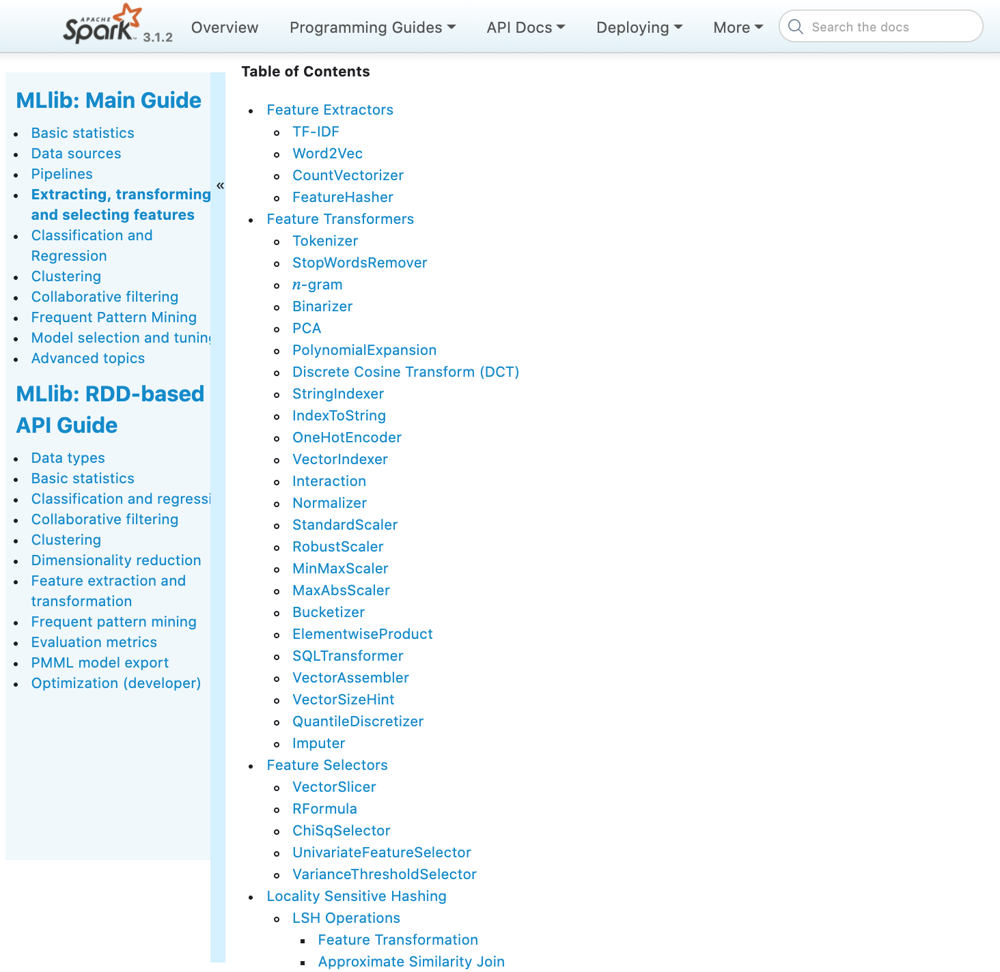
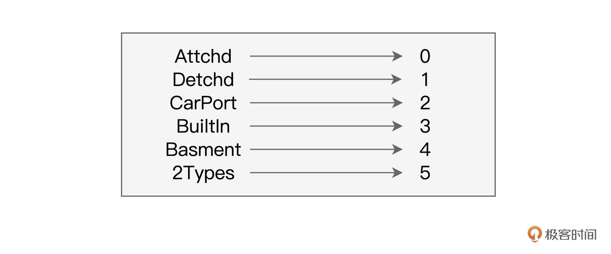
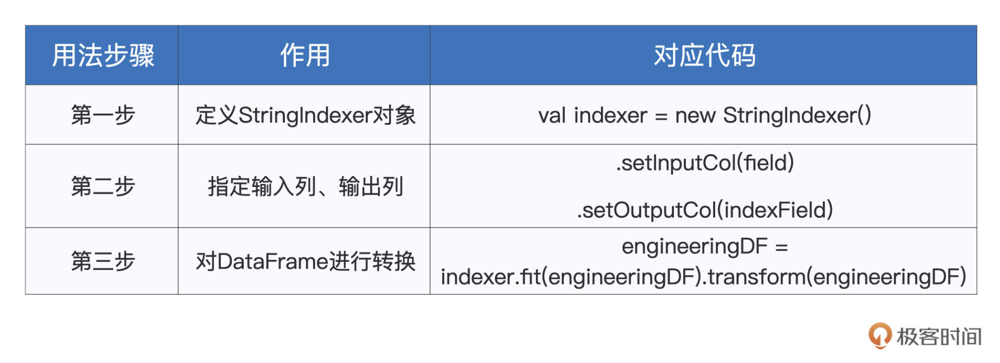
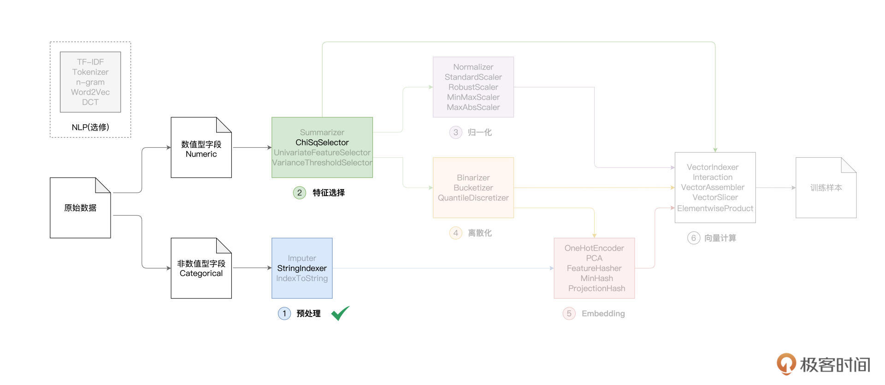
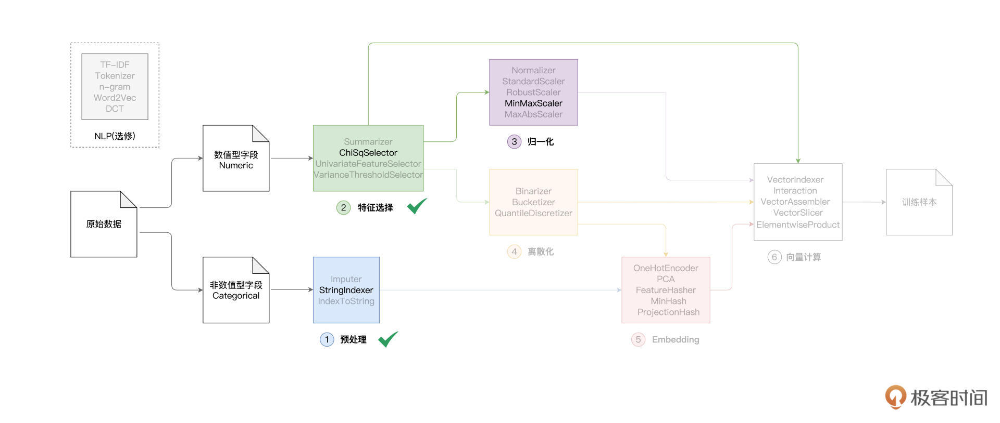
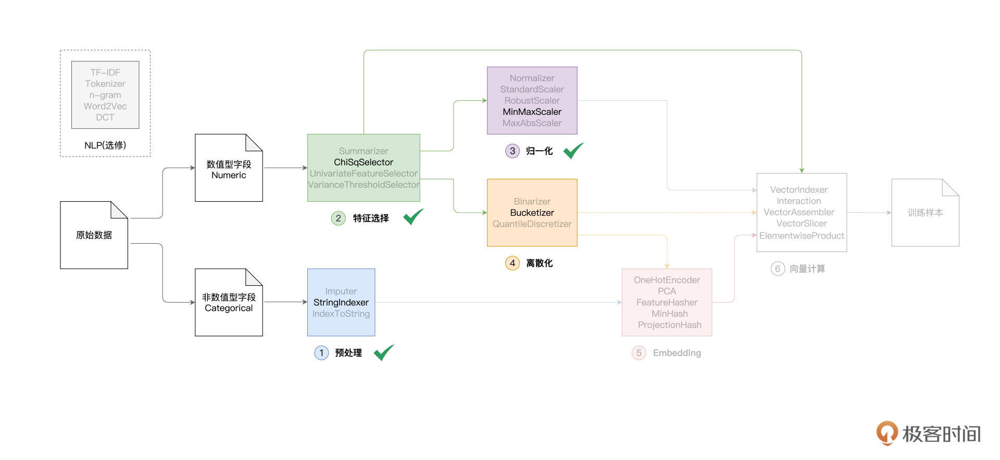

---
date: "2019-06-23"
---  
      
# 24 | 特征工程（上）：有哪些常用的特征处理函数？
你好，我是吴磊。

在上一讲，我们一起构建了一个简单的线性回归模型，来预测美国爱荷华州的房价。从模型效果来看，模型的预测能力非常差。不过，事出有因，一方面线性回归的拟合能力有限，再者，我们使用的特征也是少的可怜。

要想提升模型效果，具体到我们“房价预测”的案例里就是把房价预测得更准，我们需要从特征和模型两个方面着手，逐步对模型进行优化。

在机器学习领域，有一条尽人皆知的“潜规则”：Garbage in，garbage out。它的意思是说，当我们喂给模型的数据是“垃圾”的时候，模型“吐出”的预测结果也是“垃圾”。垃圾是一句玩笑话，实际上，它指的是不完善的特征工程。

特征工程不完善的成因有很多，比如数据质量参差不齐、特征字段区分度不高，还有特征选择不到位、不合理，等等。

作为初学者，我们必须要牢记一点：**特征工程制约着模型效果，它决定了模型效果的上限，也就是“天花板”。而模型调优，仅仅是在不停地逼近这个“天花板”而已**。因此，提升模型效果的第一步，就是要做好特征工程。

为了减轻你的学习负担，我把特征工程拆成了上、下两篇。我会用两讲的内容，带你了解在Spark MLlib的开发框架下，都有哪些完善特征工程的方法。总的来说，我们需要学习6大类特征处理方法，今天这一讲，我们先来学习前3类，下一讲再学习另外3类。

<!-- [[[read_end]]] -->

## 课程安排

打开[Spark MLlib特征工程页面](https://spark.apache.org/docs/latest/ml-features.html)，你会发现这里罗列着数不清的特征处理函数，让人眼花缭乱。作为初学者，看到这么长的列表，更是会感到无所适从。



不过，你别担心，对于列表中的函数，结合过往的应用经验，我会从特征工程的视角出发，把它们分门别类地进行归类。


如图所示，从原始数据生成可用于模型训练的训练样本（这个过程又叫“特征工程”），我们有很长的路要走。通常来说，对于原始数据中的字段，我们会把它们分为数值型（Numeric）和非数值型（Categorical）。之所以要这样区分，原因在于字段类型不同，处理方法也不同。

在上图中，从左到右，Spark MLlib特征处理函数可以被分为如下几类，依次是：

* 预处理
* 特征选择
* 归一化
* 离散化
* Embedding
* 向量计算

除此之外，Spark MLlib还提供了一些用于自然语言处理（NLP，Natural Language Processing）的初级函数，如图中左上角的虚线框所示。作为入门课，这部分不是咱们今天的重点，如果你对NLP感兴趣的话，可以到[官网页面](https://spark.apache.org/docs/latest/ml-features.html)了解详情。

我会从每个分类里各挑选一个最具代表性的函数（上图中字体加粗的函数），结合“房价预测”项目为你深入讲解。至于其他的处理函数，跟同一分类中我们讲到的函数其实是大同小异的。所以，只要你耐心跟着我学完这部分内容，自己再结合官网进一步探索其他处理函数时，也会事半功倍。

## 特征工程

接下来，咱们就来结合上一讲的“房价预测”项目，去探索Spark MLlib丰富而又强大的特征处理函数。

在上一讲，我们的模型只用到了4个特征，分别是"LotArea"，“GrLivArea”，“TotalBsmtSF"和"GarageArea”。选定这4个特征去建模，意味着我们做了一个很强的先验假设：房屋价格仅与这4个房屋属性有关。显然，这样的假设并不合理。作为消费者，在决定要不要买房的时候，绝不会仅仅参考这4个房屋属性。

爱荷华州房价数据提供了多达79个房屋属性，其中一部分是数值型字段，如记录各种尺寸、面积、大小、数量的房屋属性，另一部分是非数值型字段，比如房屋类型、街道类型、建筑日期、地基类型，等等。

显然，房价是由这79个属性当中的多个属性共同决定的。机器学习的任务，就是先找出这些“决定性”因素（房屋属性），然后再用一个权重向量（模型参数）来量化不同因素对于房价的影响。

### 预处理：StringIndexer

由于绝大多数模型（包括线性回归模型）都不能直接“消费”非数值型数据，因此，咱们的第一步，就是把房屋属性中的非数值字段，转换为数值字段。在特征工程中，对于这类基础的数据转换操作，我们统一把它称为预处理。

我们可以利用Spark MLlib提供的StringIndexer完成预处理。顾名思义，StringIndexer的作用是，以数据列为单位，把字段中的字符串转换为数值索引。例如，使用StringIndexer，我们可以把“车库类型”属性GarageType中的字符串转换为数字，如下图所示。



StringIndexer的用法比较简单，可以分为三个步骤：

* 第一步，实例化StringIndexer对象；
* 第二步，通过setInputCol和setOutputCol来指定输入列和输出列；
* 第三步，调用fit和transform函数，完成数据转换。

接下来，我们就结合上一讲的“房价预测”项目，使用StringIndexer对所有的非数值字段进行转换，从而演示并学习它的用法。

首先，我们读取房屋源数据并创建DataFrame。

```
    import org.apache.spark.sql.DataFrame
     
    // 这里的下划线"_"是占位符，代表数据文件的根目录
    val rootPath: String = _
    val filePath: String = s"${rootPath}/train.csv"
     
    val sourceDataDF: DataFrame = spark.read.format("csv").option("header", true).load(filePath)
    

```

然后，我们挑选出所有的非数值字段，并使用StringIndexer对其进行转换。

```
    // 导入StringIndexer
    import org.apache.spark.ml.feature.StringIndexer
     
    // 所有非数值型字段，也即StringIndexer所需的“输入列”
    val categoricalFields: Array[String] = Array("MSSubClass", "MSZoning", "Street", "Alley", "LotShape", "LandContour", "Utilities", "LotConfig", "LandSlope", "Neighborhood", "Condition1", "Condition2", "BldgType", "HouseStyle", "OverallQual", "OverallCond", "YearBuilt", "YearRemodAdd", "RoofStyle", "RoofMatl", "Exterior1st", "Exterior2nd", "MasVnrType", "ExterQual", "ExterCond", "Foundation", "BsmtQual", "BsmtCond", "BsmtExposure", "BsmtFinType1", "BsmtFinType2", "Heating", "HeatingQC", "CentralAir", "Electrical", "KitchenQual", "Functional", "FireplaceQu", "GarageType", "GarageYrBlt", "GarageFinish", "GarageQual", "GarageCond", "PavedDrive", "PoolQC", "Fence", "MiscFeature", "MiscVal", "MoSold", "YrSold", "SaleType", "SaleCondition")
     
    // 非数值字段对应的目标索引字段，也即StringIndexer所需的“输出列”
    val indexFields: Array[String] = categoricalFields.map(_ + "Index").toArray
     
    // 将engineeringDF定义为var变量，后续所有的特征工程都作用在这个DataFrame之上
    var engineeringDF: DataFrame = sourceDataDF
     
    // 核心代码：循环遍历所有非数值字段，依次定义StringIndexer，完成字符串到数值索引的转换
    for ((field, indexField) <- categoricalFields.zip(indexFields)) {
     
    // 定义StringIndexer，指定输入列名、输出列名
    val indexer = new StringIndexer()
    .setInputCol(field)
    .setOutputCol(indexField)
     
    // 使用StringIndexer对原始数据做转换
    engineeringDF = indexer.fit(engineeringDF).transform(engineeringDF)
     
    // 删除掉原始的非数值字段列
    engineeringDF = engineeringDF.drop(field)
    }
    

```

尽管代码看上去很多，但我们只需关注与StringIndexer有关的部分即可。我们刚刚介绍了StringIndexer用法的三个步骤，咱们不妨把这些步骤和上面的代码对应起来，这样可以更加直观地了解StringIndexer的具体用法。



以“车库类型”GarageType字段为例，我们先初始化一个StringIndexer实例。然后，把GarageType传入给它的setInputCol函数。接着，把GarageTypeIndex传入给它的setOutputCol函数。

注意，GarageType是原始字段，也就是engineeringDF这个DataFrame中原本就包含的数据列，而GarageTypeIndex是StringIndexer即将生成的数据列，目前的engineeringDF暂时还不包含这个字段。

最后，我们在StringIndexer之上，依次调用fit和transform函数来生成输出列，这两个函数的参数都是待转换的DataFrame，在我们的例子中，这个DataFrame是engineeringDF。

转换完成之后，你会发现engineeringDF中多了一个新的数据列，也就是GarageTypeIndex这个字段。而这一列包含的数据内容，就是与GarageType数据列对应的数值索引，如下所示。

```
    engineeringDF.select("GarageType", "GarageTypeIndex").show(5)
     
    /** 结果打印
    +----------+---------------+
    |GarageType|GarageTypeIndex|
    +----------+---------------+
    | Attchd| 0.0|
    | Attchd| 0.0|
    | Attchd| 0.0|
    | Detchd| 1.0|
    | Attchd| 0.0|
    +----------+---------------+
    only showing top 5 rows
    */
    

```

可以看到，转换之后GarageType字段中所有的“Attchd”都被映射为0，而所有“Detchd”都被转换为1。实际上，剩余的“CarPort”、“BuiltIn”等字符串，也都被转换成了对应的索引值。

为了对DataFrame中所有的非数值字段都进行类似的处理，我们使用for循环来进行遍历，你不妨亲自动手去尝试运行上面的完整代码，并进一步验证（除GarageType以外的）其他字段的转换也是符合预期的。



好啦，到此为止，我们以StringIndexer为例，跑通了Spark MLlib的预处理环节，拿下了特征工程的第一关，恭喜你！接下来，我们再接再厉，一起去挑战第二道关卡：特征选择。

### 特征选择：ChiSqSelector

特征选择，顾名思义，就是依据一定的标准，对特征字段进行遴选。

以房屋数据为例，它包含了79个属性字段。在这79个属性当中，不同的属性对于房价的影响程度是不一样的。显然，像房龄、居室数量这类特征，远比供暖方式要重要得多。特征选择，就是遴选出像房龄、居室数量这样的关键特征，然后进行建模，而抛弃对预测标的（房价）无足轻重的供暖方式。

不难发现，在刚刚的例子中，我们是根据日常生活经验作为遴选特征字段的标准。**实际上，面对数量众多的候选特征，业务经验往往是特征选择的重要出发点之一**。在互联网的搜索、推荐与广告等业务场景中，我们都会尊重产品经理与业务专家的经验，结合他们的反馈来初步筛选出候选特征集。

**与此同时，我们还会使用一些统计方法，去计算候选特征与预测标的之间的关联性，从而以量化的方式，衡量不同特征对于预测标的重要性**。

统计方法在验证专家经验有效性的同时，还能够与之形成互补，因此，在日常做特征工程的时候，我们往往将两者结合去做特征选择。


业务经验因场景而异，无法概述，因此，咱们重点来说一说可以量化的统计方法。统计方法的原理并不复杂，本质上都是基于不同的算法（如Pearson系数、卡方分布），来计算候选特征与预测标的之间的关联性。不过，你可能会问：“我并不是统计学专业的，做特征选择，是不是还要先去学习这些统计方法呢？”

别担心，其实并不需要。Spark MLlib框架为我们提供了多种特征选择器（Selectors），这些Selectors封装了不同的统计方法。要做好特征选择，我们只需要搞懂Selectors该怎么用，而不必纠结它背后使用的到底是哪些统计方法。

以ChiSqSelector为例，它所封装的统计方法是卡方检验与卡方分布。即使你暂时还不清楚卡方检验的工作原理，也并不影响我们使用ChiSqSelector来轻松完成特征选择。

接下来，咱们还是以“房价预测”的项目为例，说一说ChiSqSelector的用法与注意事项。既然是量化方法，这就意味着Spark MLlib的Selectors只能用于数值型字段。要使用ChiSqSelector来选择数值型字段，我们需要完成两步走：

* 第一步，使用VectorAssembler创建特征向量；
* 第二步，基于特征向量，使用ChiSqSelector完成特征选择。

VectorAssembler原本属于特征工程中向量计算的范畴，不过，在Spark MLlib框架内，很多特征处理函数的输入参数都是特性向量（Feature Vector），比如现在要讲的ChiSqSelector。因此，这里我们先要对VectorAssembler做一个简单的介绍。

VectorAssembler的作用是，把多个数值列捏合为一个特征向量。以房屋数据的三个数值列“LotFrontage”、“BedroomAbvGr”、“KitchenAbvGr”为例，VectorAssembler可以把它们捏合为一个新的向量字段，如下图所示。


VectorAssembler的用法很简单，初始化VectorAssembler实例之后，调用setInputCols传入待转换的数值字段列表（如上图中的3个字段），使用setOutputCol函数来指定待生成的特性向量字段，如上图中的“features”字段。接下来，我们结合代码，来演示VectorAssembler的具体用法。

```
    // 所有数值型字段，共有27个
    val numericFields: Array[String] = Array("LotFrontage", "LotArea", "MasVnrArea", "BsmtFinSF1", "BsmtFinSF2", "BsmtUnfSF", "TotalBsmtSF", "1stFlrSF", "2ndFlrSF", "LowQualFinSF", "GrLivArea", "BsmtFullBath", "BsmtHalfBath", "FullBath", "HalfBath", "BedroomAbvGr", "KitchenAbvGr", "TotRmsAbvGrd", "Fireplaces", "GarageCars", "GarageArea", "WoodDeckSF", "OpenPorchSF", "EnclosedPorch", "3SsnPorch", "ScreenPorch", "PoolArea")
     
    // 预测标的字段
    val labelFields: Array[String] = Array("SalePrice")
     
    import org.apache.spark.sql.types.IntegerType
     
    // 将所有数值型字段，转换为整型Int
    for (field <- (numericFields ++ labelFields)) {
    engineeringDF = engineeringDF.withColumn(s"${field}Int",col(field).cast(IntegerType)).drop(field)
    }
     
    import org.apache.spark.ml.feature.VectorAssembler
     
    // 所有类型为Int的数值型字段
    val numericFeatures: Array[String] = numericFields.map(_ + "Int").toArray
     
    // 定义并初始化VectorAssembler
    val assembler = new VectorAssembler()
    .setInputCols(numericFeatures)
    .setOutputCol("features")
     
    // 在DataFrame应用VectorAssembler，生成特征向量字段"features"
    engineeringDF = assembler.transform(engineeringDF)
    

```

代码内容较多，我们把目光集中到最下面的两行。首先，我们定义并初始化VectorAssembler实例，将包含有全部数值字段的数组numericFeatures传入给setInputCols函数，并使用setOutputCol函数指定输出列名为“features”。然后，通过调用VectorAssembler的transform函数，完成对engineeringDF的转换。

转换完成之后，engineeringDF就包含了一个字段名为“features”的数据列，它的数据内容，就是拼接了所有数值特征的特征向量。

好啦，特征向量准备完毕之后，我们就可以基于它来做特征选择了。还是先上代码。

```
    import org.apache.spark.ml.feature.ChiSqSelector
    import org.apache.spark.ml.feature.ChiSqSelectorModel
     
    // 定义并初始化ChiSqSelector
    val selector = new ChiSqSelector()
    .setFeaturesCol("features")
    .setLabelCol("SalePriceInt")
    .setNumTopFeatures(20)
     
    // 调用fit函数，在DataFrame之上完成卡方检验
    val chiSquareModel = selector.fit(engineeringDF)
     
    // 获取ChiSqSelector选取出来的入选特征集合（索引）
    val indexs: Array[Int] = chiSquareModel.selectedFeatures
     
    import scala.collection.mutable.ArrayBuffer
     
    val selectedFeatures: ArrayBuffer[String] = ArrayBuffer[String]()
     
    // 根据特征索引值，查找数据列的原始字段名
    for (index <- indexs) {
    selectedFeatures += numericFields(index)
    }
    

```

首先，我们定义并初始化ChiSqSelector实例，分别通过setFeaturesCol和setLabelCol来指定特征向量和预测标的。毕竟，ChiSqSelector所封装的卡方检验，需要将特征与预测标的进行关联，才能量化每一个特征的重要性。

接下来，对于全部的27个数值特征，我们需要告诉ChiSqSelector要从中选出多少个进行建模。这里我们传递给setNumTopFeatures的参数是20，也就是说，ChiSqSelector需要帮我们从27个特征中，挑选出对房价影响最重要的前20个特征。

ChiSqSelector实例创建完成之后，我们通过调用fit函数，对engineeringDF进行卡方检验，得到卡方检验模型chiSquareModel。访问chiSquareModel的selectedFeatures变量，即可获得入选特征的索引值，再结合原始的数值字段数组，我们就可以得到入选的原始数据列。

听到这里，你可能已经有点懵了，不要紧，结合下面的示意图，你可以更加直观地熟悉ChiSqSelector的工作流程。这里我们还是以“LotFrontage”、“BedroomAbvGr”、“KitchenAbvGr”这3个字段为例，来进行演示。


可以看到，对房价来说，ChiSqSelector认为前两个字段比较重要，而厨房个数没那么重要。因此，在selectedFeatures这个数组中，ChiSqSelector记录了0和1这两个索引，分别对应着原始的“LotFrontage”和“BedroomAbvGr”这两个字段。



好啦，到此为止，我们以ChiSqSelector为代表，学习了Spark MLlib框架中特征选择的用法，打通了特征工程的第二关。接下来，我们继续努力，去挑战第三道关卡：归一化。

### 归一化：MinMaxScaler

归一化（Normalization）的作用，是把一组数值，统一映射到同一个值域，而这个值域通常是\[0, 1\]。也就是说，不管原始数据序列的量级是105，还是10-5，归一化都会把它们统一缩放到\[0, 1\]这个范围。

这么说可能比较抽象，我们拿“LotArea”、“BedroomAbvGr”这两个字段来举例。其中，“LotArea”的含义是房屋面积，它的单位是平方英尺，量级在105，而“BedroomAbvGr”的单位是个数，它的量级是101。

假设我们采用Spark MLlib提供的MinMaxScaler对房屋数据做归一化，那么这两列数据都会被统一缩放到\[0, 1\]这个值域范围，从而抹去单位不同带来的量纲差异。

你可能会问：“为什么要做归一化呢？去掉量纲差异的动机是什么呢？原始数据它不香吗？”

原始数据很香，但原始数据的量纲差异不香。**当原始数据之间的量纲差异较大时，在模型训练的过程中，梯度下降不稳定、抖动较大，模型不容易收敛，从而导致训练效率较差。相反，当所有特征数据都被约束到同一个值域时，模型训练的效率会得到大幅提升**。关于模型训练与模型调优，我们留到下一讲再去展开，这里你先理解归一化的必要性即可。

既然归一化这么重要，那具体应该怎么实现呢？其实很简单，只要一个函数就可以搞定。

Spark MLlib支持多种多样的归一化函数，如StandardScaler、MinMaxScaler，等等。尽管这些函数的算法各有不同，但效果都是一样的。

我们以MinMaxScaler为例看一看，对于任意的房屋面积ei，MinMaxScaler使用如下公式来完成对“LotArea”字段的归一化。


其中，max和min分别是目标值域的上下限，默认为1和0，换句话说，目标值域为\[0, 1\]。而Emax和Emin分别是“LotArea”这个数据列中的最大值和最小值。使用这个公式，MinMaxScaler就会把“LotArea”中所有的数值都映射到\[0, 1\]这个范围。

接下来，我们结合代码，来演示MinMaxScaler的具体用法。

与很多特征处理函数（如刚刚讲过的ChiSqSelector）一样，MinMaxScaler的输入参数也是特征向量，因此，MinMaxScaler的用法，也分为两步走：

 *    第一步，使用VectorAssembler创建特征向量；
 *    第二步，基于特征向量，使用MinMaxScaler完成归一化。

```
    // 所有类型为Int的数值型字段
    // val numericFeatures: Array[String] = numericFields.map(_ + "Int").toArray
     
    // 遍历每一个数值型字段
    for (field <- numericFeatures) {
     
    // 定义并初始化VectorAssembler
    val assembler = new VectorAssembler()
    .setInputCols(Array(field))
    .setOutputCol(s"${field}Vector")
     
    // 调用transform把每个字段由Int转换为Vector类型
    engineeringData = assembler.transform(engineeringData)
    }
    

```

在第一步，我们使用for循环遍历所有数值型字段，依次初始化VectorAssembler实例，把字段由Int类型转为Vector向量类型。接下来，在第二步，我们就可以把所有向量传递给MinMaxScaler去做归一化了。可以看到，MinMaxScaler的用法，与StringIndexer的用法很相似。

```
    import org.apache.spark.ml.feature.MinMaxScaler
     
    // 锁定所有Vector数据列
    val vectorFields: Array[String] = numericFeatures.map(_ + "Vector").toArray
     
    // 归一化后的数据列
    val scaledFields: Array[String] = vectorFields.map(_ + "Scaled").toArray
     
    // 循环遍历所有Vector数据列
    for (vector <- vectorFields) {
     
    // 定义并初始化MinMaxScaler
    val minMaxScaler = new MinMaxScaler()
    .setInputCol(vector)
    .setOutputCol(s"${vector}Scaled")
    // 使用MinMaxScaler，完成Vector数据列的归一化
    engineeringData = minMaxScaler.fit(engineeringData).transform(engineeringData)
    }
    

```

首先，我们创建一个MinMaxScaler实例，然后分别把原始Vector数据列和归一化之后的数据列，传递给函数setInputCol和setOutputCol。接下来，依次调用fit与transform函数，完成对目标字段的归一化。

这段代码执行完毕之后，engineeringData（DataFrame）就包含了多个后缀为“Scaled”的数据列，这些数据列的内容，就是对应原始字段的归一化数据，如下所示。


好啦，到此为止，我们以MinMaxScaler为代表，学习了Spark MLlib框架中数据归一化的用法，打通了特征工程的第三关。



## 重点回顾

好啦，今天的内容讲完啦，我们一起来做个总结。今天这一讲，我们主要围绕特征工程展开，你需要掌握特征工程不同环节的特征处理方法，尤其是那些最具代表性的特征处理函数。

从原始数据到生成训练样本，特征工程可以被分为如下几个环节，我们今天重点讲解了其中的前三个环节，也就是预处理、特征选择和归一化。


针对不同环节，Spark MLlib框架提供了丰富的特征处理函数。作为预处理环节的代表，StringIndexer负责对非数值型特征做初步处理，将模型无法直接消费的字符串转换为数值。

**特征选择的动机，在于提取与预测标的关联度更高的特征，从而精简模型尺寸、提升模型泛化能力**。特征选择可以从两方面入手，业务出发的专家经验和基于数据的统计分析。


Spark MLlib基于不同的统计方法，提供了多样的特征选择器（Feature Selectors），其中ChiSqSelector以卡方检验为基础，选择相关度最高的前N个特征。

**归一化的目的，在于去掉不同特征之间量纲的影响，避免量纲不一致而导致的梯度下降震荡、模型收敛效率低下等问题**。归一化的具体做法，是把不同特征都缩放到同一个值域。在这方面，Spark MLlib提供了多种归一化方法供开发者选择。

在下一讲，我们将继续离散化、Embedding和向量计算这3个环节的学习，最后还会带你整体看一下各环节优化过后的模型效果，敬请期待。

## 每课一练

对于我们今天讲解的特征处理函数，如StringIndexer、ChiSqSelector、MinMaxScaler，你能说说它们之间的区别和共同点吗？

欢迎你在留言区跟我交流互动，也推荐你把今天的内容转发给更多同事和朋友，跟他一起交流特征工程相关的内容。