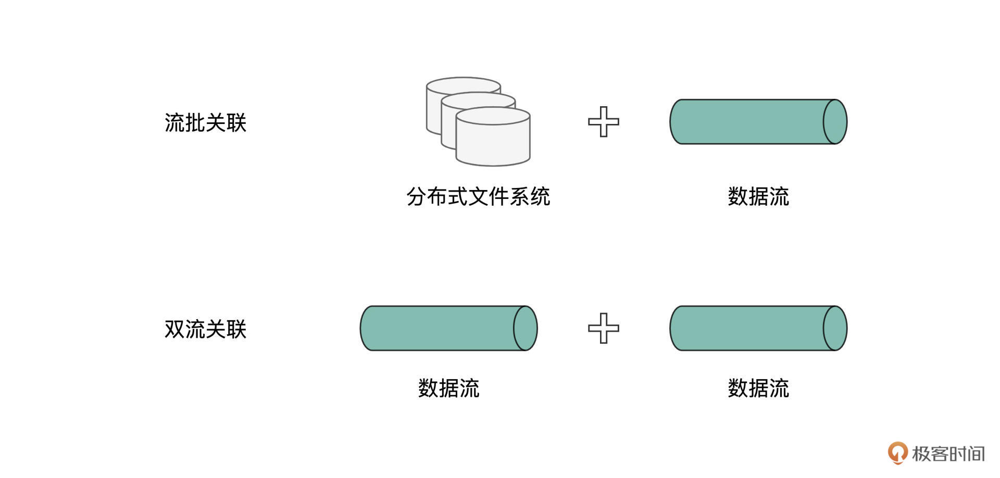
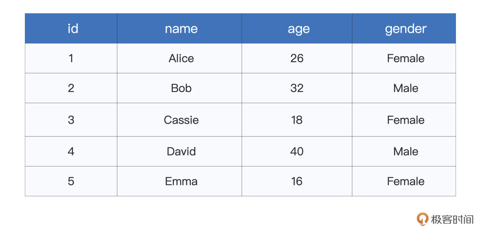
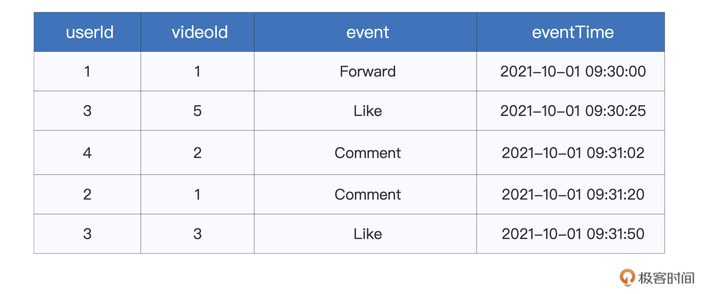
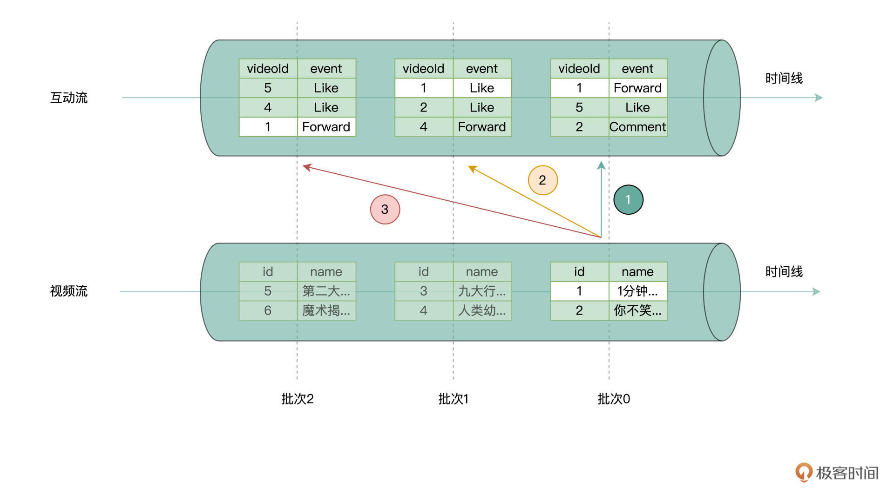

---
date: "2019-06-23"
---  
      
# 33｜流计算中的数据关联：流与流、流与批
你好，我是吴磊。

在上一讲，我们提到，Structured Streaming会复用Spark SQL所提供的一切数据处理能力，比如数据抽取、过滤、分组聚合、关联、排序，等等。不过，在这些常规的数据处理类型中，有一类操作需要我们特别关注，它就是数据关联（Joins）。

这主要是出于两方面的原因，一来，数据关联的应用非常普遍，可以说是数据应用中“出场率”最高的操作类型之一；再者，与批处理中的数据关联不同，流计算中的数据关联，还需要考虑到流处理过程中固有的一些限制，比如说时间窗口、数据延迟容忍度、输出模式，等等。

因此，今天这一讲，我们专门来说一说Structured Streaming中的数据关联。我们先盘点好Structured Streaming的技能树，看看它都支持哪些种类的数据关联。之后再用一个短视频推荐的例子上手试验一下，总结出不同类型数据关联的适用场景以及注意事项。

## 流计算中的数据关联

我们知道，如果按照关联形式来划分的话，数据关联可以分为Inner Join、Left Join、Right Join、Semi Join、Anti Join，等等。如果按照实现方式来划分的话，可以分为Nested Loop Join、Sort Merge Join和Hash Join。而如果考虑分布式环境下数据分发模式的话，Join又可以分为Shuffle Join和Broadcast Join。

<!-- [[[read_end]]] -->

对于上述的3种分类标准，它们之间是相互正交的，我们在Spark SQL学习模块介绍过它们各自的适用场景与优劣势（记不清的可以回顾第[17](https://time.geekbang.org/column/article/427470)、[18](https://time.geekbang.org/column/article/428259)讲）。

而在流计算的场景下，按照数据来源的不同，数据关联又可以分为“流批关联”与“双流关联”。所谓“流批关联”（Stream-Static Join），它指的是，参与关联的一张表，来自离线批数据，而另一张表的来源，是实时的数据流。换句话说，动态的实时数据流可以与静态的离线数据关联在一起，为我们提供多角度的数据洞察。

而“双流关联”（Stream-Stream Join），顾名思义，它的含义是，参与关联的两张表，都来自于不同的数据流，属于动态数据与动态数据之间的关联计算，如下图所示。



显然，相对于关联形式、实现方式和分发模式，数据来源的分类标准与前三者也是相互正交的。我们知道，基于前3种分类标准，数据关联已经被划分得足够细致。再加上一种正交的分类标准，数据关联的划分，只会变得更为精细。

更让人头疼的是，在Structured Streaming流计算框架下，“流批关联”与“双流关联”，对于不同的关联形式，有着不同的支持与限制。而这，也是我们需要特别关注流处理中数据关联的原因之一。

接下来，我们就分别对“流批关联”和“双流关联”进行展开，说一说它们支持的功能与特性，以及可能存在的限制。本着由简入难的原则，我们先来介绍“流批关联”，然后再去说“双流关联”。

## 流批关联

为了更好地说明流批关联，咱们不妨从一个实际场景入手。在短视频流行的当下，推荐引擎扮演着极其重要的角色，而要想达到最佳的推荐效果，推荐引擎必须依赖用户的实时反馈。

所谓实时反馈，其实就是我们习以为常的点赞、评论、转发等互动行为，不过，这里需要突出的，是一个“实时性”、或者说“及时性”。毕竟，在选择越来越多的今天，用户的兴趣与偏好，也在随着时间而迁移、变化，捕捉用户最近一段时间的兴趣爱好更加重要。

假设，现在我们需要把离线的用户属性和实时的用户反馈相关联，从而建立用户特征向量。显然，在这个特征向量中，我们既想包含用户自身的属性字段，如年龄、性别、教育背景、职业，等等，更想包含用户的实时互动信息，比如1小时内的点赞数量、转发数量，等等，从而对用户进行更为全面的刻画。

一般来说，实时反馈来自线上的数据流，而用户属性这类数据，往往存储在离线数据仓库或是分布式文件系统。因此，用户实时反馈与用户属性信息的关联，正是典型的流批关联场景。

那么，针对刚刚说的短视频场景，我们该如何把离线用户属性与线上用户反馈“合二为一”呢？为了演示流批关联的过程与用法，咱们自然需要事先把离线数据与线上数据准备好。本着一切从简的原则，让你仅用笔记本电脑就能复现咱们课程中的实例，这里我们使用本地文件系统来存放离线的用户属性。

而到目前为止，对于数据流的生成，我们仅演示过Socket的用法。实际上，除了用于测试的Socket以外，Structured Streaming还支持Kafka、文件等Source作为数据流的来源。为了尽可能覆盖更多知识点，这一讲咱们不妨通过文件的形式来模拟线上的用户反馈。

还记得吗？Structured Streaming通过readStream API来创建各式各样的数据流。要以文件的方式创建数据流，我们只需将文件格式传递给format函数，然后启用相应的option即可，如下所示。关于readStream API的一般用法，你可以回顾“流动的Word Count”（[第30讲](https://time.geekbang.org/column/article/446691)）。

```
    var streamingDF: DataFrame = spark.readStream
    .format("csv")
    .option("header", true)
    .option("path", s"${rootPath}/interactions")
    .schema(actionSchema)
    .load
    

```

对于这段代码片段来说，需要你特别注意两个地方。一个是format函数，它的形参是各式各样的文件格式，如CSV、Parquet、ORC，等等。第二个地方，是指定监听地址的option选项，也就是option\(“path”, s"\$\{rootPath\}/interactions"\)。

该选项指定了Structured Streaming需要监听的文件系统目录，一旦有新的数据内容进入该目录，Structured Streaming便以流的形式，把新数据加载进来。

需要说明的是，上面的代码并不完整，目的是让你先对文件形式的Source建立初步认识。随着后续讲解的推进，待会我们会给出完整版代码，并详细讲解其中的每一步。

要用文件的形式模拟数据流的生成，我们只需将包含用户互动行为的文件，依次拷贝到Structured Streaming的监听目录即可，在我们的例子中，也就是interactions目录。


如上图的步骤1所示，我们事先把用户反馈文件，保存到临时的staging目录中，然后依次把文件拷贝到interactions目录，即可模拟数据流的生成。而用户属性信息本身就是离线数据，因此，我们把相关数据文件保存到userProfile目录即可，如图中步骤3所示。

对于上面的流批关联计算过程，在给出代码实现之前，咱们不妨先来了解一下数据，从而更好地理解后续的代码内容。离线的用户属性比较简单，仅包含id、name、age与gender四个字段，文件内容如下所示。



线上的用户反馈相对复杂一些，分别包含userId、videoId、event、eventTime等字段。前两个字段分别代表用户ID与短视频ID，而event是互动类型，包括Like（点赞）、Comment（评论）、Forward（转发）三个取值，eventTime则代表产生互动的时间戳，如下所示。



除了上面的interactions0.csv以外，为了模拟数据流的生成，我还为你准备了interactions1.csv、interactions2.csv两个文件，它们的Schema与interactions0.csv完全一致，内容也大同小异。对于这3个文件，我们暂时把它们缓存在staging目录下。

好啦，数据准备好之后，接下来，我们就可以从批数据与流数据中创建DataFrame，并实现两者的关联，达到构建用户特征向量的目的。首先，我们先来加载数据。

```
    import org.apache.spark.sql.DataFrame
    import org.apache.spark.sql.types.StructType
     
    // 保存staging、interactions、userProfile等文件夹的根目录
    val rootPath: String = _
     
    // 使用read API读取离线数据，创建DataFrame
    val staticDF: DataFrame = spark.read
    .format("csv")
    .option("header", true)
    .load(s"${rootPath}/userProfile/userProfile.csv")
     
    // 定义用户反馈文件的Schema
    val actionSchema = new StructType()
    .add("userId", "integer")
    .add("videoId", "integer")
    .add("event", "string")
    .add("eventTime", "timestamp")
     
    // 使用readStream API加载数据流，注意对比readStream API与read API的区别与联系
    var streamingDF: DataFrame = spark.readStream
    // 指定文件格式
    .format("csv")
    .option("header", true)
    // 指定监听目录
    .option("path", s"${rootPath}/interactions")
    // 指定数据Schema
    .schema(actionSchema)
    .load
    

```

为了方便你把代码与计算流程对应上，这里我再一次把流批关联示意图贴在了下面。上述代码，对应的是下图中的步骤2与步骤3，也就是流数据与批数据的加载。


从代码中，我们不难发现，readStream API与read API的用法，几乎如出一辙，不仅如此，二者的返回类型都是DataFrame。因此，流批关联在用法上，与普通的DataFrame之间的关联，看上去并没有什么不同，如下所示。

```
    // 互动数据分组、聚合，对应流程图中的步骤4
    streamingDF = streamingDF
    // 创建Watermark，设置最大容忍度为30分钟
    .withWatermark("eventTime", "30 minutes")
    // 按照时间窗口、userId与互动类型event做分组
    .groupBy(window(col("eventTime"), "1 hours"), col("userId"), col("event"))
    // 记录不同时间窗口，用户不同类型互动的计数
    .count
     
    /**
    流批关联，对应流程图中的步骤5
    可以看到，与普通的两个DataFrame之间的关联，看上去没有任何差别
    */
    val jointDF: DataFrame = streamingDF.join(staticDF, streamingDF("userId") === staticDF("id"))
    

```

除了在用法上没有区别以外，普通DataFrame数据关联中适用的优化方法，同样适用于流批关联。比方说，对于streamingDF来说，它所触发的每一个Micro-batch，都会扫描一次staticDF所封装的离线数据。

显然，在执行效率方面，这并不是一种高效的做法。结合Spark SQL模块学到的Broadcast Join的优化方法，我们完全可以在staticDF之上创建广播变量，然后把流批关联原本的Shuffle Join转变为Broadcast Join来提升执行性能。这个优化技巧仅涉及几行代码的修改，因此，我把它留给你作为课后作业去练习。

完成流批关联之后，我们还需要把计算结果打印到终端，Console是Structured Streaming支持的Sink之一，它可以帮我们确认计算结果与预期是否一致，如下所示。

```
    jointDF.writeStream
    // 指定Sink为终端（Console）
    .format("console")
    // 指定输出选项
    .option("truncate", false)
    // 指定输出模式
    .outputMode("update")
    // 启动流处理应用
    .start()
    // 等待中断指令
    .awaitTermination()
    

```

上面这段代码，想必你并不陌生，咱们在之前的几讲中，都是指定Console为输出Sink，这里的操作没什么不同。

好啦，到此为止，流批关联实例的完整代码就是这些了。接下来，让我们把代码敲入本地环境的spark-shell，然后依次把staging文件夹中的interactions\*.csv拷贝到interactions目录之下，来模拟数据流的生成，从而触发流批关联的计算。代码与数据的全部内容，你可以通过这里的[GitHub地址](https://github.com/wulei-bj-cn/learn-spark/tree/main/chapter33)进行下载。

这里，我贴出部分计算结果供你参考。下面的截图，是我们把interactions0.csv文件拷贝到interactions目录之后得到的结果，你可以在你的环境下去做验证，同时继续把剩下的两个文件拷贝到监听目录，来进一步观察流批关联的执行效果。


## 双流关联

了解了流批关联之后，我们再来说说“双流关联”。显然，与流批关联相比，双流关联最主要的区别是数据来源的不同。除此之外，在双流关联中，**事件时间的处理尤其关键**。为什么这么说呢？

学过上一讲之后，我们知道，在源源不断的数据流当中，总会有Late Data产生。Late Data需要解决的主要问题，就是其是否参与当前批次的计算。

毫无疑问，数据关联是一种最为常见的计算。因此，在双流关联中，我们应该利用Watermark机制，明确指定两条数据流各自的Late Data“容忍度”，从而避免Structured Streaming为了维护状态数据而过度消耗系统资源。Watermark的用法很简单，你可以通过回顾[上一讲](https://time.geekbang.org/column/article/450916)来进行复习。

说到这里，你可能会问：“什么是状态数据？而维护状态数据，又为什么会过度消耗系统资源呢？”一图胜千言，咱们不妨通过下面的示意图，来说明状态数据的维护，会带来哪些潜在的问题和隐患。



假设咱们有两个数据流，一个是短视频发布的数据流，其中记录着短视频相关的元信息，如ID、Name等等。另一个数据流是互动流，也就是用户对于短视频的互动行为。其实在刚刚的流批关联例子中，我们用到数据流也是互动流，这个你应该不会陌生。

现在，我们想统计短视频在发布一段时间（比如1个小时、6个小时、12个小时，等等）之后，每个短视频的热度。所谓热度，其实就是转评赞等互动行为的统计计数。

要做到这一点，咱们可以先根据短视频ID把两个数据流关联起来，然后再做统计计数。上图演示的是，两条数据流在Micro-batch模式下的关联过程。为了直击要点，咱们把注意力放在ID=1的短视频上。

显然，在视频流中，短视频的发布有且仅有一次，即便是内容完全相同的短视频，在数据的记录上也会有不同的ID值。而在互动流中，ID=1的数据条目会有多个，而且会分布在不同的Micro-batch中。事实上，只要视频没有下线，随着时间的推移，互动流中总会夹带着ID=1的互动行为数据。

为了让视频流中ID=1的记录，能够与互动流的数据关联上，我们需要一直把视频流中批次0的全部内容，缓存在内存中，从而去等待“迟到”的ID=1的互动流数据。像视频流这种，**为了后续计算而不得不缓存下来的数据，我们就把它称作为“状态数据”**。显然，状态数据在内存中积压的越久、越多，内存的压力就越大。

在双流关联中，除了要求两条数据流要添加Watermark机之外，为了进一步限制状态数据的尺寸，Structured Streaming还要求在关联条件中，对于事件时间加以限制。这是什么意思呢？咱们还是结合视频流与互动流的示例，通过代码来解读。

```
    import org.apache.spark.sql.DataFrame
    import org.apache.spark.sql.types.StructType
     
    // 保存staging、interactions、userProfile等文件夹的根目录
    val rootPath: String = _
     
    // 定义视频流Schema
    val postSchema = new StructType().add("id", "integer").add("name", "string").add("postTime", "timestamp")
    // 监听videoPosting目录，以实时数据流的方式，加载新加入的文件
    val postStream: DataFrame = spark.readStream.format("csv").option("header", true).option("path", s"${rootPath}/videoPosting").schema(postSchema).load
    // 定义Watermark，设置Late data容忍度
    val postStreamWithWatermark = postStream.withWatermark("postTime", "5 minutes")
     
    // 定义互动流Schema
    val actionSchema = new StructType().add("userId", "integer").add("videoId", "integer").add("event", "string").add("eventTime", "timestamp")
    // 监听interactions目录，以实时数据流的方式，加载新加入的文件
    val actionStream: DataFrame = spark.readStream.format("csv").option("header", true).option("path", s"${rootPath}/interactions").schema(actionSchema).load
    // 定义Watermark，设置Late data容忍度
    val actionStreamWithWatermark = actionStream.withWatermark("eventTime", "1 hours")
     
    // 双流关联
    val jointDF: DataFrame = actionStreamWithWatermark
    .join(postStreamWithWatermark,
    expr("""
    // 设置Join Keys
    videoId = id AND
    // 约束Event time
    eventTime >= postTime AND
    eventTime <= postTime + interval 1 hour
    """))
    

```

代码的前两部分比较简单，分别是从监听文件夹读取新增的文件内容，依次创建视频流和互动流，并在两条流上设置Watermark机制。这些内容之前已经学过，不再重复，咱们把重点放在最后的双流关联代码上。

可以看到，在关联条件中，除了要设置关联的主外键之外，还必须要对两张表各自的事件时间进行约束。其中，postTime是视频流的事件时间，而eventTime是互动流的事件时间。上述代码的含义是，对于任意发布的视频流，我们只关心它一小时以内的互动行为，一小时以外的互动数据，将不再参与关联计算。

这样一来，**在Watermark机制的“保护”之下，事件时间的限制进一步降低了状态数据需要在内存中保存的时间，从而降低系统资源压力**。简言之，对于状态数据的维护，有了Watermark机制与事件时间的限制，可谓是加了“双保险”。

## 重点回顾

好啦，到这里，我们今天的内容就讲完啦，咱们一起来做个总结。首先，我们要知道，根据数据流的来源不同，Structured Streaming支持“流批关联”和“双流关联”两种关联模式。

流批关联统一了流处理与批处理，二者的统一，使得Structured Streaming有能力服务于更广泛的业务场景。流批关联的用法相对比较简单，通过readStream API与read API分别读取实时流数据与离线数据，然后按照一般Join语法完成数据关联。

在今天的演示中，我们用到了File这种形式的Source，你需要掌握File Source的一般用法。具体来说，你需要通过readStream API的format函数来指定文件格式，然后通过option指定监听目录。一旦有新的文件移动到监听目录，Spark便以数据流的形式加载新数据。

对于双流关联来说，我们首先需要明白，在这种模式下，Structured Streaming需要缓存并维护状态数据。**状态数据的维护，主要是为了保证计算逻辑上的一致性**。为了让满足条件的Late data同样能够参与计算，Structured Streaming需要一直在内存中缓存状态数据。毫无疑问，状态数据的堆积，会对系统资源带来压力与隐患。

为了减轻这样的压力与隐患，在双流关联中，一来，我们应该对参与关联的两条数据流设置Watermark机制，再者，在语法上，Structured Streaming在关联条件中，会强制限制事件时间的适用范围。在这样的“双保险”机制下，开发者即可将状态数据维护带来的性能隐患限制在可控的范围内，从而在实现业务逻辑的同时，保证应用运行稳定。

## 课后练习题

今天的题目有两道。

第一道题目是，我在流批关联那里用interactions0.csv文件给你演示了数据关联操作/请你动手在你的环境下去做验证，同时继续把剩下的两个文件（interactions1.csv、interactions2.csv两个文件）拷贝到监听目录，来进一步观察流批关联的执行效果。

第二道题目是，在双流关联中，我们需要Watermark和关联条件，来同时约束状态数据维护的成本与开销。那么，在流批关联中，我们是否也需要同样的约束呢？为什么？

欢迎你在留言区跟我交流互动，也推荐你把这一讲分享给更多同事、朋友。