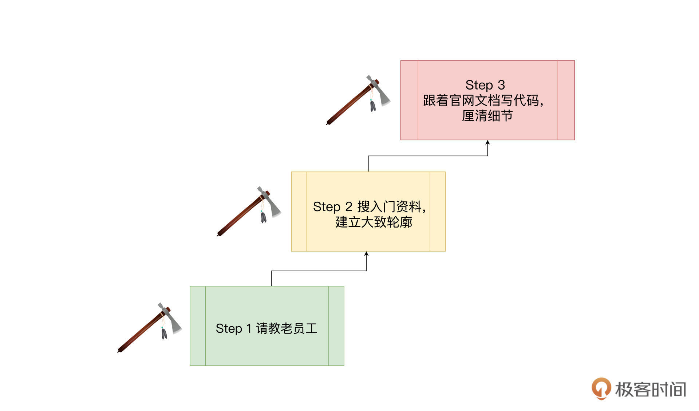
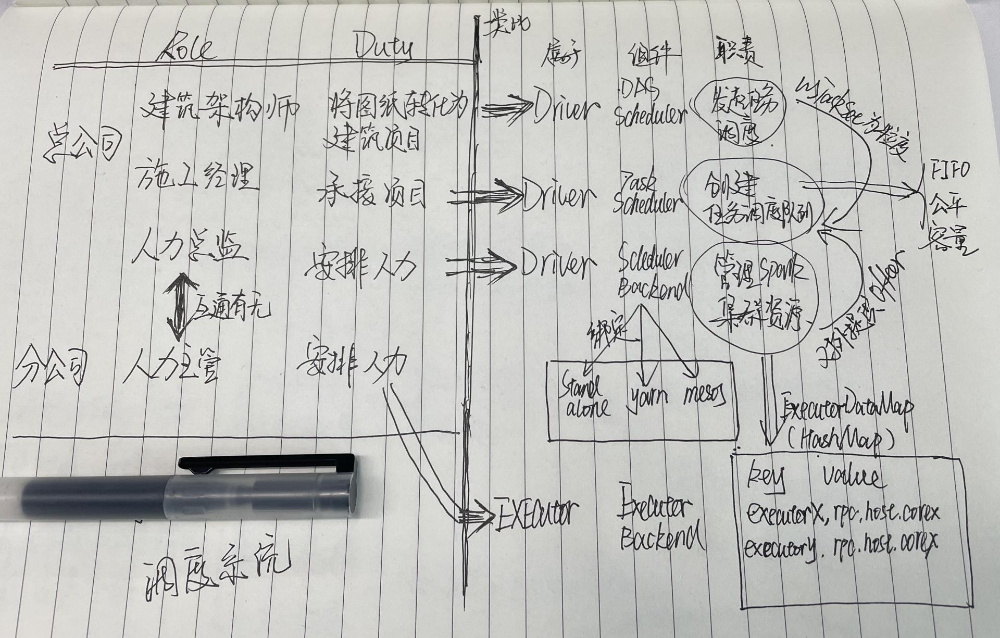
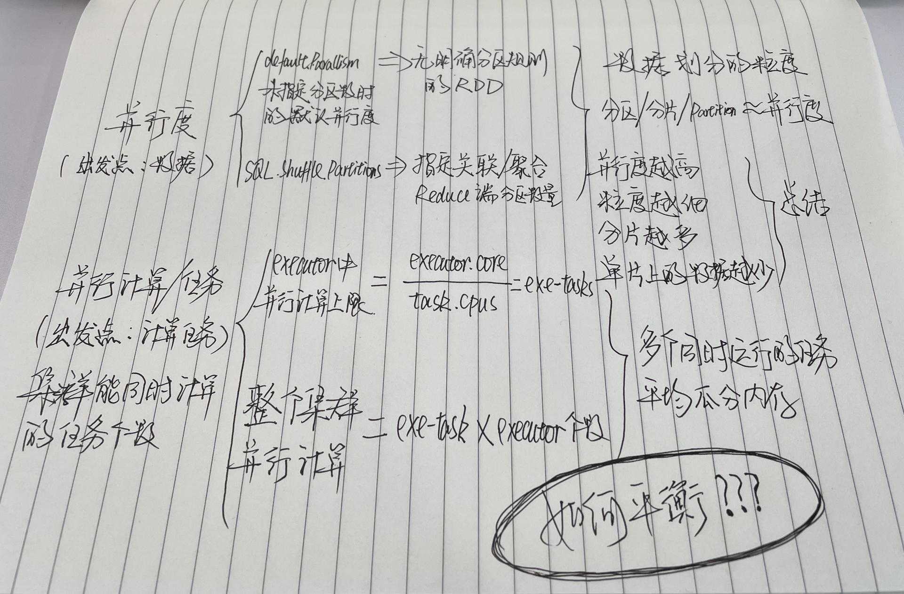
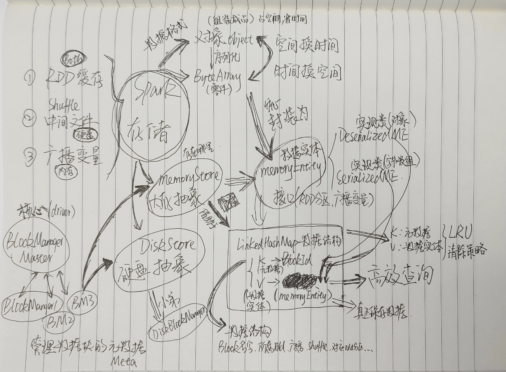

---
date: "2019-06-23"
---  
      
# 用户故事 | 小王：保持空杯心态，不做井底之蛙
你好，我是小王，是一名大数据开发者，目前在一家通信运营商公司从事开发与运维工作，从业已4年有余。

从我的经验看，如果某位工程师从事的不是大数据底层开发或顶层架构，而是业务开发，那么这位工程师所用到的大数据框架，主要分为三大块：数据采集、数据存储、数据计算。

而这些框架中，出镜率很高，生态发展很繁荣，而且工作中常用，面试中常问的框架，Apache Spark也必然数一数二。

### 我之前是如何学习Spark的？

作为平平无奇的普通开发者，我平时学习新东西的套路，总结起来就是三板斧：第一步，先请教老员工这个框架在架构图中的所处位置和核心作用；第二步，去网上找入门视频或博客资料，快速刷完，在心中描绘出一个大致轮廓，做到心中有数；第三步，去官网细读文档，跟着文档写代码，在代码中梳理开发流程和弄清细节。

我之前学习Spark也是用这种三板斧的思路来学习的。正如专栏的[开篇词](https://time.geekbang.org/column/article/415208)所说，我在“经过短短3个月的强化练习之后，已经能够独当一面，熟练地实现各式各样的业务需求。而这，自然要归功于 Spark 框架本身超高的开发效率”。

到这里，我自认为我已经是一名Spark初级工程师了。在我通读了Spark官网文档并付诸代码后，我甚至以Spark中级工程师自居了。

<!-- [[[read_end]]] -->

最近我通过考核，成为了公司的内训师，公司为了实现经验沉淀和知识共享，内训师们需要录制结合公司业务的实战课程。

为了不误人子弟，我意识到自己还得好好巩固下自己的Spark知识。这里不得不说到前面三板斧的第二步，也就是刷资料这步是相对坎坷的。尽管网上的资料林林总总，内容虽多，但“天下文章一大抄”，不同的博客网站里总能看到一模一样的文章。有的文章作者水平一般，讲得读者昏昏欲睡事小，给读者灌输了错误知识事大。

所以在这个过程中，想找到优质的资料相对较难，费力劳心。幸运的是遇到了这个专栏，其中的内容也超出了我的预期，给我带来了很多启发。

### 学习专栏有什么收获？

在仔细研读了《零基础入门Spark》专栏后，我才发现我错得离谱，我可能离“初级”都还差得远呢。在阅读此专栏的过程中，“这就触及我的知识盲区了”这个表情包不停地在我脑海中闪现。

天呐，发现自己的盲区让我心中一紧，感叹“基础不牢，地动山摇”。

因为我从来没有思考过RDD与数组的异同，而将新知识与熟悉的知识做对比，往往是get新知识的捷径；我也从来没有将算子分门别类地分组整理过，其实做好整理，可以让你在开发时不假思索、信手拈来；我也从来没试过对RDD的重要属性，DAG计算流图做生活化联想，而这个技巧可以延长我们的记忆曲线，尤其适合记忆这类概念性知识点……

通过这个专栏，这些从没深入思考过的点逐渐被点亮。除了新知识的理解，**Spark的几大核心系统**也相当重要。

比如，调度系统的流转过程及其三大组件的各自职责，这部分内容掌握了，我们才能把握住分布式计算的精髓。再比如说内存、存储系统，把这些组件吃透，也正好是我们写出高性能代码的重要前提。

要想自己独自弄明白这些重要的点，最直接的方法自然是阅读源码。但是对于资质平平无奇的我来说，阅读源码可谓是“蜀道难”。不过面对这样的困难，这个专栏刚好提供了很有效的学习线索，仿佛武当梯云纵，让我们更有可能登高望远。

在这个专栏里，吴老师并没有像其他课程那样，按照Spark的模块按部就班地讲述，而是通过一个入门case，去将底层知识串联起来讲述，**以高屋建瓴之势，述底层架构之蓝图**。别担心听不懂，因为吴老师对这些知识点做了生活化联想，对应到工厂流水线、对应到建筑工地，寓教于乐。

不要小看类比、联想的威力，相比干涩的名词，生活化联想可以有效规避死记硬背，让你出口成章，口吐莲花；关键是能让你理解更透彻，达成“既见树木又见森林”中的“见森林”。

有了“见森林”的底子后，当我再去阅读源码时，因为心里有了一条相对清晰的线索，按图索骥，所以知道哪里该重点阅读，哪里是里程碑，也不再惧怕阅读源码这件事了。

不知道你听没听过诺贝尔物理学奖获得者费曼的学习理论，也就是大名鼎鼎的[费曼学习法](https://zhuanlan.zhihu.com/p/152547764)，其中一个步骤是“用最简单的语言把一件事讲清楚，简单到小朋友也能听得懂”。而生活化联想的学习方式，也恰好与此学习方法的理念不谋而合。

在学习《零基础入门Spark》这个专栏的过程中，我有一个小小的感悟：相对于真正0基础的同学来说，我认为有经验的同学，反而可能会在学习的过程中更难一点。因为他的脑海中可能对某些知识点已经建立了刻板印象或错误认知，遇到冲突的时候，得先清空脑海中的既有知识。这好比得先清空自己杯子里的茶水，才能接纳老禅师斟的新鲜茶水。

### 我是怎样学习专栏的？

在我看来，学习方法只是手段，把知识学到手才是目的。这里我聊聊我的个人经验，仅供参考。

吴老师讲得再清楚，知识也是吴老师的。所以我在学习的过程中，一直坚持自己写笔记，做好自己的内化。由于资质平平无奇，一篇文章我得阅读三四遍甚至更多，才能领会文章的思想。

我的具体操作如下：

第一遍，逐字仔细阅读，遇到问题我会努力克制住“马上去搜索、提问”的坏毛病，坚持把第一遍读完，建立大纲。

第二遍，带着大纲和问题再次阅读文章和评论区，说不定答案就藏在被我忽视的上下文的细节中，也说不定，会在评论区看到其他同学有着相似的疑问及大家的讨论交流（顺便说一句，评论区可是拓展认知边界的好地方，正所谓他山之石可以攻玉）。

第三遍，把标题抄下来，关掉文章，看自己能否对着标题，把相关的知识点罗列出来，以及每个知识点需要注意的事项。

文稿后面的内容来自我的学习笔记，供你做个参考。这三张图分别梳理了调度系统、并行度与并行任务以及Spark存储相关的知识网络。

**其实画图也好，记录笔记也罢，关键就是帮助自己把知识之间的逻辑关系建立起来**。如果你在整理过程中遇到卡壳的地方，不妨再去阅读课程和官网资料查漏补缺。

在这样的学习、消化梳理之后，我还会将这些知识落到写代码上，或者跟读源码上，避免纸上谈兵。三四遍下来，“既见树木又见森林”中的“见树木”这个小目标也达成了。

对普通人来说，事业成功的原因99\%以上源于work with great people。吴老师就是这位the great people，这个专栏就是the great thing。我很庆幸阅读了吴老师的这门课程。把好东西牢牢抱在怀里的那种感觉你知道吗？这么好的东西，咱可不能暴殄天物。

俗话说“最好的偷懒方式就是不偷懒”，无数次的经验告诉我们，偷过的懒都会加倍还回来。**既然精进Spark是大数据工程师躲不掉的事情，那么咱们就踏踏实实、按部就班地学习、行动起来吧**。

纸上得来终觉浅，绝知此事要躬行。只有“躬行”了，专栏里的知识才会缓缓流进你的大脑里，当你用双手在键盘辛勤耕耘的时候，再从你飞舞的指尖上流出，编织成优雅美丽的代码。

保持空杯心态，不做井底之蛙。希望我们可以一起精进技术，学以致用，加油！